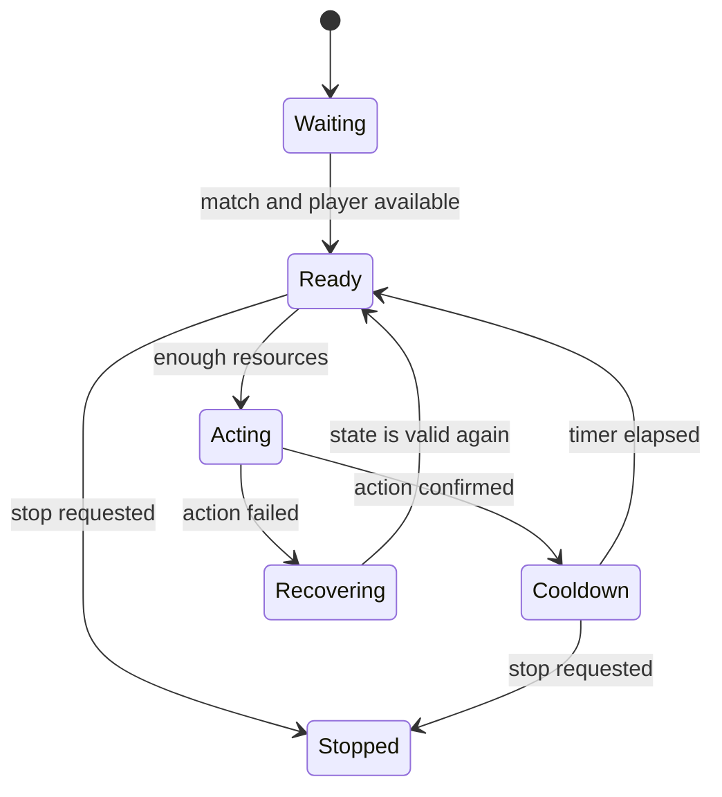

## A macro is not “press keys forever”

A reliable macro knows what state it is in, what evidence allows the next step, and when to stop.

For Wyrmsun 5.0.1 in a local match, use this loop:



Every arrow has a reason. That is much easier to debug than nested `if` statements and sleeps.

## Find the action, then find its rules

The original lesson traced a unit-creation path:


Do not call an internal function based on one breakpoint. Record several normal calls and identify:

- required thread;
- argument meaning;
- object lifetimes;
- return or error signal;
- resource checks;
- cooldown or event requirements.

An action that works once under the debugger may fail when called at the wrong time.

## Model states with an enum

```rust
#[derive(Debug)]
enum MacroState {
    Waiting,
    Ready,
    Acting { attempt: u32 },
    Cooldown { ticks_left: u32 },
    Recovering { reason: String },
    Stopped,
}
```

Impossible combinations disappear. We cannot accidentally be both `Acting` and `Cooldown`.

## Keep observations separate

```rust
#[derive(Debug)]
struct GameSnapshot {
    match_active: bool,
    player_ready: bool,
    resources: u32,
    action_confirmed: bool,
}

fn next_state(state: MacroState, game: &GameSnapshot, stop: bool) -> MacroState {
    if stop {
        return MacroState::Stopped;
    }

    match state {
        MacroState::Waiting if game.match_active && game.player_ready => {
            MacroState::Ready
        }
        MacroState::Ready if game.resources >= 100 => {
            MacroState::Acting { attempt: 1 }
        }
        MacroState::Acting { .. } if game.action_confirmed => {
            MacroState::Cooldown { ticks_left: 5 }
        }
        MacroState::Cooldown { ticks_left: 0 } => MacroState::Ready,
        MacroState::Cooldown { ticks_left } => {
            MacroState::Cooldown { ticks_left: ticks_left - 1 }
        }
        current => current,
    }
}
```

This transition function is safe, deterministic, and easy to test without a game.

## Test the decision logic

```rust
#[test]
fn stops_from_any_active_state() {
    let snapshot = GameSnapshot {
        match_active: true,
        player_ready: true,
        resources: 500,
        action_confirmed: false,
    };

    assert!(matches!(
        next_state(MacroState::Ready, &snapshot, true),
        MacroState::Stopped
    ));
}
```

The low-level observation and action layers may be version-specific. The state machine should not be.

## Rate limits and stop behavior

Use a bounded tick rate, not a busy loop:

```rust
while !stop.load(std::sync::atomic::Ordering::Relaxed) {
    let snapshot = observer.snapshot()?;
    state = next_state(state, &snapshot, false);
    std::thread::sleep(std::time::Duration::from_millis(100));
}
```

Before unloading an in-process library, set the stop flag, wait for the worker to exit, and restore any temporary state.

## Wire it to Wyrmsun 5.0.1

The original lab found these module-relative facts:

| Purpose | `wyrmsun.exe` offset |
|---|---:|
| recruit-unit call target | `0x2CF7` |
| recruit-unit hook | `0x223471` |
| main-loop hook | `0x385D34` |
| main-loop call target | `0xDBCA` |
| gold-chain root | `0x61A504` |

Wyrmsun relocates its module, so calculate `module_base + offset` every run. For one observed base of `0x00F40000`, the recruit target became `0x00F42CF7` and the hook became `0x01163471`.

The Cheat Engine gold path was:

```text
wyrmsun.exe + 0x61A504
→ read, +0x78
→ read, +0x4
→ read, +0x8
→ read, +0x4
→ read, +0x0
→ read, +0x14 = gold
```

Capture one legitimate worker record at the recruit hook (`ecx` points to the outer pointer) into a `0x110`-byte Rust buffer. When gold is over 3000, copy that captured record back, put the expected pointer in `ecx`, and call the verified recruit function from the game-loop hook. The original three overwritten recruit instructions were `push ecx`, `mov ecx, esi`, and the call; replay all eight bytes before returning.

```rust
const WORKER_RECORD_SIZE: usize = 0x110;
const RECRUIT_HOOK: usize = 0x22_3471;
const RECRUIT_FN: usize = 0x002C_F7;
const LOOP_HOOK: usize = 0x38_5D34;
const LOOP_FN: usize = 0x00_DBCA;
const GOLD_ROOT: usize = 0x61_A504;

#[derive(Clone)]
struct CapturedWorker {
    bytes: [u8; WORKER_RECORD_SIZE],
    source: usize,
}
```

Build the DLL for the game’s 32-bit architecture, inject it into your offline match, recruit one worker normally to fill the buffer, then gather more than 3000 gold. Workers should begin recruiting automatically from the selected structure. If they do not, log the calculated module addresses and verify each original byte before allowing the hooks to install.

## The two caves are fully implemented

The Rust port is in
[`strategy_hooks.rs`]({{ site.baseurl }}/windows-labs/src/windows_impl/strategy_hooks.rs). It
finds the relocated module, verifies both original call sequences, installs two
detours, captures the legitimate `0x110`-byte record, resolves the entire gold
chain, calls the real recruit function with x86 `thiscall`, replays the removed
game-loop call, and restores both hooks.

```rust
#[unsafe(naked)]
unsafe extern "C" fn wyrmsun_loop_cave() {
    core::arch::naked_asm!(
        "pushfd",
        "pushad",
        "call {maybe_recruit}",
        "popad",
        "popfd",
        "call dword ptr [{original}]",
        "jmp dword ptr [{resume}]",
        maybe_recruit = sym maybe_recruit_wyrmsun_worker,
        original = sym WYRM_LOOP_CALL,
        resume = sym WYRM_LOOP_RETURN,
    );
}
```

Inject `gha_windows_labs.dll` into `wyrmsun.exe`, recruit one worker normally,
select a structure, and collect more than 3000 gold. Press **End** to stop and
restore both hooks.

## The real lesson

The reusable skill is turning that working game hack into:

- observable inputs;
- named states;
- guarded transitions;
- a bounded action;
- a reliable stop path.

That pattern applies to test bots, accessibility helpers, replay tools, and ordinary game AI.
