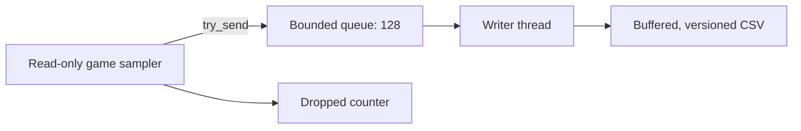

## Observation should not become the slowdown 📈

A call logger, frame observer, or value recorder has two jobs with different timing needs:

1. capture a small fact while it is fresh;
2. format and store that fact somewhere durable.

Writing a file can pause for filesystem, antivirus, indexing, or device activity. If the same thread is also handling a debugger event or time-sensitive sample, one slow write can disturb the program being measured.

A telemetry pipeline separates those jobs:



The producer never waits for disk. The consumer owns the file.

## Define the smallest useful event

This recorder needs only two fields:

```rust
#[derive(Clone, Copy, Debug)]
struct GoldEvent {
    elapsed_ms: u128,
    value: u32,
}
```

A compact event is cheap to copy and hard to misuse. It does not contain a raw process handle, borrowed buffer, remote pointer, or `String` allocation.

For a call logger, the same shape could include:

```rust
struct CallEvent {
    elapsed_micros: u128,
    thread_id: u32,
    call_site_rva: u32,
    target_rva: u32,
}
```

Prefer module-relative addresses in durable logs. A live address alone loses meaning after ASLR chooses a new module base.

## Backpressure is a policy

The channel has fixed capacity:

```rust
let (sender, receiver) = mpsc::sync_channel::<GoldEvent>(128);
```

A normal blocking `send` would wait when all 128 slots are occupied. The producer uses `try_send` instead:

```rust
match sender.try_send(event) {
    Ok(()) => Ok(()),
    Err(TrySendError::Full(_)) => {
        self.dropped += 1;
        Ok(())
    }
    Err(TrySendError::Disconnected(_)) => {
        anyhow::bail!("telemetry writer stopped early")
    }
}
```

Dropping an event sounds bad, but silently pausing every target thread can be worse. The important rule is **make loss visible**. The final report prints both written and dropped counts.

Different tools can choose different policies:

| Tool | Sensible full-queue policy |
|---|---|
| Five-second call logger | Drop and count; stop if loss exceeds a threshold |
| Turn-by-turn strategy log | Block briefly or stop because every event matters |
| High-rate overlay metrics | Keep only the newest sample |
| Crash report | Flush synchronously because the process is already failing |

Backpressure is not one Rust API. It is the decision a system makes when producers outrun consumers.

## Let channel closure be the stop message

The sink owns an optional sender and writer thread. Finishing removes the final sender:

```rust
self.sender.take();
let written = writer.join()??;
```

The receiver’s loop ends naturally when the channel is disconnected and empty. No special “stop event” can become stuck behind normal events in a full queue.

The writer then flushes `BufWriter`, returns the count, and joins. This ordering proves that a successful `finish` means all accepted events reached the operating-system file interface.

`Drop` repeats the close-and-join path as a fallback. Explicit `finish` is still better because it returns errors and counts to `main`.

## Version the file before it contains history

The log begins:

```text
# gha-gold-telemetry v1
# target=wesnoth.exe pid=4120 address=0x12345678
elapsed_ms,gold
0,100
50,100
100,75
```

The version explains the schema. The target line records run-specific context.
For a Wesnoth telemetry file you want to compare across several launches, also
record:

- executable SHA-256;
- game and tool versions;
- module base;
- sampling period;
- field profile name;
- wall-clock start in UTC;
- written and dropped counts in a footer or sidecar.

Do not silently reinterpret old columns after a format change. Create `v2`.

## Give a run a beginning, details, and an ending

Treat one telemetry file as a complete record rather than a pile of unrelated
lines:

1. the **header** says how to interpret the run;
2. the **detail rows** contain repeated observations;
3. the **trailer** says how the run ended.

For example:

```text
# gha-gold-telemetry v1
# target=wesnoth.exe build=1.14.9 sample_ms=50
elapsed_ms,gold
0,100
50,75
# end written=2 dropped=0 clean_shutdown=true
```

The repeated rows are useful only when the surrounding facts are trustworthy.
If `clean_shutdown=false` or the writer reports dropped samples, analysis code
can label the run incomplete instead of quietly treating a gap as normal game
behavior. A footer also gives you a cheap consistency check: the number of data
rows should agree with `written`.

## Sampling is an observation, not perfect time

The loop sleeps for 50 ms, which aims for about 20 samples per second. Desktop scheduling is not a metronome. The code records `Instant::elapsed()` for each sample instead of assuming sample 20 happened at exactly one second.

The tool opens Wesnoth without write rights, resolves the verified pointer path once, and records for 1–300 seconds. If the match ends and the address becomes unreadable, the run returns an error instead of fabricating a value.

For a longer recorder, re-resolve and validate the object identity periodically rather than trusting one pointer forever.

## Complete buildable recorder

<details class="lab-source" markdown="1">
<summary>Complete lab source: gold_telemetry.rs</summary>

```rust
#[cfg(windows)]
mod app {
    use std::{
        fs::File,
        io::{self, BufWriter, Write},
        path::PathBuf,
        sync::mpsc::{self, SyncSender, TrySendError},
        thread::{self, JoinHandle},
        time::{Duration, Instant},
    };

    use anyhow::Context;
    use gha_windows_labs::Process;

    const PLAYER_ROOT: usize = 0x017E_ED18;
    const GAME_OFFSET: usize = 0x0A90;
    const GOLD_OFFSET: usize = 0x0004;
    const QUEUE_CAPACITY: usize = 128;

    #[derive(Clone, Copy, Debug)]
    struct GoldEvent {
        elapsed_ms: u128,
        value: u32,
    }

    struct TelemetrySink {
        sender: Option<SyncSender<GoldEvent>>,
        writer: Option<JoinHandle<io::Result<usize>>>,
        dropped: usize,
    }

    impl TelemetrySink {
        fn start(path: PathBuf, target: String) -> anyhow::Result<Self> {
            let file = File::create(&path)
                .with_context(|| format!("could not create {}", path.display()))?;
            let (sender, receiver) = mpsc::sync_channel::<GoldEvent>(QUEUE_CAPACITY);
            let writer = thread::Builder::new()
                .name("gha-telemetry-writer".to_owned())
                .spawn(move || {
                    let mut output = BufWriter::new(file);
                    writeln!(output, "# gha-gold-telemetry v1")?;
                    writeln!(output, "# target={target}")?;
                    writeln!(output, "elapsed_ms,gold")?;
                    let mut written = 0_usize;
                    while let Ok(event) = receiver.recv() {
                        writeln!(output, "{},{}", event.elapsed_ms, event.value)?;
                        written += 1;
                    }
                    output.flush()?;
                    Ok(written)
                })?;

            Ok(Self {
                sender: Some(sender),
                writer: Some(writer),
                dropped: 0,
            })
        }

        fn record(&mut self, event: GoldEvent) -> anyhow::Result<()> {
            let sender = self.sender.as_ref().context("telemetry sink is closed")?;
            match sender.try_send(event) {
                Ok(()) => Ok(()),
                // ⚠️ Never block the observation loop behind slow disk I/O.
                Err(TrySendError::Full(_)) => {
                    self.dropped += 1;
                    Ok(())
                }
                Err(TrySendError::Disconnected(_)) => {
                    anyhow::bail!("telemetry writer stopped early")
                }
            }
        }

        fn finish(mut self) -> anyhow::Result<(usize, usize)> {
            // 🧹 Closing the final sender lets the writer drain queued events,
            // flush the file, and leave its receive loop without a magic sentinel.
            self.sender.take();
            let writer = self.writer.take().context("telemetry writer is missing")?;
            let written = writer
                .join()
                .map_err(|_| anyhow::anyhow!("telemetry writer panicked"))??;
            Ok((written, self.dropped))
        }
    }

    impl Drop for TelemetrySink {
        fn drop(&mut self) {
            self.sender.take();
            if let Some(writer) = self.writer.take() {
                let _ = writer.join();
            }
        }
    }

    fn gold_address(process: &Process) -> anyhow::Result<usize> {
        let player = process.read_u32(PLAYER_ROOT)? as usize;
        anyhow::ensure!(player != 0, "start a local Wesnoth match first");
        let side_pointer = player
            .checked_add(GAME_OFFSET)
            .context("player + game offset overflowed")?;
        let side = process.read_u32(side_pointer)? as usize;
        anyhow::ensure!(side != 0, "current side pointer is null");
        side.checked_add(GOLD_OFFSET)
            .context("side + gold offset overflowed")
    }

    pub fn run() -> anyhow::Result<()> {
        let mut arguments = std::env::args().skip(1);
        let seconds = arguments
            .next()
            .map(|text| text.parse::<u64>())
            .transpose()
            .context("duration must be whole seconds")?
            .unwrap_or(10);
        anyhow::ensure!(
            (1..=300).contains(&seconds),
            "duration must be 1..=300 seconds"
        );
        let path = arguments
            .next()
            .map(PathBuf::from)
            .unwrap_or_else(|| PathBuf::from("wesnoth-gold.csv"));
        anyhow::ensure!(
            arguments.next().is_none(),
            "usage: gold_telemetry [seconds] [output.csv]"
        );

        // 🔒 Telemetry observes only; the process handle has no write rights.
        let process = Process::open_by_name("wesnoth.exe", false)?;
        anyhow::ensure!(
            process.is_32_bit()?,
            "this profile requires 32-bit Wesnoth 1.14.9"
        );
        let address = gold_address(&process)?;
        let target = format!(
            "{} pid={} address={address:#010x}",
            process.name(),
            process.id()
        );
        let mut sink = TelemetrySink::start(path.clone(), target)?;

        let started = Instant::now();
        let duration = Duration::from_secs(seconds);
        while started.elapsed() < duration {
            let value = process.read_u32(address)?;
            sink.record(GoldEvent {
                elapsed_ms: started.elapsed().as_millis(),
                value,
            })?;
            thread::sleep(Duration::from_millis(50));
        }

        let (written, dropped) = sink.finish()?;
        println!(
            "Wrote {written} samples to {} ({dropped} dropped).",
            path.display()
        );
        Ok(())
    }
}

#[cfg(windows)]
fn main() -> anyhow::Result<()> {
    app::run()
}

#[cfg(not(windows))]
fn main() {
    eprintln!("This live telemetry recorder must run on Windows.");
}
```

</details>

The same source is available as [`gold_telemetry.rs`]({{ site.baseurl }}/windows-labs/src/bin/gold_telemetry.rs).

## Build and run it

Start a local Wesnoth 1.14.9 match, then record 15 seconds:

```powershell
cd windows-labs
cargo build --release --target i686-pc-windows-msvc --bin gold_telemetry
.\target\i686-pc-windows-msvc\release\gold_telemetry.exe 15 wesnoth-gold.csv
```

Spend or gain gold during the window. Inspect the file:

```powershell
Get-Content .\wesnoth-gold.csv
```

Or let PowerShell parse only the data rows:

```powershell
Get-Content .\wesnoth-gold.csv |
  Where-Object { -not $_.StartsWith("#") } |
  ConvertFrom-Csv |
  Select-Object -First 20
```

The tool should report roughly 300 accepted samples for 15 seconds and zero drops on a normal disk. A nonzero drop count is not hidden; it is evidence that the writer or chosen rate needs attention.

## Connect this design to the call logger

The call logger already knows the time-sensitive facts while Windows holds a debug event. Its advanced path should:

1. copy registers and module-relative addresses into a compact `CallEvent`;
2. restore/re-arm the breakpoint;
3. call `try_send`;
4. continue the debug event;
5. let the writer format symbols and text later.

Never send a borrowed `DEBUG_EVENT` union member to the writer. Its validity belongs to the current event-handling scope. Copy only the fields whose meaning has already been checked.

## Test the pipeline without a game

A useful test can start a queue of capacity one, hold the receiver, and send three events:

- the first is accepted;
- later events become counted drops;
- the producer does not block;
- dropping the sender lets the receiver finish;
- the written count plus dropped count equals the attempted count.

Also simulate a writer that exits early. `Disconnected` must become an error rather than another drop.

{% include quiz.html
  id="advanced-telemetry-backpressure"
  type="multiple-choice"
  title="Choose a hot-path logging policy"
  prompt="A debugger call logger's file writer cannot keep up, and the bounded queue is full. Which policy best protects the paused target while keeping the loss visible?"
  options="Use nonblocking send, increment a dropped-event counter, and stop if loss exceeds a limit||Block inside the debug event forever||Allocate an unlimited vector||Write each event synchronously before continuing the target"
  answer="0"
  explanation="The debug loop should restore state and continue promptly. A bounded queue controls memory, nonblocking send avoids holding the target for disk I/O, and an explicit loss counter prevents missing evidence from being hidden."
%}

## Checkpoint

You are ready to reuse this pipeline when you can explain:

- why events contain copied facts instead of handles or borrowed buffers;
- what a full queue means;
- why accepted and dropped counts both matter;
- why dropping the last sender is a clean shutdown signal;
- why timestamps are measured rather than inferred from sample number.
