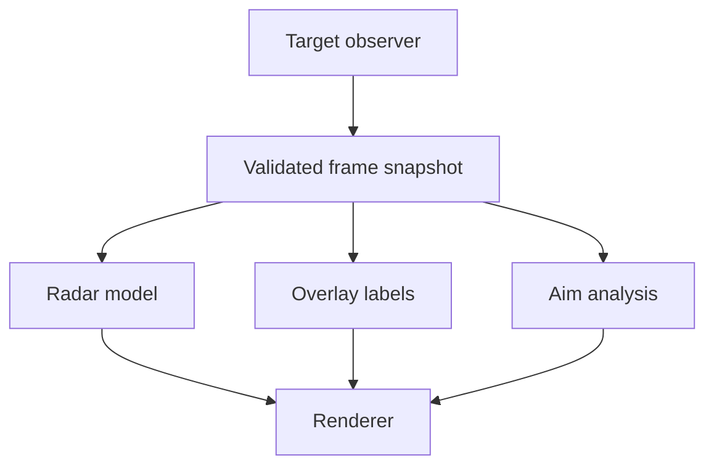

## Combining code exposes hidden problems

Five prototypes can each work alone and still fail when combined. Common causes include:

- each feature reads the same memory separately;
- two features change the same graphics state;
- global booleans get out of sync;
- shutdown happens while a worker is still running;
- one feature’s error crashes every other feature.

The solution is architecture, not more `if` statements.

## One frame, one snapshot



Read and validate target data once per update. Features consume the same owned snapshot.

```rust
struct FrameSnapshot {
    local: PlayerSnapshot,
    players: Vec<PlayerSnapshot>,
    matrix: Mat4,
    viewport: (f32, f32),
}
```

## Give every feature a lifecycle

```rust
trait Feature {
    fn name(&self) -> &'static str;
    fn enable(&mut self) -> anyhow::Result<()>;
    fn update(&mut self, frame: &FrameSnapshot) -> anyhow::Result<()>;
    fn disable(&mut self) -> anyhow::Result<()>;
}
```

Only patching or hooking features need work in `enable` and `disable`. Pure observer features may only implement `update`.

## Model configuration with enums

```rust
#[derive(Clone, Copy, Debug, Eq, PartialEq)]
enum OverlayMode {
    Off,
    Teammates,
    Opponents,
    Everyone,
}

#[derive(Debug)]
struct Settings {
    overlay: OverlayMode,
    show_radar: bool,
    show_debug_values: bool,
}
```

An enum prevents impossible combinations such as three different overlay booleans being true at the same time.

## Route input as commands

```rust
enum Command {
    ToggleRadar,
    CycleOverlay,
    ToggleDebugValues,
    Stop,
}

fn apply_command(settings: &mut Settings, command: Command) {
    match command {
        Command::ToggleRadar => settings.show_radar = !settings.show_radar,
        Command::CycleOverlay => {
            settings.overlay = match settings.overlay {
                OverlayMode::Off => OverlayMode::Teammates,
                OverlayMode::Teammates => OverlayMode::Opponents,
                OverlayMode::Opponents => OverlayMode::Everyone,
                OverlayMode::Everyone => OverlayMode::Off,
            };
        }
        Command::ToggleDebugValues => {
            settings.show_debug_values = !settings.show_debug_values;
        }
        Command::Stop => {}
    }
}
```

The input thread sends commands through a channel. The update loop owns and changes the settings, avoiding shared mutable globals.

## Contain feature failures

```rust
for feature in &mut features {
    if let Err(error) = feature.update(&frame) {
        eprintln!("{} disabled: {error:#}", feature.name());
        let _ = feature.disable();
    }
}
```

Decide whether a failure is local to one feature or invalidates the whole snapshot. A missing matrix may disable the overlay while a closed process should stop everything.

## Shut down in reverse order

```text
stop accepting input
→ signal update workers
→ wait for workers to finish
→ disable features
→ restore patches and graphics hooks
→ close handles
→ exit or unload
```

Do not unload code while another thread may still execute it.

## Keep version facts outside feature logic

```rust
struct TargetProfile {
    build_id: String,
    modules: ModuleOffsets,
    layouts: Layouts,
    signatures: Signatures,
}
```

An actual profile should make the supported game and version obvious. These constants join the concrete labs from this chapter; the complete project uses `Option<usize>` for facts a game does not need.

```rust
const ASSAULTCUBE_1202: TargetFacts = TargetFacts {
    process: "ac_client.exe",
    local_player_ptr: Some(0x0050_9B74),
    entity_list_ptr: Some(0x0050_F4F8),
    entity_count: Some(0x0050_F500),
    trigger_call: Some(0x0040_AD9D),
    no_recoil_patch: Some(0x0045_BAAD),
    radar_patch: Some(0x0040_9FB3),
    esp_hook: Some(0x0040_BE7E),
    draw_elements_hook_offset: None,
};

const URBAN_TERROR_434: TargetFacts = TargetFacts {
    process: "Quake3-UrT.exe",
    local_player_ptr: None,
    entity_list_ptr: None,
    entity_count: None,
    trigger_call: None,
    no_recoil_patch: None,
    radar_patch: None,
    esp_hook: None,
    draw_elements_hook_offset: Some(0x16),
};
```

At startup, verify an original instruction signature at every address you plan to use. The finished DLL dispatches by the current executable and exposes only hotkeys that belong to that exact game:

| Target | F1 | F2 | F3 | F4 | F5 |
|---|---|---|---|---|---|
| Wesnoth 1.14.9 | terrain gold cave | second-player stat text | reveal map | — | — |
| AssaultCube 1.2.0.2 | triggerbot | no recoil | reveal radar | aimbot | internal ESP |
| Urban Terror 4.3.4 | memory wallhook | OpenGL wallhack | OpenGL chams | — | — |

**End** stops the worker and restores every active patch. Flare and Wyrmsun use their dedicated in-game automation loops from chapter 4 instead of this function-key table.

Load one supported profile after fingerprinting the target. Features receive verified addresses and layouts instead of hardcoding them.

The complete dispatcher and lifecycles are in [`dll.rs`]({{ site.baseurl }}/windows-labs/src/windows_impl/dll.rs). The patch-owning primitives are in [`local_patch.rs`]({{ site.baseurl }}/windows-labs/src/windows_impl/local_patch.rs); dropping each `LocalPatch` restores the bytes it captured only after an exact pre-patch verification.

## The finish line

A multifeature tool is ready when:

- starting it twice does not double-hook;
- every feature can be toggled repeatedly;
- disabling restores its changes;
- target closure stops the tool cleanly;
- unknown versions are rejected;
- one feature error does not corrupt the rest;
- the offline target behaves normally after exit.

That reliability is more impressive—and more reusable—than adding one more effect.
