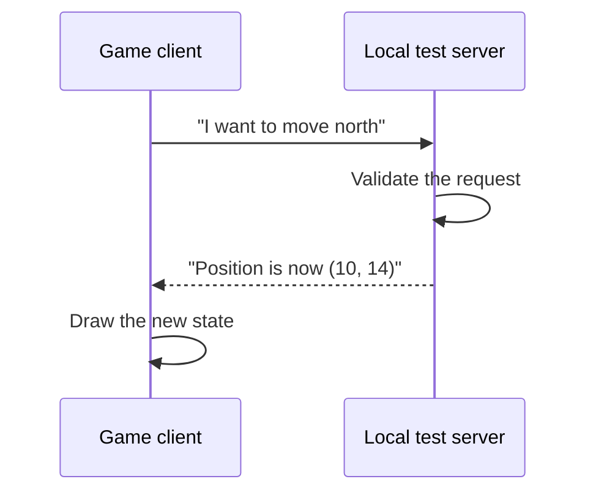

## Client and server

A multiplayer client collects your input, sends requests, receives state, and draws what you see. A server applies the official rules.


{: .diagram-on-dark }



The client usually sends an **intent**, not the final truth.

## Packets and protocols

A packet is a chunk of bytes sent through a network. A protocol is the agreement that gives those bytes meaning.

A simple framed message might contain:

```text
[4-byte length][1-byte kind][payload bytes...]
```

Rust can model the decoded meaning:

```rust
enum Message {
    Chat { sender: String, text: String },
    Move { unit_id: u32, x: i32, y: i32 },
    Ping,
}
```

The bytes are untrusted until parsing succeeds.

## A protocol is a stack of agreements

Several layers cooperate when the bot sends one chat message:

```text
chat meaning:      sender and text
serialization:     WML fields and tags
compression:       gzip bytes
framing:           four-byte length plus payload
transport:         ordered TCP byte stream
network:           loopback IP packets
```

When something fails, ask which layer broke. A correct TCP connection does not prove the WML is valid. A valid gzip stream does not prove the length prefix used the right byte order.

**Serialization** turns structured values into bytes. **Framing** tells the receiver where one serialized message ends. **Transport** moves bytes between endpoints. Keeping those jobs separate makes both the explanation and the Rust code easier to test.

## Byte order is part of the protocol

The same integer has more than one possible byte order. Wesnoth’s four-byte frame length is big endian, so decimal `258` is:

```text
00 00 01 02
```

On little-endian x86 memory, a native `u32` with the same value would usually appear as `02 01 00 00`. Network code must follow the protocol, not the host CPU’s default. That is why the reader uses `u32::from_be_bytes` rather than a pointer cast.

## TCP is a stream

TCP delivers an ordered stream of bytes. It does **not** preserve your application’s message boundaries.

One call to `read` may return:

- half of one message;
- exactly one message;
- one message plus part of the next;
- several messages.

This is why a protocol needs framing.

```rust
use std::io::{self, Read};

fn read_frame(stream: &mut impl Read, max_size: usize) -> io::Result<Vec<u8>> {
    let mut length_bytes = [0_u8; 4];
    stream.read_exact(&mut length_bytes)?;
    let length = u32::from_be_bytes(length_bytes) as usize;

    if length > max_size {
        return Err(io::Error::new(
            io::ErrorKind::InvalidData,
            "frame is too large",
        ));
    }

    let mut payload = vec![0_u8; length];
    stream.read_exact(&mut payload)?;
    Ok(payload)
}
```

The maximum size prevents a bad length field from requesting absurd amounts of memory.

## UDP is made of datagrams

UDP preserves datagram boundaries but does not guarantee delivery, order, or uniqueness. Fast games often tolerate those tradeoffs for time-sensitive state.

Do not assume a game uses only one protocol. It might use TCP for login/chat and UDP for movement.

## Ports and sockets

A socket connects an address and port to a network endpoint:

```rust
use std::net::TcpStream;
use std::time::Duration;

let stream = TcpStream::connect_timeout(
    &"127.0.0.1:15000".parse()?,
    Duration::from_secs(3),
)?;
```

`127.0.0.1` means the same computer. We use loopback and a local test server for this section.

## Encryption changes what you can see

If a protocol uses modern encryption correctly, a packet capture shows encrypted bytes, addresses, sizes, and timing—not readable messages. Do not try to defeat encryption or certificate checks.

For learning, use:

- your own toy protocol;
- a local open-source server;
- captured bytes provided by a challenge;
- application logs you control.

## The network rule

Only capture, replay, proxy, or generate traffic for systems you own or have permission to test. “It reached my computer” is not permission to alter someone else’s service.
