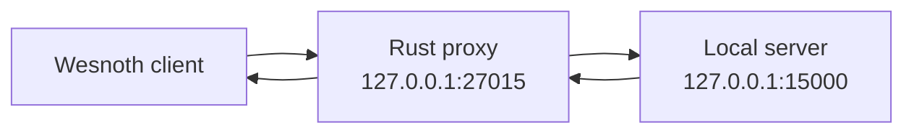

## What a proxy does

A local TCP proxy accepts a client connection, opens a connection to your local server, and relays bytes both ways.



Begin as a transparent relay. If the protocol fails before you modify anything, fix the relay first.

## Restrict both endpoints

```rust
use std::net::{IpAddr, SocketAddr};

fn require_loopback(address: SocketAddr) -> anyhow::Result<SocketAddr> {
    anyhow::ensure!(
        address.ip() == IpAddr::V4(std::net::Ipv4Addr::LOCALHOST)
            || address.ip() == IpAddr::V6(std::net::Ipv6Addr::LOCALHOST),
        "proxy endpoints must be loopback addresses"
    );
    Ok(address)
}
```

This course proxy is intentionally not a general remote interception tool.

## Relay one direction

Rust’s standard library can copy a stream until EOF:

```rust
use std::{io, net::TcpStream};

fn relay(mut source: TcpStream, mut destination: TcpStream) -> io::Result<u64> {
    io::copy(&mut source, &mut destination)
}
```

TCP is full duplex, so run two relays:

```rust
fn proxy_pair(client: TcpStream, server: TcpStream) -> anyhow::Result<()> {
    let client_to_server = client.try_clone()?;
    let server_to_client = server.try_clone()?;

    let upstream = std::thread::spawn(move || relay(client_to_server, server));
    let downstream = std::thread::spawn(move || relay(server_to_client, client));

    upstream.join().map_err(|_| anyhow::anyhow!("upstream relay panicked"))??;
    downstream.join().map_err(|_| anyhow::anyhow!("downstream relay panicked"))??;
    Ok(())
}
```

For many connections, an async runtime such as Tokio scales better. Threads keep the first lab easy to see.

## Half-closes matter

One direction can reach EOF while the other still has data to send. A production proxy should use `shutdown(Write)` on the destination after a direction finishes, then allow the reverse relay to complete.

## Log metadata, not unlimited payloads

Useful bounded observations include:

```text
connection opened
client → server: 142 bytes
server → client: 68 bytes
connection closed
```

If you parse permitted local frames, cap preview length and avoid logging secrets or full chat histories by default.

## Diagnose handshake failures


When a transparent proxy fails, compare direct and proxied captures:

- Did both directions start?
- Were bytes changed or dropped?
- Did the client send the server’s port or address inside the protocol?
- Is there TLS or a certificate bound to a hostname?
- Did a relay block because it waited for EOF?
- Did one side expect a UDP companion channel?


{: .diagram-on-dark }

Do not bypass certificate validation. For encrypted protocols, create a development configuration with certificates you control.

## Parse without changing

The safest next step is a **tee**:

```text
read bytes
→ feed a copy to a bounded parser/log channel
→ forward the original bytes unchanged
```

Keep parsing off the relay’s critical path. If the observer cannot keep up, drop observations rather than blocking the connection.

## Inject a real local Wesnoth chat response

The original lab used proxy port `27015` and server port `15000`. Start `wesnothd.exe`, start the Rust proxy, then tell Wesnoth to connect to `localhost:27015`. Reaching the normal lobby through the proxy proves both directions work.

For injection, one task must own the upstream writer so two threads cannot interleave bytes. After the special four-zero negotiation has passed, have the client-to-server path read one complete Wesnoth frame at a time. Forward the original bytes unchanged, but inspect a decoded copy:

```rust
use std::io::Write;

fn forward_with_chat_hook(
    client: &mut TcpStream,
    server: &mut TcpStream,
) -> anyhow::Result<()> {
    loop {
        let original = read_frame(client)?;
        let decoded = decode_wesnoth_frame(&original)?;

        // Preserve the legitimate game packet exactly as captured.
        server.write_all(&original)?;

        if decoded.contains("message=\"\\wave\"") {
            let injected = encode_chat("ChatBot", "Hello!")?;
            server.write_all(&injected)?;
        }
        server.flush()?;
    }
}
```

Keep the server-to-client direction as an ordinary transparent relay. The handshake needs one small state flag because its first four zero bytes are not a gzip frame; forward those four bytes directly before switching the upstream parser into framed mode.

Now send `\wave` from the real Wesnoth client. The server receives both the original command and the injected **Hello!** message on the already authenticated connection. This is the practical advantage of the proxy: the official client performs its own login while Rust observes and modifies the permitted local traffic.

## Checkpoint

The local proxy is correct when:

- direct and proxied sessions behave the same;
- byte counts agree with a packet capture;
- either side closing ends the session cleanly;
- malformed observations cannot stop forwarding;
- non-loopback endpoints are rejected;
- the only modification is the documented `\wave` response in this permitted local lab;
- removing the hook returns the proxy to byte-for-byte transparent behavior.

## Run the complete proxy

Start `wesnothd.exe` on its normal local port, then run:

```powershell
.\target\i686-pc-windows-msvc\release\wesnoth_proxy.exe
```

Connect the official Wesnoth 1.14.9 client to `localhost:27015`. Type `\wave` after login and confirm the injected `Hello!` appears. The complete two-direction relay is [`wesnoth_proxy.rs`](/windows-labs/src/bin/wesnoth_proxy.rs). It binds only to loopback, forwards the unframed negotiation, parses bounded upstream frames, preserves each original frame, injects through the single upstream writer, half-closes both directions, and keeps the server-to-client stream transparent.

<details class="lab-source" markdown="1">
<summary>Complete lab source: wesnoth_proxy.rs</summary>

```rust
use std::{
    io::{self, Read, Write},
    net::{IpAddr, Ipv4Addr, Shutdown, SocketAddr, TcpListener, TcpStream},
    thread,
    time::Duration,
};

use anyhow::{Context, Result};
use gha_windows_labs::wesnoth_protocol::{decode_frame, encode_chat, read_frame};

fn loopback(port: u16) -> SocketAddr {
    SocketAddr::new(IpAddr::V4(Ipv4Addr::LOCALHOST), port)
}

fn upstream(mut client: TcpStream, mut server: TcpStream) -> Result<()> {
    // The negotiation request is the protocol's one unframed client message.
    let mut negotiation = [0_u8; 4];
    client.read_exact(&mut negotiation)?;
    anyhow::ensure!(negotiation == [0, 0, 0, 0], "unexpected negotiation bytes");
    server.write_all(&negotiation)?;
    server.flush()?;

    loop {
        let frame = match read_frame(&mut client) {
            Ok(frame) => frame,
            Err(error) if error.kind() == io::ErrorKind::UnexpectedEof => break,
            Err(error) => return Err(error.into()),
        };
        let decoded = decode_frame(&frame)?;
        server.write_all(&frame)?;
        if decoded.contains("message=\"\\wave\"") {
            server.write_all(&encode_chat("ChatBot", "Hello!")?)?;
        }
        server.flush()?;
    }
    server.shutdown(Shutdown::Write)?;
    Ok(())
}

fn downstream(mut server: TcpStream, mut client: TcpStream) -> Result<()> {
    io::copy(&mut server, &mut client)?;
    client.shutdown(Shutdown::Write)?;
    Ok(())
}

fn proxy_pair(client: TcpStream) -> Result<()> {
    let server = TcpStream::connect_timeout(&loopback(15_000), Duration::from_secs(3))
        .context("start local wesnothd.exe on port 15000 first")?;
    client.set_read_timeout(Some(Duration::from_secs(30)))?;
    server.set_write_timeout(Some(Duration::from_secs(5)))?;

    let upstream_client = client.try_clone()?;
    let downstream_server = server.try_clone()?;
    let up = thread::spawn(move || upstream(upstream_client, server));
    let down = thread::spawn(move || downstream(downstream_server, client));
    up.join()
        .map_err(|_| anyhow::anyhow!("upstream thread panicked"))??;
    down.join()
        .map_err(|_| anyhow::anyhow!("downstream thread panicked"))??;
    Ok(())
}

fn main() -> Result<()> {
    let listener = TcpListener::bind(loopback(27_015))?;
    println!("Wesnoth proxy listening on 127.0.0.1:27015 -> 127.0.0.1:15000");
    println!("Connect the official 1.14.9 client to localhost:27015.");
    for connection in listener.incoming() {
        let client = connection?;
        anyhow::ensure!(
            client.peer_addr()?.ip().is_loopback(),
            "client is not loopback"
        );
        if let Err(error) = proxy_pair(client) {
            eprintln!("session ended: {error:#}");
        }
    }
    Ok(())
}
```

</details>

Only the upstream task writes to the server. That single-writer rule prevents the original frame and injected frame from being interleaved. The downstream task stays byte-for-byte transparent, so one experimental hook cannot accidentally rewrite both directions.
