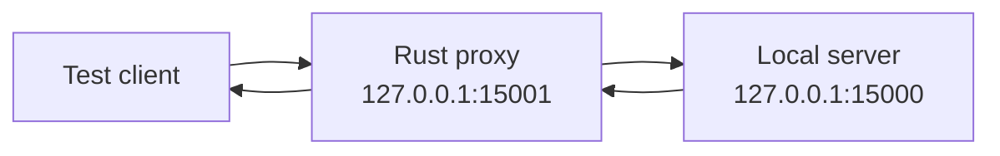

## What a proxy does

A local TCP proxy accepts a client connection, opens a connection to your local server, and relays bytes both ways.



Begin as a transparent relay. If the protocol fails before you modify anything, fix the relay first.

## Restrict both endpoints

```rust
use std::net::{IpAddr, SocketAddr};

fn require_loopback(address: SocketAddr) -> anyhow::Result<SocketAddr> {
    anyhow::ensure!(
        address.ip() == IpAddr::V4(std::net::Ipv4Addr::LOCALHOST)
            || address.ip() == IpAddr::V6(std::net::Ipv6Addr::LOCALHOST),
        "proxy endpoints must be loopback addresses"
    );
    Ok(address)
}
```

This course proxy is intentionally not a general remote interception tool.

## Relay one direction

Rust’s standard library can copy a stream until EOF:

```rust
use std::{io, net::TcpStream};

fn relay(mut source: TcpStream, mut destination: TcpStream) -> io::Result<u64> {
    io::copy(&mut source, &mut destination)
}
```

TCP is full duplex, so run two relays:

```rust
fn proxy_pair(client: TcpStream, server: TcpStream) -> anyhow::Result<()> {
    let client_to_server = client.try_clone()?;
    let server_to_client = server.try_clone()?;

    let upstream = std::thread::spawn(move || relay(client_to_server, server));
    let downstream = std::thread::spawn(move || relay(server_to_client, client));

    upstream.join().map_err(|_| anyhow::anyhow!("upstream relay panicked"))??;
    downstream.join().map_err(|_| anyhow::anyhow!("downstream relay panicked"))??;
    Ok(())
}
```

For many connections, an async runtime such as Tokio scales better. Threads keep the first lab easy to see.

## Half-closes matter

One direction can reach EOF while the other still has data to send. A production proxy should use `shutdown(Write)` on the destination after a direction finishes, then allow the reverse relay to complete.

## Log metadata, not unlimited payloads

Useful bounded observations include:

```text
connection opened
client → server: 142 bytes
server → client: 68 bytes
connection closed
```

If you parse permitted local frames, cap preview length and avoid logging secrets or full chat histories by default.

## Diagnose handshake failures


When a transparent proxy fails, compare direct and proxied captures:

- Did both directions start?
- Were bytes changed or dropped?
- Did the client send the server’s port or address inside the protocol?
- Is there TLS or a certificate bound to a hostname?
- Did a relay block because it waited for EOF?
- Did one side expect a UDP companion channel?


Do not bypass certificate validation. For encrypted protocols, create a development configuration with certificates you control.

## Parse without changing

The safest next step is a **tee**:

```text
read bytes
→ feed a copy to a bounded parser/log channel
→ forward the original bytes unchanged
```

Keep parsing off the relay’s critical path. If the observer cannot keep up, drop observations rather than blocking the connection.

## Checkpoint

The local proxy is correct when:

- direct and proxied sessions behave the same;
- byte counts agree with a packet capture;
- either side closing ends the session cleanly;
- malformed observations cannot stop forwarding;
- non-loopback endpoints are rejected;
- the proxy never modifies data unless a later, explicitly permitted lab says so.
