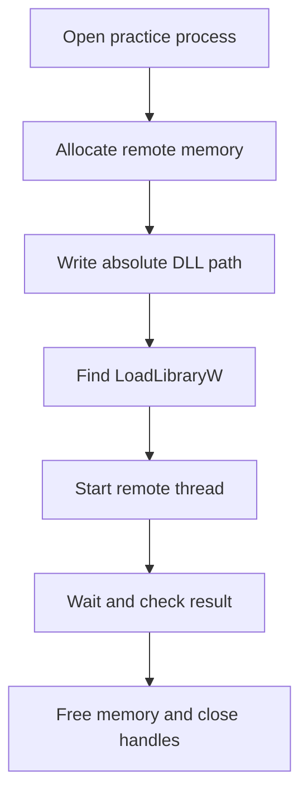

## Scope this tool in code

DLL injection is dual-use. This lesson targets only a practice process built from source inside your VM. Add a handshake or build marker and refuse every other target.

```rust
const PRACTICE_WINDOW_TITLE: &str = "GHA loader practice target";
```

Do not use this tool with anti-cheat, security software, someone else’s process, or an online game.

## The classic loader sequence



Every box can fail and must clean up what earlier boxes created.

## Use a wide absolute path

Windows `LoadLibraryW` expects a zero-terminated UTF-16 path:

```rust
use std::{os::windows::ffi::OsStrExt, path::Path};

fn wide_path(path: &Path) -> anyhow::Result<Vec<u16>> {
    let absolute = path.canonicalize()?;
    let mut wide: Vec<u16> = absolute.as_os_str()
        .encode_wide()
        .collect();
    wide.push(0);
    Ok(wide)
}
```

A relative path depends on the target’s working directory and is easy to misresolve.

## Own remote memory

Model the allocation so cleanup is not optional:

```rust
struct RemoteAllocation<'a> {
    process: &'a Process,
    address: *mut std::ffi::c_void,
    size: usize,
}

impl Drop for RemoteAllocation<'_> {
    fn drop(&mut self) {
        // The implementation calls VirtualFreeEx with MEM_RELEASE.
        // It logs failure because Drop cannot return an error.
        let _ = self.process.free_remote(self.address);
    }
}
```

`Process::allocate_remote`, `write_exact`, and `free_remote` contain the Windows calls and safety comments. The orchestration stays readable.

## Verify every boundary

The high-level loader should look like a checklist:

```rust
fn load_practice_dll(
    process: &Process,
    dll_path: &Path,
) -> anyhow::Result<()> {
    anyhow::ensure!(process.is_practice_target()?, "target marker not found");

    let path = wide_path(dll_path)?;
    let bytes: Vec<u8> = path.iter()
        .flat_map(|unit| unit.to_le_bytes())
        .collect();
    let remote_path = process.allocate_remote(bytes.len())?;
    process.write_exact(remote_path.address as usize, &bytes)?;

    let load_library = process.resolve_load_library_w()?;
    let thread = process.start_remote_thread(load_library, remote_path.address)?;
    let result = thread.wait_with_timeout(std::time::Duration::from_secs(5))?;

    anyhow::ensure!(result != 0, "LoadLibraryW returned null");
    Ok(())
}
```

The wrapper methods are small `unsafe` boundaries over:

- `OpenProcess`;
- `VirtualAllocEx` / `VirtualFreeEx`;
- `WriteProcessMemory`;
- `CreateRemoteThread`;
- waiting and reading the thread exit code;
- `CloseHandle`.

## Architecture must match

A 32-bit DLL loads into a 32-bit process. A 64-bit DLL loads into a 64-bit process. Check both the loader and target architecture before allocating anything.

## Loader-lock reminder

When the DLL loads, Windows calls its `DllMain` under the loader lock. Keep `DllMain` tiny, as shown in lesson 3.3. Have the practice host call an exported initialization function after loading whenever possible.

## Cleanup order

On every error:

1. stop waiting on or close the remote thread handle;
2. free the remote path allocation;
3. close the process handle.

RAII types make this happen during early returns.

## Safer development path

Before remote loading:

1. load the DLL normally from a host program you wrote;
2. call its exported start function;
3. test unload and repeated load cycles;
4. add the remote transport only after the DLL lifecycle is reliable.

The useful lesson is resource-safe Windows API design, not bypassing another program’s boundaries.
