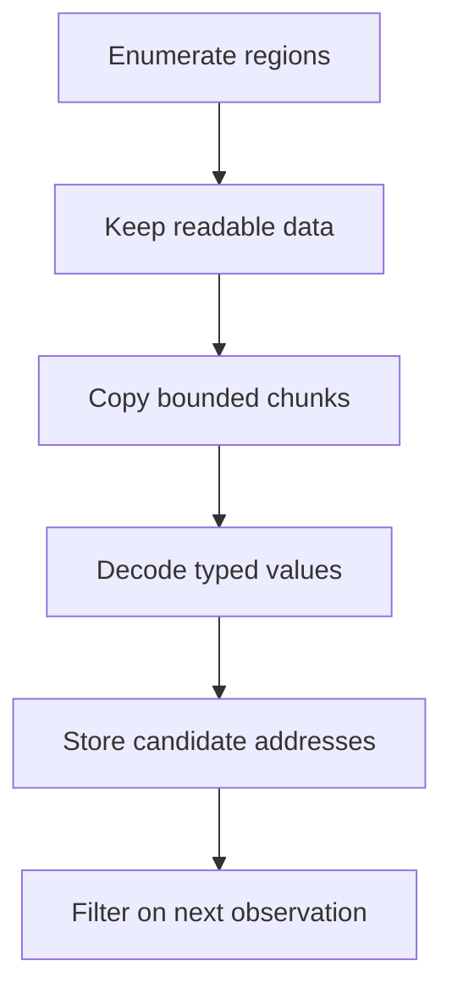

## The scanner pipeline



The Windows calls are only the outer shell. Candidate filtering is safe Rust.

🔎 **Scanner mindset:** every new observation should remove candidates. If a scan adds unexplained addresses, revisit the value type, range, or filtering rule.
{: .emoji-note }

## What the scanner is searching

A process does not own one giant, equally readable byte array. Windows divides its virtual address space into pages and reports neighboring pages with similar state as **regions**.

| Region fact | Question it answers |
|---|---|
| State | Is this address range committed, reserved, or free? |
| Protection | Can the target read, write, or execute it? Is it guarded? |
| Base address | Where does the region begin? |
| Region size | Where must the region walk advance next? |

`VirtualQueryEx` describes these facts; it does not copy the target bytes. `ReadProcessMemory` performs the copy later. Keeping “describe” and “read” as separate steps makes failures easier to explain.

A number such as `100` is also not self-identifying. The bytes `64 00 00 00` represent `100` only when interpreted as a little-endian `u32`. The same four bytes can be part of a pointer, an instruction, a larger number, or unrelated data. That is why the first scan returns candidates rather than an answer.

## Repeated scans are set intersection

Imagine the first scan finds 40,000 addresses containing `100`. You spend 15 gold and scan for `85`. Most unrelated addresses do not make that exact transition, so perhaps 18 survive. Earn 7 gold and scan for `92`; perhaps one remains.

```text
all readable addresses
∩ value was 100
∩ value became 85
∩ value became 92
= candidates consistent with every observation
```

The scanner never rescans the whole process after the first pass. It re-reads only the surviving addresses. This makes later passes faster and preserves the history needed for filters such as increased, decreased, changed, and unchanged.

## Describe readable regions

```rust
#[derive(Clone, Copy, Debug)]
struct MemoryRegion {
    base: usize,
    size: usize,
    readable: bool,
    writable: bool,
    executable: bool,
}
```

This struct is a local description, not a view into the remote process. `base` and `size` are integers because no Rust reference can safely borrow memory owned by another process. The Boolean fields are decisions already derived from Windows protection flags, so the scanning loop does not need to repeat bit-mask logic.

Use `VirtualQueryEx` to walk the target’s virtual address space. Keep only committed regions with readable protection, and skip guard or no-access pages.

Advance with checked math:

```rust
let next = region.base.checked_add(region.size)
    .context("memory-region walk overflowed")?;
anyhow::ensure!(next > current, "memory-region walk made no progress");
current = next;
```

The progress check prevents an infinite loop if Windows or a wrapper ever reports a zero-sized region. `checked_add` treats address overflow as an error instead of wrapping from the top of the address space back to zero.

## Scan copied chunks

```rust
fn find_u32_in_chunk(base: usize, bytes: &[u8], wanted: u32) -> Vec<usize> {
    let needle = wanted.to_le_bytes();

    bytes.windows(needle.len())
        .enumerate()
        .filter_map(|(offset, window)| {
            (window == needle)
                .then(|| base.checked_add(offset))
                .flatten()
        })
        .collect()
}
```

For an aligned-only scan, step by four. For a general scan, `windows(4)` checks every byte offset.

`wanted.to_le_bytes()` creates the exact four-byte representation used by the 32-bit Windows course games. `.windows(4)` yields overlapping four-byte slices, so a value may start at any byte. When a match appears, `base + offset` translates the local slice position back into the target’s virtual address.

The complete program reads 1 MiB chunks. Adjacent chunks overlap by three bytes because a four-byte value can begin in the final three positions of the earlier chunk. Without that overlap, a value split across the boundary would never exist in either local buffer as a complete four-byte window.

## Keep candidate values

```rust
#[derive(Clone, Copy, Debug)]
struct Candidate {
    address: usize,
    previous: u32,
}

enum Filter {
    Equal(u32),
    Increased,
    Decreased,
    Changed,
    Unchanged,
}
```

Filter by re-reading each candidate:

```rust
fn keep(filter: &Filter, previous: u32, current: u32) -> bool {
    match filter {
        Filter::Equal(value) => current == *value,
        Filter::Increased => current > previous,
        Filter::Decreased => current < previous,
        Filter::Changed => current != previous,
        Filter::Unchanged => current == previous,
    }
}
```

The enum replaces a stringly typed filter:

```diff
- fn keep(kind: &str, previous: u32, current: u32) -> bool {
-     if kind == "changed" { return current != previous; }
-     if kind == "same" { return current == previous; }
-     false
- }
+ fn keep(filter: &Filter, previous: u32, current: u32) -> bool {
+     match filter {
+         Filter::Equal(value) => current == *value,
+         Filter::Increased => current > previous,
+         Filter::Decreased => current < previous,
+         Filter::Changed => current != previous,
+         Filter::Unchanged => current == previous,
+     }
+ }
```

> **Why this version?** A misspelled string silently behaves like an unknown
> filter. An enum can contain only supported states, and an exhaustive `match`
> makes the compiler point out every place that needs updating when a new filter
> is added. Passing `&Filter` borrows the rule because the comparison does not
> need to consume or copy it.
{: .block-why }

Update `previous` for candidates that survive.

The `Filter` enum makes every supported relationship explicit. A string such as `"decreased"` could be misspelled and discovered only at runtime; an enum lets the compiler force every `match` to handle each case. `previous` belongs beside the address because “changed” always compares two observations of the same candidate.

## Expect regions to disappear

The target can free or change a region between enumeration and reading. Treat an unreadable candidate as removed, not as a reason to crash the scan.

This is a normal race, not necessarily a bug. Between the region query and the read, the game can free an allocation, change its protection, or exit. The scanner’s snapshot is always slightly behind the running process. A robust tool reports skipped work and continues with evidence that is still valid.

Return a scan report:

```rust
struct ScanReport {
    regions_seen: usize,
    regions_read: usize,
    bytes_read: u64,
    candidates: Vec<Candidate>,
    skipped_regions: usize,
}
```

## Bound the work

Set limits for:

- maximum region size per read;
- chunk size, such as 1 MiB;
- total candidates;
- total scan time;
- supported value types.

A scan for a common value such as zero can produce millions of matches. Refuse or require a narrower range rather than exhausting memory.

Limits are correctness rules:

- a chunk limit bounds each allocation and Windows copy;
- a region limit avoids one suspicious mapping monopolizing the scan;
- a candidate limit bounds local memory and later re-read time;
- an output limit keeps the terminal usable;
- a time or cancellation limit gives control back to the learner.

Without these limits, perfectly memory-safe Rust can still make an unusable program.

## Guard writes

```rust
fn write_candidate(
    process: &Process,
    candidate: Candidate,
    replacement: u32,
) -> anyhow::Result<()> {
    let current = process.read_u32(candidate.address)?;
    anyhow::ensure!(
        current == candidate.previous,
        "value changed since the last scan"
    );
    process.write_u32(candidate.address, replacement)?;
    Ok(())
}
```

The UI should show the old and new value and require an explicit action.

The second read closes a **time-of-check/time-of-use** gap. The candidate matched during the last filter, but the game kept running afterward. If the current value no longer equals `candidate.previous`, the address may be stale or the rule may have changed; the write must stop rather than overwrite newer state.


## Separate types

Use a trait or enum for `u8`, `u16`, `u32`, `i32`, and `f32` rather than casting everything to one type. Float searches need special handling for NaN and approximate comparisons.

Start with one type and make it correct. A small scanner with clear errors is a stronger project than a giant clone with undefined behavior.

For floating-point scans, exact byte equality is sometimes useful and sometimes misleading. `NaN` does not equal itself, `-0.0` and `0.0` compare equal despite different bit patterns, and visible decimal text may round the stored value. A future `ValueKind` should state whether it compares bits, exact numeric values, or values within a tolerance.

## Run the complete scanner

Start one supported course game with a value you can change visibly—for example, gold in Wesnoth—and run:

```powershell
.\target\i686-pc-windows-msvc\release\memory_scanner.exe wesnoth.exe 100
```

Change the value in the game, press Enter, and type the new value. The scanner re-reads only surviving addresses. If one remains, it offers one guarded replacement and first confirms the value has not changed again.

The full program is [`memory_scanner.rs`]({{ site.baseurl }}/windows-labs/src/bin/memory_scanner.rs). It uses `VirtualQueryEx`, skips unreadable or oversized regions, reads at most 1 MiB per chunk, adds a three-byte overlap so a `u32` cannot hide across a chunk boundary, caps candidates at 250,000, handles disappearing regions, and prints at most 25 results.

<details class="lab-source" markdown="1">
<summary>Complete lab source: memory_scanner.rs</summary>

```rust
#[cfg(windows)]
fn main() -> anyhow::Result<()> {
    use std::io;

    use anyhow::Context;
    use gha_windows_labs::Process;

    const CHUNK_SIZE: usize = 1024 * 1024;
    const MAX_REGION_SIZE: usize = 64 * 1024 * 1024;
    const MAX_CANDIDATES: usize = 250_000;

    let mut arguments = std::env::args().skip(1);
    let process_name = arguments
        .next()
        .context("usage: memory_scanner <process.exe> <initial_u32>")?;
    let initial = arguments
        .next()
        .context("missing initial value")?
        .parse::<u32>()
        .context("initial value must be an unsigned number")?;

    let process = Process::open_by_name(&process_name, true)?;
    println!(
        "Scanning {} (PID {}) for {initial}...",
        process.name(),
        process.id()
    );

    let mut candidates = Vec::new();
    for region in process.regions(0x1_0000, usize::MAX)? {
        if !region.readable || region.size == 0 || region.size > MAX_REGION_SIZE {
            continue;
        }

        let mut offset = 0_usize;
        while offset < region.size {
            let count = CHUNK_SIZE.min(region.size - offset);
            // A u32 can begin in the final three bytes of a chunk. This overlap
            // keeps a value from falling through the crack between two reads.
            let read_count = count.saturating_add(3).min(region.size - offset);
            let address = region.base + offset;
            let Ok(bytes) = process.read_bytes(address, read_count) else {
                break; // the game changed this region while we were scanning
            };

            for (inside_chunk, window) in bytes.windows(4).enumerate() {
                if inside_chunk >= count {
                    break; // the next chunk owns starts beyond this boundary
                }
                if window == initial.to_le_bytes() {
                    candidates.push(address + inside_chunk);
                    anyhow::ensure!(
                        candidates.len() <= MAX_CANDIDATES,
                        "too many matches; choose a less common value"
                    );
                }
            }
            offset += count;
        }
    }

    println!("First scan: {} candidates", candidates.len());
    println!("Change the value in the game, then press Enter.");
    let mut line = String::new();
    io::stdin().read_line(&mut line)?;
    line.clear();
    println!("What is the new value?");
    io::stdin().read_line(&mut line)?;
    let new_value = line.trim().parse::<u32>().context("not a u32 value")?;

    candidates.retain(|address| {
        process
            .read_u32(*address)
            .is_ok_and(|value| value == new_value)
    });
    println!("Next scan: {} candidates", candidates.len());
    for address in candidates.iter().take(25) {
        println!("  {address:#010x}");
    }

    if candidates.len() == 1 {
        line.clear();
        println!("Type a replacement number, or press Enter without typing to stop:");
        io::stdin().read_line(&mut line)?;
        if !line.trim().is_empty() {
            let replacement = line.trim().parse::<u32>().context("not a u32 value")?;
            let address = candidates[0];
            anyhow::ensure!(
                process.read_u32(address)? == new_value,
                "the value changed before the guarded write"
            );
            process.write_u32(address, replacement)?;
            println!("Changed {new_value} -> {replacement} at {address:#010x}");
        }
    } else {
        println!("Repeat the experiment with another changed value to narrow the list.");
    }
    Ok(())
}

#[cfg(not(windows))]
fn main() {
    eprintln!("This memory scanner uses Windows APIs and must run on Windows.");
}
```

</details>

Read the source as two different jobs. The first half discovers possible addresses in bounded chunks. The second half re-reads only those addresses after you change the game value. Keeping those jobs separate is what turns millions of raw bytes into a short, testable list.

## Walk through one run

Suppose Wesnoth displays `100` gold:

1. The program parses `wesnoth.exe` and `100` before opening anything.
2. `Process::open_by_name(..., true)` requests the additional write right only because this lab may offer a final guarded write.
3. The region loop skips unreadable, empty, and oversized ranges.
4. Each chunk is copied. Failed reads abandon only that changing region.
5. Matching local windows become target addresses until the candidate cap is reached.
6. You change gold normally and enter the new visible value.
7. `retain` removes every address that cannot be read or no longer matches.
8. Only one survivor unlocks the optional replacement prompt.
9. The program re-reads that survivor immediately before writing.

This ordering explains why the program is more than a `ReadProcessMemory` loop. Its real job is maintaining trustworthy candidate state while the target keeps changing.

## Diagnose by phase

| Symptom | Phase to inspect |
|---|---|
| Zero first-pass candidates | Value type, endianness, range permissions, or target build |
| Candidate cap reached | Initial value is too common; choose a more distinctive observation |
| Good first pass, zero second pass | Entered value, timing, or a value stored in another representation |
| Read failures grow rapidly | Target exited or memory layout changed during the scan |
| One address survives but write is refused | The value changed after filtering; repeat the observation |

The refusal cases are successful safety behavior. They prevent a plausible address from being treated as certain after its evidence has expired.



{% include quiz.html
  id="scanner-second-pass"
  type="multiple-choice"
  title="Narrow the candidate list"
  prompt="A first scan finds every address containing 100. You spend points and the visible value becomes 75. What should the next scan keep?"
  options="Every address that has ever contained 100||Only old candidates that now contain 75||Every readable address containing 75, ignoring the first scan||Only addresses in executable pages"
  answer="1"
  explanation="The first scan creates a candidate set. The second observation asks which members of that same set changed to the new value. Repeating controlled changes removes unrelated copies until a small, explainable group remains."
%}
