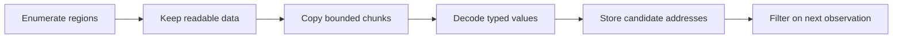

## The scanner pipeline



The Windows calls are only the outer shell. Candidate filtering is safe Rust.

## Describe readable regions

```rust
#[derive(Clone, Copy, Debug)]
struct MemoryRegion {
    base: usize,
    size: usize,
    readable: bool,
    writable: bool,
    executable: bool,
}
```

Use `VirtualQueryEx` to walk the target’s virtual address space. Keep only committed regions with readable protection, and skip guard or no-access pages.

Advance with checked math:

```rust
let next = region.base.checked_add(region.size)
    .context("memory-region walk overflowed")?;
anyhow::ensure!(next > current, "memory-region walk made no progress");
current = next;
```

## Scan copied chunks

```rust
fn find_u32_in_chunk(base: usize, bytes: &[u8], wanted: u32) -> Vec<usize> {
    let needle = wanted.to_le_bytes();

    bytes.windows(needle.len())
        .enumerate()
        .filter_map(|(offset, window)| {
            (window == needle)
                .then(|| base.checked_add(offset))
                .flatten()
        })
        .collect()
}
```

For an aligned-only scan, step by four. For a general scan, `windows(4)` checks every byte offset.

## Keep candidate values

```rust
#[derive(Clone, Copy, Debug)]
struct Candidate {
    address: usize,
    previous: u32,
}

enum Filter {
    Equal(u32),
    Increased,
    Decreased,
    Changed,
    Unchanged,
}
```

Filter by re-reading each candidate:

```rust
fn keep(filter: &Filter, previous: u32, current: u32) -> bool {
    match filter {
        Filter::Equal(value) => current == *value,
        Filter::Increased => current > previous,
        Filter::Decreased => current < previous,
        Filter::Changed => current != previous,
        Filter::Unchanged => current == previous,
    }
}
```

Update `previous` for candidates that survive.

## Expect regions to disappear

The target can free or change a region between enumeration and reading. Treat an unreadable candidate as removed, not as a reason to crash the scan.

Return a scan report:

```rust
struct ScanReport {
    regions_seen: usize,
    regions_read: usize,
    bytes_read: u64,
    candidates: Vec<Candidate>,
    skipped_regions: usize,
}
```

## Bound the work

Set limits for:

- maximum region size per read;
- chunk size, such as 1 MiB;
- total candidates;
- total scan time;
- supported value types.

A scan for a common value such as zero can produce millions of matches. Refuse or require a narrower range rather than exhausting memory.

## Guard writes

```rust
fn write_candidate(
    process: &Process,
    candidate: Candidate,
    replacement: u32,
) -> anyhow::Result<()> {
    let current = process.read_u32(candidate.address)?;
    anyhow::ensure!(
        current == candidate.previous,
        "value changed since the last scan"
    );
    process.write_u32(candidate.address, replacement)?;
    Ok(())
}
```

The UI should show the old and new value and require an explicit action.


## Separate types

Use a trait or enum for `u8`, `u16`, `u32`, `i32`, and `f32` rather than casting everything to one type. Float searches need special handling for NaN and approximate comparisons.

Start with one type and make it correct. A small scanner with clear errors is a stronger project than a giant clone with undefined behavior.
