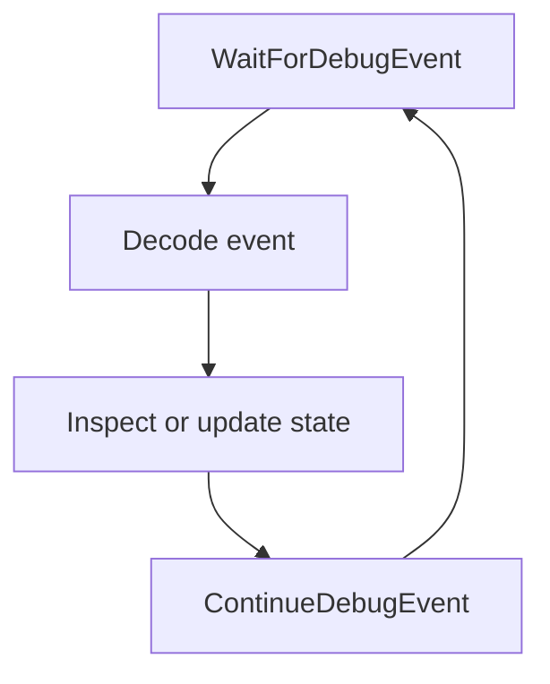

## A debugger is an event loop

Windows reports events such as process creation, DLL loading, exceptions, and process exit.



If the debugger forgets to continue an event, the target remains frozen.

## Model events immediately

Convert Windows structs into owned Rust data at the FFI boundary:

```rust
#[derive(Debug)]
enum DebugEvent {
    ProcessCreated { process_id: u32, thread_id: u32 },
    ThreadCreated { thread_id: u32 },
    ModuleLoaded { base: usize },
    Exception {
        thread_id: u32,
        code: u32,
        address: usize,
        first_chance: bool,
    },
    ProcessExited { code: u32 },
    Other,
}
```

Close or transfer ownership of any handles contained in the raw Windows event. Do not leak them during a long session.

## Own breakpoint state

```rust
#[derive(Debug)]
struct SoftwareBreakpoint {
    address: usize,
    original_byte: u8,
    armed: bool,
}

struct Debugger {
    process: Process,
    breakpoints: std::collections::HashMap<usize, SoftwareBreakpoint>,
}
```

Setting a breakpoint:

1. read the original byte;
2. store it;
3. write `0xCC`;
4. flush the instruction cache;
5. mark it armed.


## Handle the `int3` pause

When an owned software breakpoint fires:

1. suspend the relevant flow through the debug event;
2. restore the original byte;
3. move the instruction pointer back by one byte;
4. enable the CPU trap flag for one instruction;
5. continue.

The next single-step exception lets the debugger reinsert `0xCC` and clear the trap flag.

This dance is why a breakpoint is state, not just one byte.

```rust
enum BreakpointPhase {
    Armed,
    SteppingOriginal { thread_id: u32 },
    Disabled,
}
```

## Distinguish your exceptions

Not every breakpoint exception belongs to your debugger. Windows and the target may use breakpoints internally.

Check:

- exception code;
- address;
- whether the address is in your breakpoint map;
- first-chance status;
- current phase and thread.

Pass unhandled exceptions onward with the correct continue status.

## Keep FFI wrappers narrow

Windows calls include:

- `DebugActiveProcess` or process creation with debug flags;
- `WaitForDebugEvent`;
- `ContinueDebugEvent`;
- thread context get/set;
- process memory read/write;
- `FlushInstructionCache`;
- handle cleanup.

Each wrapper should document handle ownership, pointer validity, buffer size, and structure initialization.

## Guarantee continuation

Use a guard so an early parsing error does not accidentally leave an event uncontinued:

```rust
struct ContinueGuard {
    process_id: u32,
    thread_id: u32,
    status: u32,
    active: bool,
}

impl ContinueGuard {
    fn continue_now(mut self) -> windows::core::Result<()> {
        // Call ContinueDebugEvent here.
        self.active = false;
        Ok(())
    }
}
```

Its `Drop` implementation can make a best-effort continue and log failures.

## First milestone

Do not start with stepping, symbols, and a GUI. First:

1. launch a tiny Rust practice target under the debugger;
2. print process and thread events;
3. continue every event;
4. exit cleanly when the target exits.

Then add one breakpoint at a known function in your own target.

## Cleanup

On detach or exit:

- restore every armed breakpoint;
- flush the instruction cache;
- continue any pending event;
- detach if the target is still running;
- close every process and thread handle.

A debugger that pauses correctly but cannot cleanly detach is not finished.
