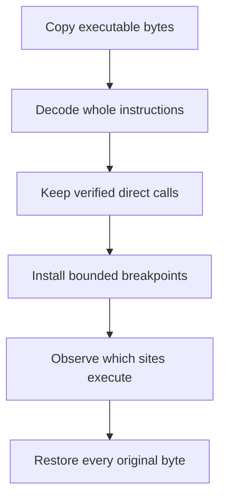
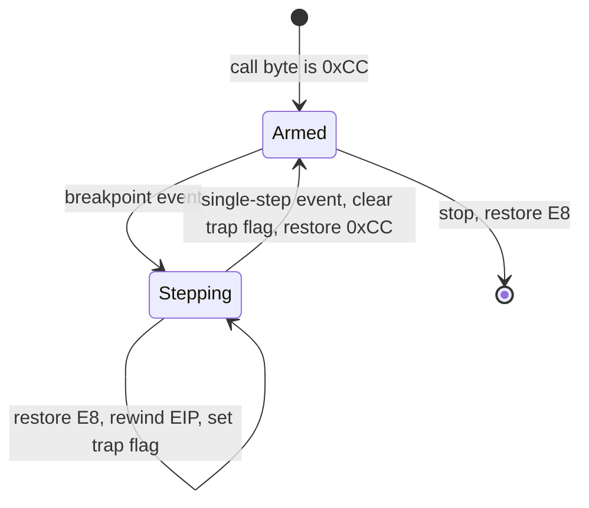

## Define the question

A call logger should not mean “break on every call in the whole process.” That would be noisy and slow.

Choose:

- one module;
- one executable section;
- one known caller range or target function;
- one small time window;
- a maximum number of events.

This scope is not just a performance setting. It gives the log a meaning. “These calls happened while one turn ended inside this verified module range” is evidence you can reproduce. “The process called thousands of things” is mostly noise.

## What a `call` instruction really does

A function call has two jobs:

1. remember the address of the instruction that should run afterward;
2. move the instruction pointer to the called function.

On 32-bit x86, a common direct call begins with opcode `E8` followed by a signed 32-bit relative displacement. The CPU adds that displacement to the address immediately after the call. A disassembler performs this calculation and exposes the final target.

An indirect call such as `call eax` or `call [ecx+8]` gets its destination from a register or memory at runtime. Static bytes alone do not reveal one final target, so the first course logger deliberately records only direct calls.

## Static discovery and live observation are different jobs

The logger does not place a breakpoint on every byte equal to `E8`. That byte may appear inside an immediate value or data. Instead, iced-x86 walks complete instructions and reports their flow-control kind.



## Find calls with the decoder

Use iced-x86 on the copied `.text` bytes and select direct near calls:

```rust
use iced_x86::{Decoder, DecoderOptions, FlowControl};

#[derive(Clone, Copy, Debug)]
struct CallSite {
    address: u64,
    target: u64,
}

fn direct_calls(bytes: &[u8], bitness: u32, start_ip: u64) -> Vec<CallSite> {
    let mut decoder = Decoder::with_ip(
        bitness,
        bytes,
        start_ip,
        DecoderOptions::NONE,
    );
    let mut calls = Vec::new();

    while decoder.can_decode() {
        let instruction = decoder.decode();
        if instruction.flow_control() == FlowControl::Call
            && matches!(
                instruction.op0_kind(),
                iced_x86::OpKind::NearBranch16
                    | iced_x86::OpKind::NearBranch32
            )
        {
            calls.push(CallSite {
                address: instruction.ip(),
                target: instruction.near_branch_target(),
            });
        }
    }
    calls
}
```

`NearBranch16` and `NearBranch32` are the direct relative call forms used in this 32-bit target. Indirect calls need runtime register or memory values and are a separate feature.

`Decoder::with_ip` needs both the bytes and their live starting address. The address lets each `Instruction` report a correct `ip()` and resolve a relative target. `decoder.can_decode()` stops at the end of the bounded slice. `flow_control() == FlowControl::Call` identifies call-like control flow, while the operand-kind check narrows that set to direct near branches.

The lesson uses `decode()` for readability. The complete binary reuses one `Instruction` with `decode_out`, which avoids constructing a new value on every loop iteration. That optimization does not change the algorithm.

## Bound the software breakpoints

Options include:

- one breakpoint on a specific call site;
- one breakpoint at a target function entry;
- a small rotating set;
- an in-process instrumentation hook for a practice program.

Start with one entry breakpoint while learning the state machine. The completed course tool expands to verified direct calls in readable executable regions, excludes known noisy sites, deduplicates addresses, and applies a hard 2,000-breakpoint cap. More instrumentation multiplies state and performance cost.

A software breakpoint changes the first byte of an instruction to `0xCC`, the one-byte `int3` instruction. When the CPU executes it, Windows pauses the thread and reports `EXCEPTION_BREAKPOINT` to the debugger. The original `E8` must be remembered so the real call can still execute and can later be restored.

## The two-event breakpoint dance

One breakpoint hit is not enough. If the debugger immediately writes `0xCC` back at the same address and continues, the thread hits it forever. The logger temporarily restores the call and single-steps exactly one instruction:



At the breakpoint event, Windows reports the address of `int3`. The logger:

1. confirms the address belongs to its breakpoint map;
2. restores the original `E8` byte;
3. opens the event thread and reads its `CONTEXT`;
4. rewinds `EIP` to the call address;
5. sets bit 8 of `EFlags`, the trap flag;
6. records that this thread is stepping this call;
7. continues the event.

The CPU now executes the real call. Because the trap flag is set, Windows pauses after that one instruction with `EXCEPTION_SINGLE_STEP`. At this moment `EIP` contains the call destination. The logger clears the flag, reinstalls `0xCC` at the call site, removes the thread from the stepping map, and prints the source and destination.

The stepping map is keyed by thread ID because several game threads can hit different breakpoints. A single global “currently stepping” variable would mix their state.

## Capture a compact event

```rust
#[derive(Debug)]
struct CallEvent {
    timestamp_micros: u128,
    thread_id: u32,
    call_site: usize,
    target: usize,
    stack_pointer: usize,
}
```

Do not automatically dump the entire stack or arbitrary pointed-to memory. Record only what the current experiment requires.

The event is a snapshot of facts already available while the thread is paused. `call_site` and `target` explain control flow; `thread_id` separates timelines; `stack_pointer` helps compare call contexts without copying unknown stack contents.

## Use a bounded channel

```rust
use std::sync::mpsc::{self, SyncSender};

fn logger_channel() -> (SyncSender<CallEvent>, mpsc::Receiver<CallEvent>) {
    mpsc::sync_channel(1_024)
}
```

The debugger thread uses `try_send`. If the writer is behind, increment a dropped-event counter rather than blocking the debug loop.

A bounded channel creates **backpressure**: it gives the producer a fixed amount of space instead of allowing logs to consume memory forever. `try_send` makes the policy explicit. Losing a counted observation is better than holding every target thread suspended while a disk writer catches up.

## Resolve addresses after capture

Keep time-sensitive handling short:

```text
breakpoint fires
→ copy register/context fields
→ re-arm and continue
→ background worker adds module+offset and symbols
→ writer stores one line
```

Symbols can be slow or unavailable. A module-relative address is still useful:

```text
wesnoth.exe + 0x1B4D00
```

Address resolution is delayed because the debug-event loop has a deadline: every target thread remains stopped until `ContinueDebugEvent`. Expensive formatting, symbol lookup, and file I/O belong on a background worker after the minimal register facts have been copied.

## Log a versioned format

```text
# gha-call-log v1
# target_sha256=...
# module=wesnoth.exe
time_us,thread,call_site,target,stack_pointer
15234,4108,0x1400012A0,0x140003500,0x000000BEEF...
```

Include the target fingerprint so later analysis does not mix runs from different builds.

CSV is intentionally boring. A version header explains how to parse it, a target hash binds it to one binary, and hexadecimal addresses preserve the notation used in the debugger. A future format can add columns without silently changing what older logs mean.

## Protect the target

Stop logging when:

- the event cap is reached;
- the time window expires;
- the target exits;
- event drops exceed a threshold;
- the user requests stop;
- a breakpoint cannot be restored.

These conditions form the logger’s safety envelope. The event cap bounds memory and terminal output. The time cap bounds disruption. The drop threshold detects a writer that cannot keep up. A restoration failure stops the experiment because continuing would leave the target executing altered code whose ownership is uncertain.

## How the Rust data structures divide responsibility

The complete executable uses two maps:

```rust
let mut breakpoints: BTreeMap<usize, u8> = BTreeMap::new();
let mut stepping: HashMap<u32, usize> = HashMap::new();
```

`breakpoints` maps each call address to its original byte. A `BTreeMap` also restores in deterministic address order, which makes diagnostics repeatable. `stepping` maps a thread ID to the call it is temporarily executing. A `HashMap` gives direct keyed lookup when the single-step event arrives.

The types prevent two different facts from being blurred together: “this address is patched” and “this thread is between restore and re-arm.”

## The Windows debug-event contract

`WaitForDebugEvent` returns one pending event. Until the debugger calls `ContinueDebugEvent`, target threads remain stopped. Therefore every successful wait must lead to exactly one continue, including error paths.

Some event variants transfer handles to the debugger. The logger closes process, thread, and image-file handles after reading the active union member selected by `dwDebugEventCode`. It does not guess which union field is valid.

The `AttachGuard` is the last line of cleanup. If ordinary Rust error propagation leaves the event loop, `Drop` attempts to detach. Breakpoint restoration still happens explicitly first because detaching a process whose code still contains course `0xCC` bytes would be unsafe.

## The capstone project

This tool combines the whole section:

- the pattern scanner locates a range or anchor;
- the memory wrapper copies bytes;
- iced-x86 identifies calls;
- the debugger owns breakpoint state;
- the logger moves observations off the hot path;
- RAII restores bytes and closes handles.

First prove the logger against a small Rust target whose source you control. Then run the real capstone against one narrow course target:

- Wesnoth 1.14.9: log calls around `0x009B4D00` while ending one turn;
- AssaultCube 1.2.0.2: log entries to the internal print function at `0x00419880` while names are drawn;
- Urban Terror 4.3.4: log the render path around the memory-wall hook at `0x0052D2FD` for one local frame window.

Set a limit such as 1,000 events or five seconds. The output should show real module-relative callers and targets from the selected game. Compare the log with x64dbg, then detach and verify every breakpoint byte was restored.

## Run the complete Wesnoth logger

The compiled course tool chooses the Wesnoth main module, asks `VirtualQueryEx` for readable executable regions, decodes them as x86 with iced-x86, and installs at most 2,000 verified `E8` call breakpoints. It excludes two known noisy call sites from the historical lab. When a call fires, it restores `E8`, rewinds `EIP`, sets the trap flag, executes the real call once, records the destination `EIP`, reinserts `0xCC`, and continues.

```powershell
.\target\i686-pc-windows-msvc\release\call_logger.exe
```

Exercise a small Wesnoth path, then press **End**. The tool restores every installed call byte before detaching. The full code is [`call_logger.rs`](/windows-labs/src/bin/call_logger.rs); shared memory and region enumeration are in [`process.rs`](/windows-labs/src/windows_impl/process.rs).

This first complete version writes compact lines directly to the console. The bounded-channel design above is the next performance step when you add file output; it is not required to run or reproduce the actual call logger.

## Read the complete source in six passes

The full [`call_logger.rs`](/windows-labs/src/bin/call_logger.rs) is longer than the scanner because it owns a live state machine. Read it in this order:

1. **Constants and guards** — caps, trap flag, known exclusions, detach cleanup.
2. **Thread context helpers** — open only the event thread and get or set its suspended register state.
3. **Static discovery** — copy executable regions and let iced-x86 return verified call instructions.
4. **Breakpoint transaction** — save `E8`, install `0xCC`, and roll back already-installed sites on partial failure.
5. **Exception state machine** — pair each breakpoint event with a later per-thread single-step event.
6. **Event loop and shutdown** — continue every event once, close transferred handles, restore bytes, and detach.

Do not begin at `main` and dive into every Windows name. First locate these six responsibilities; then read the helper used by the phase you are studying.

## Diagnose by the last completed state

| Symptom | Likely boundary |
|---|---|
| No call sites discovered | Wrong bitness, module range, region permissions, or decoder input |
| Breakpoints install but never fire | The chosen action did not execute those sites, or the scope is wrong |
| Repeated hit at one address | `EIP` was not rewound or the call was re-armed too early |
| Unhandled single-step event | The thread ID was absent from the stepping map |
| Target stays paused | A `WaitForDebugEvent` result did not reach one matching continue |
| Target crashes after detach | Original bytes were not completely restored |

This table is why the state machine is explained explicitly: the symptom tells you which transition to inspect instead of encouraging random breakpoint changes.
