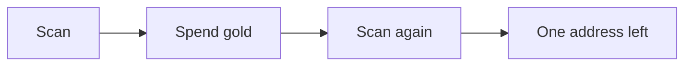

import {
  Accordion, AccordionGroup, Badge, Card, CardGrid, CodeGroup, Color, Column, Columns, Example, Expandable,
  Fields, FileTree, Frame, GitHub, HoverCard, Icon, LinkButton, LinkCard, Math, Panel, ParamField, Prompt, ResponseField,
  SpeedType, Steps, Tab, Tabs, Tile, Tiles, Tooltip, Update, Updates,
} from '../../components/kit';

This page shows each component the lessons can use, with the text that makes it.
A component earns its place when it changes how a reader moves through an idea:
steps a reader follows in order, alternatives a reader chooses between, detail a
reader can skip. It is never decoration. Colour follows the same rule: a lesson's
own colour marks structure that belongs to it, and the reading colours keep their
meanings (terms and prompts, code and types, results, cautions).

Every component is plain HTML in the page, so printing, search, and the listening
edition keep all of its text, including closed accordions, every tab, and the text of
every hover card.

## Callouts

Use a callout for one thing a reader must not miss. Keep it short. Four kinds exist,
and each has one meaning: **note** adds context, **tip** saves effort, **caution**
warns about a likely mistake, **danger** warns about harm.

```mdx
:::tip[Search the whole book]
Press <kbd>⌘</kbd> <kbd>K</kbd> to search every lesson at once.
:::
```

:::note[A note adds context]
The first scan returns many candidates. That is expected: a value like 100 is common.
:::

:::tip[A tip saves effort]
Change the value in the game before the next scan, so only the real address still matches.
:::

:::caution[A caution warns about a likely mistake]
Do not write to an address you have not confirmed. Restore the original value first.
:::

:::danger[A danger warns about harm]
Run lab programs only against the offline targets this course names.
:::

## Steps

Use steps for things a reader does, or a program does, in a fixed order. Each step
is one action. Write the list as an ordinary numbered list and wrap it.

```mdx
<Steps>

1. Start the game and note the gold value.
2. Scan for that value.
3. Spend some gold, then scan for the new value.

</Steps>
```

<Steps>

1. Start the game and note the gold value.
2. Scan for that value.
3. Spend some gold, then scan for the new value.
4. Repeat until one address is left.

</Steps>

## Tabs and code groups

Use tabs for alternatives to one job: two operating systems, two languages, two
tools. A reader who picks Windows once sees Windows everywhere on the page and in
later lessons, because tabs with the same `sync` key switch together. Without
JavaScript, and in print, every tab is shown one after another under its label.

```mdx
<Tabs sync="shell">
  <Tab label="PowerShell">

  Run `Get-Process wesnoth` to find the game.

  </Tab>
  <Tab label="Command Prompt">

  Run `tasklist | findstr wesnoth` to find the game.

  </Tab>
</Tabs>
```

<Tabs sync="shell">
  <Tab label="PowerShell">

  Run `Get-Process wesnoth` to find the game.

  </Tab>
  <Tab label="Command Prompt">

  Run `tasklist | findstr wesnoth` to find the game.

  </Tab>
</Tabs>

A code group is tabs whose panels are code, joined to the block:

<CodeGroup sync="lang">
  <Tab label="Rust">

```rust
let gold: u32 = 40;
let total = gold + 10;
```

  </Tab>
  <Tab label="Lua">

```lua
local gold = 40
local total = gold + 10
```

  </Tab>
</CodeGroup>

## Accordions

Use an accordion for material a reader may skip on a first pass: a long listing, an
optional check, a closer look. Never hide anything a later section depends on.

```mdx
<Accordion title="Check the arithmetic yourself">
  100 − 25 = 75, so the new gold value is 75.
</Accordion>
```

<AccordionGroup>
<Accordion title="Check the arithmetic yourself">

The price is 25 and the gold was 100. `100 − 25 = 75`, so the new value is 75.

</Accordion>
<Accordion title="Why 100 is a poor first scan">

Many unrelated values happen to be 100, so the first scan returns far too many candidates.

</Accordion>
</AccordionGroup>

## Columns

Use columns to put two or three things side by side: a before and an after, two cases,
source and bytes. They stack on narrow screens, in reading order.

```mdx
<Columns cols={2}>
  <Column title="Before"> ... </Column>
  <Column title="After"> ... </Column>
</Columns>
```

<Columns cols={2}>
  <Column title="Before the purchase">

  Gold is `100`. The shop shows a price of `25`.

  </Column>
  <Column title="After the purchase">

  Gold is `75`. The scan for `75` now has few candidates.

  </Column>
</Columns>

## Cards and tiles

Use cards to offer a few next places to go, with a sentence on what each one covers.
Use tiles when each option is better shown with a picture.

<CardGrid>
  <Card title="Memory scanning" icon="magnifier">
    Find a value that changes, then narrow the candidates until one address is left.
  </Card>
  <Card title="Debugging" icon="laptop">
    Pause the game and read the instruction that changed the value.
  </Card>
</CardGrid>

<LinkCard title="All lessons" description="Every lesson in reading order, with a progress tick for each." href="/contents/" />

<Tiles>
  <Tile title="Choose the process" href="/pages/1/09/" image="/assets/images/1/5/wesnoth2.png" alt="The process list with Wesnoth selected">
    Pick the right program before scanning.
  </Tile>
  <Tile title="The first scan" href="/pages/1/09/" image="/assets/images/1/5/wesnoth3.png" alt="Scan results for the value 100">
    See how many candidates one scan returns.
  </Tile>
</Tiles>

## Link buttons

Use a link button for the one next action a page offers, such as starting the first
lesson or opening a reference. A button says "do this next", so a page needs few of them.
Give the main action `primary`, an alternative `secondary`, and a quiet extra `minimal`.
A path that starts with `/` is inside the book.

```mdx
<LinkButton href="/pages/1/01/" variant="primary" icon="right-arrow">Start with Lesson 1.1</LinkButton>
```

<LinkButton href="/pages/1/01/" variant="primary" icon="right-arrow">Start with Lesson 1.1</LinkButton>
<LinkButton href="/glossary/" variant="secondary" icon="open-book">Open the glossary</LinkButton>
<LinkButton href="/updates/" variant="minimal">What's new</LinkButton>

## Frames

Use a frame around a screenshot or figure that needs a caption. The caption is for the
eye. Put the full description in the image's alt text: that is what the listening edition
reads, so nothing is read twice.

```mdx
<Frame caption="The first scan returns many candidates">
  
</Frame>
```

<Frame caption="The first scan returns many candidates">
  
</Frame>

## Badges and icons

Use a badge for a short fact about what follows: who it is for, what it needs. A plain
label is neutral. Colour is only for a status: green means safe, amber means take care,
red means it changes something. Use an icon only when it adds meaning a word does not.

<Badge text="Optional" /> <Badge text="Windows only" /> <Badge text="Safe lab" variant="success" /> <Badge text="Needs care" variant="caution" /> <Badge text="Changes the game" variant="danger" />

Open a lab from the lesson list <Icon name="right-caret" /> then run it.

## Hover cards

A hover card opens over a word or phrase when a reader hovers it, moves to it with the
keyboard, or taps it. The book writes some itself: a glossary word shows its definition
where the book first uses the word, and a mention such as "Lesson 2.1" shows what that
lesson covers. Write your own for an extra a reader can do without: an example, a
reference, a tip, an alternative, a recommendation, or a closer explanation.

A card is never where the lesson explains something. A reader can turn cards off in the
Reader theme panel, and on a phone a card needs a tap, so a card holds only what the
lesson reads fine without: never a step, a value, or a definition a later section uses.
Keep it to a sentence or two, and use few of them. The text of every card stays in the
page, in brackets after its words, so it prints and is read in the listening edition.

```mdx
Values are stored <HoverCard kind="example" body="The number `0x1234` is stored as the two bytes `34 12`: the small end comes first.">little-endian</HoverCard>.
```

Values are stored <HoverCard kind="example" body="The number `0x1234` is stored as the two bytes `34 12`: the small end comes first.">little-endian</HoverCard>.
The words are what the sentence says; `body` is what the card says. It can use `code`,
**bold**, *emphasis*, and [links](/pages/1/01/). A card can also have a `title`, and an
`href` that turns the words into a link and lets the card preview where it goes. Each
kind has one job, shown in its card's label and in its colour: information for what a
thing is, process for how it works, result for what to do, and caution for what goes wrong.

- **`definition`**: what a word means, when the glossary does not cover it. The first scan returns many <HoverCard kind="definition" title="Candidate" body="An address whose value still matches every scan so far. The next scan keeps only the candidates that match again.">candidates</HoverCard>.
- **`explanation`**: a closer second account of an idea, for a reader who wants more. Gold is read as a <HoverCard kind="explanation" body="A 32-bit value is four bytes. The scanner must read all four, in the order the game stored them, to get the number the game shows.">32-bit value</HoverCard>.
- **`reference`**: where to read more, such as a page of documentation or a tool's manual. Give an `href`. The read goes through <HoverCard kind="reference" href="https://learn.microsoft.com/en-us/windows/win32/api/memoryapi/nf-memoryapi-readprocessmemory" body="Microsoft's page for this function: every parameter, the return value, and the error cases.">ReadProcessMemory</HoverCard>.
- **`example`**: one concrete case of what the sentence says, with real values or a real output. Bytes are stored <HoverCard kind="example" body="The number `0x1234` is stored as the two bytes `34 12`: the small end comes first.">little-endian</HoverCard>.
- **`alternative`**: another way to do the same job, such as a different tool or method. Find the address with the <HoverCard kind="alternative" body="Cheat Engine's scanner finds the same address. The book builds its own so every step is visible, not because the other tool is wrong.">scanner this book builds</HoverCard>.
- **`tip`**: something that saves effort. <HoverCard kind="tip" body="Change the value in the game before the next scan, so only the real address still matches.">Change the value</HoverCard> before each scan.
- **`recommendation`**: what the book would choose, and why. Run every lab against a <HoverCard kind="recommendation" body="A copy you can delete and reinstall is safe to break. A game you care about is not.">practice copy of the game</HoverCard>.
- **`caution`**: a likely mistake, or something that cannot be undone. Never <HoverCard kind="caution" body="A write to an address you have not confirmed can corrupt the game's state. Keep the original value, and write it back to undo the change.">write to an unconfirmed address</HoverCard>.

Hover, focus, or tap any of the underlined words above to see its card. A card on a
link, like the one on `ReadProcessMemory`, stays a link: the card only previews it.

## Tooltips

Use a tooltip for a short explanation of one word or phrase that a reader may not know
and the lesson does not depend on: a sentence or two, with the real numbers if it has
any. It is a hover card of kind `explanation` whose text goes in a `tip` attribute, so it
opens on hover, focus, or tap, and its text stays in the page for printing and the
listening edition. A word the book uses in many places belongs in the glossary instead.

```mdx
A quarter turn is 1.5708 <Tooltip tip="A radian measures an angle by the arc it covers on a circle of radius 1. A full turn is 2π = 6.2832 radians.">radians</Tooltip>.
```

A quarter turn is 1.5708 <Tooltip tip="A radian measures an angle by the arc it covers on a circle of radius 1. A full turn is 2π = 6.2832 radians.">radians</Tooltip>.

## Fields

Use fields to document a function, a request, or a structure: each name with its type
and what it means. They read more clearly than a table when the descriptions are long.

```mdx
<Fields title="Parameters">
  <ParamField name="process" type="HANDLE" required> ... </ParamField>
</Fields>
<ResponseField name="return" type="BOOL"> ... </ResponseField>
```

<Fields title="Parameters">
  <ParamField name="process" type="HANDLE" required>
    A handle to the process whose memory is read. It must allow reading.
  </ParamField>
  <ParamField name="address" type="*const c_void" required>
    The address in that process to start reading from.
  </ParamField>
  <ParamField name="size" type="usize" required>
    How many bytes to read.
    <Expandable title="Why a size is always needed">

    The call cannot know how long the value is. Asking for too many bytes can cross into memory that is not readable, which makes the whole call fail.

    </Expandable>
  </ParamField>
</Fields>

<ResponseField name="return" type="BOOL">
  Nonzero when every requested byte was read, zero when the read failed.
</ResponseField>

## Examples and panels

Use an example for one worked case set apart from the explanation around it. Use a panel
for a reference box a reader may return to: a cheat sheet, a small table, a list of terms.

<Example title="Reading four bytes as a number">

The bytes `19 00 00 00`, read little-endian, are the number `25`. The first byte is the
smallest part, so the value is `0x19 = 25`.

</Example>

<Panel title="Registers at a glance">

| Register | Usually holds |
|---|---|
| `eax` | A result or a number being worked on |
| `esp` | The top of the stack |
| `eip` | The next instruction |

</Panel>

## File trees

Use a file tree to show how a folder is laid out.

<FileTree>

- windows-labs/
  - src/
    - bin/
      - access_probe.rs
      - handle_raii.rs
  - Cargo.toml

</FileTree>

## Colours

Use a colour swatch where a lesson gives a colour as numbers, such as <Color value="#d85f2a" name="orange" /> and <Color value="rgb(39, 108, 103)" name="teal" />.

## Prompts

Use a prompt where a reader will ask an assistant for help. It can be copied, or opened in
an assistant, and nothing is sent until the reader clicks.

<Prompt title="Ask for a second explanation">

I am reading a lesson about scanning a game's memory for its gold value. Explain, in plain
language and with one small example, why the first scan returns so many results and how a
second scan narrows them. Do not give me addresses: I will find those myself.

</Prompt>

## Source on GitHub

Use a GitHub card where a lesson points at a lab. It shows how long the file is and links
to the exact version the book was built from.

<GitHub path="windows-labs/src/bin/access_probe.rs" />

## Maths

Write maths between double dollar signs. A formula on its own line is displayed; one
inside a sentence stays in the sentence. A single dollar sign is never maths, so prices
and shell variables are safe.

```mdx
$$
% speak: the distance is the square root of the sum of the squared differences
d = \sqrt{(x_2 - x_1)^2 + (y_2 - y_1)^2}
$$
```

The distance between two points is

$$
% speak: the distance is the square root of the sum of the squared differences
d = \sqrt{(x_2 - x_1)^2 + (y_2 - y_1)^2}
$$

and a value of $$2^{10} = 1024$$ in a sentence stays on its line. The line that starts
with `% speak:` is the formula in words, for the listening edition. Leave it out and the
book reads the formula automatically.

MDX reads curly braces in running text as code, so a formula that needs them for
subscripts and groups is safest written with the `Math` component. Its `speak` is the
formula in words:

```mdx
<Math block tex="\Delta_{\text{game}} = \min(\Delta_{\text{real}},\ \Delta_{\max}) \times s" speak="the game delta equals the smaller of the real delta and the maximum delta, times the time scale s" />
```

<Math block tex="\Delta_{\text{game}} = \min(\Delta_{\text{real}},\ \Delta_{\max}) \times s" speak="the game delta equals the smaller of the real delta and the maximum delta, times the time scale s" />

## Typing practice

Wrap a short block of code in `SpeedType` and the lesson gets a "Practise typing this"
button under it. A reader types the code with the keyboard, the way speedtyper.dev
does: the code stays on screen, dimmed, each correct key lights up the next character,
a wrong key flashes and waits, and Backspace takes the last one back. Enter starts the
next line and the indentation is filled in, so only the code itself is typed. The result
is words per minute, accuracy, and time, and the reader's best is kept in their browser.

<SpeedType id="components-spend" title="Type the spending check">

```rust
fn spend_if_possible(gold: u32, cost: u32) -> Option<u32> {
    gold.checked_sub(cost)
}
```

</SpeedType>

````mdx
<SpeedType id="components-spend" title="Type the spending check">

```rust
fn spend_if_possible(gold: u32, cost: u32) -> Option<u32> {
    gold.checked_sub(cost)
}
```

</SpeedType>
````

Choose code that is short (about 5 to 15 lines), plain ASCII, and already explained in the
lesson, so typing it fixes the idea in place. Characters a keyboard cannot easily type, such
as an emoji in a comment, are filled in. `id` names the snippet for the reader's best and
must be unique across the book.

## Diagrams

A fenced `mermaid` block draws a diagram. The book draws it while building, so a reader's
browser never has to.



## Updates

The list of changes to the book and the site is on its own page, written with
`Updates` and `Update`:

<LinkCard title="What's new" description="Recent changes to the lessons and the reader." href="/updates/" />

```mdx
<Updates>
  <Update label="3 October 2026" tags="Reader, Progress" description="Mark lessons done."> ... </Update>
</Updates>
```
