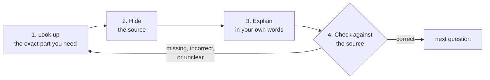

import MemoryStrip from '../../../../components/MemoryStrip.astro';

You do not need to prove that you already know something before you study it.
The next lesson starts with the parts of a computer and builds each idea from
there. You do not need to look up its missing foundations before you begin.

Here is one study loop that works well for unfamiliar technical ideas. It is a
suggestion, not a requirement: the later lessons explain their subjects
directly and do not depend on it, so use it when an idea will not stick and
skip it when it does.

1. **Look up** the exact part you need.
2. **Close or hide** the answer.
3. **Explain** the idea in your own words.
4. **Check and correct** what you said.

That loop gives you fast feedback. It also prevents a common mistake: reading
the same paragraph several times and confusing recognition with understanding.

## Ask a question small enough to answer

Broad questions make it hard to tell whether an answer is complete.

❌ **Too broad:** “How do games work?”

✅ **Better:** “When I press the jump button, what changes on the screen?”

✅ **Better:** “If I press jump while the character is standing still, does the
character rise before landing again?”

A useful technical question usually names:

- the object you are studying;
- the relationship you want to understand;
- the evidence or example you can check.

The jump question names the action you control, the change you want to observe,
and a way to check it: try the same button press while standing still and watch
the character. If nothing happens, you have a more useful next question: was
the button received, or does this situation prevent jumping? You can investigate
one possibility at a time.

<MemoryStrip
  column
  cells="object=the jump button|relationship=what the character does after one press while standing still|evidence=repeat the press from the same starting position and watch the rise and landing"
  caption="A checkable question names the action, the change to look for, and a repeatable observation."
/>

## Read the source before answering an unfamiliar question

If you encounter an unfamiliar idea, read the explanation and its example
before trying to answer a question about it. For a detail that depends on a
particular tool or version, consult that tool's documentation too.

Then hide the source and answer without looking at it. This matters because
copying a sentence tests your eyes, while rebuilding its meaning tests your
understanding.

Suppose a lesson says:

> A game's state is the information that describes what is happening now.

A good answer in your own words could be:

> State is what the game currently remembers, such as a character's health or
> position.

The wording changed, but the meaning stayed accurate. Do not add a claim the
lesson did not support, such as “state is only what I can see on the screen.”

## Correct mistakes immediately

After answering, compare your answer with the source or ask for a correction
that uses the source. Mark each important part as:

- **correct** — the meaning matches;
- **missing** — an important part was left out;
- **incorrect** — the answer says something the source does not support;
- **unclear** — the idea may be right, but the wording hides it.

Rewrite only the parts that need work. A correction should tell you *why* the
old answer failed, not merely show a replacement sentence.

If you miss the same question in the same study session, look it up again and
retry with different wording. This tests whether you can express the idea in
more than one way. If you retry on another day, answer as accurately as you can
after reviewing it again. Save repeated weak spots for spaced review.

## Accuracy and flexible wording are different skills

**Answering in your own words** means preserving the original meaning without
copying the sentence.

**Explaining it a different way** means keeping that meaning while changing the
example, order, or comparison. For instance:

- accurate answer: “Game state describes what is happening now.”
- different explanation: “If a character loses health, the game's remembered
  health changes; the health bar may then show that change.”

The first checks precision. The second checks whether you can use the idea.

## Use a worked example before making a prediction

First follow an example whose starting point, action, and result are explained.
Suppose a game shows 100 gold. Buying an item for 25 gold leaves 75: subtracting
25 from 100 gives 75. After seeing that worked through, you can predict what a
second 25-gold purchase would do, then check in the game. Later lessons use
this same visible change to ask where the value is kept and how code updates it.

When you reach a code example, read its explanation before predicting a result.
If you use an AI completion or copy a line, explain every accepted line. “It
compiles” is useful feedback, but it is not the same as understanding.

## Ask for debugging help someone can reproduce

“It does not work” gives another person almost nothing to inspect. A useful help
request includes:

- what you expected;
- what actually happened;
- the smallest relevant code;
- the exact error message;
- the target version and architecture;
- what you already tested.

That information turns a complaint into a question someone can reproduce.

## Use AI as a helper, not as the source of truth

AI can create practice questions, compare your explanation with supplied source
material, simplify a difficult paragraph, or suggest a small test. Give it the
actual source, version, and code when those details matter.

Always check important claims against the program, documentation, or source
code. If the answer cannot show where a fact came from, treat it as a lead to
verify—not as evidence.

## A short study session

If you want a routine, this one fits in 20–40 minutes:

1. skim the lesson headings for a few minutes;
2. choose one question you can test;
3. read one explanation and one small example;
4. hide them and explain the idea;
5. run or inspect the example;
6. check your explanation against the source and retry the parts you missed.

## Checkpoint

Before moving on, you should be able to:

- turn a broad topic into a checkable question;
- look up an unfamiliar idea before answering;
- explain it without copying the source;
- compare, correct, and retry your answer;
- give a helper enough detail to reproduce your problem.
