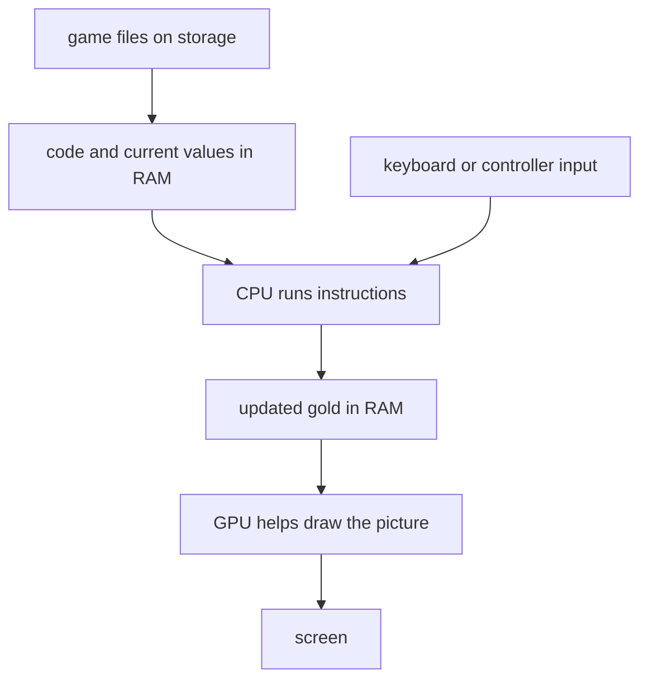
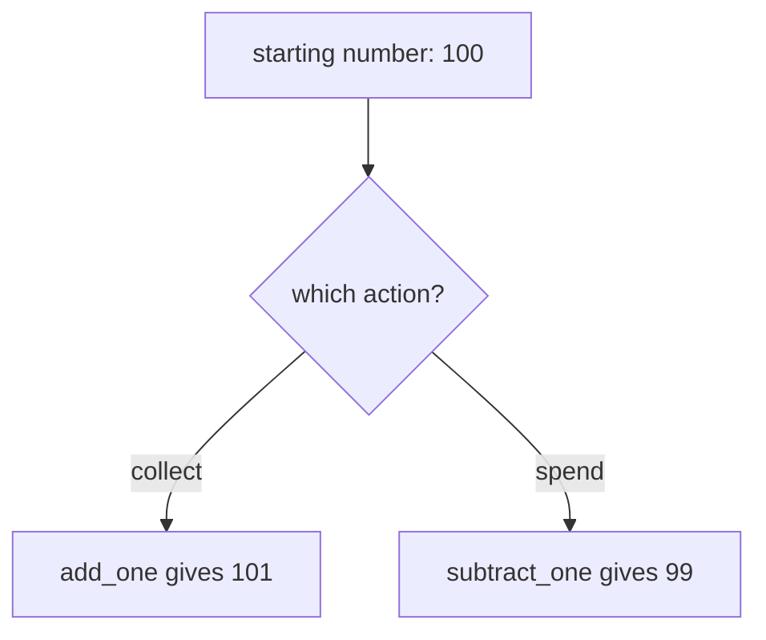
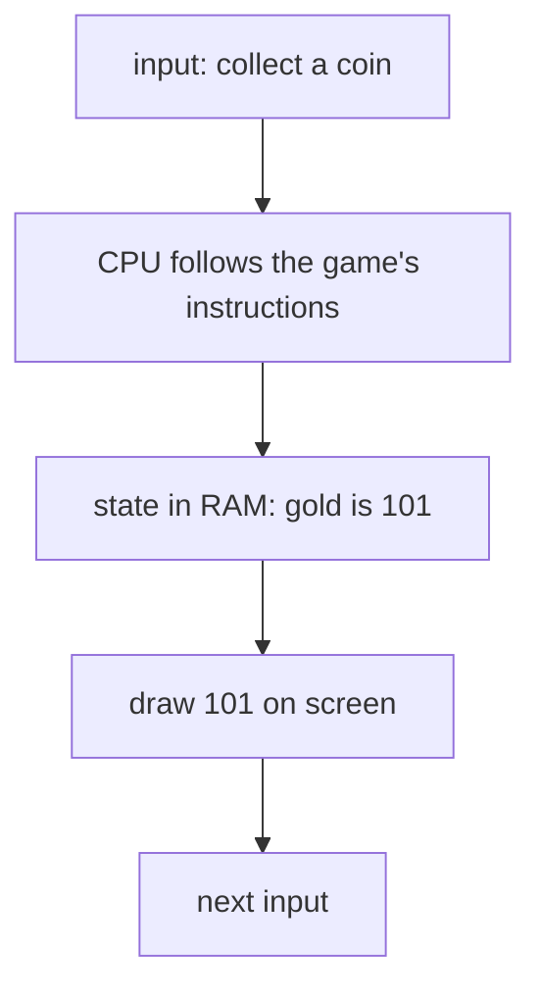

import MemoryStrip from '../../../../components/MemoryStrip.astro';

Suppose a game shows 100 gold. You collect one coin, and the display changes
to 101. What had to happen inside the computer for that small change to
appear? We can answer without knowing a programming language yet.

## The parts work together

The game's files stay on a **storage drive** when the game is closed. When
you start it, the computer puts the code and the information needed soon into
**RAM** (random-access memory). RAM is fast working storage; its contents are
temporary. The **CPU** (central processing unit) runs the code and changes
values such as your gold. A keyboard, mouse, or controller supplies input.
The **GPU** (graphics processing unit) helps turn the game's drawing work
into the picture you see.

These parts have different jobs in our coin example. The stored game file
contains the instructions for collecting a coin. While the game runs, RAM
holds the current gold value. The CPU updates that value from 100 to 101, and
the game draws the new number on the screen. The parts communicate through
the computer's hardware; none of them is the whole game by itself.



## The CPU follows small instructions

The CPU is sometimes called the computer's **brain**. That is a useful first
picture of its central job, but the CPU does not understand a game as a person
does. It executes **instructions**: small, specified operations such as
copying a number, adding two numbers, comparing them, or going to another
instruction.

The CPU has tiny working places called **registers**. Imagine one register
currently holds 100. An add-one instruction changes that register's value to
101. It did one small job; it did not decide what a coin means or draw the
number. Later, the program can store the result in RAM for continued use.

This is a description of the change, not executable CPU code:

```text
working value starts at 100
add 1 to the working value
working value is now 101
```

The exact CPU instructions and register names depend on the machine. For
now, follow the value: 100 went in, one was added, and 101 came out.

## A program combines instructions

A **program** is a collection of instructions arranged to do a larger job.
Our example becomes a tiny program if we let a number come in and send the
new number out:

```text
input: 100
copy the input into a working value
add 1 to the working value
output: 101
```

The **input** is the value supplied to this calculation. The **output** is
its result. A running program can also remember values, cause effects, and
keep working rather than stop after one output. In a game, the gold count is
part of the game's changing **state**: information describing what is
happening now. The input might be the event “collect a coin,” and the new
state has 101 gold.

## A function names work we want to reuse

A larger program may need to add one in many places. We can give that small
behavior a name: **add_one**. A named piece of program behavior is a
**function**. Instead of describing its steps every time, another part of
the program can ask add_one to work on a number.

```text
function add_one(number):
    result = number + 1
    give back result

add_one(100) gives back 101
```

This is explanatory pseudocode, not code you can run as written. The name
`number` stands for the input supplied on each use; `result` is the value
after adding one. A function can also do work without taking an input or
returning a useful value. Naming behavior lets the program reuse and
organize it.

## A branch chooses which work to do

What if a game can award a coin **or** charge one? We can name the second
operation subtract_one. Both operations change the same starting number by
one. Now the program needs another input: which action occurred?

```text
starting number: 100
action "collect": add_one(100) gives back 101
action "spend": subtract_one(100) gives back 99
```

For “collect,” the program follows the add path and ends at 101. For
“spend,” it follows the subtract path and ends at 99. It must **compare**
the action with the choices and then follow one path. This choice is a
**branch**. A branch lets the same program respond differently to different
input. It does not run both outcomes for one action.



In a real game, spending may also need a rule such as “do not spend when
gold is zero.” That is another comparison and branch. Lesson 1.4 will turn
this small calculation into a program written in Rust.

## How the numbers are represented

We have treated 100 and 101 as ordinary numbers. To find them in a running
game, we also need to know how computers represent numbers.

In familiar **decimal** notation, each place is worth ten times the place
to its right. The number 101 means one hundred, zero tens, and one unit:
1 × 100 + 0 × 10 + 1. **Binary** uses only 0 and 1. Each place is worth
twice the place to its right. One binary digit, either 0 or 1, is a **bit**.

Eight bits make one **byte**. The eight places in a byte are worth 128, 64,
32, 16, 8, 4, 2, and 1. For example:

```text
place value: 128  64  32  16   8   4   2   1
bits:          0   1   1   0   0   1   0   0
total:            64 + 32 + 4 = 100
```

Writing eight bits for every byte gets tiring. **Hexadecimal**, or **hex**,
uses sixteen digits: 0–9 followed by A–F for values ten through fifteen.
One hex digit represents four bits, so two hex digits represent one byte.
The byte above splits into `0110` (six) and `0100` (four), written
`0x64`. The prefix `0x` tells you it is hex. Its value is still decimal
100: 6 × 16 + 4. Decimal, binary, and hex are different ways to *write* the
same number, not three different kinds of gold.

<MemoryStrip
  cells="high four bits=0110|low four bits=0100"
  groups="0-0:hex 6|1-1:hex 4"
  groups2="0-1:0x64 = 6 × 16 + 4 = 100"
  caption="The same one-byte value, split into two groups of four bits and written in hexadecimal."
/>

One byte can represent 0 through 255. Larger values use several bytes. The
memory lesson just before the first scan will show where those bytes sit and
how a program reads them together.

## Languages help people write programs

The CPU executes instructions represented by patterns of bits. Writing a
whole game as bit patterns would be difficult. **Assembly language** gives
human-readable names to operations such as moving and adding values. A
**higher-level language** lets us express larger ideas, such as functions
and branches, without spelling out every CPU operation.

Our add-one function and collect-or-spend branch can be written in a
language like Rust. A compiler translates source code into machine code
for a chosen target. The translation is not necessarily one source line to
one CPU instruction. Here is our same small function in Rust:

```rust
fn add_one(number: u32) -> u32 {
    return number + 1;
}
```

`fn` names a function. `number` is its input; `u32` means a non-negative
whole number stored in 32 bits. The arrow says the function gives back a
`u32`, and `return` sends back the sum. Calling `add_one(100)` therefore
gives back 101, just as the earlier pseudocode did. This is a function
fragment, not a whole program; Lesson 1.4 builds and runs the complete Rust
example. Lesson 1.10 follows the later steps that turn source into a program
file.

## The operating system helps programs use the computer

Even our tiny add-one program needs more than arithmetic if a person must
type a number and see an answer. It needs a way to receive input and display
output. A game also needs files, sound, windows, and access to devices.

An **operating system** (OS) provides common services for those jobs and
coordinates programs that use the computer. This book uses Windows for its
practical examples. A program written for Windows can ask Windows to read
a file or show a window instead of controlling each device from scratch.

An **application** is a program made for a user to do something. A game is
an application: it uses the OS's services, runs its own instructions, and
keeps its own changing state.

## From a file to a running game

The game file on storage contains code and other saved information. Starting
it creates a **process**: one running instance of that program, with its own
memory and resources. Windows loads the code and needed data into memory and
starts a **thread**, a path that executes instructions in the process. A
process may have more than one thread, but one is enough to picture this
first example.

Many games repeat a broad **game loop** while you play:

1. receive input, such as the event “collect a coin”;
2. update state, changing gold from 100 to 101;
3. draw the current state, so the display shows 101;
4. repeat for the next action.



Actual games split this work among many systems and sometimes several
threads. This loop is a first model for asking a useful question: did the
input arrive, did the stored value change, and did the display show the
changed value?

## The pieces together

The CPU carries out individual instructions. A program arranges many of
them into useful behavior: receive a value, apply the add-one operation,
and produce a changed value. A function names that reusable behavior;
a branch chooses whether to collect or spend. Storage keeps the game
file, RAM holds the running program's state, and the operating system
loads the file as a process the CPU can execute.

The gold value changed while the game was running. The next question is
what the game's rules do with it and how several players can each have
their own value. [Game Fundamentals](/pages/1/03/) starts there. We will
return to bytes and addresses just before the first memory scan in
[Lesson 1.8](/pages/1/08/).
