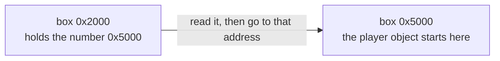
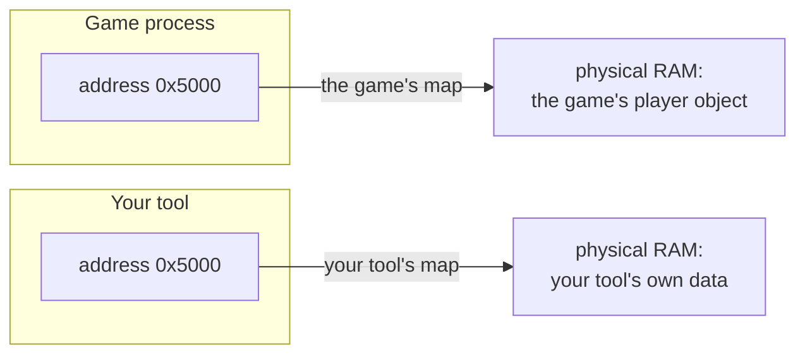
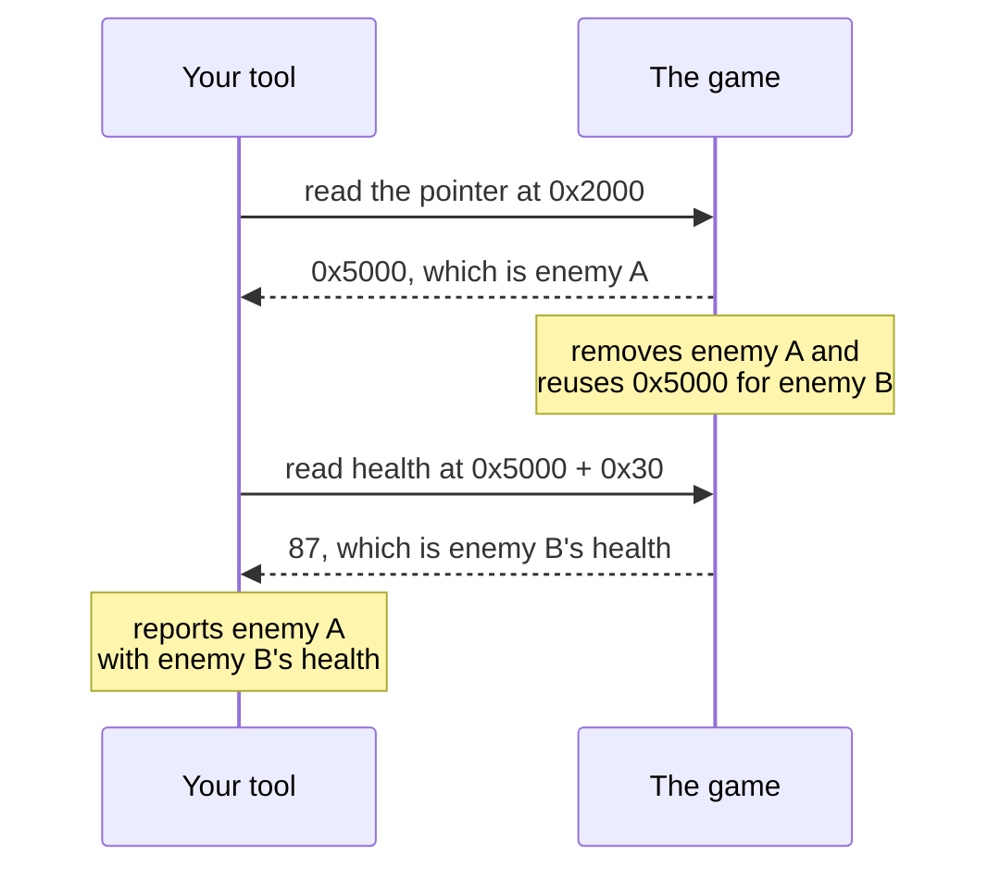

import ConceptLab from '../../../../components/ConceptLab.astro';
import MemoryStrip from '../../../../components/MemoryStrip.astro';
import Quiz from '../../../../components/Quiz.astro';

Your health bar says 100. You take a hit and it says 75. Somewhere inside the
computer, something that was 100 is now 75.

This lesson is about where that number actually lives and what it is made of.
Nearly everything later in the book — finding a value, following a pointer,
reading another program's memory — falls apart if these few ideas are fuzzy, so
it is worth going slowly here.

It is also a first pass. Each idea gets one clear example here, and
[Lesson 3.9](/pages/3/09/) comes back later to take the bits apart one at a
time, including exactly how a fractional number like 10.0 is stored.

## "Memory" means more than one thing

People use the word for several kinds of storage, and mixing them up causes a
lot of early confusion.

| Layer | How big, how fast | What lives there |
|---|---|---|
| CPU registers and caches | tiny, extremely fast | the handful of values the CPU is working on right now |
| RAM | large, fast | the running game's code, objects, and current state |
| storage drive | huge, slow | the game's files, art, settings, and saved games |

There are layers because no single technology is fast, large, cheap, and
permanent all at once. Fast memory costs a lot, so you get a little of it. Cheap
storage is slow, so it holds the things you are not using this instant.

From here on, when this book says "memory" it means RAM. That is where your
health value lives while you are playing. Turn the computer off and it is gone —
which is exactly why saving a game has to write a file to the drive.

## Memory is a very long row of numbered boxes

Picture RAM as an enormous row of boxes. Each box holds one **byte**, and each
box has a permanent number called its **address**.

That really is most of the idea. Memory is boxes, one byte each, each with an
address. Here are four of them:

<MemoryStrip
  cells="0x1000=64|0x1001=00|0x1002=00|0x1003=00"
  caption="Four boxes of RAM. The small label is each box's address; the number inside is the byte stored there."
/>

Both the addresses and the bytes are written in **hexadecimal**, a way of
writing numbers that the next two sections build up from scratch. The `0x`
prefix on an address announces it. Inside the boxes, each byte is shown as two
hex digits with the prefix left off, which is also how debuggers and hex dumps
display bytes.

### Inside a byte: eight bits and their place values

A **bit** is a single switch that is either 0 or 1. A byte is eight bits in a
row. The question is how eight 0s and 1s can mean a number like 100.

The answer is the same trick ordinary numbers use: position. In the decimal
number 100, the 1 is worth a hundred only because of where it sits. Each
position in decimal is worth ten times the position to its right — ones, tens,
hundreds, thousands.

Binary works the same way, except each position is worth **two** times the
position to its right. Starting from the right, the eight positions in a byte
are worth:

```text
128   64   32   16   8   4   2   1
```

To read a byte, add up what the positions holding a 1 are worth. The positions
holding a 0 add nothing:

<MemoryStrip
  cells="128=0|64=1|32=1|16=0|8=0|4=1|2=0|1=0"
  marks="1-2|5"
  groups="0-7:64 + 32 + 4 = 100"
  caption="The byte `0x64`, bit by bit. Each small label is what that position is worth. The three highlighted 1 bits add up to 100."
/>

With every bit set, a byte holds 128 + 64 + 32 + 16 + 8 + 4 + 2 + 1 = 255. With
none set, it holds 0. So a byte has exactly 256 possible values, 0 to 255.

### Why everything is in hex

Eight 0s and 1s are tiring to read, so people write bytes in **hexadecimal**,
which is base 16. It counts with sixteen digits: `0` to `9`, then `A` to `F`
standing for 10 to 15.

Hex fits bits perfectly. Four bits have the place values 8, 4, 2, and 1, so they
can hold anything from 0 (all off) to 15 (all on) — exactly the range of one hex
digit. Split a byte into two halves of four bits and each half becomes one hex
digit:

<MemoryStrip
  cells="8=0|4=1|2=1|1=0|8=0|4=1|2=0|1=0"
  marks="1-2|5"
  groups="0-3:4 + 2 = 6, hex `6`|4-7:4 = 4, hex `4`"
  caption="The same byte split into two four-bit halves. Each half is one hex digit, so the byte is written `0x64`."
/>

That is the whole reason debuggers use hex: two hex digits are always exactly
one byte, so you can see where each byte starts and ends. The same number
written in decimal, 100, hides that. It gets more obvious with bigger numbers:
decimal 4096 looks arbitrary, while `0x1000` is clearly a round figure in memory
terms.

You do not need to convert hex in your head. Recognise the `0x`, and use a
calculator until it becomes familiar. Converting by hand works like decimal
with sixteens instead of tens: `0x64` is six sixteens plus four, 6 × 16 + 4 =
100.

## Bigger values use neighbouring boxes

One box holds one byte, and one byte only goes up to 255. Anything bigger has to
spill into the boxes next door. A `u32` — the type name for an unsigned 32-bit
whole number, explained properly below — uses four boxes in a row.

### Byte order, and why hex dumps look backwards

Once a value spans several boxes, the CPU needs a rule for which box holds which
part.

Think about the decimal number 1,234. The leading 1 is worth the most — it means
a thousand. The trailing 4 is worth the least. The bytes inside a multi-byte
value work the same way, and the byte worth the least is called the
**least-significant** byte.

Windows games on x86 and x86-64 put the least-significant byte in the
lowest-numbered box. That arrangement is called **little endian**.

Each box counts in units 256 times bigger than the box before it, because one
byte holds 256 different values — the same reason each decimal column counts in
units ten times bigger than the one to its right. So the four boxes of a `u32`
count ones, 256s, 256 × 256 = 65,536s, and 256 × 256 × 256 = 16,777,216s. Here
is the number 1,000, which is `0x3E8` in hex:

<MemoryStrip
  cells="0x1000=E8|0x1001=03|0x1002=00|0x1003=00"
  groups="0-0:× 1|1-1:× 256|2-2:× 65,536|3-3:× 16,777,216"
  groups2="0-3:0xE8 is 232, and 232 × 1 + 3 × 256 = 1,000"
  caption="Little endian: the byte worth the least sits in the lowest-numbered box."
/>

The practical effect is that reading a hex dump left to right shows the bytes in
the opposite order from how you would write the number: `E8 03 00 00`, not
`00 00 03 E8`.

This trips up nearly everyone at least once. Expect the reversal every time you
compare a number you worked out against bytes you actually saw.

Now the four boxes from the start of the lesson make sense. `64 00 00 00` is
`0x64` ones plus nothing else, which is 100.

### Three facts that are easy to blur together

Look again at those four boxes. There are three separate things going on:

- `0x1000` is a **location** — which box;
- `64 00 00 00` is a **pattern of bytes** starting in that box;
- `100` is one **interpretation** of that pattern.

<MemoryStrip
  cells="0x1000=64|0x1001=00|0x1002=00|0x1003=00"
  marks="0"
  groups="0-3:the byte pattern `64 00 00 00`"
  groups2="0-3:one interpretation: the `u32` value 100"
  caption="The address names one box. The pattern spans four. The number 100 appears only when something reads those four boxes as a `u32`."
/>

The third one does not follow automatically from the first two, and this is the
single most important idea in the lesson. Those bytes only become the number 100
once something decides to read four boxes, treat them as one whole number, and
use little-endian byte order. Read the same boxes with a different set of rules
and the very same bytes mean something else, as the next section shows.

So never treat "address" and "value" as the same word. An address tells you
*where to look*. A value is what you get *after* you look and decide how to read
what is there.

## A type is the instruction for reading bytes

A **type** answers two questions: how many bytes to read, and what the bits
inside them mean.

```rust
let health: u32 = 100;
let speed: f32 = 3.5;
let alive: bool = true;
```

The names are for you. The types are for the compiler. These are the ones you
will meet most often:

| Rust type | Size | What the bits mean |
|---|---|---|
| `u8` | 1 byte | a whole number from 0 to 255 |
| `u16` | 2 bytes | a whole number from 0 to 65,535 |
| `u32` | 4 bytes | a whole number from 0 to 4,294,967,295 |
| `i32` | 4 bytes | a whole number from −2,147,483,648 to 2,147,483,647 |
| `f32` | 4 bytes | a number that can have a fractional part, such as 3.5 |
| `f64` | 8 bytes | the same idea as `f32`, with more precision |
| `bool` | 1 byte | `0` means false, `1` means true |

The names follow a pattern. The number is the size in bits. `u` means
**unsigned**: the value can never be negative. `i` means a signed **integer**,
which can be. `f` means **floating point**, a number with a fractional part.

The ranges come from counting patterns. One bit has 2 patterns, and every extra
bit doubles the count: two bits have 4, three have 8, and eight have 256, which
is why a `u8` stops at 255. Sixteen bits have 256 × 256 = 65,536 patterns, and
thirty-two bits have 65,536 × 65,536 = 4,294,967,296. An `i32` has exactly as
many patterns as a `u32`, but it spends half of them on negative numbers, which
is why its range is split around zero.

### One pattern, two readings

`u32` and `f32` are both four bytes, but they use those 32 bits in completely
different ways. A `u32` reads all 32 bits as one whole number. An `f32` splits
them into three parts — a sign, a power of two, and the digits of the number —
much as scientific notation writes 1,500 as 1.5 × 10³.

So one four-byte pattern holds two totally different numbers, depending on which
type you ask for:

<MemoryStrip
  cells="=00|=00|=20|=41"
  groups="0-3:read as `u32`: 1,092,616,192"
  groups2="0-3:read as `f32`: 10.0"
  caption="One four-byte pattern, read two ways. Both readings are correct; they answer different questions."
/>

The `u32` reading uses only what this lesson has covered: written most
significant first, the bytes are `0x41200000`, and a calculator turns that into
1,092,616,192. The `f32` reading follows rules for its three parts that are not
covered here; [Lesson 3.9](/pages/3/09/#fractions-how-an-f32-splits-its-32-bits)
works through them bit by bit, all the way to 10.0. What matters now is that
nothing in memory changed between the two readings. Only the type did.

Floats have one habit worth knowing from the start: most fractions cannot be
stored exactly. Ask an `f32` to hold 10.1 and it actually holds 10.100000381…,
the nearest value its 32 bits can express. That is why float values in games are
rarely round, and why memory scanners let you search for a float within a small
range instead of only an exact value.

### Values side by side

An array puts equal-sized values back to back. A 3D position is often three
`f32` values in a row, one each for x, y, and z:

<MemoryStrip
  cells="+0x00=00|=00|=80|=3F|+0x04=00|=00|=00|=40|+0x08=00|=00|=60|=C0"
  groups="0-3:x = 1.0|4-7:y = 2.0|8-11:z = −3.5"
  caption="A position stored as three `f32` values. The labels are offsets from the start of the position."
/>

Each value is four bytes, which is why the labels go up by 4 and not by 1.

Text and lists add their own rules on top. A C string just runs until it hits a
zero byte. Other kinds of string store a pointer and a length. A growable list
usually stores a pointer to its contents plus a length and a capacity. The code
that reads a string or list is what tells you which layout a game uses.

### Working out types in a running game

When you inspect a compiled game, the names and the types are gone. The compiler
used them to choose instructions and then threw them away. What is left is how
the game *uses* the bytes, and that is enough to work the type out:

- how many bytes an instruction reads or writes at once: 1, 2, 4, or 8;
- which kind of instruction does it — x86 has separate instructions for
  floating-point values, so a float load means an `f32` or `f64`;
- what the code does with the result — compares it with a signed or unsigned
  test, adds it to an address, passes it to a drawing function;
- how the bytes change when you make the game change;
- whether nearby bytes behave like parts of the same object.

This is also why a memory scanner asks what kind of value you are hunting before
it searches. The whole number 10 is stored as `0A 00 00 00`. The float 10.0 is
stored as `00 00 20 41`. The two patterns do not share a single byte, so a
search for one can never find the other.

<ConceptLab
  id="memory-byte-lens"
  lab="byte-lens"
  label="Interactive byte interpretation lab"
/>

## A pointer is a number that happens to be an address

Every value so far has been data about the game: 100 gold, 10.0 metres per
second. A **pointer** is a value too — an ordinary number, stored in ordinary
bytes, in an ordinary box. What makes it a pointer is only what that number
*means*: it is the address of something else.

Nothing in the bytes marks them as a pointer. `00 50 00 00` could be the number
20,480 — `0x50` is 80, and 80 × 256 = 20,480 — or it could be a pointer to
address `0x5000`, which is the same number written in hex. As always, the code
that reads them decides which.

Here is the whole idea. Four ordinary bytes at `0x2000`:

<MemoryStrip
  cells="0x2000=00|0x2001=50|0x2002=00|0x2003=00"
  groups="0-3:read together as a `u32`: the number `0x5000`, where the player object starts"
/>



Three different numbers are involved, and running them together is the most
common early mistake by a wide margin:

| Number | What it is | Here |
|---|---|---|
| where the pointer lives | an address | `0x2000` |
| the pointer's own value | also an address | `0x5000` |
| what it points at | the actual data | the player object |

Read address `0x2000` and you get `0x5000`. That is not the player. To reach the
player you read a second time, now from `0x5000`. That second read is called
**dereferencing** the pointer.

Think of a library catalogue card. The card is not the book. It sits in a
drawer at its own location, and all it carries is a shelf number. Finding the
book is two separate steps: read the card, then walk to the shelf.

That comparison is worth keeping because it survives being pushed on. The
drawer slot is `0x2000`. The shelf number written on the card is `0x5000`. The
book is the player object. And here is the part that matters most: if a
librarian removes that book and shelves a different one in the gap, your card
still reads `0x5000` and still sends you confidently to a real shelf holding a
real book — the wrong one. Nothing about the card looks damaged.

That is not a flaw in the comparison. It is precisely what goes wrong with
pointers, and you will see it happen at the end of this lesson.

### Why bother with the extra hop?

Because the object can move. It can be destroyed and rebuilt somewhere else,
which happens constantly in a game. When it does, only the one number at
`0x2000` needs updating, and every piece of code that goes through it keeps
working.

So `0x5000` is only where the object happened to sit during one run, while
`0x2000` is where the game itself looks every time it needs the object. The
second address keeps working after the object moves. Lesson 2.8 builds the idea
of a stable pointer path on exactly this.

A pointer is not guaranteed to stay good, either. The object can be removed, the
memory reused, a module unloaded. An address that is not zero can still be
completely wrong.

### What a pointer's type tells you

In source code a pointer usually has a type attached. Rust writes a raw pointer
to a `u32` as `*const u32`, read aloud as "a pointer to a `u32`". That type
describes the data at the other end, not the pointer itself, and it is called
the **pointee type**. It tells the program how many bytes to read at the
destination and how to interpret them.

Follow one pointer value, `0x5000`, with three different pointee types. The
bytes waiting at `0x5000` are the `00 00 20 41` pattern from the type section:

<MemoryStrip
  cells="0x5000=00|0x5001=00|0x5002=20|0x5003=41"
  groups="0-3:through a `*const u32`: 4 bytes, 1,092,616,192"
  groups2="0-3:through a `*const f32`: 4 bytes, 10.0"
  groups3="0-0:through a `*const u8`: 1 byte, 0"
  caption="One address, three pointee types, three different reads. The pointer held the same number every time."
/>

The pointer's own size has nothing to do with its pointee type. It is set by the
process: every pointer in a 32-bit game is 4 bytes and every pointer in a 64-bit
game is 8, whether it leads to a single byte or a 2,000-byte player object.
[Lesson 3.9](/pages/3/09/#what-a-pointers-type-tells-the-program) shows why, and
how the pointee type also decides how far a pointer moves when it steps to the
next item in a list.

<Quiz
  id="pointer-size-vs-pointee"
  title="Pointer size or pointee size?"
  prompt="A 32-bit game holds a `*const f32` and a `*const u8`. How many bytes does each pointer itself take up?"
  options="4 and 4, because a pointer's own size is set by the process||4 and 1, because each pointer matches what it points to||8 and 8, because pointers are always 8 bytes||It depends on the value stored at the destination"
  answer="0"
  explanation="Every pointer in a 32-bit process holds a 32-bit address, so both are 4 bytes. The pointee types only decide what gets read at the destination: 4 bytes as a float, or 1 byte."
/>

## An offset is a distance, not a place

Say a player object starts at `0x5000`, and its health sits 48 bytes into it.

```text
object base    = 0x5000
field offset   = 0x30       (48 in decimal: 3 × 16)
health address = 0x5000 + 0x30 = 0x5030
```

<MemoryStrip
  cells="0x5000=object starts|=· · ·|0x5030=health"
  marks="2"
  groups="0-1:the offset: 0x30, or 48 bytes along"
  caption="The base says where the object starts. The offset is the distance to the field. Their sum, `0x5030`, is where health is read."
/>

Three different numbers, doing three different jobs. The base says where the
object starts. The **offset** says how far in the field is. The sum says where
to read.

An offset is not an address and it is not the health value. On its own it means
nothing at all — `0x30` is just "48 bytes along from something."

Offsets matter because they last. The object's base address may land somewhere
new every time the game starts, but for one build of the game, health stays 48
bytes in. That fixed distance is what stays true from one run to the next.

## Stack and heap are two ways of handing out memory

Both are ordinary RAM, and both sit in the same address space. Neither is
special hardware. What separates them is who decides when memory is handed out
and when it is taken back.

### The stack: automatic, and tied to function calls

Each thread gets a region reserved for function calls, plus a register holding
the current top of it — `esp` on 32-bit x86. Calling a function subtracts from
that register to make room for the return address and the call's local values.
Returning adds it straight back. The block belonging to one call is its **stack
frame**.

Picture a single bookmark sliding down a page as calls go deeper, and sliding
back up as they return. Everything past the bookmark is scratch space that the
next call will write over.

<MemoryStrip
  column
  cells="0x0019FF80=main: return address and locals|0x0019FF50=update_world: return address and locals|0x0019FF30=apply_damage: return address and locals|esp →=scratch: the next call writes here"
  marks="2"
  groups="0-2:in use, released newest first|3-3:free"
  caption="One thread's stack on 32-bit x86. Each call claims a frame just below the previous one, and `esp` is the bookmark. When `apply_damage` returns, `esp` moves back up and the next call reuses those same bytes."
/>

That one image predicts all of the stack's behaviour. Allocation is cheap
because it is just moving the bookmark. Cleanup is automatic because returning
moves it back whether or not anyone remembered to tidy up. And frames are
released in reverse order because there is only one bookmark and it retraces
its own steps.

The price of that simplicity is that a stack value cannot outlive its function.
Once the pointer moves back, those bytes belong to whatever gets called next.

### The heap: manual, and tied to the object's own lifetime

Anything that must outlive the function that created it goes on the **heap**.
An allocator tracks which regions are in use, hands out a block when asked, and
marks it free when told to.

Game entities, text, and growable lists live here, because their lifetimes are
set by game events — an enemy spawning, a match ending — not by a function
returning. That flexibility costs real work per allocation, and nothing is
automatic: some code has to decide when the object dies.

Renting a locker is the closer comparison here, and it earns its place by
getting the failures right too. You ask for one and it is yours for as long as
you want, rather than until you leave the room. You have to hand the key back,
and if you forget, the locker stays reserved for nobody — which is what a memory
leak is. And once you do return it, the very next person can be given that exact
locker, which is the address-reuse problem in the next section.

### An object keeps its address, but an address does not keep its object

These two statements sound like they contradict each other. Both are true, and
holding them apart prevents a whole category of bug.

While a heap object is alive it stays where it is. The allocator will not move
it behind your back, so an address you found for a living enemy keeps working
for as long as that enemy exists.

The moment the object is freed, its address returns to the pool and can be
handed to the very next thing that asks. The old address is still perfectly
readable. It now refers to something else entirely.

<MemoryStrip
  cells="0x5000=enemy A · health 100|0x5080=free|0x5100=chat text"
  caption="Before: enemy A lives at `0x5000`."
/>

<MemoryStrip
  cells="0x5000=enemy B · health 87|0x5080=free|0x5100=chat text"
  marks="0"
  caption="After enemy A is freed, the allocator hands the same address to enemy B. A tool that still treats `0x5000` as enemy A reads without error, and is now wrong."
/>

So a heap address is stable in a way a stack address never is — but stable means
"stable while that object lives," not "permanently means that object." This
exact failure shows up at the end of the lesson, where `0x5000` quietly stops
being enemy A and starts being enemy B.

Stack memory offers not even that much. Its bytes are reused constantly, as one
call returns and the next one claims the same space, so a stack address rarely
stays meaningful for long.

Which is why the things you want to watch — players, units, items — are almost
always on the heap. And a value that vanishes the instant you stop looking at it
was probably on the stack.

## Every process gets its own private numbering

Here is something that surprises people. The addresses your debugger shows are
**virtual addresses**, and they belong to one process only. Windows keeps a
per-process map from those numbers to actual physical memory.

So `0x5000` in the game and `0x5000` in your own tool are two unrelated
locations that happen to share a number. They are not the same box.



Room numbers work the same way. Every building has a Room 101, so “Room 101”
identifies nothing until you also say which building. Push that further and it
keeps holding: you cannot walk into another building's Room 101 just by knowing
the number — you need to be let through their front door first.

That has a hard practical consequence. Your tool cannot reach the game's health
value by reading `0x5000` itself — it would just read its own memory. It has to
ask Windows to read that address *inside that particular process*. A **process
handle** is how you name which process you mean, and it is why every external
memory tool in this book starts by opening one.

A handle behaves like a cloakroom ticket, and the comparison holds up under
pressure. The ticket is not the coat, and studying the number tells you nothing
about the coat. It only works at the desk that issued it, which is why a handle
number means nothing in another process. The desk decides what you may do with
it — collect the coat, or only ask whether it is still there — which is the
access rights you request when opening one. And if you never hand the ticket
back, the desk keeps the hook reserved forever, which is exactly what leaking a
handle does to Windows.

Windows hands out virtual memory in blocks called **pages**, and groups
neighbouring pages with matching properties into regions. A region can be
readable, writable, executable, guarded, reserved, or not actually backed by
anything yet.

You do not need all of that yet. The rule that matters now: before reading a
range, a memory tool should ask Windows whether that range exists and whether
its protection currently allows the read. Chapter 10 covers the full map.

## Lifetime: how long an address stays true

An address is only useful while the thing it points at is still there.

A local value on the stack may last only until its function returns. A heap
object lasts until the game deletes it. A loaded module stays valid until it
unloads.

Nothing announces these endings. The address does not change colour when the
object behind it dies. This is why solid tools check identity and version
instead of assuming an address they found once is still correct — an idea
Lesson 1.4 turns into generation counters.

## The game does not hold still while you read it

A memory scanner copies bytes while the game keeps running. What you get back is
a **snapshot** gathered over a short stretch of time, not a clean freeze of
everything at one instant.

So a careful scanner:

1. asks which regions are readable;
2. reads a bounded chunk;
3. searches the copy it made;
4. checks its arithmetic and lengths;
5. treats failed or partial reads as ordinary, expected errors;
6. re-checks promising candidates before trusting them.

The reason for that last step is worth seeing in full. If two related fields have
to describe the same moment, read them together, or read them twice and compare.
Otherwise a multi-step read can stitch together facts that were never true at
once:



Every read succeeded. Nothing returned an error. The answer is still wrong: your
tool now reports enemy A holding enemy B's health. Bugs like this are miserable
to track down precisely because nothing failed, which is why careful tools
re-check identity after a multi-step read instead of assuming the world stood
still.

## Keep these words separate

| Word | Direct meaning |
|---|---|
| bit | one binary digit, 0 or 1 |
| byte | eight bits |
| address | a location in one process's virtual memory |
| type | how many bytes to read, and what their bits mean |
| value | bytes interpreted using a type |
| pointer | a value that stores an address |
| pointee type | the type of the data a pointer leads to |
| dereference | read or write through a pointer |
| offset | a distance from a chosen base address |
| lifetime | how long an object or location remains valid |
| snapshot | bytes copied from a running program over a short stretch of time |

## Checkpoint

You should now be able to explain why:

- a byte's value is the sum of the place values of its 1 bits;
- a hex dump shows the bytes of a `u32` in reverse order on x86;
- the address, stored bytes, and interpreted value are different things;
- the same four bytes can be a whole number or a float, depending on the type;
- a pointer's own size comes from the process, while its pointee type decides
  what is read at the destination;
- a pointer needs another read to reach its target;
- `base + offset` computes a field address;
- stack and heap describe different lifetime and allocation patterns;
- another process has its own virtual address space;
- a memory scan copies changing state rather than one frozen instant.
