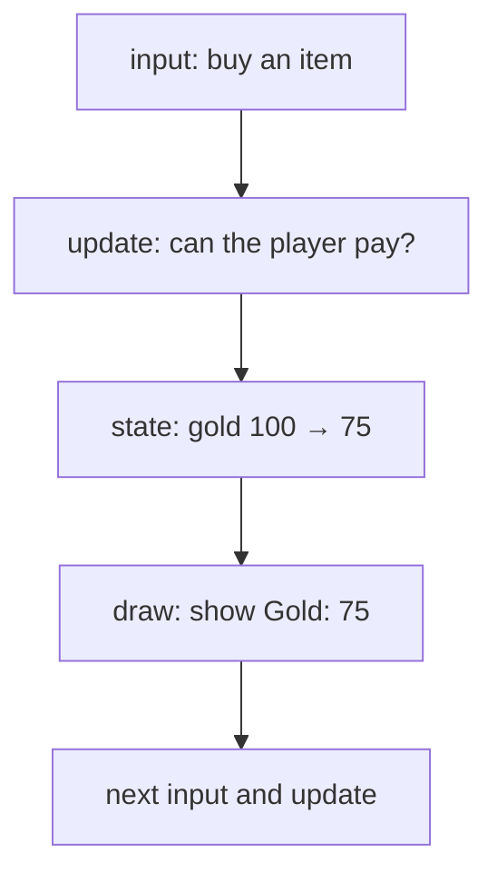
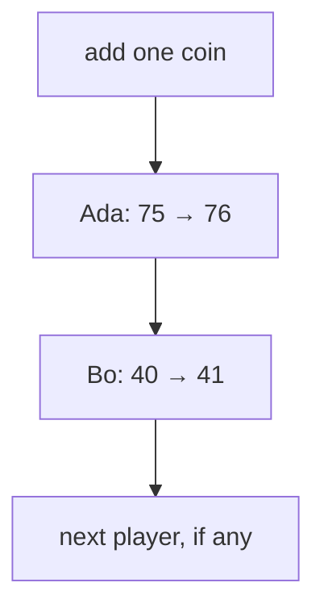
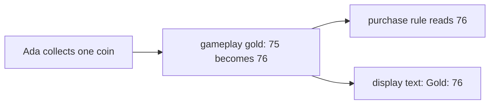

import MemoryStrip from '../../../../components/MemoryStrip.astro';

Lesson 1.2 followed a game action through the CPU and a simple loop. To
understand why a displayed number changes, we need a model of the game
around it: what the player does, which rule runs, what the game remembers,
and what it shows. The byte-level memory model comes just before our first
scan in Lesson 1.9.

## A game turns actions into a changing world

A player supplies **input**, such as buying an item or pressing a movement
key. The game applies **rules** to its current **state**—the information it
remembers about the world. It then draws or plays an **output** that the
player can perceive. A common game loop repeats those steps as play
continues:


```mermaid
flowchart TD
    I["input: buy an item"] --> R["update: can the player pay?"]
    R --> S["state: gold 100 → 75"]
    S --> D["draw: show Gold: 75"]
    D --> N["next input and update"]
```

The example takes the successful purchase path. If the player has only 10
gold and the item costs 25, the rule leaves gold unchanged. The screen
reports what the game decided; it does not decide the purchase itself.
Later in this lesson we will see why the screen may even hold a separate
copy of that result.

Games can also update enemies, timers, physics, or music without a fresh
button press. The important cycle is that rules read the current world,
change it, and produce something the player can observe. An engine commonly
supplies the repeating loop, rendering, and asset loading; the game supplies
particular rules such as the price of an item. Finding the right place to
change a game starts by asking which side owns the behavior. [Lesson 4.1](/pages/1/11/) develops that boundary.

A game remembers more than one number. It might track one player's gold,
current health, and maximum health at the same time. How can it keep those
values together and apply the same rule to many players?

## One player has related values

Suppose a player starts with 100 gold, 80 health, and a maximum of 100
health. These values are part of the changing game state.

```text
player:
    gold = 100
    health = 80
    max_health = 100
```

The labels tell us what each value means. If the player buys an item for 25
gold, gold becomes 75, while health stays 80. If the player then takes 20
damage, health becomes 60, while gold stays 75. The changes belong to one
player, but each rule uses a different part of that player's state.

A group of related named values is a **record**. Each value inside it is
a **field**. The record lets the program talk about a player's gold without
confusing it with that player's health. It also gives later memory work a
question to ask: which nearby stored values belong to the same player?

<MemoryStrip
  cells="gold=75|health=60|max_health=100"
  groups="0-2:one player's related fields"
  caption="After the purchase and the hit, three different values still belong to one player record."
/>

## One record becomes several players

For the table below, call the first player Ada and a second player Bo.
Bo has 40 gold and 50 health. Copying the first player's field names
into `gold2`, `health2`, and so on would work for two
players, but every new player would demand more special-case code. Instead,
the game can keep several player records in a **collection**:

| Player | Gold | Health | Maximum health |
| --- | ---: | ---: | ---: |
| Ada | 75 | 60 | 100 |
| Bo | 40 | 50 | 80 |

The table is a picture of two records, not a claim that RAM stores a table
with headings. A compiled game stores values as bytes; the labels here tell
*us* what each value means. Lesson 1.8 will show how a type tells code how to
read those bytes.

Suppose both players collect one coin. We could write “Ada's gold becomes
76; Bo's gold becomes 41.” For many players, repeating a single rule is
simpler:

```text
for each player in the collection:
    add 1 to that player's gold
```

That repeated pass is a **loop**. One pass handles Ada (75 becomes 76);
the next handles Bo (40 becomes 41). The rule stays the same when the
collection grows. This is the reason to introduce a collection and a loop,
rather than a list of data-structure names to memorize.


```mermaid
flowchart TD
    Rule["add one coin"] --> Ada["Ada: 75 → 76"]
    Ada --> Bo["Bo: 40 → 41"]
    Bo --> More["next player, if any"]
```

## The same idea in Rust

Rust gives a record type a name with `struct`. We can describe the three
numeric fields from our example:

```rust
struct Player {
    gold: u32,
    health: u32,
    max_health: u32,
}
```

`Player` is the record type. Each line inside the braces names a field,
then gives its type after a colon. `u32` means a non-negative whole number
held in 32 bits, or four of the eight-bit bytes from Lesson 1.2. The comma
separates fields. This
declaration describes the shape of a player; it does not create Ada or Bo.
Lesson 1.4 will create values, change fields, and write a loop in Rust.

A game's actual layout may differ from this source-level sketch. A memory
tool has to infer fields from the bytes and the instructions that use them.
[Lessons 3.4–3.6](/pages/3/03/) develop that recovery in detail, including
alternative layouts and objects that move or disappear.

## Rules connect fields

Having fields together also lets the game check relationships between them.
Ada's health of 60 fits her maximum of 100. A health value of 120 with a
maximum of 100 would violate the simple rule

```text
0 <= health <= max_health
```

We do not need a new data structure to explain this rule. It is a
relationship the game should preserve when it applies damage or healing.
Lesson 1.4 keeps both fields in its working player record. Later chapters
call a rule that must remain true an **invariant** and show how to test one
when recovering a game's data.

An address alone does not prove that a player record is still the same
player. The game can remove a player and use that memory for someone else.
For this first pass, remember that an address tells you *where* to look now;
it does not guarantee an object's identity forever. Lesson 3.6 develops
ways to recognize identity and lifetime.

## The display can hold a copy

After Ada collects a coin, the game may store 76 as her current gold and
also prepare the text `"Gold: 76"` for the screen. The text is derived
from the number, but it is not necessarily the number that the purchase
rule reads.


```mermaid
flowchart LR
    Input["Ada collects one coin"] --> State["gameplay gold: 75 becomes 76"]
    State --> Rule["purchase rule reads 76"]
    State --> Display["display text: Gold: 76"]
```

If someone changes only the display text to `"Gold: 999"`, the screen may
show 999 while the purchase rule still sees 76. Changing a displayed copy
can affect appearance without changing gameplay. This is why observing a
matching number in memory is only the start of an investigation. Later
lessons compare what changes after a purchase with what the game actually
uses to decide whether the purchase is allowed.

In multiplayer, a server may also hold the value that decides the shared
result. Chapter 8 explains that extra boundary after we have followed one
local game's state.

## How the game pieces fit

Input triggers a rule, the rule updates state, and the display shows a
result. Gold, health, and maximum health are fields of one player record;
a collection holds several such records, and a loop can apply one coin
rule to each. Health of 120 with a maximum of 100 violates the record's
health rule. The displayed gold text can be another value, so changing
only that text need not change the gold used by gameplay.

We have described the update in words. [Lesson 1.4](/pages/1/04/) turns the
same player's values and rules into a small Rust program.
