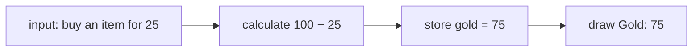
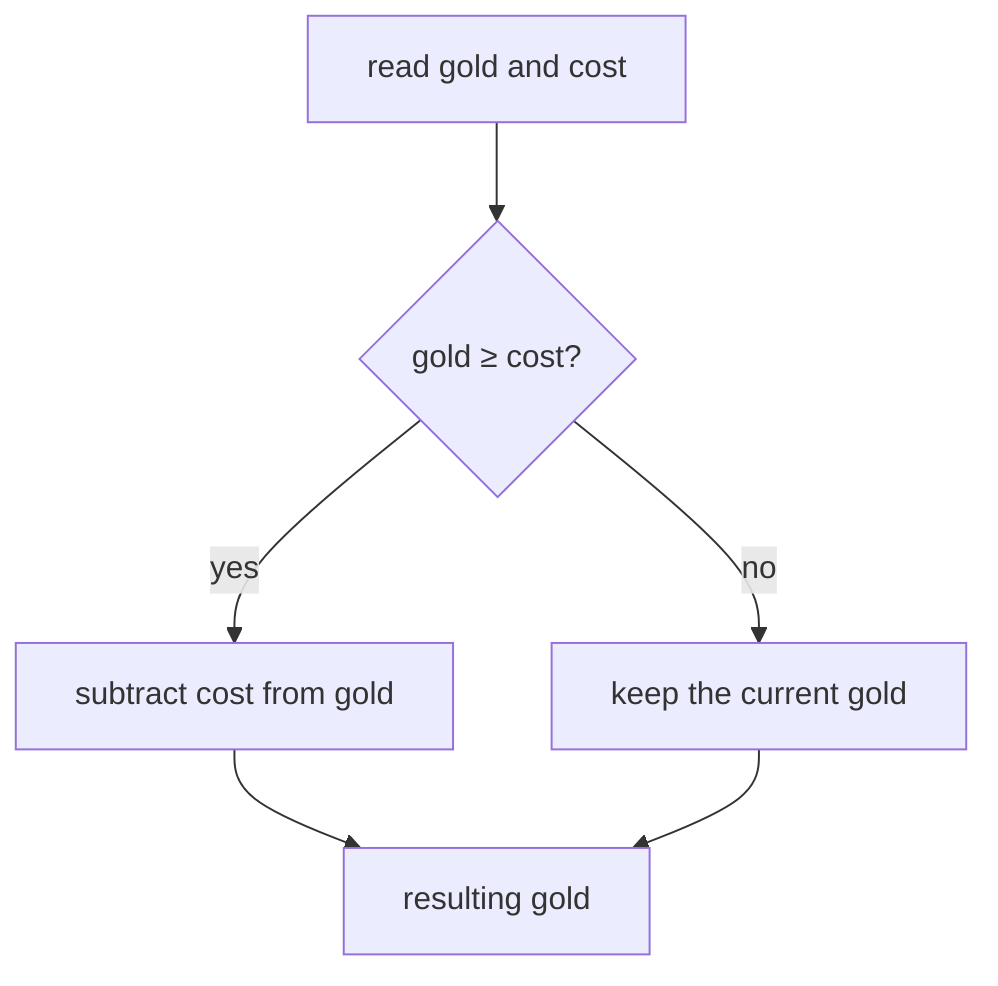

import CodeTrace from '../../../../components/CodeTrace.astro';
import Frame from '../../../../components/kit/Frame.astro';
import { CardGrid, Example, HoverCard, LinkCard, SpeedType } from '../../../../components/kit';
import MemoryStrip from '../../../../components/MemoryStrip.astro';
import MarginNote from '../../../../components/kit/MarginNote.astro';

We have already followed one value through a CPU instruction (Lesson 1.2)
and grouped it with one player's other values (Lesson 1.3). Now we can write
a small program that uses those ideas. We will start with 100 gold and ask
what happens when an item costs 25. Lesson 1.8 will show the bytes this
program uses before we try to find them in a running game.

Call the two players in this lesson Ada and Bo. Ada starts with 100 gold
and Bo with 40. The short Rust fragments each explain one idea, and the
next lesson runs a separate complete program. Here we will also compare
program logic, collections, and ways to organize code.

## Data, values, and types

**Data** is information stored or sent as bytes. A **value** is what those
bytes mean when interpreted, and a **type** tells the program how to
interpret and use them. For example, the four bytes `50 00 00 00` can
represent the number 80 when read as a little-endian `u32`. We will work
through the byte order in Lesson 1.8. For now, notice that “four bytes”
and “80 health” describe different levels of the same information.

<MemoryStrip
  cells="=50|=00|=00|=00"
  groups="0-3:four stored bytes"
  groups2="0-3:read as a u32: the value 80"
  caption="A type tells code how to interpret stored data."
/>

The number 100 is a **literal**: a value written directly in the code.
A **variable** is a name for a value the program can use. This first
fragment names the current gold and the cost:

```rust
let mut gold: u32 = 100;
let cost: u32 = 25;
```

`let` introduces a variable. `gold` and `cost` are names we chose.
The colon gives each variable a **type**. Game Fundamentals used `u32` for
a non-negative whole number stored in four bytes. The equals sign sets
the starting value, and the semicolon ends the statement. `mut` means
the value named `gold` may change. We do not need to change `cost`,
so it has no `mut`.

The type keeps different kinds of value apart. `80` can be a `u32` health
amount, `"Ada"` can be text, and `true` can be a `bool` answer to a question.
Adding two health amounts makes sense; adding the player name to health does
not. Later, Lesson 3.1 will show how types can even distinguish two numbers
that happen to use the same underlying bytes, such as a player ID and a
health amount.

At this point, gold is 100 and cost is 25. To calculate a purchase, the
program reads both values, subtracts cost, and stores the result back in
gold:

```rust
gold = gold - cost;
```

The right side is calculated first: 100 − 25 = 75. The equals sign then
assigns 75 to `gold`. The cost stays 25.

<MemoryStrip
  cells="gold before=100|cost=25|gold after=75"
  groups="0-2:read 100 and 25, subtract, then store 75"
  caption="The assignment changes gold. It does not change the cost."
/>

## State is information that can change

The program's **state** is the information it remembers at one moment.
Before the assignment, `gold` is 100; afterward, it is 75. The cost is an
input to that calculation. The subtraction result is a temporary value
until it is stored as the new gold. A screen might then show the derived
text `"Gold: 75"`, but that text is not necessarily the stored amount the
next purchase checks.



This input → calculation → stored state → display path helps us ask which
value a later piece of code actually reads. Game Fundamentals first showed
that the display may hold a copy; Hacking Fundamentals will turn that
observation into an experiment.

## An algorithm is a repeatable procedure

What if gold is only 10 and the cost is 25? A purchase should not be
allowed. Because `u32` cannot represent a negative number, blindly
subtracting would also be the wrong operation. We need the branch from
Lesson 1.2:

```rust
if gold >= cost {
    gold = gold - cost;
}
```

`>=` asks whether gold is greater than or equal to cost. The answer is
a **boolean** value, either `true` or `false`. `if` runs the
instructions between the braces only when the answer is true. Starting
with 100 gold, the comparison is true and gold becomes 75. Starting
with 10, it is false and gold remains 10. The braces mark the group of
statements controlled by the branch.



This gives us a repeatable **algorithm**, meaning a procedure with
ordered steps: read the current gold, compare it with the cost, and
subtract only if the player can pay. The same procedure works for 100 gold
and for 10 gold. An algorithm is the plan; Rust code is one exact way to
express it. Its three building blocks are already visible here: do steps
in **sequence**, use `if` to **select** a path, and later use a loop to
**repeat** work for several players.

<Frame caption="A comparison chooses the next operation">
  
</Frame>

<MarginNote kind="brief">An algorithm is a plan of ordered steps. Rust is just one exact way to write that plan down.</MarginNote>

You can first write the plan in **pseudocode**, ordinary steps arranged to
look like code without committing to a language's exact syntax:

```text
receive the current gold and the item cost
if the gold is at least the cost:
    give back gold minus cost
otherwise:
    give back the original gold
```

This is a sketch to discuss and trace, rather than a program Rust can run.
With 100 and 25, it gives back 75. With 10 and 25, it gives back 10. Naming
the inputs and both outcomes makes the next function easier to write.


<CodeTrace trace="handoff-affordable-purchase" />

## A function gives a name to a behavior

A **function** gives a behavior a name so another part of the program
can use it. This one takes a gold amount and a cost, then gives back
the gold amount after a permitted purchase:

<SpeedType id="spend-if-possible" title="Type the spending check" recall={[{"text": "gold: u32, cost: u32", "hint": "Receive the available amount and the price as unsigned 32-bit values."}, {"text": "gold >= cost", "hint": "Permit spending when the available amount covers the whole price, including exact payment."}, {"text": "gold - cost", "hint": "Return the remaining amount after paying the price."}]}>

```rust
fn spend_if_possible(gold: u32, cost: u32) -> u32 {
    if gold >= cost {
        return gold - cost;
    }
    return gold;
}
```

</SpeedType>

`fn` begins the function definition. The names inside parentheses
are its **parameters**: the two input values it will receive. Each
has a `u32` type. The arrow `-> u32` says the returned value is
also a `u32`. `return` sends the value back to whoever used the
function. If there is enough gold, it returns the subtraction. If
there is not, it returns the original amount. The final `return`
also shows that functions do not have to run every line: the first
return ends that call.

For example, `spend_if_possible(100, 25)` returns 75.
`spend_if_possible(10, 25)` returns 10. Those expressions **call**
the same function with different inputs. They do not change a
variable by themselves; the caller must store the returned value:

```rust
gold = spend_if_possible(gold, cost);
```

This simple result does not tell the caller whether a purchase happened
when the cost is zero. A later lesson introduces types that can
represent success or failure explicitly. We only need the resulting
gold amount here.

## A value can have more than one role

Gold and cost are **inputs** to `spend_if_possible`; its returned amount is
an **output**. The caller can store that output in its mutable `gold`
variable. `cost` stays fixed during the calculation. Input, output, and
mutable are therefore overlapping descriptions, not three separate kinds
of variable. They answer “where does the value flow?” and “may it change?”

Two other descriptions concern where a name is usable and how long its
storage exists. A **local** name belongs to a scope such as one function.
People often use **global** for a name available outside a single function,
although the language's visibility controls which code can use it. A Rust **static** item has storage for the entire program run. That
storage duration does not by itself mean its contents can never change;
Rust separately checks how code obtains shared or editable access; a long
lifetime does not grant permission to mutate. See the
[Rust Reference's static-item explanation](https://doc.rust-lang.org/reference/items/static-items.html)
for the complete access requirements. Our purchase calculation needs only its supplied
inputs, so it does not need a shared global gold value.

<span id="check-the-rule-at-its-boundaries" aria-hidden="true" />

## Check affordability at the price boundary

The ordinary 100-gold purchase is a useful **baseline case**, sometimes
informally called a base case. In recursive algorithms, “base case” has a more
specific meaning: a case solved directly without another recursive call.
For this affordability check, we are checking ordinary and unusual inputs. It is not
enough to check only that example. An **edge case** exercises an unusual
end of the allowed range, such as having zero gold. A **boundary case**
checks where a decision changes: just below, exactly at, and just above
the price. A **corner case** combines unusual conditions, such as zero
gold and a zero price. These labels can overlap; the important part is
writing down the inputs and expected result:

| Case | Gold | Cost | Expected returned gold |
| --- | ---: | ---: | ---: |
| Ordinary purchase | 100 | 25 | 75 |
| No gold | 0 | 25 | 0 |
| Just below the price | 24 | 25 | 24 |
| Exactly the price | 25 | 25 | 0 |
| Just above the price | 26 | 25 | 1 |
| No gold and a free item | 0 | 0 | 0 |

The exact-price case checks that `>=` allows payment when gold equals cost.
Changing it to `>` would reject that purchase. The free-item case also
shows the limitation already mentioned: unchanged gold alone cannot tell
us whether a purchase happened. The Rust Primer demonstrates an automated
test for its stamina check; Hacking Fundamentals will check the conditions
that permit a memory write.

<MarginNote kind="alternative">Amounts just below, equal to, and above the price reveal where affordability changes. They catch a mistaken greater-than check where at-least was intended.</MarginNote>

## A data structure organizes values

We can group gold, health, and maximum health into one record. For this
example, Ada starts with 100 gold and 80 health so the program can
perform the purchase itself.
That record is a **data structure**: a chosen way to organize related
values. Rust uses `struct` to describe its shape:

<SpeedType id="player-struct" title="Type the Player struct" recall={[{"text": "gold: u32", "hint": "Store this player's available currency as an unsigned 32-bit amount."}, {"text": "    health: u32", "hint": "Store the player's current health amount."}, {"text": "max_health: u32", "hint": "Store the ceiling used to judge whether current health is valid."}]}>

```rust
struct Player {
    gold: u32,
    health: u32,
    max_health: u32,
}
```

</SpeedType>

Each line inside the braces is a named **field**. Now we can create one
player value:

```rust
let ada = Player {
    gold: 100,
    health: 80,
    max_health: 100,
};
```

The braces supply the three field values. A comma separates fields;
the semicolon ends the `let` statement. `ada.gold` reads Ada's
gold field. `ada.health` reads her health. The dot selects a field
from this particular record.

The pair `health` and `max_health` has a required relationship: a valid
player's health must be between zero and the maximum. For Ada, 80 is within
0 to 100. If a mistaken update made health 120 while the maximum
stayed 100, the record would violate that relationship. We will call
such a condition an **invariant** below. For now, check the relationship
instead of trusting either field alone.

## Apply one operation to several players

Suppose Ada has 100 gold and Bo has 40. We want to charge each of
them 25. A **collection** stores several values. The square brackets
below make a fixed-size array containing two `Player` records:

```rust
let mut players = [
    Player { gold: 100, health: 80, max_health: 100 },
    Player { gold: 40, health: 50, max_health: 80 },
];
```

We make `players` mutable because its records' gold values will
change. A **loop** repeats one operation for each record:

```rust
for player in &mut players {
    player.gold = spend_if_possible(player.gold, 25);
}
```

Read `for player in ...` as “take each player in turn.” The
`&mut players` part lets the loop access the existing records so
it can change them; Rust calls this a mutable borrow. We will study
borrowing more fully when a tool begins reading another process in
Chapter 3. Here, the important effect is that the loop changes the
records in the collection, rather than temporary copies.

On the first pass, Ada's 100 becomes 75. On the second, Bo's 40
becomes 15. If Bo had only 10, his gold would stay 10 because the
function's comparison would reject that purchase. The same named
operation works for both players; adding a third record would not
require writing another affordability check and subtraction.

<MemoryStrip
  cells="Ada before=100|Ada after=75|Bo before=40|Bo after=15"
  groups="0-1:first loop pass|2-3:second loop pass"
  caption="The same guarded 25-gold subtraction visits two records and produces two results."
/>

The `Player` record groups fields belonging to **one** player; the array
groups **several** players. Both are data structures, chosen for different
questions. We will compare other useful collections after tracing this array.

## Trace the two-player result

The function, record, and loop fragments above show
both outcomes without seeing a longer program yet:

| Player | Gold before | Cost | Gold after | Health afterward |
| --- | ---: | ---: | ---: | --- |
| Ada | 100 | 25 | 75 | 80/100 |
| Bo | 40 | 25 | 15 | 50/80 |

The same purchase function visits each record. It changes gold, not health.
[The Rust Primer](/pages/1/05/#grow-one-runner-into-the-full-two-runner-program)
runs a separate stamina-based program with two runners and shows how Rust
lends each record to a function in turn.

## Programming logic: sequence, selection, and repetition

The purchase program combines three simple ways for instructions to flow.
A **sequence** does one step and then the next. A **selection** chooses a
path based on a condition, as `if` did for the purchase. **Repetition**
runs steps again, as `for` did for the two players. These are not three
special kinds of program; they are building blocks you can combine.

<Example title="Three prices in order">

Suppose Ada meets three prices in order: 25, 90, and 10. Start with 100
gold and trace this short Rust fragment:

```rust
let mut gold = 100;
for cost in [25, 90, 10] {
    if gold >= cost {
        gold = gold - cost;
    }
}
```

The array supplies prices in **sequence**. The `for` loop **repeats**
the body once per price. The `if` **selects** whether subtraction runs
on that pass. Follow the stored gold, not just the prices:

| Pass | Price | Comparison | What happens to gold? |
| --- | ---: | --- | --- |
| Start | — | — | 100 |
| 1 | 25 | 100 ≥ 25 is true | 100 → 75 |
| 2 | 90 | 75 ≥ 90 is false | remains 75 |
| 3 | 10 | 75 ≥ 10 is true | 75 → 65 |

The final gold is 65. Order matters: if the 90-gold purchase came first,
it could succeed while the later 25-gold purchase would fail. This is why
reading unfamiliar logic means finding both **which** steps can run and
**when** they run. A `while` loop also repeats, but it keeps going while
its condition remains true; the `for` loop here has a known collection
of three prices. Later lessons combine these same forms into scanners,
parsers, and game bots.

</Example>

## Name the result you need

Once values are in a collection, the question determines the work. After
the earlier two-player purchase, Ada has 75 gold and Bo has 15. For a new
item costing 25, we can ask several different questions:

| Question | Kind of result | Answer for Ada and Bo |
| --- | --- | --- |
| Can Bo afford the item? | **Decision:** a yes/no answer | No, because 15 is below 25. |
| How many players can afford it? | **Count:** the number that meet a condition | One: Ada. |
| What is the least or greatest gold amount? | **Minimum or maximum:** an extreme value | Minimum 15; maximum 75. |

Counting requires checking each player's gold against the price. Finding
a maximum requires comparing the gold amounts with one another. Neither
requires sorting all players first. If there are no players, the count
is zero, but there is no player's minimum or maximum to return. We will
use Rust's `Option` in the next lesson to represent a missing answer.
Clarifying the desired result helps you choose a collection and an
algorithm, instead of copying a solution to a different question.

## Choose a collection for the question

The array above has two fixed `Player` slots. A vector can grow when the
number of values changes; this small history gains one new sample:

```rust
let mut recent_gold = vec![100, 75];
recent_gold.push(65);
```

The values are now 100, 75, and 65. A hash map instead looks up a value by
key, and a queue takes waiting items in arrival order. `T` in `Vec<T>` names
the stored item type. A grid groups rows and columns; a graph records
connections. The operation you need determines the useful arrangement.
[Lesson 3.3 compares these choices](/pages/1/14/#choose-a-collection-for-the-question)
with the full table and decision diagram before its bounded byte examples.

<span id="programming-paradigms-ways-to-organize-the-same-rule" aria-hidden="true" />

## Programming paradigms: ways to organize a purchase

A **programming paradigm** organizes instructions and responsibilities.
The same guarded purchase still gives 75 for `(100, 25)` and keeps 10 for
`(10, 25)`. These four styles decide where and when that work happens:

### Procedural: follow the steps

Check `gold >= cost`, then update gold only on the permitted path. Our
named function keeps that check in one place instead of copying it into
every caller.

### Object-oriented: keep behavior with its data

A method such as `ada.buy(25)` groups the purchase behavior with Ada's
record. Rust's `impl` syntax in the next lesson shows how a method receives
the record it uses.

### Functional: make the result visible

`spend_if_possible(100, 25)` calculates 75 without secretly changing Ada.
The caller decides whether to store the returned value.

### Event-driven: respond when something happens

A Buy click can produce an event. Its handler asks the purchase function to
update that player's gold. The event decides **when** the calculation runs;
the affordability check still decides whether spending is allowed.

One game can combine these styles. [Lesson 3.9 keeps the complete comparison
and source fragments](/pages/3/04/#programming-paradigms-ways-to-organize-a-purchase)
beside the object-oriented code clues they help interpret.

## An abstraction hides details behind a smaller interface

Calling `spend_if_possible(100, 25)` lets another part of the program use
the purchase calculation without repeating its branch and subtraction. That is
an **abstraction**: <HoverCard kind="example" body="`vec.push(65)` is an abstraction too. The caller asks for one more item; how the vector finds room, and moves its items if it must grow, stays hidden.">a smaller interface hides useful steps</HoverCard>. It still has
to keep its promise. If the caller and function disagree about the
inputs, the friendly name does not repair the mistake. [Lesson 6.1](/pages/3/08/) later explains source-level APIs and machine-level
ABIs when we begin calling compiled game functions.

<span id="an-invariant-is-a-rule-valid-state-must-keep-true" aria-hidden="true" />

## An invariant is a condition valid state keeps true

The earlier health-range requirement is an **invariant**: when player state is valid,
`health <= max_health` must hold. A small function can check it:

```rust
fn valid_health(health: u32, max_health: u32) -> bool {
    health <= max_health
}
```

For our `u32` values, zero is already the smallest possible number. If
Ada has 80 health and a maximum of 100, the function returns `true`; for
120 and 100 it returns `false`. The purchase function has its own condition:
only subtract a cost when the player can pay. <HoverCard kind="example" body="A growable list in memory keeps `begin <= end <= capacity_end`: its used part can never reach past the storage allocated for it. Lesson 3.10 checks those pointer bounds on recovered bytes.">An invariant</HoverCard> gives you a
concrete check when unfamiliar state or a recovered field might be wrong.
[Lesson 13.1](/pages/13/01/)
uses such conditions to distinguish valid and invalid game state.

## Follow the data through unfamiliar code

Return to `spend_if_possible` rather than trying to hold the whole page
in your head. One useful route is to ask five questions:

1. **What enters?** Gold and cost, both `u32` values.
2. **What can stop or change the path?** `gold >= cost` chooses the return.
3. **What state changes inside?** None; this function calculates a result.
4. **What leaves?** A `u32`: 75 for `(100, 25)`, or 10 for `(10, 25)`.
5. **Who stores that result?** The caller's assignment to `gold` or
   `player.gold`.

The same questions work for a new function or event handler: find the
inputs and types, checks, state changes, and output. A dense line can be
broken into smaller expressions to see which value each one produces.

## What the gold program shows

`mut` permits gold to change while cost stays fixed. The 10-gold case
takes the failed branch of `gold >= cost`, so `spend_if_possible` returns
unchanged gold. One loop applies that same function to Ada and Bo. The
three-price trace combines ordered steps, a branch, and repetition.

A vector keeps a growing history; a hash map answers a lookup by key;
a queue keeps pending actions in arrival order. A visible “Gold: 75”
label can be separate from the `gold` field the calculation reads. Procedural,
object-oriented, functional, and event-driven styles can organize the
same check and subtraction in different places, while `valid_health` checks that player
health stays within its allowed range.

[The Rust Primer](/pages/1/05/) uses a different game action to make the
Rust syntax executable. [Hacking Fundamentals](/pages/1/06/) then turns
an observed purchase into a question about a running game: which value
actually controls it?

## Where these ideas continue

<CardGrid>
  <LinkCard title="Rust Primer: Logic in Code" description="The same ideas as running Rust code." href="/pages/1/05/" />
  <LinkCard title="How Collections Live and Die in Memory" description="Vectors, hash maps, and queues as bytes in memory." href="/pages/3/05/" />
  <LinkCard title="Pathfinding on a Game Map" description="Grids and graphs put to work on a game map." href="/pages/4/06/" />
</CardGrid>
