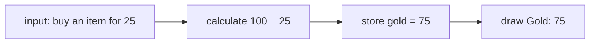
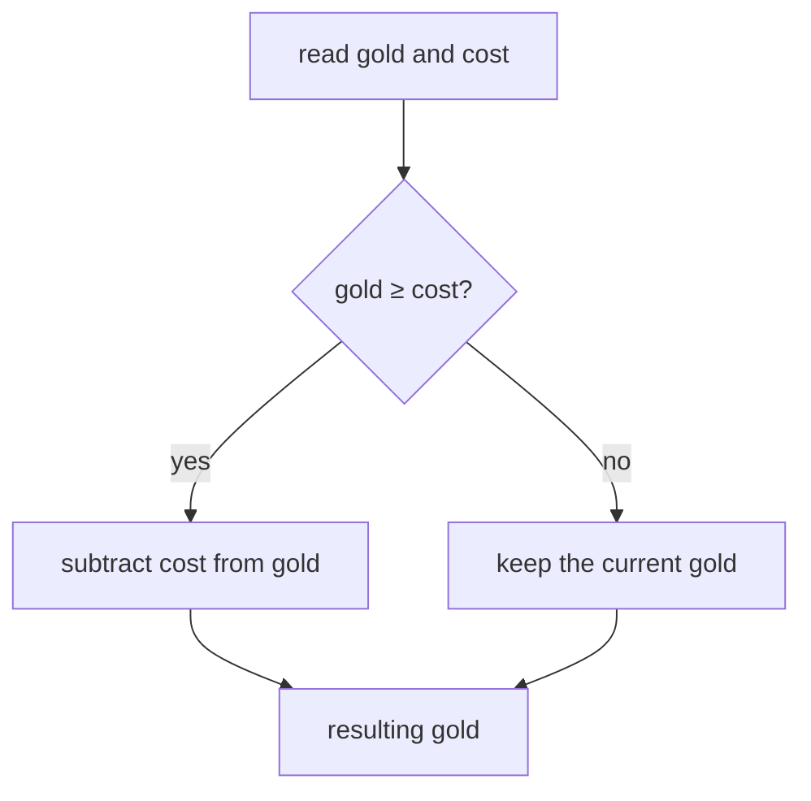
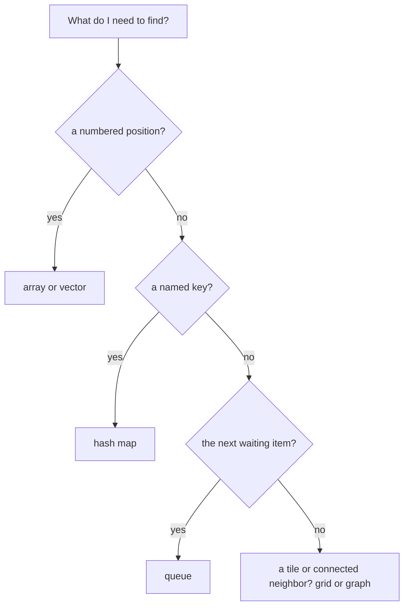

import MemoryStrip from '../../../../components/MemoryStrip.astro';

We have already followed one value through a CPU instruction (Lesson 1.2)
and grouped it with one player's other values (Lesson 1.3). Now we can write
a small program that uses those ideas. We will start with 100 gold and ask
what happens when an item costs 25. Lesson 1.7 will show the bytes this
program uses before we try to find them in a running game.

The examples below are Rust. Read each new part before trying to predict
a result. The complete program comes after the pieces it uses. Then we will
use the same purchase rule to compare program logic, collections, and a few
ways to organize code.

## Data, values, and types

**Data** is information stored or sent as bytes. A **value** is what those
bytes mean when interpreted, and a **type** tells the program how to
interpret and use them. For example, the four bytes `50 00 00 00` can
represent the number 80 when read as a little-endian `u32`. We will work
through the byte order in Lesson 1.7. For now, notice that “four bytes”
and “80 health” describe different levels of the same information.

<MemoryStrip
  cells="=50|=00|=00|=00"
  groups="0-3:four stored bytes"
  groups2="0-3:read as a u32: the value 80"
  caption="A type tells code how to interpret stored data."
/>

The number 100 is a **literal**: a value written directly in the code.
A **variable** is a name for a value the program can use. This first
fragment names the current gold and the cost:

```rust
let mut gold: u32 = 100;
let cost: u32 = 25;
```

`let` introduces a variable. `gold` and `cost` are names we chose.
The colon gives each variable a **type**. Game Fundamentals used `u32` for
a non-negative whole number stored in four bytes. The equals sign sets
the starting value, and the semicolon ends the statement. `mut` means
the value named `gold` may change. We do not need to change `cost`,
so it has no `mut`.

The type keeps different kinds of value apart. `80` can be a `u32` health
amount, `"Ada"` can be text, and `true` can be a `bool` answer to a question.
Adding two health amounts makes sense; adding the player name to health does
not. Later, Lesson 3.1 will show how types can even distinguish two numbers
that happen to use the same underlying bytes, such as a player ID and a
health amount.

At this point, gold is 100 and cost is 25. To calculate a purchase, the
program reads both values, subtracts cost, and stores the result back in
gold:

```rust
gold = gold - cost;
```

The right side is calculated first: 100 − 25 = 75. The equals sign then
assigns 75 to `gold`. The cost stays 25.

<MemoryStrip
  cells="gold before=100|cost=25|gold after=75"
  groups="0-2:read 100 and 25, subtract, then store 75"
  caption="The assignment changes gold. It does not change the cost."
/>

## State is information that can change

The program's **state** is the information it remembers at one moment.
Before the assignment, `gold` is 100; afterward, it is 75. The cost is an
input to that calculation. The subtraction result is a temporary value
until it is stored as the new gold. A screen might then show the derived
text `"Gold: 75"`, but that text is not necessarily the stored amount the
next purchase checks.



This input → calculation → stored state → display path helps us ask which
value a later piece of code actually reads. Game Fundamentals first showed
that the display may hold a copy; Hacking Fundamentals will turn that
observation into an experiment.

## An algorithm is a repeatable procedure

What if gold is only 10 and the cost is 25? A purchase should not be
allowed. Because `u32` cannot represent a negative number, blindly
subtracting would also be the wrong operation. We need the branch from
Lesson 1.2:

```rust
if gold >= cost {
    gold = gold - cost;
}
```

`>=` asks whether gold is greater than or equal to cost. The answer is
a **boolean** value, either `true` or `false`. `if` runs the
instructions between the braces only when the answer is true. Starting
with 100 gold, the comparison is true and gold becomes 75. Starting
with 10, it is false and gold remains 10. The braces mark the group of
statements controlled by the branch.



This gives us a repeatable **algorithm**, meaning a procedure with
ordered steps: read the current gold, compare it with the cost, and
subtract only if the player can pay. The same procedure works for 100 gold
and for 10 gold. An algorithm is the plan; Rust code is one exact way to
express it. Its three building blocks are already visible here: do steps
in **sequence**, use `if` to **select** a path, and later use a loop to
**repeat** work for several players.

## A function gives a name to a behavior

A **function** gives a behavior a name so another part of the program
can use it. This one takes a gold amount and a cost, then gives back
the gold amount after a permitted purchase:

```rust
fn spend_if_possible(gold: u32, cost: u32) -> u32 {
    if gold >= cost {
        return gold - cost;
    }
    return gold;
}
```

`fn` begins the function definition. The names inside parentheses
are its **parameters**: the two input values it will receive. Each
has a `u32` type. The arrow `-> u32` says the returned value is
also a `u32`. `return` sends the value back to whoever used the
function. If there is enough gold, it returns the subtraction. If
there is not, it returns the original amount. The final `return`
also shows that functions do not have to run every line: the first
return ends that call.

For example, `spend_if_possible(100, 25)` returns 75.
`spend_if_possible(10, 25)` returns 10. Those expressions **call**
the same function with different inputs. They do not change a
variable by themselves; the caller must store the returned value:

```rust
gold = spend_if_possible(gold, cost);
```

This simple result does not tell the caller whether a purchase happened
when the cost is zero. A later lesson introduces types that can
represent success or failure explicitly. We only need the resulting
gold amount here.

## A data structure organizes values

Lesson 1.3 grouped gold, health, and maximum health into one record.
That lesson followed Ada through a purchase and damage. Here we start a
fresh run with her original 100 gold and 80 health so the program can
perform the purchase itself.
That record is a **data structure**: a chosen way to organize related
values. Rust uses `struct` to describe its shape:

```rust
struct Player {
    gold: u32,
    health: u32,
    max_health: u32,
}
```

Each line inside the braces is a named **field**. Now we can create one
player value:

```rust
let ada = Player {
    gold: 100,
    health: 80,
    max_health: 100,
};
```

The braces supply the three field values. A comma separates fields;
the semicolon ends the `let` statement. `ada.gold` reads Ada's
gold field. `ada.health` reads her health. The dot selects a field
from this particular record.

The pair `health` and `max_health` has a rule: a valid player's
health should be between zero and the maximum. For Ada, 80 is within
0 to 100. If a mistaken update made health 120 while the maximum
stayed 100, the record would violate that rule. We will name this
kind of rule an **invariant** below. For now, check the relationship
instead of trusting either field alone.

## Apply one operation to several players

Suppose Ada has 100 gold and Bo has 40. We want to charge each of
them 25. A **collection** stores several values. The square brackets
below make a fixed-size array containing two `Player` records:

```rust
let mut players = [
    Player { gold: 100, health: 80, max_health: 100 },
    Player { gold: 40, health: 50, max_health: 80 },
];
```

We make `players` mutable because its records' gold values will
change. A **loop** repeats one operation for each record:

```rust
for player in &mut players {
    player.gold = spend_if_possible(player.gold, 25);
}
```

Read `for player in ...` as “take each player in turn.” The
`&mut players` part lets the loop access the existing records so
it can change them; Rust calls this a mutable borrow. We will study
borrowing more fully when a tool begins reading another process in
Chapter 3. Here, the important effect is that the loop changes the
records in the collection, rather than temporary copies.

On the first pass, Ada's 100 becomes 75. On the second, Bo's 40
becomes 15. If Bo had only 10, his gold would stay 10 because the
function's comparison would reject that purchase. The same named
operation works for both players; adding a third record would not
require writing a third purchase rule.

<MemoryStrip
  cells="Ada before=100|Ada after=75|Bo before=40|Bo after=15"
  groups="0-1:first loop pass|2-3:second loop pass"
  caption="One 25-gold purchase rule visits two records and produces two results."
/>

The `Player` record groups fields belonging to **one** player; the array
groups **several** players. Both are data structures, chosen for different
questions. We will compare other useful collections after following this
array through a complete program.

## Run the complete example

This program combines the pieces above. `main` is the function Rust
starts when you run the program. `println!` writes text to the
terminal; each pair of braces in its quoted text is filled with the
next value supplied after the text.

```rust
struct Player {
    gold: u32,
    health: u32,
    max_health: u32,
}

fn spend_if_possible(gold: u32, cost: u32) -> u32 {
    if gold >= cost {
        return gold - cost;
    }
    return gold;
}

fn main() {
    let mut players = [
        Player { gold: 100, health: 80, max_health: 100 },
        Player { gold: 40, health: 50, max_health: 80 },
    ];

    for player in &mut players {
        player.gold = spend_if_possible(player.gold, 25);
    }

    println!(
        "Ada has {} gold and {}/{} health",
        players[0].gold, players[0].health, players[0].max_health
    );
    println!(
        "Bo has {} gold and {}/{} health",
        players[1].gold, players[1].health, players[1].max_health
    );
}
```

`players[0]` selects the first record, Ada; `players[1]` selects
the second, Bo. Arrays count positions from zero. The dot then selects
each record's gold field. The program prints:

```text
Ada has 75 gold and 80/100 health
Bo has 15 gold and 50/80 health
```

The code is longer than the idea it expresses, but every part now has
a reason: values represent gold, a branch guards the subtraction, a
function names the rule, records keep related state together, and a
loop applies the rule to several records.

## Programming logic: sequence, selection, and repetition

The purchase program combines three simple ways for instructions to flow.
A **sequence** does one step and then the next. A **selection** chooses a
path based on a condition, as `if` did for the purchase. **Repetition**
runs steps again, as `for` did for the two players. These are not three
special kinds of program; they are building blocks you can combine.

Suppose Ada meets three prices in order: 25, 90, and 10. Start with 100
gold and trace this short Rust fragment:

```rust
let mut gold = 100;
for cost in [25, 90, 10] {
    if gold >= cost {
        gold = gold - cost;
    }
}
```

The array supplies prices in **sequence**. The `for` loop **repeats**
the body once per price. The `if` **selects** whether subtraction runs
on that pass. Follow the stored gold, not just the prices:

| Pass | Price | Comparison | What happens to gold? |
| --- | ---: | --- | --- |
| Start | — | — | 100 |
| 1 | 25 | 100 ≥ 25 is true | 100 → 75 |
| 2 | 90 | 75 ≥ 90 is false | remains 75 |
| 3 | 10 | 75 ≥ 10 is true | 75 → 65 |

The final gold is 65. Order matters: if the 90-gold purchase came first,
it could succeed while the later 25-gold purchase would fail. This is why
reading unfamiliar logic means finding both **which** steps can run and
**when** they run. A `while` loop also repeats, but it keeps going while
its condition remains true; the `for` loop here has a known collection
of three prices. Later lessons combine these same forms into scanners,
parsers, and game bots.

## Choose a collection for the question

The fixed array of two `Player` records was enough when we knew there were
exactly two. What if players can join, we need one player's score by name,
or we must handle pending actions in arrival order? Those are different
questions, and different collections make each one natural:

| Collection | Picture it as | Good first use | Important limit |
| --- | --- | --- | --- |
| Array, `[T; N]` | numbered slots with a fixed count | two known players, three prices | its count does not grow |
| Vector, `Vec<T>` | numbered slots that can grow | players joining or a history of health samples | removing from the middle shifts later items |
| Hash map, `HashMap<K, V>` | a key pointing to its value | find Ada's gold by her name or ID | a key may be missing; order is not the promise |
| Queue, `VecDeque<T>` | a line of waiting items | handle actions in arrival order | it is for the next item, not fast arbitrary lookup |
| Grid | rows and columns | map tiles at `(row, column)` | boundaries must be checked |
| Graph | places and their connections | waypoints and reachable paths | you must store and inspect the connections |

`T` stands for the kind of item stored. A vector of `u32` values, for
example, is written `Vec<u32>`. `K` and `V` stand for a map's key and
value types. A queue can be implemented with Rust's `VecDeque`, which
lets us add at the back and take from the front.

Here are three small examples. Each one answers a different question about
the same game:

```rust
use std::collections::{HashMap, VecDeque};

let mut recent_gold = vec![100, 75];
recent_gold.push(65);                    // keep one more sample
let second_sample = recent_gold[1];      // numbered position: 75

let mut gold_by_name = HashMap::new();
gold_by_name.insert("Ada", 75);
if let Some(amount) = gold_by_name.get("Ada") {
    println!("Ada has {amount} gold");   // key lookup: 75
}

let mut pending = VecDeque::new();
pending.push_back("buy item");
pending.push_back("heal");
let next_action = pending.pop_front();   // arrival order: buy item
```

`vec!` creates a growable vector; `push` adds another value. Index `[1]`
selects its second item because indexes start at zero. The map's `insert`
associates the key `"Ada"` with 75. `get` may find no such key, so
`Some(amount)` means it found one; the matching `if let` runs only then.
The queue's `pop_front` may also find nothing if the queue is empty. Here
it returns the first action, leaving `"heal"` to be handled next. Rust
wraps these possibly absent results in `Some` or `None`; [Lesson
3.1](/pages/3/01/) explains that type fully.

A grid can be a vector of rows, so `tiles[row][column]` reaches a tile.
A graph stores which waypoints connect; [Lesson 4.6](/pages/4/06/) uses
one to search for a route. These are arrangements of data, not magic
algorithms. Choose by the operation you need: **next by position, look up
by key, take the oldest, or visit neighbors**. [Lesson 3.5](/pages/3/05/)
shows how their layouts can be recognized in a running game.



## Programming paradigms: ways to organize the same rule

A **programming paradigm** is a style for organizing instructions and
responsibilities. It does not change what a purchase means. Ada still
starts with 100 gold, pays 25 if she can, and ends with 75. The styles
answer a different question: *where should that rule live, and how should
other code use it?*

| Style | Main idea | Our purchase example |
| --- | --- | --- |
| Procedural or imperative | Write the steps that change state | Check gold, then subtract cost. |
| Object-oriented | Put related data and behavior together | A `Player` has gold and a `buy` method. |
| Functional | Calculate an output from inputs without changing hidden state | `spend_if_possible(100, 25)` returns 75. |
| Event-driven | Run a handler when something happens | A Buy click calls the purchase rule. |

### Procedural: follow the steps

The first version we wrote is procedural. It says **how** to update the
variable, in order:

```rust
if gold >= cost {
    gold = gold - cost;
}
```

That is often the clearest way to begin. It becomes awkward only if every
screen and bot copies the same purchase steps, because one later rule
change would have to be repeated everywhere. Our named function solves
that duplication.

### Object-oriented: keep behavior with its data

A `Player` record already keeps related data together. In Rust, an `impl`
block can give that type a **method**, a function called through one
player value:

```rust
impl Player {
    fn buy(&mut self, cost: u32) {
        self.gold = spend_if_possible(self.gold, cost);
    }
}
```

Here `self` is the player receiving the call; `&mut` lets the method
change that player's gold. After creating a mutable Ada, `ada.buy(25)`
uses the same rule as before. The method has a convenient home because it
acts on player state. Rust methods do not require class inheritance;
[Lesson 3.3](/pages/3/03/) later examines how a compiled C++ game's
classes and methods appear in memory.

### Functional: make the result visible

Our `spend_if_possible` function illustrates a functional style. Given
100 and 25, it returns 75. It does not secretly reach out and change
Ada. The caller decides whether to store the answer:

```rust
let next_gold = spend_if_possible(100, 25); // 75
```

That makes the calculation easy to check with different inputs. A larger
program can mix this style with state-changing methods; the two are
useful for different jobs.

### Event-driven: respond when something happens

A real game stays open instead of running `main` once and closing. A
Buy click can produce an **event**, and the interface or game engine can
call a registered **handler** in response:

```rust
fn on_buy_click(player: &mut Player) {
    player.gold = spend_if_possible(player.gold, 25);
}
```

This shows the handler's job, not a complete window setup. A game also
updates and draws while no one clicks. [Lesson 8.6](/pages/8/06/)
explains Windows messages and game loops; [Lesson 4.7](/pages/4/07/)
compares events with checking for changes on a schedule. For now, notice
that the event-driven style decides **when** the familiar purchase rule
runs.

One game can use all four styles: an event calls a handler, which asks a
player method to update state using a small calculation. A paradigm is a
way to organize work, not a team you must join forever.

## An abstraction hides details behind a smaller interface

Calling `spend_if_possible(100, 25)` lets another part of the program use
the purchase rule without repeating its branch and subtraction. That is
an **abstraction**: a smaller interface hides useful steps. It still has
to keep its promise. If the caller and function disagree about the
inputs, the friendly name does not repair the mistake. [Lesson
3.8](/pages/3/08/) later explains source-level APIs and machine-level
ABIs when we begin calling compiled game functions.

## An invariant is a rule valid state must keep true

The earlier health rule is an **invariant**: when player state is valid,
`health <= max_health` must hold. A small function can check it:

```rust
fn valid_health(health: u32, max_health: u32) -> bool {
    health <= max_health
}
```

For our `u32` values, zero is already the smallest possible number. If
Ada has 80 health and a maximum of 100, the function returns `true`; for
120 and 100 it returns `false`. The purchase rule has its own condition:
only subtract a cost when the player can pay. An invariant gives you a
concrete check when unfamiliar state or a recovered field might be wrong.
[Lesson 13.1](/pages/13/01/)
uses such rules in deeper game-state investigations.

## Read unfamiliar code in a fixed order

Return to `spend_if_possible` rather than trying to hold the whole page
in your head. Ask five questions in order:

1. **What enters?** Gold and cost, both `u32` values.
2. **What can stop or change the path?** `gold >= cost` chooses the return.
3. **What state changes inside?** None; this function calculates a result.
4. **What leaves?** A `u32`: 75 for `(100, 25)`, or 10 for `(10, 25)`.
5. **Who stores that result?** The caller's assignment to `gold` or
   `player.gold`.

That order works again for a new function or event handler: find the
inputs and types, checks, state changes, and output. When a line still
feels dense, break it into smaller expressions and repeat the questions.

## Checkpoint

Before moving on, try to explain:

- why `gold` needs `mut` but `cost` does not;
- what happens with 10 gold and a cost of 25, and which comparison
  makes it happen;
- what values enter `spend_if_possible` and what it returns;
- why the loop changes Ada and Bo without two separate rules;
- where sequence, selection, and repetition appear in the three-price example;
- why a vector fits a growing history, a hash map fits a lookup by name,
  and a queue fits pending actions;
- why a displayed “Gold: 75” label may still be different data from
  the `gold` field the purchase rule uses;
- how procedural, object-oriented, functional, and event-driven styles
  would organize the same purchase rule;
- what rule `valid_health` checks and how to read an unfamiliar function.

We have made a small, known program and can account for its state.
[Hacking Fundamentals](/pages/1/05/) turns that understanding into a careful
question about a running game: how could we find and test the value
that actually controls a purchase?
