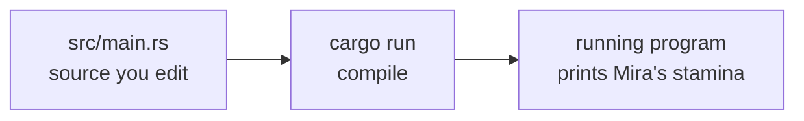
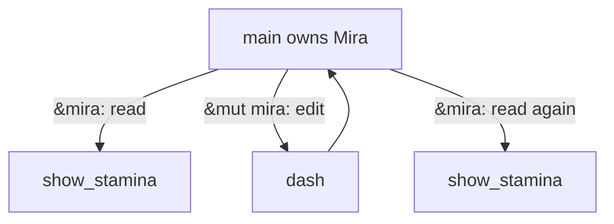

import { HoverCard, SpeedType, Frame } from '../../../../components/kit';
import MemoryStrip from '../../../../components/MemoryStrip.astro';
import OwnershipScope from '../../../../components/OwnershipScope.astro';
import CodeTrace from '../../../../components/CodeTrace.astro';
import MarginNote from '../../../../components/kit/MarginNote.astro';

This lesson gives Rust syntax a purpose. A program runs steps in order,
chooses between possible steps, repeats a step, and keeps related state
together. Rust has familiar ways to express each of those ideas. We will
build one small program around a fictional runner named Mira, who has 12
stamina. A dash uses 4 stamina. A second runner named Sol will let us see
why the same dash function can update several records.

| Programming question | Rust expression in this lesson |
| --- | --- |
| What happens first, next, and last? | Statements in `main`, function calls, and assignments. |
| Which path should run? | `if`, `match`, and `if let`. |
| What should repeat, and when should it stop? | `for`, `while`, `loop`, and collection iterators. |
| Which values belong together? | `struct`, collections, and `enum`. |
| Who can read or change a value? | `&`, `&mut`, ownership, and methods. |
| What if a value is missing or an operation fails? | `Option`, `Result`, and `?`. |

The traces below open with a worked example. Change a value or step through a branch to see why the result changes. Typing practice is optional: **Practise typing this** hides selected names, parameters and calculations, so you can recall them after reading the explanation. Hints and an answer reveal are always available. **Copy visible code** offers practice with the complete snippet instead.

## Give the code a place to run

**Cargo** is the tool normally used to build and run Rust projects. After
installing a Rust toolchain, a terminal can check that Cargo is available:

```text
cargo --version
```

A version number means the command is ready. If it is not installed, the
[official Rust installation guide](https://www.rust-lang.org/tools/install)
explains the supported setup. You can read this primer now and <HoverCard kind="alternative" body="To try a short program sooner, the [Rust Playground](https://play.rust-lang.org/) compiles and runs it in your browser with nothing to install. The Windows tools later in the book still need the lab setup from Lesson 1.7.">run it after
the Windows lab setup in Lesson 1.7</HoverCard>.

<Frame caption="A move hands over ownership; the text on the heap is not copied.">
  
</Frame>


Make a project in a folder you control:

```text
cargo new rust_stamina_primer --vcs none
cd rust_stamina_primer
```

Cargo creates `Cargo.toml`, which describes the project, and
`src/main.rs`, which holds the starting program. Replace the contents of
`src/main.rs` with the complete program below. The shorter fragments before
it each isolate one idea; do not paste all of them into the same file.
`cargo run` compiles and
runs it. `cargo check` checks the code without producing a program you
can run. The [official Cargo chapter](https://doc.rust-lang.org/book/ch01-03-hello-cargo.html)
walks through these same commands.



## Name the state, then run steps in order

Start with three values, each with a distinct job. The statements run from
top to bottom; later statements can use names created earlier:

<SpeedType id="rust-name-state" title="Name and compare stamina" recall={[{"text": "mut", "hint": "This binding receives a later assignment."}, {"text": "u32", "hint": "Choose an unsigned 32-bit whole-number type."}, {"text": "stamina >= cost", "hint": "A dash is possible when the available amount covers its cost."}]}>

```rust
let mut stamina: u32 = 12;
let cost = 4_u32;
let can_dash = stamina >= cost;
```

</SpeedType>

`let` binds a name. `mut` permits a later assignment to `stamina`.
The `: u32` is an explicit type; the `_u32` on `4` gives the literal
that type too. Rust can infer that `cost` is a `u32` and `can_dash` is a
`bool`, because `>=` produces `true` or `false`. A semicolon ends each
statement. To update state, assign a new value to the same name:

```rust
stamina = stamina - cost; // first calculate 12 - 4, then store 8
```

## Selection: run only the path that fits

The assignment above <HoverCard kind="caution" body="Without a check, a `u32` that would go below zero does not become negative. A debug build stops with a subtract-with-overflow panic; a release build wraps around, so 2 − 4 gives 4,294,967,294.">assumes the runner has enough stamina</HoverCard>. To choose whether the dash runs or reports insufficient stamina, use `if`
and `else`:

<SpeedType id="rust-select-dash" title="Choose the dash branch" recall={[{"text": "can_dash", "hint": "Use the boolean computed from the stamina and cost."}, {"text": "stamina - cost", "hint": "Subtract the requested amount from the available amount."}]}>

```rust
if can_dash {
    stamina = stamina - cost;
} else {
    println!("Not enough stamina");
}
```

</SpeedType>

With 12 stamina, the first branch runs and stamina becomes 8. The `else` branch
would run for 2 stamina and a 4-stamina cost. The braces group the statements
belonging to each path. This is **selection**: test a condition, then run
the matching branch. Later, `match` and `if let` will select by the shape
of a result instead of a true/false condition.

<CodeTrace trace="rust-dash-branch" label="Explore the guarded dash branch" />

Move the stamina below the cost, then step forward. The failed branch keeps the original amount; a comparison chooses the path before any subtraction.

<span id="repetition-apply-the-same-rule-to-several-inputs" aria-hidden="true" />

## Repetition: call the dash function for several inputs

A `for` loop repeats a body for each item in a collection. Here the loop
tries three dash costs in order, carrying the current stamina into the next
attempt:

<SpeedType id="rust-loop-costs" title="Carry stamina through a loop" recall={[{"text": "stamina >= cost", "hint": "Check the current amount before subtracting this cost."}, {"text": "stamina -= cost", "hint": "Update the same binding using subtraction assignment."}]}>

```rust
let mut stamina = 12_u32;
for cost in [4, 10, 2] {
    if stamina >= cost {
        stamina -= cost;
    }
}
// stamina is 6: use 4, skip 10, use 2
```

</SpeedType>

`stamina -= cost` is short for `stamina = stamina - cost`. The trace is 12 → 8;
10 needs more stamina than remains, so stamina stays 8; using 2 leaves 6. The code
shows **repetition** without writing the dash check three times.

<CodeTrace trace="rust-dash-loop" label="Explore three dash costs in order" />

The watched amount belongs to one runner throughout the loop. Change its starting value to 16: all three costs now fit and the final amount is zero.

Use `for` when there is a collection to visit. Use `while` when the
condition determines whether another pass is needed:

<SpeedType id="rust-while-attempts" title="Stop after three attempts" recall={[{"text": "attempts < 3", "hint": "Continue only while the counter is below the limit."}, {"text": "attempts += 1", "hint": "Advance the counter once per pass."}]}>

```rust
let mut attempts = 0;
while attempts < 3 {
    attempts += 1;
    println!("Attempt {attempts}");
}
// prints Attempt 1, Attempt 2, Attempt 3
```

</SpeedType>

Use `loop` when the body decides exactly when to stop:

<SpeedType id="rust-loop-break" title="Leave a loop at zero" recall={[{"text": "remaining == 0", "hint": "Test whether the remaining amount has reached zero."}, {"text": "break", "hint": "Leave this loop immediately."}, {"text": "remaining -= 1", "hint": "Reduce the amount once per pass."}]}>

```rust
let mut remaining = 2;
loop {
    if remaining == 0 {
        break;
    }
    remaining -= 1;
}
```

</SpeedType>

The important question is always **what makes the repetition stop?**
The `for` example ends after its three costs, the `while` example ends
when `attempts` reaches three, and the `loop` example reaches `break`
when `remaining` reaches zero.

<MarginNote kind="brief">Every loop needs a stop condition: a collection that runs out, a test that turns false, or a break.</MarginNote>

## Group related state and name a behavior

So far `stamina` is a standalone number. A game also needs to know whose
stamina it is. A `struct` names a shape of related fields; `Runner` groups a
name with a stamina amount. A function names a repeatable behavior. Here
`dash` checks stamina before subtracting the cost; `show_stamina` displays the state:

```rust
struct Runner {
    name: String,
    stamina: u32,
}

fn show_stamina(runner: &Runner) {
    println!("{} has {} stamina", runner.name, runner.stamina);
}

fn dash(runner: &mut Runner, cost: u32) -> bool {
    if runner.stamina < cost {
        return false;
    }
    runner.stamina = runner.stamina - cost;
    return true;
}

fn main() {
    let mut mira = Runner {
        name: String::from("Mira"),
        stamina: 12,
    };

    show_stamina(&mira);
    let dashed = dash(&mut mira, 4);
    println!("Dash succeeded: {dashed}");
    show_stamina(&mira);
}
```

Run it with `cargo run`. You should see:

```text
Mira has 12 stamina
Dash succeeded: true
Mira has 8 stamina
```

The order of those lines matters. `main` starts, creates this sample
runner, prints the starting value, asks `dash` to check and spend stamina, and
prints the new value.
The first and last print calls read the **same** runner record, before
and after one controlled change.

<MemoryStrip
  cells="Mira.stamina before=12|dash cost=4|Mira.stamina after=8"
  groups="0-2:dash checks the cost, then changes Mira's stored stamina"
  caption="The `dash` call changes Mira's record; `show_stamina` only reads it."
/>

## Who owns the runner, and who may change it?

`let mut mira` creates a **mutable** runner value inside `main`.
`main` owns that value for this example. The `name` field is a `String`:
owned text stored in Mira's record. `u32` is a non-negative whole-number
type, suitable for this simple stamina example.

`show_stamina(&mira)` lends the function a read-only **reference** to Mira.
The `&Runner` parameter says it may inspect a runner without taking over
ownership. `dash(&mut mira, 4)` lends a temporary editable reference;
`&mut Runner` says the function may change that runner. When the call
returns, `main` can use Mira again. Neither function needs to copy the
whole record just to read or update its fields.

Think of Mira's record as one notebook. `show_stamina` may read it; `dash`
needs permission to write in it. The analogy stops at Rust's borrowing checks:
references are checked by the compiler, and Rust will reject conflicting
access to the same value during an editable borrow. [Lesson 3.1](/pages/3/01/) develops ownership, borrowing, and error handling
when we build an external memory tool.



Remove `mut` from `let mut mira` and run `cargo check`: the
editable `&mut mira` call is rejected before the program runs.
Put `mut` back to make the intended change explicit. Compiler messages
are useful clues about which part of the code's promise does not match.

## Copy a number, move an owned string

<HoverCard kind="reference" href="https://doc.rust-lang.org/book/ch04-01-what-is-ownership.html" body="The Rust Book's chapter on ownership gives the rules with more examples: each value has an owner, there is one owner at a time, and the value is dropped when its owner goes out of scope.">Ownership</HoverCard> becomes clearer when we compare two assignments. A `u32`
number is a small `Copy` value: assigning it to another variable copies
the number, so both names remain usable. A `String` owns growable text;
assigning it normally **moves ownership** to the new name:

```rust
let stamina = 12_u32;
let copied_stamina = stamina; // both names can still be used

let name = String::from("Mira");
let moved_name = name; // moved_name now owns the text
// println!("{name}"); // rejected: name no longer owns it
println!("{moved_name} has {copied_stamina} stamina");
```

This does not make a second independent copy of the text. If both names
claimed to own the same growable allocation, each might try to release
it later. Rust makes the transfer visible to the compiler instead. A
borrow such as `&mira` is different: it lets a function use the value
temporarily while Mira remains owned by `main`.

<MarginNote kind="alternative">Photocopying a note leaves two usable notes. Moving a String is like handing over the only house key: the old holder can no longer open the door.</MarginNote>

<OwnershipScope id="string-move" example="move-string" />

The interactive view separates the `String` value's small bookkeeping
from the text it owns. It previews the stack and heap vocabulary that
Lesson 1.8 will explain. The important ownership consequence here is that
the old name cannot be used after its owned `String` moves; the new
owner can use it. A copyable `u32` behaves differently.

## Punctuation that carries meaning

Rust's symbols are easier to read when each has a job:

| In the example | Read it as |
| --- | --- |
| `name: String` | a field named `name` whose type is `String` |
| `-> bool` | this function returns `true` or `false` |
| `runner.stamina` | the `stamina` field in this runner |
| `String::from("Mira")` | call `from` associated with the `String` type |
| `&mira` / `&mut mira` | lend read access / lend editable access |
| `println!` | a printing macro; the `!` marks macro syntax |

The braces in `println!("{} has {} stamina", ...)` mark slots filled by
the values after the quoted text. The `{dashed}` form uses the local
variable by name. In a later collection example,
`use std::collections::{HashMap, VecDeque};` brings two standard-library
names into scope; `::` walks through their module path.

## Grow one runner into the full two-runner program

To see how one function updates several records, add Sol to the program. Mira
starts with 12 stamina and Sol with 7; each has a separate health amount.
Replace `src/main.rs` with this complete version;
do not paste a second `main` underneath the first one:

```rust
struct Runner {
    name: String,
    stamina: u32,
    health: u32,
    max_health: u32,
}

fn dash(runner: &mut Runner, cost: u32) -> bool {
    if runner.stamina < cost {
        return false;
    }
    runner.stamina = runner.stamina - cost;
    return true;
}

fn show_runner(runner: &Runner) {
    println!(
        "{} has {} stamina and {}/{} health",
        runner.name, runner.stamina, runner.health, runner.max_health
    );
}

fn main() {
    let mut runners = [
        Runner {
            name: String::from("Mira"),
            stamina: 12,
            health: 70,
            max_health: 100,
        },
        Runner {
            name: String::from("Sol"),
            stamina: 7,
            health: 45,
            max_health: 60,
        },
    ];

    for runner in &mut runners {
        dash(runner, 4);
    }
    for runner in &runners {
        show_runner(runner);
    }
}
```

The first loop lends each existing runner to `dash` for an edit. That
loop finishes before the second loop lends each runner to `show_runner`
for reading. Mira's stamina becomes 8 and Sol's becomes 3; their health
fields do not change. `cargo run` should print:

```text
Mira has 8 stamina and 70/100 health
Sol has 3 stamina and 45/60 health
```

The shape of each runner became larger, but the stamina check did not need a
special Mira version and a special Sol version. Add a third record with
2 stamina: the dash fails and that record keeps 2. The function's
`bool` result could also be used to
display whether each dash succeeded.

## Put behavior next to a struct with `impl`

An `impl Runner` block attaches a method to the record type. `&mut self`
gives that method editable access to its receiving runner, just as
`dash` receives `&mut Runner`. A short method can reuse the existing check:

```rust
impl Runner {
    fn try_dash(&mut self, cost: u32) -> bool {
        dash(self, cost)
    }
}
```

In the full program's first loop, `runner.try_dash(4)` has the same result
as `dash(runner, 4)`: Mira 8 and Sol 3. Rust methods organize behavior;
class inheritance is not required. [Lesson 3.4 keeps the full direct-check
alternative and its original practice](/pages/1/15/#put-behavior-next-to-a-struct-with-impl).
Use that alternative in place of this method, not as a second method with
the same name.

## Model two possible outcomes with `enum` and `match`

The `bool` from `dash` says whether the dash succeeded, but it does
not say *why* it failed or how much stamina is left. When an answer can take
one of a few distinct shapes, Rust uses an `enum`. This separate program
decides a dash without changing a runner record:

```rust
enum DashOutcome {
    Dashed { remaining: u32 },
    TooTired { missing: u32 },
}

fn decide_dash(stamina: u32, cost: u32) -> DashOutcome {
    if stamina >= cost {
        DashOutcome::Dashed { remaining: stamina - cost }
    } else {
        DashOutcome::TooTired { missing: cost - stamina }
    }
}

fn main() {
    let decision = decide_dash(2, 4);
    match decision {
        DashOutcome::Dashed { remaining } => println!("Left: {remaining}"),
        DashOutcome::TooTired { missing } => println!("Need {missing} more stamina"),
    }
}
```

This prints `Need 2 more stamina`. The `if` chooses which outcome to construct.
`match` then selects the arm for that outcome and names its stored value.
The last expression in each branch has no semicolon, so it becomes the
function's answer. If you later add a third kind of dash outcome,
Rust requires the `match` to handle it too. This is how the **logic of
alternatives** appears in a type, instead of being hidden in a special
number such as `-1`.

## Try the growable collections in Rust

The two-runner program uses a fixed array. A vector can instead grow as
new values arrive:

```rust
let mut recent_stamina = vec![12, 8];
recent_stamina.push(6);
```

The vector now holds 12, 8, and 6. A hash map finds a value by key; a queue
takes actions in arrival order. [Lesson 3.3 gives their complete Rust
examples](/pages/1/14/#try-the-growable-collections-in-rust), including a missing
map entry or an empty queue.

### Express a repeated query with an iterator

An iterator repeatedly yields items. For stamina values 8, 3, and 6, a
query keeping values at least 4 counts two ready runners. The loop forms
above show how such repetition works. [The full iterator/loop comparison
and original practice](/pages/1/14/#express-a-repeated-query-with-an-iterator)
follow the collection examples when we examine bounded sequences.

## When a result might be missing

`.get(1)` returns an `Option`: `Some(value)` when that array position
exists, or `None` when it does not. `if let` runs its block only for the
matching shape and names the value inside it:

```rust
let dash_costs = [4, 10];
if let Some(cost) = dash_costs.get(1) {
    println!("Second dash cost: {cost}");
}
```

This prints 10. `.get(5)` would give `None` and skip the print, while direct
out-of-bounds indexing would fail at runtime. A missing answer differs from
a valid zero: `4_u32.checked_sub(4)` gives `Some(0)`, whereas
`2_u32.checked_sub(4)` gives `None`. No negative unsigned value is invented.
These calculations return an answer; they do not change a runner's fields.

<span id="trace-rust-checked-option" aria-hidden="true" />

[Lesson 3.2 keeps the complete remaining-stamina function, its original
practice, and the zero-versus-missing trace](/pages/1/13/#when-a-result-might-be-missing).

## Give a failure a reason with `Result`

`Option` says whether a value exists. `Result<T, E>` says either
`Ok(value)` or `Err(reason)`. Parsing the text `"4"` as a `u32` succeeds;
`"tired"` is not a whole number. The caller handles both possibilities:

```rust
match "4".parse::<u32>() {
    Ok(cost) => println!("Cost: {cost}"),
    Err(error) => println!("Invalid cost: {error}"),
}
```

`::<u32>` selects the numeric type. For `"4"`, the success arm prints
`Cost: 4`; for `"tired"`, the error arm runs. Invalid input is not a valid
zero cost. `T` names the success type and `E` the error type.

### Stop a sequence early with `?`

`?` continues with an `Ok` value or immediately returns an `Err` to the
caller. The function's return type must support that failure:

```rust
fn read_dash_cost(text: &str) -> Result<u32, std::num::ParseIntError> {
    let cost = text.parse::<u32>()?;
    Ok(cost)
}
```

The final expression without a semicolon supplies the returned value.
Here success is `Ok(cost)`; a failed parse returns before that line.
The caller still decides how to handle the failure. [Lesson 3.2 keeps the
complete two-input caller and original parser practice](/pages/1/13/#stop-a-sequence-early-with-),
then contrasts that parse error with a domain-specific purchase failure.

## Recognize a few later Rust boundaries

The book's memory tools also introduce syntax whose detailed requirements belong
beside the tool that needs them. You can still tell what role each plays:

| Later syntax | Programming idea it expresses | Where it becomes concrete |
| --- | --- | --- |
| `trait MemoryReader { ... }` | A promise that different readers provide the same behavior. | [Lesson 3.1](/pages/3/01/) |
| `unsafe { ... }` | Allows operations such as raw-pointer dereferencing; the programmer must ensure the data is valid, aligned and accessible for that operation. | [Lesson 3.1](/pages/3/01/#raw-pointers-and-unsafe) |
| `extern "system" { ... }` | A call across the Rust–Windows boundary. | [Lesson 5.7](/pages/7/07/) |

You can read a lab function as *inputs → operation → `Result` → caller's
decision* even before knowing every Windows API name. The later lesson
defines the new boundary when you reach it.

<span id="check-the-rule-with-a-small-test" aria-hidden="true" />

## Check insufficient stamina with a small test

Below the complete two-runner program, add this test. It creates a runner
with only 2 stamina, requests a 4-point dash, and checks both the answer and the
unchanged state:

```rust
#[test]
fn insufficient_stamina_keeps_state() {
    let mut runner = Runner {
        name: String::from("Mira"),
        stamina: 2,
        health: 70,
        max_health: 100,
    };

    let dashed = dash(&mut runner, 4);
    assert!(!dashed);
    assert_eq!(runner.stamina, 2);
}
```

`#[test]` marks a function for Cargo's test runner. `assert!` requires
the answer to be false here; `assert_eq!` requires the stamina to remain 2.
Run `cargo test`. If you change `dash` so it subtracts without
checking, this test catches the mistake. The test does not prove every
possible dash is correct, but it protects one important boundary.
The successful path can be checked with 12 stamina and cost 4. The [Cargo Book's testing
guide](https://doc.rust-lang.org/cargo/guide/tests.html) explains how
tests in a project are discovered and run.

## Change one value and inspect the branch

In the two-runner program, change `dash(runner, 4)` to
`dash(runner, 20)`. Neither runner has 20 stamina. The function returns
`false` before subtraction, so the final lines show 12 and 7 stamina.
The 4-point cost restores the original run.

You can now read the Rust code in the next lessons as a set of explicit
promises: a value has a type, a reference says what access a function
gets, and a return value says what came back. [Hacking
Fundamentals](/pages/1/06/) applies the same programming concepts to a
different game's observed behavior.

## Choose the next Rust idea when you need it

You have now seen names, branches, loops, ownership and fallible results.
The following lessons take one group of those ideas further with small
worked examples, adjustable traces and optional recall practice:

- [Optional values and decisions](/pages/1/13/) explains combinators,
  question mark, data-carrying enums and pattern matching.
- [Collections, bounds and bytes](/pages/1/14/) follows iterator chains,
  complete records, byte order, integer limits and target layout.
- [Borrowed views and interfaces](/pages/1/15/) connects lifetimes,
  typed offsets, conversions, traits, formatting and builders.
- [Cleanup and helpful errors](/pages/1/16/) pairs a local guard with
  restoration, then distinguishes library causes from application context.

Use the link that answers your current question. Later memory and tool
lessons also point back to the relevant idea when it first appears.
