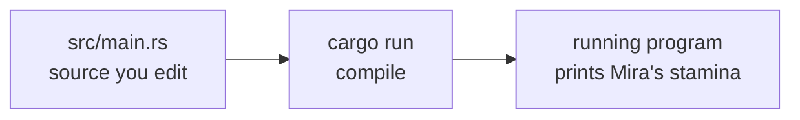
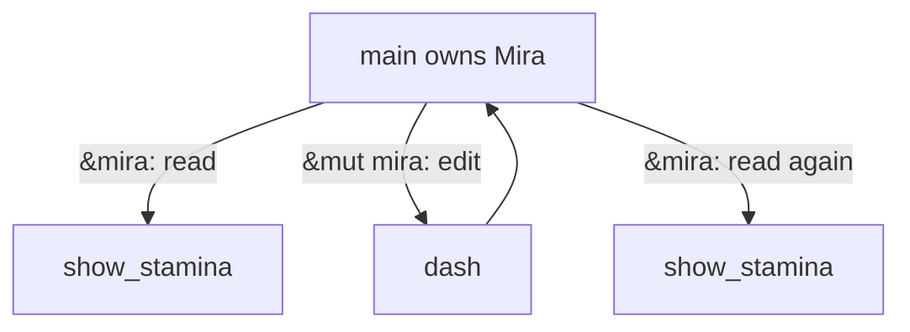

import { HoverCard, SpeedType } from '../../../../components/kit';
import MemoryStrip from '../../../../components/MemoryStrip.astro';
import OwnershipScope from '../../../../components/OwnershipScope.astro';

This lesson gives Rust syntax a purpose. A program runs steps in order,
chooses between possible steps, repeats a step, and keeps related state
together. Rust has familiar ways to express each of those ideas. We will
build one small program around a fictional runner named Mira, who has 12
stamina. A dash uses 4 stamina. A second runner named Sol will let us see
why the same rule can serve several records.

| Programming question | Rust expression in this lesson |
| --- | --- |
| What happens first, next, and last? | Statements in `main`, function calls, and assignments. |
| Which path should run? | `if`, `match`, and `if let`. |
| What should repeat, and when should it stop? | `for`, `while`, `loop`, and collection iterators. |
| Which values belong together? | `struct`, collections, and `enum`. |
| Who can read or change a value? | `&`, `&mut`, ownership, and methods. |
| What if a value is missing or an operation fails? | `Option`, `Result`, and `?`. |

## Give the code a place to run

**Cargo** is the tool normally used to build and run Rust projects. After
installing a Rust toolchain, a terminal can check that Cargo is available:

```text
cargo --version
```

A version number means the command is ready. If it is not installed, the
[official Rust installation guide](https://www.rust-lang.org/tools/install)
explains the supported setup. You can read this primer now and <HoverCard kind="alternative" body="To try a short program sooner, the [Rust Playground](https://play.rust-lang.org/) compiles and runs it in your browser with nothing to install. The Windows tools later in the book still need the lab setup from Lesson 1.7.">run it after
the Windows lab setup in Lesson 1.7</HoverCard>.

Make a project in a folder you control:

```text
cargo new rust_stamina_primer --vcs none
cd rust_stamina_primer
```

Cargo creates `Cargo.toml`, which describes the project, and
`src/main.rs`, which holds the starting program. Replace the contents of
`src/main.rs` with the complete program below. The shorter fragments before
it each isolate one idea; do not paste all of them into the same file.
`cargo run` compiles and
runs it. `cargo check` checks the code without producing a program you
can run. The [official Cargo chapter](https://doc.rust-lang.org/book/ch01-03-hello-cargo.html)
walks through these same commands.



## Name the state, then run steps in order

Start with three values, each with a distinct job. The statements run from
top to bottom; later statements can use names created earlier:

```rust
let mut stamina: u32 = 12;
let cost = 4_u32;
let can_dash = stamina >= cost;
```

`let` binds a name. `mut` permits a later assignment to `stamina`.
The `: u32` is an explicit type; the `_u32` on `4` gives the literal
that type too. Rust can infer that `cost` is a `u32` and `can_dash` is a
`bool`, because `>=` produces `true` or `false`. A semicolon ends each
statement. To update state, assign a new value to the same name:

```rust
stamina = stamina - cost; // first calculate 12 - 4, then store 8
```

## Selection: run only the path that fits

The assignment above <HoverCard kind="caution" body="Without a check, a `u32` that would go below zero does not become negative. A debug build stops with a subtract-with-overflow panic; a release build wraps around, so 2 − 4 gives 4,294,967,294.">assumes the runner has enough stamina</HoverCard>. To express a rule with
two possible paths, use `if` and `else`:

```rust
if can_dash {
    stamina = stamina - cost;
} else {
    println!("Not enough stamina");
}
```

With 12 stamina, the first branch runs and stamina becomes 8. The `else` branch
would run for 2 stamina and a 4-stamina cost. The braces group the statements
belonging to each path. This is **selection**: test a condition, then run
the matching branch. Later, `match` and `if let` will select by the shape
of a result instead of a true/false condition.

## Repetition: apply the same rule to several inputs

A `for` loop repeats a body for each item in a collection. Here the loop
tries three dash costs in order, carrying the current stamina into the next
attempt:

```rust
let mut stamina = 12_u32;
for cost in [4, 10, 2] {
    if stamina >= cost {
        stamina -= cost;
    }
}
// stamina is 6: use 4, skip 10, use 2
```

`stamina -= cost` is short for `stamina = stamina - cost`. The trace is 12 → 8;
10 needs more stamina than remains, so stamina stays 8; using 2 leaves 6. The code
shows **repetition** without writing the dash check three times.

Use `for` when there is a collection to visit. Use `while` when the
condition determines whether another pass is needed:

```rust
let mut attempts = 0;
while attempts < 3 {
    attempts += 1;
    println!("Attempt {attempts}");
}
// prints Attempt 1, Attempt 2, Attempt 3
```

Use `loop` when the body decides exactly when to stop:

```rust
let mut remaining = 2;
loop {
    if remaining == 0 {
        break;
    }
    remaining -= 1;
}
```

The important question is always **what makes the repetition stop?**
The `for` example ends after its three costs, the `while` example ends
when `attempts` reaches three, and the `loop` example reaches `break`
when `remaining` reaches zero.

## Group related state and name a behavior

So far `stamina` is a standalone number. A game also needs to know whose
stamina it is. A `struct` names a shape of related fields; `Runner` groups a
name with a stamina amount. A function names a repeatable behavior. Here
`dash` is the guarded dash rule and `show_stamina` displays the state:

```rust
struct Runner {
    name: String,
    stamina: u32,
}

fn show_stamina(runner: &Runner) {
    println!("{} has {} stamina", runner.name, runner.stamina);
}

fn dash(runner: &mut Runner, cost: u32) -> bool {
    if runner.stamina < cost {
        return false;
    }
    runner.stamina = runner.stamina - cost;
    return true;
}

fn main() {
    let mut mira = Runner {
        name: String::from("Mira"),
        stamina: 12,
    };

    show_stamina(&mira);
    let dashed = dash(&mut mira, 4);
    println!("Dash succeeded: {dashed}");
    show_stamina(&mira);
}
```

Run it with `cargo run`. You should see:

```text
Mira has 12 stamina
Dash succeeded: true
Mira has 8 stamina
```

The order of those lines matters. `main` starts, creates this sample
runner, prints the starting value, asks `dash` to apply the rule, and
prints the new value.
The first and last print calls read the **same** runner record, before
and after one controlled change.

<MemoryStrip
  cells="Mira.stamina before=12|dash cost=4|Mira.stamina after=8"
  groups="0-2:dash checks the cost, then changes Mira's stored stamina"
  caption="The `dash` call changes Mira's record; `show_stamina` only reads it."
/>

## Who owns the runner, and who may change it?

`let mut mira` creates a **mutable** runner value inside `main`.
`main` owns that value for this example. The `name` field is a `String`:
owned text stored in Mira's record. `u32` is a non-negative whole-number
type, suitable for this simple stamina example.

`show_stamina(&mira)` lends the function a read-only **reference** to Mira.
The `&Runner` parameter says it may inspect a runner without taking over
ownership. `dash(&mut mira, 4)` lends a temporary editable reference;
`&mut Runner` says the function may change that runner. When the call
returns, `main` can use Mira again. Neither function needs to copy the
whole record just to read or update its fields.

Think of Mira's record as one notebook. `show_stamina` may read it; `dash`
needs permission to write in it. The analogy stops at the Rust rule:
references are checked by the compiler, and Rust will reject conflicting
access to the same value during an editable borrow. [Lesson 3.1](/pages/3/01/) develops ownership, borrowing, and error handling
when we build an external memory tool.



Remove `mut` from `let mut mira` and run `cargo check`: the
editable `&mut mira` call is rejected before the program runs.
Put `mut` back to make the intended change explicit. Compiler messages
are useful clues about which part of the code's promise does not match.

## Copy a number, move an owned string

<HoverCard kind="reference" href="https://doc.rust-lang.org/book/ch04-01-what-is-ownership.html" body="The Rust Book's chapter on ownership gives the rules with more examples: each value has an owner, there is one owner at a time, and the value is dropped when its owner goes out of scope.">Ownership</HoverCard> becomes clearer when we compare two assignments. A `u32`
number is a small `Copy` value: assigning it to another variable copies
the number, so both names remain usable. A `String` owns growable text;
assigning it normally **moves ownership** to the new name:

```rust
let stamina = 12_u32;
let copied_stamina = stamina; // both names can still be used

let name = String::from("Mira");
let moved_name = name; // moved_name now owns the text
// println!("{name}"); // rejected: name no longer owns it
println!("{moved_name} has {copied_stamina} stamina");
```

This does not make a second independent copy of the text. If both names
claimed to own the same growable allocation, each might try to release
it later. Rust makes the transfer visible to the compiler instead. A
borrow such as `&mira` is different: it lets a function use the value
temporarily while Mira remains owned by `main`.

<OwnershipScope id="string-move" example="move-string" />

The interactive view separates the `String` value's small bookkeeping
from the text it owns. It previews the stack and heap vocabulary that
Lesson 1.8 will explain. The important source-level rule here is that
the old name cannot be used after its owned `String` moves; the new
owner can use it. A copyable `u32` behaves differently.

## Punctuation that carries meaning

Rust's symbols are easier to read when each has a job:

| In the example | Read it as |
| --- | --- |
| `name: String` | a field named `name` whose type is `String` |
| `-> bool` | this function returns `true` or `false` |
| `runner.stamina` | the `stamina` field in this runner |
| `String::from("Mira")` | call `from` associated with the `String` type |
| `&mira` / `&mut mira` | lend read access / lend editable access |
| `println!` | a printing macro; the `!` marks macro syntax |

The braces in `println!("{} has {} stamina", ...)` mark slots filled by
the values after the quoted text. The `{dashed}` form uses the local
variable by name. In a later collection example,
`use std::collections::{HashMap, VecDeque};` brings two standard-library
names into scope; `::` walks through their module path.

## Grow one runner into the full two-runner program

To see how one rule serves several records, add Sol to the program. Mira
starts with 12 stamina and Sol with 7; each has a separate health amount.
Replace `src/main.rs` with this complete version;
do not paste a second `main` underneath the first one:

```rust
struct Runner {
    name: String,
    stamina: u32,
    health: u32,
    max_health: u32,
}

fn dash(runner: &mut Runner, cost: u32) -> bool {
    if runner.stamina < cost {
        return false;
    }
    runner.stamina = runner.stamina - cost;
    return true;
}

fn show_runner(runner: &Runner) {
    println!(
        "{} has {} stamina and {}/{} health",
        runner.name, runner.stamina, runner.health, runner.max_health
    );
}

fn main() {
    let mut runners = [
        Runner {
            name: String::from("Mira"),
            stamina: 12,
            health: 70,
            max_health: 100,
        },
        Runner {
            name: String::from("Sol"),
            stamina: 7,
            health: 45,
            max_health: 60,
        },
    ];

    for runner in &mut runners {
        dash(runner, 4);
    }
    for runner in &runners {
        show_runner(runner);
    }
}
```

The first loop lends each existing runner to `dash` for an edit. That
loop finishes before the second loop lends each runner to `show_runner`
for reading. Mira's stamina becomes 8 and Sol's becomes 3; their health
fields do not change. `cargo run` should print:

```text
Mira has 8 stamina and 70/100 health
Sol has 3 stamina and 45/60 health
```

The shape of each runner became larger, but the rule did not need a
special Mira version and a special Sol version. Add a third record with
2 stamina: the dash fails and that record keeps 2. The function's
`bool` result could also be used to
display whether each dash succeeded.

## Put behavior next to a struct with `impl`

The complete program uses a separate `dash(runner, 4)` function. Rust
also lets us attach behavior to the `Runner` type in an `impl` block.
This alternative method performs the same guarded subtraction:

<SpeedType id="runner-impl" title="Type the Runner methods">

```rust
impl Runner {
    fn try_dash(&mut self, cost: u32) -> bool {
        if self.stamina < cost {
            return false;
        }
        self.stamina = self.stamina - cost;
        return true;
    }
}
```

</SpeedType>

`self` means the runner receiving the method call. `&mut self` gives
the method temporary editable access to that runner, like the earlier
`&mut Runner` parameter. You can add this `impl` block below the
two-runner program and replace `dash(runner, 4)` in the first loop with
`runner.try_dash(4)`. The result stays Mira 8 and Sol 3. The method
organizes the code differently; it does not invent a different dash
rule. In Rust, a `struct` holds fields and an `impl` gives it methods;
class inheritance is not required.

## Model two possible outcomes with `enum` and `match`

The `bool` from `dash` says whether the dash succeeded, but it does
not say *why* it failed or how much stamina is left. When an answer can take
one of a few distinct shapes, Rust uses an `enum`. This separate program
decides a dash without changing a runner record:

```rust
enum DashOutcome {
    Dashed { remaining: u32 },
    TooTired { missing: u32 },
}

fn decide_dash(stamina: u32, cost: u32) -> DashOutcome {
    if stamina >= cost {
        DashOutcome::Dashed { remaining: stamina - cost }
    } else {
        DashOutcome::TooTired { missing: cost - stamina }
    }
}

fn main() {
    let decision = decide_dash(2, 4);
    match decision {
        DashOutcome::Dashed { remaining } => println!("Left: {remaining}"),
        DashOutcome::TooTired { missing } => println!("Need {missing} more stamina"),
    }
}
```

This prints `Need 2 more stamina`. The `if` chooses which outcome to construct.
`match` then selects the arm for that outcome and names its stored value.
The last expression in each branch has no semicolon, so it becomes the
function's answer. If you later add a third kind of dash outcome,
Rust requires the `match` to handle it too. This is how the **logic of
alternatives** appears in a type, instead of being hidden in a special
number such as `-1`.

## Try the growable collections in Rust

Different questions call for different collections. A vector keeps a
growable sequence of samples. A hash map finds a value by a key. A queue
keeps actions in arrival order. Try their Rust forms in a separate scratch
run after the two-runner example. The `use` line makes the two standard
library collection types available by their short names:

```rust
use std::collections::{HashMap, VecDeque};

let mut recent_stamina = vec![12, 8];
recent_stamina.push(6);
let second_sample = recent_stamina[1];
println!("Second sample: {second_sample}");

let mut stamina_by_name = HashMap::new();
stamina_by_name.insert("Mira", 8);
if let Some(amount) = stamina_by_name.get("Mira") {
    println!("Mira has {amount} stamina");
}

let mut pending = VecDeque::new();
pending.push_back("dash");
pending.push_back("rest");
if let Some(action) = pending.pop_front() {
    println!("Next action: {action}");
}
```

`vec!` starts a growable vector with two samples, `push` adds a third,
and `[1]` selects the second sample because positions start at zero.
The hash map associates the key `"Mira"` with 8, so `get("Mira")` can
find the amount without scanning a list of names. The queue adds actions
at the back and takes the oldest from the front; after the first pop,
`"rest"` is still waiting.

### Express a repeated query with an iterator

A loop is useful when you want to show each step. An **iterator** can
express the same repeated question as a short pipeline. Count how many
runners have enough stamina for a 4-point dash:

```rust
let stamina_samples = [8_u32, 3, 6];
let ready = stamina_samples
    .iter()
    .copied()
    .filter(|stamina| *stamina >= 4)
    .count();
println!("{ready} runners can dash"); // 2
```

`.iter()` walks borrowed values from the array, `.copied()` makes cheap
`u32` copies, `filter` keeps the values that satisfy the condition, and
`count` counts those kept. `|stamina| *stamina >= 4` is a **closure**: a small
unnamed function supplied right where it is used. `*stamina` reads the
number passed to that closure. The longer `for` version says the same
thing:

```rust
let stamina_samples = [8_u32, 3, 6];
let mut ready = 0;
for stamina in stamina_samples {
    if stamina >= 4 {
        ready += 1;
    }
}
// ready is 2
```

Use the form that makes the rule clearest. Later labs also use `.map(...)`
to transform each item and `.collect()` to gather results; the logic is
still “visit each item, do something, then produce an answer.”

Both the map lookup and the queue removal may fail to produce an item:
the name might be absent or the queue empty. Their results therefore
use `Some(value)` or `None`. The next section shows the same shape with
the dash rule. A grid and graph need their own operations; [Lesson 4.9](/pages/4/06/) uses them for map tiles and paths.

## When a result might be missing

An array's `[1]` asks for a position directly; using an index outside
its bounds would fail at runtime. Its `.get(1)` method instead gives an
`Option`: `Some(value)` when that position exists, or `None` when it
does not. This is the same `Some` used in the hash-map example above:

```rust
let dash_costs = [4, 10];
if let Some(cost) = dash_costs.get(1) {
    println!("Second dash cost: {cost}");
}
```

The code prints `Second dash cost: 10`. With `.get(5)`, the answer would be
`None`, and the print would be skipped. `if let` means “run this block if
the result has the `Some` shape, and give its inner value the name
`cost`.”

The same idea can report a dash that cannot be made. A missing
answer needs a different shape from a valid result of zero:

```rust
fn remaining_after_dash(stamina: u32, cost: u32) -> Option<u32> {
    stamina.checked_sub(cost)
}
```

`checked_sub` gives `Some(8)` for `(12, 4)`, because the subtraction
fits in `u32`. It gives `None` for `(2, 4)`, because an unsigned value
cannot hold the negative answer. For `(4, 4)`, the answer is
`Some(0)`, not `None`; zero is a valid remaining amount. This differs
from `dash`, which returned `false` and left the runner's stamina unchanged
on a failed dash. The return type tells the caller which story
it will receive. In Rust, the last expression without a semicolon is
the returned value; here that expression is the `checked_sub` result.

Another common Rust type, `Result`, represents either a success (`Ok`)
or an error (`Err`) when the reason for failure matters. The
[official `Option` documentation](https://doc.rust-lang.org/std/option/)
has more examples when you need them.

## Give a failure a reason with `Result`

`Option` fits “there may be no item.” Sometimes you need to know **why**
an operation failed. Suppose a small tool reads a dash cost as text.
`"4"` can become a `u32`; `"tired"` cannot. Rust's `parse` operation
returns a `Result`: `Ok(cost)` or `Err(error)`.

```rust
match "4".parse::<u32>() {
    Ok(cost) => println!("Cost: {cost}"),
    Err(error) => println!("Invalid cost: {error}"),
}
```

The `::<u32>` tells `parse` which number type we want. `match` selects
one arm by the **shape** of the result and gives the value inside that
arm a name. For `"4"`, the first arm prints `Cost: 4`. Change the text
to `"tired"` and the error arm runs instead. Both possibilities are
written down, so the caller cannot silently treat invalid text as a
valid zero cost.

| Question | Rust shape | Example |
| --- | --- | --- |
| Might there be no value? | `Option<T>`: `Some` or `None` | No item at index 5. |
| Might an operation fail with a reason? | `Result<T, E>`: `Ok` or `Err` | Text is not a whole number. |

The letters `T` and `E` stand for the success-value type and error type.
You do not need to invent a custom error type yet. [Lesson 3.1](/pages/3/01/#errors-are-part-of-the-function) returns useful errors
from a memory reader and explains where to handle them.

### Stop a sequence early with `?`

Sometimes a function has several steps, and each step can fail. Rust's
`?` keeps the successful value moving through the sequence and returns
an error immediately when that step fails:

<SpeedType id="read-dash-cost" title="Type the dash-cost parser">

```rust
fn read_dash_cost(text: &str) -> Result<u32, std::num::ParseIntError> {
    let cost = text.parse::<u32>()?;
    Ok(cost)
}

fn main() {
    for text in ["4", "tired"] {
        match read_dash_cost(text) {
            Ok(cost) => println!("Cost: {cost}"),
            Err(error) => println!("Invalid cost: {error}"),
        }
    }
}
```

</SpeedType>

For `"4"`, `parse` produces `Ok(4)`, `?` gives `4` to `cost`, and the
function returns `Ok(4)`. For `"tired"`, `parse` produces `Err`, so
the function stops before `Ok(cost)` and passes that error to its caller.
The caller's `match` still decides what to do with it. Read `?` as
**“continue with the value, or return the error now.”**

The angle brackets in `Result<u32, ParseIntError>` supply concrete types
to a reusable type: success holds a `u32`, error holds a parse error.
`Option<u32>`, `Vec<u32>`, and `HashMap<&str, u32>` use the same
**generic** pattern with different values inside.

## Recognize a few later Rust boundaries

The book's memory tools also introduce syntax whose full rules belong
beside the tool that needs them. You can still tell what role each plays:

| Later syntax | Programming idea it expresses | Where it becomes concrete |
| --- | --- | --- |
| `trait MemoryReader { ... }` | A promise that different readers provide the same behavior. | [Lesson 3.1](/pages/3/01/) |
| `unsafe { ... }` | A small region where the programmer must uphold rules the compiler cannot verify. | [Lesson 3.1](/pages/3/01/#raw-pointers-and-unsafe) |
| `extern "system" { ... }` | A call across the Rust–Windows boundary. | [Lesson 5.7](/pages/7/07/) |

You can read a lab function as *inputs → operation → `Result` → caller's
decision* even before knowing every Windows API name. The later lesson
defines the new boundary when you reach it.

## Check the rule with a small test

Below the complete two-runner program, add this test. It creates a runner
with only 2 stamina, requests a 4-point dash, and checks both the answer and the
unchanged state:

```rust
#[test]
fn insufficient_stamina_keeps_state() {
    let mut runner = Runner {
        name: String::from("Mira"),
        stamina: 2,
        health: 70,
        max_health: 100,
    };

    let dashed = dash(&mut runner, 4);
    assert!(!dashed);
    assert_eq!(runner.stamina, 2);
}
```

`#[test]` marks a function for Cargo's test runner. `assert!` requires
the answer to be false here; `assert_eq!` requires the stamina to remain 2.
Run `cargo test`. If you change the `dash` rule so it subtracts without
checking, this test catches the mistake. The test does not prove every
possible dash is correct, but it protects one important boundary.
The successful path can be checked with 12 stamina and cost 4. The [Cargo Book's testing
guide](https://doc.rust-lang.org/cargo/guide/tests.html) explains how
tests in a project are discovered and run.

## Change one value and inspect the branch

In the two-runner program, change `dash(runner, 4)` to
`dash(runner, 20)`. Neither runner has 20 stamina. The function returns
`false` before subtraction, so the final lines show 12 and 7 stamina.
The 4-point cost restores the original run.

You can now read the Rust code in the next lessons as a set of explicit
promises: a value has a type, a reference says what access a function
gets, and a return value says what came back. [Hacking
Fundamentals](/pages/1/06/) applies the same programming concepts to a
different game's observed behavior.
