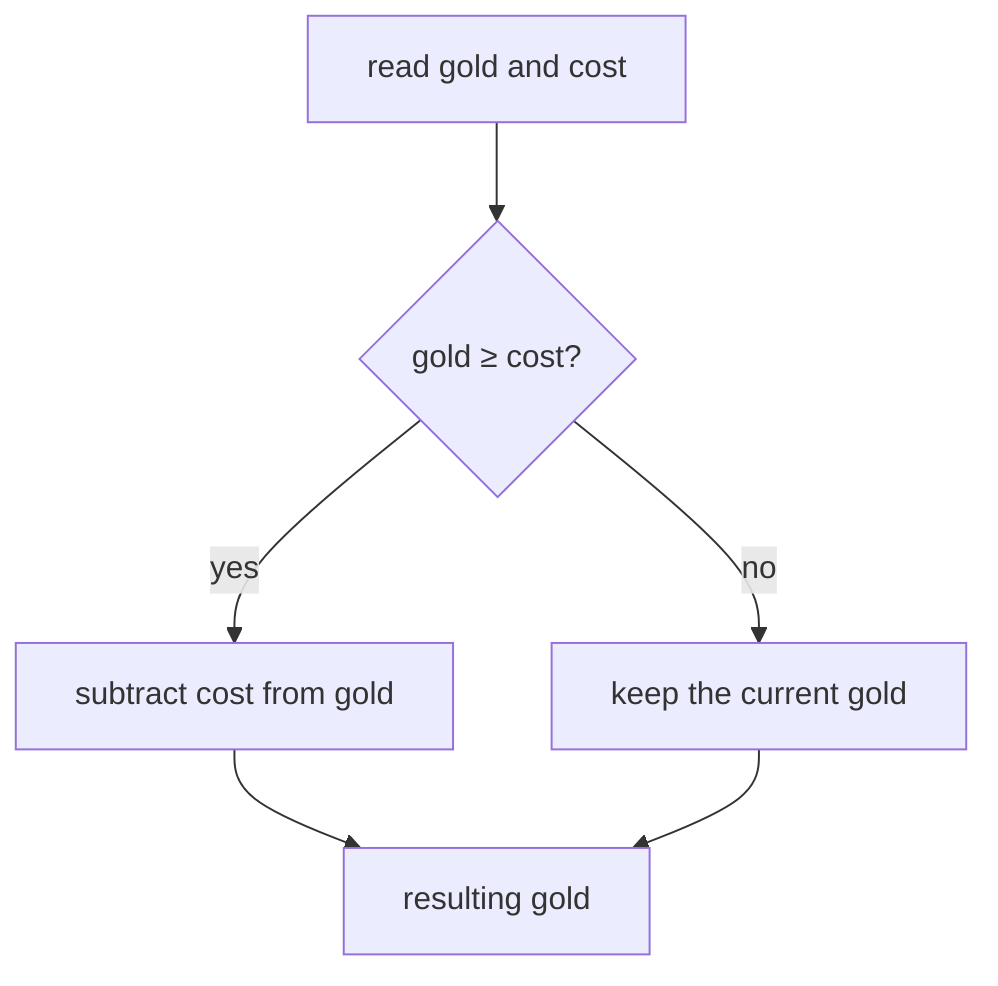

import MemoryStrip from '../../../../components/MemoryStrip.astro';

We have already followed one value through a CPU instruction (Lesson 1.2),
looked at its bytes in memory (Lesson 1.3), and grouped it with one player's
other values (Lesson 1.4). Now we can write a small program that uses those
ideas. We will start with 100 gold and ask what happens when an item costs 25.

The examples below are Rust. Read each new part before trying to predict
a result. The complete program comes after the pieces it uses.

## Start with values and variables

The number 100 is a **literal**: a value written directly in the code.
A **variable** is a name for a value the program can use. This first
fragment names the current gold and the cost:

```rust
let mut gold: u32 = 100;
let cost: u32 = 25;
```

`let` introduces a variable. `gold` and `cost` are names we chose.
The colon gives each variable a **type**. Lesson 1.3 introduced `u32`:
a non-negative whole number stored in four bytes. The equals sign sets
the starting value, and the semicolon ends the statement. `mut` means
the value named `gold` may change. We do not need to change `cost`,
so it has no `mut`.

At this point, gold is 100 and cost is 25. To calculate a purchase, the
program reads both values, subtracts cost, and stores the result back in
gold:

```rust
gold = gold - cost;
```

The right side is calculated first: 100 − 25 = 75. The equals sign then
assigns 75 to `gold`. This is a change in program **state**, the
information the program currently remembers. The cost stays 25.

<MemoryStrip
  cells="gold before=100|cost=25|gold after=75"
  groups="0-2:read 100 and 25, subtract, then store 75"
  caption="The assignment changes gold. It does not change the cost."
/>

## Check before subtracting

What if gold is only 10 and the cost is 25? A purchase should not be
allowed. Because `u32` cannot represent a negative number, blindly
subtracting would also be the wrong operation. We need the branch from
Lesson 1.2:

```rust
if gold >= cost {
    gold = gold - cost;
}
```

`>=` asks whether gold is greater than or equal to cost. The answer is
a **boolean** value, either `true` or `false`. `if` runs the
instructions between the braces only when the answer is true. Starting
with 100 gold, the comparison is true and gold becomes 75. Starting
with 10, it is false and gold remains 10. The braces mark the group of
statements controlled by the branch.



This gives us a repeatable **algorithm**, meaning a procedure with
ordered steps: read the current gold, compare it with the cost, and
subtract only if the player can pay. The name is useful because the
same steps work for different starting values.

## Give the operation a name

A **function** gives a behavior a name so another part of the program
can use it. This one takes a gold amount and a cost, then gives back
the gold amount after a permitted purchase:

```rust
fn spend_if_possible(gold: u32, cost: u32) -> u32 {
    if gold >= cost {
        return gold - cost;
    }
    return gold;
}
```

`fn` begins the function definition. The names inside parentheses
are its **parameters**: the two input values it will receive. Each
has a `u32` type. The arrow `-> u32` says the returned value is
also a `u32`. `return` sends the value back to whoever used the
function. If there is enough gold, it returns the subtraction. If
there is not, it returns the original amount. The final `return`
also shows that functions do not have to run every line: the first
return ends that call.

For example, `spend_if_possible(100, 25)` returns 75.
`spend_if_possible(10, 25)` returns 10. Those expressions **call**
the same function with different inputs. They do not change a
variable by themselves; the caller must store the returned value:

```rust
gold = spend_if_possible(gold, cost);
```

This simple result does not tell the caller whether a purchase happened
when the cost is zero. A later lesson introduces types that can
represent success or failure explicitly. We only need the resulting
gold amount here.

## Put related values in a player record

Lesson 1.4 grouped gold, health, and maximum health into one record.
That lesson followed Ada through a purchase and damage. Here we start a
fresh run with her original 100 gold and 80 health so the program can
perform the purchase itself.
Rust uses `struct` to describe that shape:

```rust
struct Player {
    gold: u32,
    health: u32,
    max_health: u32,
}
```

Each line inside the braces is a named **field**. Now we can create one
player value:

```rust
let ada = Player {
    gold: 100,
    health: 80,
    max_health: 100,
};
```

The braces supply the three field values. A comma separates fields;
the semicolon ends the `let` statement. `ada.gold` reads Ada's
gold field. `ada.health` reads her health. The dot selects a field
from this particular record.

The pair `health` and `max_health` has a rule: a valid player's
health should be between zero and the maximum. For Ada, 80 is within
0 to 100. If a mistaken update made health 120 while the maximum
stayed 100, the record would violate that rule. Later lessons call
a rule that valid state must preserve an **invariant**. For now, it is
enough to check the relationship instead of trusting either field
alone.

## Apply one operation to several players

Suppose Ada has 100 gold and Bo has 40. We want to charge each of
them 25. A **collection** stores several values. The square brackets
below make a fixed-size array containing two `Player` records:

```rust
let mut players = [
    Player { gold: 100, health: 80, max_health: 100 },
    Player { gold: 40, health: 50, max_health: 80 },
];
```

We make `players` mutable because its records' gold values will
change. A **loop** repeats one operation for each record:

```rust
for player in &mut players {
    player.gold = spend_if_possible(player.gold, 25);
}
```

Read `for player in ...` as “take each player in turn.” The
`&mut players` part lets the loop access the existing records so
it can change them; Rust calls this a mutable borrow. We will study
borrowing more fully when a tool begins reading another process in
Chapter 3. Here, the important effect is that the loop changes the
records in the collection, rather than temporary copies.

On the first pass, Ada's 100 becomes 75. On the second, Bo's 40
becomes 15. If Bo had only 10, his gold would stay 10 because the
function's comparison would reject that purchase. The same named
operation works for both players; adding a third record would not
require writing a third purchase rule.

<MemoryStrip
  cells="Ada before=100|Ada after=75|Bo before=40|Bo after=15"
  groups="0-1:first loop pass|2-3:second loop pass"
  caption="One 25-gold purchase rule visits two records and produces two results."
/>

## Run the complete example

This program combines the pieces above. `main` is the function Rust
starts when you run the program. `println!` writes text to the
terminal; each pair of braces in its quoted text is filled with the
next value supplied after the text.

```rust
struct Player {
    gold: u32,
    health: u32,
    max_health: u32,
}

fn spend_if_possible(gold: u32, cost: u32) -> u32 {
    if gold >= cost {
        return gold - cost;
    }
    return gold;
}

fn main() {
    let mut players = [
        Player { gold: 100, health: 80, max_health: 100 },
        Player { gold: 40, health: 50, max_health: 80 },
    ];

    for player in &mut players {
        player.gold = spend_if_possible(player.gold, 25);
    }

    println!(
        "Ada has {} gold and {}/{} health",
        players[0].gold, players[0].health, players[0].max_health
    );
    println!(
        "Bo has {} gold and {}/{} health",
        players[1].gold, players[1].health, players[1].max_health
    );
}
```

`players[0]` selects the first record, Ada; `players[1]` selects
the second, Bo. Arrays count positions from zero. The dot then selects
each record's gold field. The program prints:

```text
Ada has 75 gold and 80/100 health
Bo has 15 gold and 50/80 health
```

The code is longer than the idea it expresses, but every part now has
a reason: values represent gold, a branch guards the subtraction, a
function names the rule, records keep related state together, and a
loop applies the rule to several records.

## Checkpoint

Before moving on, try to explain:

- why `gold` needs `mut` but `cost` does not;
- what happens with 10 gold and a cost of 25, and which comparison
  makes it happen;
- what values enter `spend_if_possible` and what it returns;
- why the loop changes Ada and Bo without two separate rules;
- why a displayed “Gold: 75” label may still be different data from
  the `gold` field the purchase rule uses.

We have made a small, known program and can account for its state.
[Hacking Fundamentals](/pages/1/06/) turns that understanding into a careful
question about a running game: how could we find and test the value
that actually controls a purchase?
