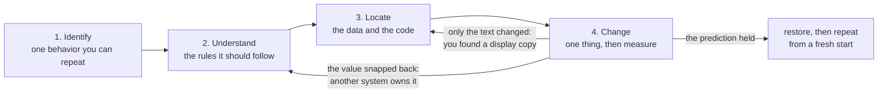

import MemoryStrip from '../../../../components/MemoryStrip.astro';

The fastest way to get completely lost is to open a memory scanner and start
searching before deciding what you are actually asking. You end up with four
hundred addresses, no way to tell which one matters, and no idea which ones you
already ruled out.

One way to keep the work in order is to split it into four steps. Treat them as
a suggestion to adapt, not a rule the rest of the book relies on:

1. **Identify** the exact behavior.
2. **Understand** how that behavior should work.
3. **Locate** the data and code involved.
4. **Change** one thing and measure the result.

The steps can repeat. A failed change often sends you back to improve what you
understand or locate a different copy:



## 1. Identify the behavior

Choose something you can observe and reproduce.

❌ “Find player stuff.”

✅ “Find the value that decreases by exactly 25 when the local player takes one
known hit.”

The behavior is only repeatable if it starts from the same conditions each
time:

- exact game build;
- map, save, or level;
- starting value;
- action you will perform;
- result you expect to observe.

Good starting behaviors include spending gold, taking damage, moving along one
axis, or toggling one graphics setting. Avoid changing several things at once.

## 2. Understand how the behavior should work

Before searching memory, work out the rule the game appears to follow.

For health:

```text
new_health = max(0, old_health - damage)
```

The rule also implies conditions that should always hold:

```text
0 <= health <= max_health
dead becomes true when health reaches 0
the health bar follows health after an update
```

These rules help distinguish the simulation value from text, animation state,
or a cached display value.

At this stage the rules are guesses. The game may apply armor, difficulty
scaling, or delayed damage, or a server may own the result, and any of these
would break the simple formula.

## Define what your tool is allowed to do

Before code touches another process, decide its limits in a small contract:

```text
Target: Wesnoth 1.14.9, 32-bit Windows build
Input: process name and expected build fingerprint
Read: one known module-relative pointer path
Change: one u32 field after confirming its current value
Stop: cancel key, version mismatch, invalid pointer, or failed read
Restore: write the saved original value back when the experiment ends
```

This contract prevents a small experiment from quietly turning into an
unbounded tool.

## 3. Locate the data and code

Use the least complicated technique that can answer the question:

1. scan for the visible value;
2. make one controlled game change;
3. filter the candidate addresses;
4. repeat until the list is small;
5. set a breakpoint on the strongest candidate;
6. observe which instruction reads or writes it;
7. follow the object pointer and surrounding fields.

Each controlled change throws away the candidates that did not change the same
way. The numbers below are only an example, but the shape is typical:

<MemoryStrip
  cells="first scan for 100=4,012|after spending 25 gold=37|after a second purchase=3|write breakpoint=1 instruction"
  marks="3"
  caption="Scanning narrows the addresses; a write breakpoint then names the instruction that stores to the survivor, which ties the address to the game's own code rather than to a coincidence of values."
/>

An address found once is valid for that run. Restarting the game shows whether
it is stable. If the absolute address moves but a module-relative path keeps
working, the path is what carries over, and only for the exact build it was
found in.

Each kind of check rules out a different mistake. A second scan with a
different amount rules out an unrelated value that happened to match once. A
write breakpoint shows which instruction owns the value. A restart shows
whether the path survives a new process.

## 4. Change one thing and measure the result

Make a prediction before the change:

```text
If this is the game-play gold field, changing 75 to 100 should allow a purchase
that costs more than 75, and the value should remain consistent after the next
game update.
```

Then:

1. save the original bytes or value so you can restore them;
2. confirm the value still matches what you expect;
3. apply one bounded change;
4. observe the immediate and next-update results;
5. restore the original state;
6. repeat from a known starting condition.

If only the text changes, you probably found a display copy. If the value snaps
back, another system owns or recomputes it. If unrelated fields break, your type,
width, or address may be wrong.

## Use tests and types for quick feedback

Separate code that decides *what should happen* from code that performs a
Windows API call. Pure logic can be tested without launching the game:

```rust
fn should_write(current: u32, expected: u32, replacement: u32) -> bool {
    current == expected && replacement <= 10_000
}

#[test]
fn rejects_an_unexpected_current_value() {
    assert!(!should_write(74, 75, 100));
}
```

The compiler checks types, tests check examples, and the debugger checks the
running game. Each one catches mistakes the other two cannot.

## Checkpoint

You should now be able to plan an experiment that:

- names one repeatable behavior;
- states the rules it expects and where they might not hold;
- narrows candidates with controlled changes and a breakpoint;
- makes one reversible change;
- uses the compiler, tests, and the debugger for feedback.
