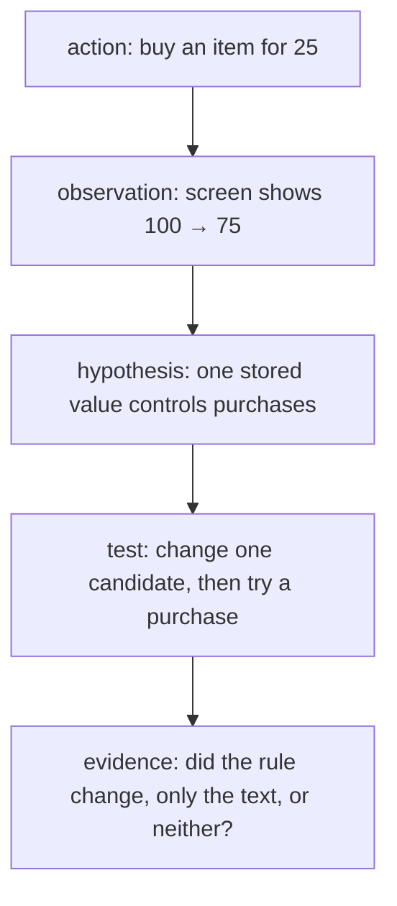
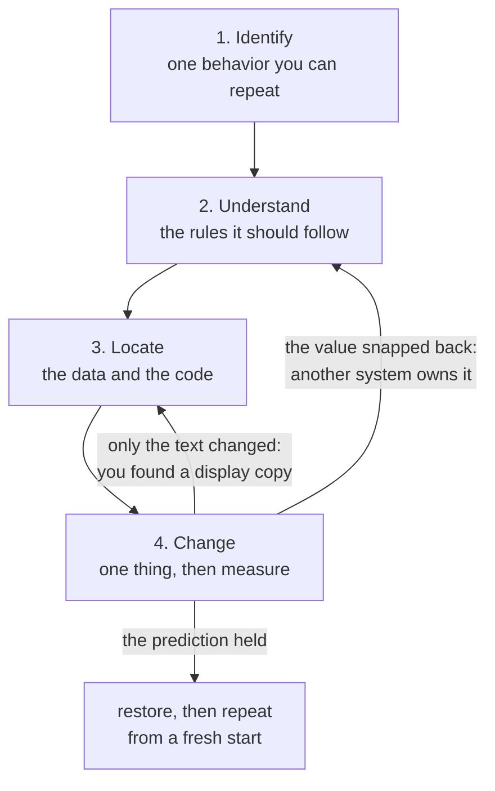
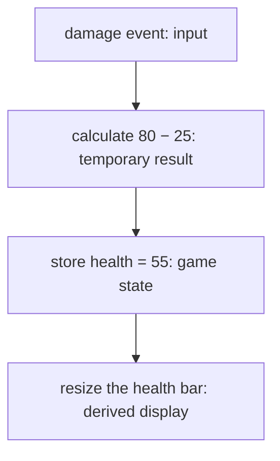
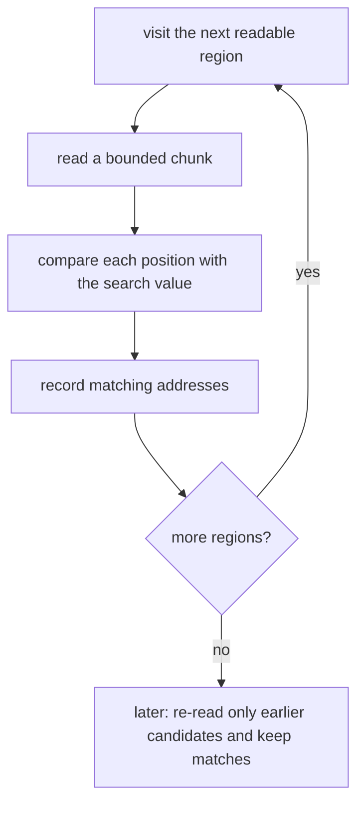

import MemoryStrip from '../../../../components/MemoryStrip.astro';

Imagine an offline game whose display shows 100 gold. Buying an item for
25 changes the display to 75. The screen shows the result, but it does
not identify the rule or the
stored value that caused it. **Game hacking** in this book means
investigating that behavior and making a deliberate, testable change to
the game or its data.

## Start with evidence, not a scan result

An observation is what you can actually see: after a 25-gold purchase,
the display changes from 100 to 75. An explanation is a **hypothesis**:
perhaps a four-byte value in the game's memory stores the gold used by
the purchase rule. Other explanations are possible. The game may keep a
display copy, recalculate gold from other data, or let a server decide
the result. A matching number is therefore a candidate, not a conclusion.


```mermaid
flowchart TD
    A["action: buy an item for 25"] --> O["observation: screen shows 100 → 75"]
    O --> H["hypothesis: one stored value controls purchases"]
    H --> T["test: change one candidate, then try a purchase"]
    T --> E["evidence: did the rule change, only the text, or neither?"]
```

The fastest way to get completely lost is to open a memory scanner and
start searching before deciding what you are asking. You can end up with
hundreds of addresses—numbered locations in the game's running memory—with
no way to tell which matters and no record of
which ones you have ruled out. A scanner finds values that match a
question; a debugger can later show the instruction that reads or writes
a candidate. Neither tool supplies the meaning by itself.

## Four steps for a controlled experiment

One way to keep the work in order is to split it into four steps. Treat them as
a suggestion to adapt, not a rule the rest of the book relies on:

1. **Identify** the exact behavior.
2. **Understand** how that behavior should work.
3. **Locate** the data and code involved.
4. **Change** one thing and measure the result.

The steps can repeat. A failed change often sends you back to improve what you
understand or locate a different copy:


```mermaid
flowchart TD
    I["1. Identify<br/>one behavior you can repeat"] --> U["2. Understand<br/>the rules it should follow"]
    U --> L["3. Locate<br/>the data and the code"]
    L --> C["4. Change<br/>one thing, then measure"]
    C -->|"only the text changed:<br/>you found a display copy"| L
    C -->|"the value snapped back:<br/>another system owns it"| U
    C -->|"the prediction held"| R["restore, then repeat<br/>from a fresh start"]
```

## 1. Identify the behavior

Choose something you can observe and reproduce.

❌ “Find player stuff.”

✅ “Find the value that decreases by exactly 25 when the local player buys one
known item.”

The behavior is only repeatable if it starts from the same conditions each
time:

- exact game build;
- map, save, or level;
- starting value;
- action you will perform;
- result you expect to observe.

Good starting behaviors include spending gold, taking damage, moving along one
axis, or toggling one graphics setting. Avoid changing several things at once.

## 2. Understand how the behavior should work

Before searching memory, work out the rule the game appears to follow.
For this lesson's 25-gold purchase, our first guess is:

```text
if gold >= cost:
    new_gold = gold - cost
else:
    new_gold = gold
```

Try the same idea on another behavior. For health, a first guess might be:

```text
new_health = max(0, old_health - damage)
```

The rule also implies conditions that should always hold:

```text
0 <= health <= max_health
dead becomes true when health reaches 0
the health bar follows health after an update
```

The health calculation, stored result, and visible bar are connected,
but they need not be one stored value:


```mermaid
flowchart TD
    E["damage event: input"] --> C["calculate 80 − 25: temporary result"]
    C --> S["store health = 55: game state"]
    S --> B["resize the health bar: derived display"]
```

These rules help distinguish a value used by the game's rules from text,
animation state, or a cached display value.

This self-contained Rust fragment makes the distinction visible:

```rust
let mut gold = 100_u32;
let displayed_gold = gold;
if gold >= 25 {
    gold -= 25;
}
```

Now `displayed_gold` is still 100, but `gold` is 75. Changing the copy
would not make a later purchase use 100 gold; the rule reads `gold`.
A real game may refresh its display differently, so the
experiment must establish which value the rule actually reads.

At this stage the rules are guesses. The game may apply armor, difficulty
scaling, or delayed damage, or a server may own the result, and any of these
would break the simple formula.

## Define what your tool is allowed to do

Before code touches another process, decide its limits in a small contract.
This is a preview of the external tools built later in the book; you do
not need to implement it for the first memory experiment:

```text
Target: Wesnoth 1.14.9, 32-bit Windows build
Input: process name and expected build fingerprint
Read: one narrowed gold candidate in the current run
Change: one u32 field after confirming its current value
Stop: cancel key, version mismatch, invalid address, or failed read
Restore: write the saved original value back when the experiment ends
```

This contract prevents a small experiment from quietly turning into an
unbounded tool.

A later tool may replace the temporary address with a **module-relative
pointer path**: a sequence of lookups anchored to one exact game build.
Lesson 1.8 first explains a pointer, and Lesson 2.8 builds the path. For
this experiment, the useful limit is simpler: verify the game build and
current value before changing anything.

## 3. Locate the data and code

Use the least complicated technique that can answer the question. A
**breakpoint** is a debugger rule that pauses execution at a chosen
instruction or memory access; we will use one only after learning the
debugger.

1. scan for the visible value;
2. make one controlled game change;
3. filter the candidate addresses;
4. repeat until the list is small;
5. later, set a breakpoint on the strongest candidate;
6. observe which instruction reads or writes it;
7. follow the stored address leading to the object and inspect nearby fields.

The first lab stops after scanning, filtering, and testing a candidate.
The breakpoint and object steps become practical after Chapters 2 and 3
teach the required tools and pointer model.

Inside one scan, the scanner follows an algorithm over **readable regions**:
ranges of numbered locations the operating system currently permits it to
read. It copies one limited chunk at a time:


```mermaid
flowchart TD
    R["visit the next readable region"] --> C["read a bounded chunk"]
    C --> M["compare each position with the search value"]
    M --> K["record matching addresses"]
    K --> N{"more regions?"}
    N -->|"yes"| R
    N -->|"no"| L["later: re-read only earlier candidates and keep matches"]
```

An algorithm is a repeatable set of steps. The scanner does not know
what gold means; it compares bytes according to the value and type you
supplied. Even a small choice such as checking only every fourth byte
can miss a value starting at one of the positions between those checks.

Each controlled change throws away the candidates that did not change the same
way. The numbers below are only an example, but the shape is typical:

<MemoryStrip
  cells="first scan for 100=4,012|after spending 25 gold=37|after a second purchase=3|write breakpoint=1 instruction"
  marks="3"
  caption="Scanning narrows the addresses; a write breakpoint then names the instruction that stores to the survivor, which ties the address to the game's own code rather than to a coincidence of values."
/>

An address found once is only a candidate for that run; its object can even
disappear before the run ends. Restarting the game shows whether it is
repeatable. If the absolute address moves but a module-relative path keeps
working, the path is what carries over, and only for the exact build it was
found in.

Each kind of check rules out a different mistake. A second scan with a
different amount rules out an unrelated value that happened to match once. A
**write breakpoint** pauses the game when an instruction writes to a chosen
address. Chapter 2 teaches how to use one. It shows which instruction
changed the candidate; a restart shows whether the path survives a new
process.

## 4. Change one thing and measure the result

Make a prediction before the change:

```text
If this is the game-play gold field, changing 75 to 100 should allow a purchase
that costs more than 75, and the value should remain consistent after the next
game update.
```

Then:

1. save the original bytes or value so you can restore them;
2. confirm the value still matches what you expect;
3. apply one bounded change;
4. observe the immediate and next-update results;
5. restore the original state;
6. repeat from a known starting condition.

If only the text changes, you probably found a display copy. If the value snaps
back, another system owns or recomputes it. If unrelated fields break, your type,
width, or address may be wrong.

## Use tests and types for quick feedback

Separate code that decides *what should happen* from code that performs a
Windows API call. Pure logic can be tested without launching the game:

```rust
fn should_write(current: u32, expected: u32, replacement: u32) -> bool {
    current == expected && replacement <= 10_000
}

#[test]
fn rejects_an_unexpected_current_value() {
    assert!(!should_write(74, 75, 100));
}
```

The compiler checks types, tests check examples, and the debugger checks the
running game. Each one catches mistakes the other two cannot.

## What a candidate address tells you

A matching address is a lead. A repeatable behavior and an expected rule
give it meaning; controlled changes and a breakpoint narrow the lead.
A reversible edit tests whether that address affects the game rule or
only a copy. The compiler and tests check the tool's logic, while the
debugger observes what the running game actually does.

[Lesson 1.7](/pages/1/07/) prepares a repeatable Windows lab. Lesson 1.8
shows what its scanner will read, and [Lesson 1.9](/pages/1/09/) walks
through the first gold scan with screenshots. Its 15-gold recruit is a
separate game action with its own starting value and observed result.
