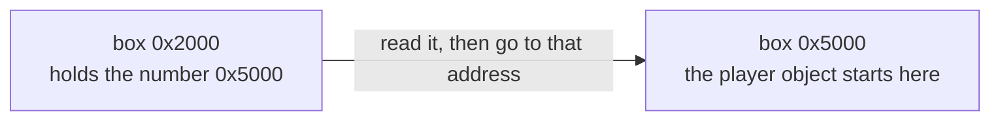

import ConceptLab from '../../../../components/ConceptLab.astro';
import MemoryStrip from '../../../../components/MemoryStrip.astro';
import Quiz from '../../../../components/Quiz.astro';

Before scanning a running game, we need to know what the scanner reads.
Suppose a health bar says 100. The player takes a hit, and the bar says
75. Somewhere inside the running game, a stored value changed.

This lesson gives you the first map of where that number lives and what it is
made of. You will use the same map when you find a value, follow a pointer, or
read another program's memory later in the book.

We will distinguish locations, contents, types, and pointers here.
[Lesson 3.2](/pages/3/09/) later takes the bits apart one at a time,
including exactly how a fractional number like 10.0 is stored.

## "Memory" means more than one thing

People use the word for several kinds of storage, and mixing them up causes a
lot of early confusion.

| Layer | How big, how fast | What lives there |
|---|---|---|
| CPU registers and caches | tiny, extremely fast | the handful of values the CPU is working on right now |
| RAM | large, fast | the running game's code, objects, and current state |
| storage drive | huge, slow | the game's files, art, settings, and saved games |

There are layers because no single technology is fast, large, cheap, and
permanent all at once. Fast memory costs a lot, so you get a little of it. Cheap
storage is slow, so it holds the things you are not using this instant.

From here on, when this book says "memory" it means RAM. That is where your
health value lives while you are playing. Turn the computer off and it is gone —
which is exactly why saving a game has to write a file to the drive.

## Memory is a very long row of numbered boxes

Picture a process's memory as an enormous row of boxes. Each box holds one
**byte**, and each box has a number called its **address**. The number tells
the process where to look during that run; it need not identify the same data
after the game restarts.

That really is most of the idea. Memory is boxes, one byte each, each with an
address. Here are four of them:

<MemoryStrip
  cells="0x1000=64|0x1001=00|0x1002=00|0x1003=00"
  caption="Four boxes of RAM. The small label is each box's address; the number inside is the byte stored there."
/>

Lesson 1.2 introduced **hexadecimal** as another way to write numbers. The
`0x` prefix on an address announces it. Inside the boxes, each byte is shown
as two hex digits with the prefix left off, which is also how debuggers and
hex dumps display bytes. The next two sections show why the first byte,
`64`, represents decimal 100.

### Inside a byte: eight bits and their place values

A **bit** is a single switch that is either 0 or 1. A byte is eight bits in a
row. The question is how eight 0s and 1s can mean a number like 100.

The answer is the same trick ordinary numbers use: position. In the decimal
number 100, the 1 is worth a hundred only because of where it sits. Each
position in decimal is worth ten times the position to its right — ones, tens,
hundreds, thousands.

Binary works the same way, except each position is worth **two** times the
position to its right. Starting from the right, the eight positions in a byte
are worth:

```text
128   64   32   16   8   4   2   1
```

To read a byte, add up what the positions holding a 1 are worth. The positions
holding a 0 add nothing:

<MemoryStrip
  cells="128=0|64=1|32=1|16=0|8=0|4=1|2=0|1=0"
  marks="1-2|5"
  groups="0-7:64 + 32 + 4 = 100"
  caption="The byte `0x64`, bit by bit. Each small label is what that position is worth. The three highlighted 1 bits add up to 100."
/>

With every bit set, a byte holds 128 + 64 + 32 + 16 + 8 + 4 + 2 + 1 = 255. With
none set, it holds 0. So a byte has exactly 256 possible values, 0 to 255.

### Why everything is in hex

Eight 0s and 1s are tiring to read, so people write bytes in **hexadecimal**,
which is base 16. It counts with sixteen digits: `0` to `9`, then `A` to `F`
standing for 10 to 15.

Hex fits bits perfectly. Four bits have the place values 8, 4, 2, and 1, so they
can hold anything from 0 (all off) to 15 (all on) — exactly the range of one hex
digit. Split a byte into two halves of four bits and each half becomes one hex
digit:

<MemoryStrip
  cells="8=0|4=1|2=1|1=0|8=0|4=1|2=0|1=0"
  marks="1-2|5"
  groups="0-3:4 + 2 = 6, hex `6`|4-7:4 = 4, hex `4`"
  caption="The same byte split into two four-bit halves. Each half is one hex digit, so the byte is written `0x64`."
/>

That is the whole reason debuggers use hex: two hex digits are always exactly
one byte, so you can see where each byte starts and ends. The same number
written in decimal, 100, hides that. It gets more obvious with bigger numbers:
decimal 4096 looks arbitrary, while `0x1000` is clearly a round figure in memory
terms.

You do not need to convert hex in your head. Recognise the `0x`, and use a
calculator until it becomes familiar. Converting by hand works like decimal
with sixteens instead of tens: `0x64` is six sixteens plus four, 6 × 16 + 4 =
100.

## Bigger values use neighbouring boxes

One box holds one byte, and one byte only goes up to 255. Anything bigger has to
spill into the boxes next door. A `u32` — the type name for an unsigned 32-bit
whole number, explained properly below — uses four boxes in a row.

### Byte order, and why hex dumps look backwards

Once a value spans several boxes, the CPU needs a rule for which box holds which
part.

Think about the decimal number 1,234. The leading 1 is worth the most — it means
a thousand. The trailing 4 is worth the least. The bytes inside a multi-byte
value work the same way, and the byte worth the least is called the
**least-significant** byte.

Windows games on x86 and x86-64 put the least-significant byte in the
lowest-numbered box. That arrangement is called **little endian**.

Each box counts in units 256 times bigger than the box before it, because one
byte holds 256 different values — the same reason each decimal column counts in
units ten times bigger than the one to its right. So the four boxes of a `u32`
count ones, 256s, 256 × 256 = 65,536s, and 256 × 256 × 256 = 16,777,216s. Here
is the number 1,000, which is `0x3E8` in hex:

<MemoryStrip
  cells="0x1000=E8|0x1001=03|0x1002=00|0x1003=00"
  groups="0-0:× 1|1-1:× 256|2-2:× 65,536|3-3:× 16,777,216"
  groups2="0-3:0xE8 is 232, and 232 × 1 + 3 × 256 = 1,000"
  caption="Little endian: the byte worth the least sits in the lowest-numbered box."
/>

The practical effect is that reading a hex dump left to right shows the bytes in
the opposite order from how you would write the number: `E8 03 00 00`, not
`00 00 03 E8`.

This trips up nearly everyone at least once. Expect the reversal every time you
compare a number you worked out against bytes you actually saw.

Now the four boxes from the start of the lesson make sense. `64 00 00 00` is
`0x64` ones plus nothing else, which is 100.

### Three facts that are easy to blur together

Look again at those four boxes. There are three separate things going on:

- `0x1000` is a **location** — which box;
- `64 00 00 00` is a **pattern of bytes** starting in that box;
- `100` is one **interpretation** of that pattern.

<MemoryStrip
  cells="0x1000=64|0x1001=00|0x1002=00|0x1003=00"
  marks="0"
  groups="0-3:the byte pattern `64 00 00 00`"
  groups2="0-3:one interpretation: the `u32` value 100"
  caption="The address names one box. The pattern spans four. The number 100 appears only when something reads those four boxes as a `u32`."
/>

The third one does not follow automatically from the first two, and this is the
single most important idea in the lesson. Those bytes only become the number 100
once something decides to read four boxes, treat them as one whole number, and
use little-endian byte order. Read the same boxes with a different set of rules
and the very same bytes mean something else, as the next section shows.

So never treat "address" and "value" as the same word. An address tells you
*where to look*. A value is what you get *after* you look and decide how to read
what is there.

## A type is the instruction for reading bytes

A **type** answers two questions: how many bytes to read, and what the bits
inside them mean.

```rust
let health: u32 = 100;
let speed: f32 = 3.5;
let alive: bool = true;
```

The names are for you. The types are for the compiler. These are the ones you
will meet most often:

| Rust type | Size | What the bits mean |
|---|---|---|
| `u8` | 1 byte | a whole number from 0 to 255 |
| `u16` | 2 bytes | a whole number from 0 to 65,535 |
| `u32` | 4 bytes | a whole number from 0 to 4,294,967,295 |
| `i32` | 4 bytes | a whole number from −2,147,483,648 to 2,147,483,647 |
| `f32` | 4 bytes | a number that can have a fractional part, such as 3.5 |
| `f64` | 8 bytes | the same idea as `f32`, with more precision |
| `bool` | 1 byte | `0` means false, `1` means true |

The names follow a pattern. The number is the size in bits. `u` means
**unsigned**: the value can never be negative. `i` means a signed **integer**,
which can be. `f` means **floating point**, a number with a fractional part.

The ranges come from counting patterns. One bit has 2 patterns, and every extra
bit doubles the count: two bits have 4, three have 8, and eight have 256, which
is why a `u8` stops at 255. Sixteen bits have 256 × 256 = 65,536 patterns, and
thirty-two bits have 65,536 × 65,536 = 4,294,967,296. An `i32` has exactly as
many patterns as a `u32`, but it spends half of them on negative numbers, which
is why its range is split around zero.

### One pattern, two readings

`u32` and `f32` are both four bytes, but they use those 32 bits in completely
different ways. A `u32` reads all 32 bits as one whole number. An `f32` splits
them into three parts — a sign, a power of two, and the digits of the number —
much as scientific notation writes 1,500 as 1.5 × 10³.

So one four-byte pattern holds two totally different numbers, depending on which
type you ask for:

<MemoryStrip
  cells="=00|=00|=20|=41"
  groups="0-3:read as `u32`: 1,092,616,192"
  groups2="0-3:read as `f32`: 10.0"
  caption="One four-byte pattern, read two ways. Both readings are correct; they answer different questions."
/>

The `u32` reading uses only what this lesson has covered: written most
significant first, the bytes are `0x41200000`, and a calculator turns that into
1,092,616,192. The `f32` reading follows rules for its three parts that are not
covered here; [Lesson 3.2](/pages/3/09/#fractions-how-an-f32-splits-its-32-bits)
works through them bit by bit, all the way to 10.0. What matters now is that
nothing in memory changed between the two readings. Only the type did.

Floats have one habit worth knowing from the start: most fractions cannot be
stored exactly. Ask an `f32` to hold 10.1 and it actually holds 10.100000381…,
the nearest value its 32 bits can express. That is why float values in games are
rarely round, and why memory scanners let you search for a float within a small
range instead of only an exact value.

### Values side by side

An array puts equal-sized values back to back. A 3D position is often three
`f32` values in a row, one each for x, y, and z:

<MemoryStrip
  cells="+0x00=00|=00|=80|=3F|+0x04=00|=00|=00|=40|+0x08=00|=00|=60|=C0"
  groups="0-3:x = 1.0|4-7:y = 2.0|8-11:z = −3.5"
  caption="A position stored as three `f32` values. The labels are offsets from the start of the position."
/>

Each value is four bytes, which is why the labels go up by 4 and not by 1.

Text and lists add their own rules on top. A C string just runs until it hits a
zero byte. Other kinds of string store a pointer and a length. A growable list
usually stores a pointer to its contents plus a length and a capacity. The code
that reads a string or list is what tells you which layout a game uses.

### Working out types in a running game

When you inspect a compiled game without useful debug information, many source
names and type declarations are unavailable. The compiler used them to choose
instructions, and those instructions provide clues about how the game *uses*
the bytes:

- how many bytes an instruction reads or writes at once: 1, 2, 4, or 8;
- which kind of instruction does it — x86 has separate instructions for
  floating-point values, so a float load means an `f32` or `f64`;
- what the code does with the result — compares it with a signed or unsigned
  test, adds it to an address, passes it to a drawing function;
- how the bytes change when you make the game change;
- whether nearby bytes behave like parts of the same object.

This is also why a memory scanner asks what kind of value you are hunting before
it searches. The whole number 10 is stored as `0A 00 00 00`. The float 10.0 is
stored as `00 00 20 41`. The two patterns do not share a single byte, so a
search for one can never find the other.

<ConceptLab
  id="memory-byte-lens"
  lab="byte-lens"
  label="Interactive byte interpretation lab"
/>

## A pointer is a number that happens to be an address

Every value so far has been data about the game: 100 gold, 10.0 metres per
second. A **pointer** is a value too — an ordinary number, stored in ordinary
bytes, in an ordinary box. What makes it a pointer is only what that number
*means*: it is the address of something else.

Nothing in the bytes marks them as a pointer. `00 50 00 00` could be the number
20,480 — `0x50` is 80, and 80 × 256 = 20,480 — or it could be a pointer to
address `0x5000`, which is the same number written in hex. As always, the code
that reads them decides which.

Here is the whole idea. Four ordinary bytes at `0x2000`:

<MemoryStrip
  cells="0x2000=00|0x2001=50|0x2002=00|0x2003=00"
  groups="0-3:read together as a `u32`: the number `0x5000`, where the player object starts"
/>



Three different numbers are involved, and running them together is the most
common early mistake by a wide margin:

| Number | What it is | Here |
|---|---|---|
| where the pointer lives | an address | `0x2000` |
| the pointer's own value | also an address | `0x5000` |
| what it points at | the actual data | the player object |

Read address `0x2000` and you get `0x5000`. That is not the player. To reach the
player you read a second time, now from `0x5000`. That second read is called
**dereferencing** the pointer.

Think of a library catalogue card. The card is not the book. It sits in a
drawer at its own location, and all it carries is a shelf number. Finding the
book is two separate steps: read the card, then walk to the shelf.

That comparison is worth keeping because it survives being pushed on. The
drawer slot is `0x2000`. The shelf number written on the card is `0x5000`. The
book is the player object. And here is the part that matters most: if a
librarian removes that book and shelves a different one in the gap, your card
still reads `0x5000` and still sends you confidently to a real shelf holding a
real book — the wrong one. Nothing about the card looks damaged.

That is not a flaw in the comparison. It is precisely what can go wrong with a
stale pointer. [Lesson 3.6](/pages/3/05/) shows the address-reuse example in
memory.

### Why bother with the extra hop?

Because the object can move. It can be destroyed and rebuilt somewhere else.
When the game updates the pointer at `0x2000`, code that reads it *again* can
follow the new address instead of holding on to the old one.

So `0x5000` is where the object sits in this example, while `0x2000` is where
the example's pointer is stored. That first location is useful only while the
pointer storage itself remains valid. [Lesson 2.7](/pages/2/08/) builds a
repeatable pointer path with that condition in mind.

A pointer is not guaranteed to stay good, either. The object can be removed, the
memory reused, a module unloaded. An address that is not zero can still be
completely wrong.

### What a pointer's type tells you

In source code a pointer usually has a type attached. Rust writes a raw pointer
to a `u32` as `*const u32`, read aloud as "a pointer to a `u32`". That type
describes the data at the other end, not the pointer itself, and it is called
the **pointee type**. It tells the program how many bytes to read at the
destination and how to interpret them.

Follow one pointer value, `0x5000`, with three different pointee types. The
bytes waiting at `0x5000` are the `00 00 20 41` pattern from the type section:

<MemoryStrip
  cells="0x5000=00|0x5001=00|0x5002=20|0x5003=41"
  groups="0-3:through a `*const u32`: 4 bytes, 1,092,616,192"
  groups2="0-3:through a `*const f32`: 4 bytes, 10.0"
  groups3="0-0:through a `*const u8`: 1 byte, 0"
  caption="One address, three pointee types, three different reads. The pointer held the same number every time."
/>

The pointer's own size has nothing to do with its pointee type. For the plain
raw pointers to sized values used in this book's x86 labs, it is set by the
process architecture: 4 bytes in a 32-bit game and 8 in a 64-bit game, whether
it leads to a single byte or a 2,000-byte player object.
[Lesson 3.2](/pages/3/09/#what-a-pointers-type-tells-the-program) shows why, and
how the pointee type also decides how far a pointer moves when it steps to the
next item in a list.

<Quiz
  id="pointer-size-vs-pointee"
  title="Pointer size or pointee size?"
  prompt="A 32-bit game holds a `*const f32` and a `*const u8`. How many bytes does each pointer itself take up?"
  options="4 and 4, because a pointer's own size is set by the process||4 and 1, because each pointer matches what it points to||8 and 8, because pointers are always 8 bytes||It depends on the value stored at the destination"
  answer="0"
  explanation="These plain raw pointers in a 32-bit process each hold a 32-bit address, so both are 4 bytes. The pointee types decide what gets read at the destination: 4 bytes as a float, or 1 byte."
/>

## An offset is a distance, not a place

Say a player object starts at `0x5000`, and its health sits 48 bytes into it.

```text
object base    = 0x5000
field offset   = 0x30       (48 in decimal: 3 × 16)
health address = 0x5000 + 0x30 = 0x5030
```

<MemoryStrip
  cells="0x5000=object starts|=· · ·|0x5030=health"
  marks="2"
  groups="0-1:the offset: 0x30, or 48 bytes along"
  caption="The base says where the object starts. The offset is the distance to the field. Their sum, `0x5030`, is where health is read."
/>

Three different numbers, doing three different jobs. The base says where the
object starts. The **offset** says how far in the field is. The sum says where
to read.

An offset is not an address and it is not the health value. On its own it means
nothing at all — `0x30` is just "48 bytes along from something."

Offsets matter because they may outlast one address. The object's base address
may land somewhere new every time the game starts, while the health field can
remain 48 bytes into the same object layout for that build. Verify the offset
again when the game or layout changes.

## Why an address can stop working

The pointer and offset example gives you a way to find a field *now*. It does
not promise that the object will occupy the same address later. Two common ways
of handing out memory help explain why.

A function can use its thread's **stack** for temporary values. Its **stack
frame** lasts through that call; later calls can reuse the same bytes. An
allocator can give a longer-lived game object space on the **heap**. That object
may survive many calls, but the game can eventually remove it and reuse its
address for a different object. A growing collection can also move its
contents. [Lesson 3.4](/pages/3/03/) draws a call frame in memory, and
[Lesson 3.6](/pages/3/05/) follows a heap address from one object to another.
[Lesson 2.7](/pages/2/08/) then builds pointer paths that can survive a moving
object base.

### The process is part of the address

A debugger shows **virtual addresses** in a particular process. The game's
`0x5000` and your tool's `0x5000` need not name the same bytes. An external tool
therefore opens a **process handle** and asks Windows to read an address in
*that game's* address space. Windows also divides the space into protected
pages; a number that looks like an address may not be readable at the moment
you try it. [Lesson 3.3](/pages/3/02/) works through a remote read, and
[Lesson 11.7](/pages/10/05/) examines the page map in detail.

### A running game is not a frozen picture

A scanner copies bytes while the game continues to update them. Its result is
a **snapshot** gathered over a short stretch of time, not a promise that every
field describes one instant. This is a copy of selected memory, unlike the
whole virtual-machine recovery snapshot from Lesson 1.7. For example, if the
game removes one enemy after
you read its pointer and reuses that address before you read its health, both
reads can succeed while your combined answer describes neither enemy
correctly. Re-check a promising candidate and its object identity before
trusting it. [Lesson 3.3](/pages/3/02/) shows that sequence and the checks an
external reader needs.

## Keep these words separate

| Word | Direct meaning |
|---|---|
| bit | one binary digit, 0 or 1 |
| byte | eight bits |
| address | a location in one process's virtual memory |
| type | how many bytes to read, and what their bits mean |
| value | bytes interpreted using a type |
| pointer | a value that stores an address |
| pointee type | the type of the data a pointer leads to |
| dereference | read or write through a pointer |
| offset | a distance from a chosen base address |
| lifetime | how long an object or location remains valid |
| snapshot | bytes copied from a running program over a short stretch of time |

## What the scanner sees

A byte is the sum of the place values of its set bits. On x86, a hex
dump shows a multi-byte `u32` least-significant byte first. An address,
the bytes at that address, and the value produced by interpreting those
bytes are different things; four identical bytes can mean a whole
number or a float when read with different types.

A pointer has a size set by the process, while its pointee type controls
the value read after following it. `base + offset` computes the address
of a field. Stack and heap allocations have different lifetime patterns,
and another process has its own virtual address space. A memory scan
reads state while the game can continue changing it; it is not an
instantaneous frozen copy.

[Lesson 1.9](/pages/1/09/) uses these distinctions to scan a real gold
value, narrow the candidates, and test one of them in the game.
