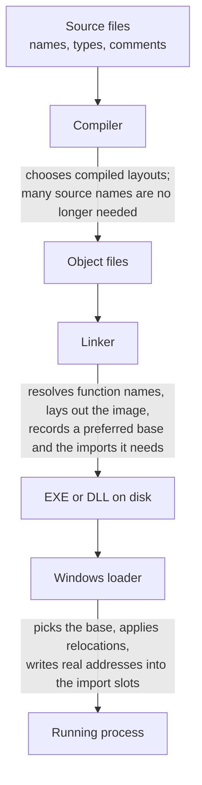

import MemoryStrip from '../../../../components/MemoryStrip.astro';

Lesson 1.8 found a gold address in one running game. After a restart, that
absolute address may move. Yet an instruction's distance from the start
of its module can remain useful for the same build. The compiler's source
name for the gold field may be absent from the released executable too.

These differences come from the stages that turn source into a running
process. Follow those stages and you can ask which facts survive a restart,
which require the exact build, and which must be rediscovered after an
update.

## Four stages, each deciding something different

Each stage keeps what the next stage needs. A release build may omit
information that helped the programmer but is unnecessary for execution.
Debug information can preserve some names separately; we will distinguish
that case below.

## The compiler decides layout, and stops needing your names

The compiler translates source into object code, often stored in `.obj`
files by the Microsoft toolchain used for these Windows C++ examples. Two
of its decisions matter throughout this book.

First, it chooses a compiled layout according to the language's rules.
For an example player structure, it may insert the padding Lesson 3.3
describes and put health 48 bytes into the object. The emitted instruction
can then use `[ecx+0x30]`, the base address plus 48 bytes, without naming
health.

Second, the machine instruction no longer needs the word `health`. The
name helped the programmer refer to the field; the instruction uses its
distance from the object base. A normal release executable often omits
local and field names, though debug information can preserve them. A
missing name is not evidence that it was encrypted or hidden.

Function names survive slightly longer, because the linker still has work to do
with them.

## The linker resolves names, then it does not need them either

Your game is many object files plus libraries, and one file's call to a function
defined in another may still be an unresolved reference. The **linker** matches
references to definitions it has, lays the sections out into the final image,
and records the references that a loader must finish later. A call to an
internal game function can be resolved here; a call into a DLL still needs the
DLL's address at run time.

After that, many internal names have served their purpose. Debug
information can be kept — the Microsoft toolchain often puts it in a
separate `.pdb` file — but the EXE does not need it to run. Imports and
exports can still carry names in the executable; the next section shows
why an imported function name may remain.

This explains why a debugger may show an imported Windows function's name
but only a numeric address for an internal game function. A binary without
debug symbols is not necessarily obfuscated; it may simply lack source
names that execution does not require.

## Two things the linker deliberately leaves unfinished

Not everything can be decided at build time, and the two exceptions are exactly
the ones later chapters spend time on.

**Where the module will be.** The linker does not know which address Windows
will choose, so it records a preferred base and includes a table of every
location that would need adjusting if a different base is used. That is why
Lesson 2.8 can promise that offsets within a module stay fixed while the base
moves: the image is laid out as one block, and the loader relocates the block.

**Where the DLL functions will be.** The linker knows the game calls
`MessageBoxW` in `user32.dll`, but not the address, which will not exist until
the DLL is mapped. So it writes down the requirement — which DLL, which
function — and leaves a table of slots for the loader to fill with real
addresses. That table is the Import Address Table:

<MemoryStrip
  column
  cells="on disk=a reference to the name MessageBoxW in user32.dll|in memory=the address of MessageBoxW, written by the loader"
  marks="1"
  caption="One Import Address Table slot. The game's code calls through the slot, so the call works only once the loader has written the real address there."
/>

Lesson 8.4 hooks a program's own copy of this table — a technique that works
precisely because the linker left the address for someone else to fill in.

## The loader turns a file into a process

The loader maps the sections into memory with the right permissions, applies
those relocations if it picked a different base, fills in the import table,
prepares thread-local storage, and runs the initialisation code. Chapter 11
follows this in detail, because it is also the sequence that makes `DllMain`
such a constrained place to work.

Now the two layouts of Lesson 7.1 make sense as what they are: the same content
arranged for storage on disk and arranged for execution in memory, by two
different stages with different requirements.

### Follow one location across two runs

Suppose the linker placed an instruction `0x1350` bytes from the beginning of
the game's module. In one run, Windows loads that module at `0x00400000`; in
another, it loads it at `0x00600000`. The instruction did not move *within the
module*, even though its absolute address changed:

| Run | Module base | Instruction offset | Instruction address |
|---|---:|---:|---:|
| first | `0x00400000` | `0x1350` | `0x00401350` |
| second | `0x00600000` | `0x1350` | `0x00601350` |

The same distinction applies inside an object, but the starting point is
different. If the compiler put `health` at `+0x30` within a player object,
and that object begins at `0x01A2B000` in the first run, its health field is at
`0x01A2B030`. A newly created player at `0x0208C000` puts the same field at
`0x0208C030`. The module offset measures from the **loaded module**; the field
offset measures from **that particular object**. Neither offset alone is a
complete address. Later pointer work uses this distinction every time it adds
an offset to a base address.

## What this predicts about updates

The practical payoff is knowing which kinds of location survive a new game
version.

| What you found | Safe to reuse? | Why |
|---|---|---|
| A raw address from one run | No reliable reuse after a restart | The module or object may have a different base |
| An offset from the module base | Usually after a restart of the same build | The linker fixed its place within that image |
| A field offset like `+0x30` | Usually for objects of that type in the same build | The compiler chose the layout |
| A byte pattern | Verify it in each build | Compilation or linking can change its bytes |
| "Health is 48 bytes in" | Recheck after a rebuild | A new field earlier in the structure may shift it |

That last row is the one Lesson 13.6 turns into a migration procedure. In
this fixed-order example, inserting a field moves the later fields and
leaves the earlier ones in place. Other layout rules can change more, so
measure the new build rather than assuming the same shift everywhere:

<MemoryStrip
  cells="+0x00=id|+0x04=health|+0x08=max_health|+0x0C=gold"
  caption="The player structure in one build."
/>

<MemoryStrip
  cells="+0x00=id|+0x04=armor|+0x08=health|+0x0C=max_health|+0x10=gold"
  marks="1"
  groups="2-4:each moved 4 bytes later"
  caption="The next build adds `armor`. `id` keeps its offset; every field after the new one moves."
/>

## Optimization is why the code does not match the source

One more consequence, and it explains a lot of confusing disassembly. An
optimising build is allowed to produce anything that behaves the same. It can
paste a small function into each of its callers so no call remains, keep a
variable only in a register so it never touches memory, drop a variable whose
result is never used, reorder work, and merge two identical functions.

So when a function you expected is missing, the usual explanation is not that
it was hidden. It is that the compiler decided the fastest way to do that work
did not involve a separate function. This is also why a debug build and a
release build of the same source can be so different to read, and why an
address or offset belongs to the exact build it came from.

## Checkpoint

You should now be able to explain:

- which stage decides a structure's field offsets, and when;
- why many source names may be absent from a release binary while import
  names or separate debug information can remain;
- what the linker leaves unfinished, and which chapter exploits each gap;
- why a module-relative offset can survive a restart even when a raw address
  changes;
- why an inserted field moves some offsets and leaves others alone;
- why an optimised build may contain no trace of a function in the source.

[Lesson 1.10](/pages/1/10/) now follows the other side of the question:
whether a game's rule comes from executable code, a data file, or a script.
