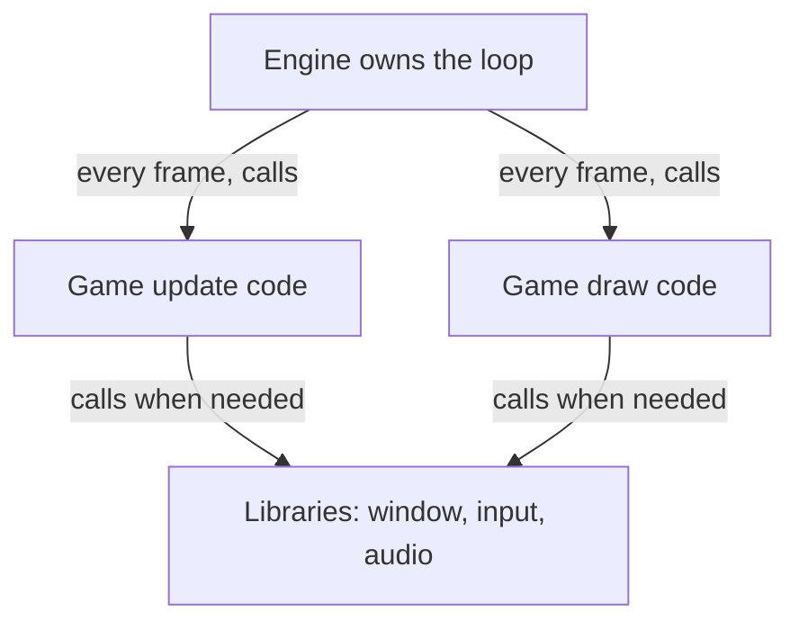
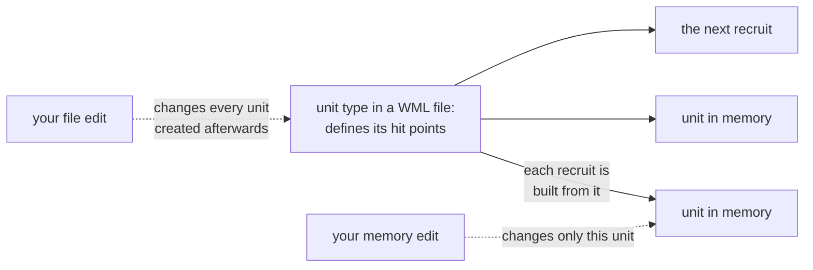

This book keeps saying "the engine." The engine loads the level, the engine owns
the object, the engine calls the renderer. It is time to say exactly what that
word means, because knowing where the engine stops and the game begins tells you
which technique in this book will work on a given problem.

## An engine is the part every game needs

Every game, whatever it is about, needs the same basic machinery:

- a **game loop** that reads input, updates the world, and draws a frame, over
  and over (Lesson 1.4);
- a renderer that turns the world into pixels;
- a way to load art, sound, levels, and settings from disk;
- a model of the world: what objects exist, where they are, what they hold;
- collision, so objects cannot walk through walls;
- sound, input, menus, and often networking and scripting.

Writing all of that from nothing is years of work, and most of it looks the same
whether the game is about tanks or farming. So it gets written once and reused.

A **game engine** is that reusable machinery: the software that runs the loop,
draws the frames, loads the files, and manages the objects, on which a
particular game's content and rules are built.

A spreadsheet program is a useful comparison, because it holds up when you push
on it. The program supplies the grid, the formulas, and the recalculation; each
spreadsheet file supplies its own numbers and formulas. A bug in how the program
recalculates breaks every spreadsheet you open. A wrong formula in one file
breaks only that file. And two files made in the same program share the same
structure, so once you understand one, the next is easier to read. All three
statements hold for engines and games too, which is exactly what makes the split
worth learning.

## Who calls whom

Games also use **libraries**, and the difference between a library and an
engine is precise: it comes down to who calls whom.

Your code calls a library. SDL, for example, is a library that Wesnoth's engine
uses to open a window, read the keyboard, and play sound. It has no idea what a
unit or a map is; it waits to be asked.

An engine calls *your* code. It owns the loop, and on every frame it calls the
game's update and draw functions at the moments it chooses. The game is a guest
in a loop the engine runs. In the words of Lesson 1.5, the game's update and
draw functions are callbacks: the game hands them over, and the engine decides
when they run.

Outside games, software that works this way is called a **framework**. A web
framework owns the loop that waits for requests and calls the handler you
registered for each address, so the same question — who calls whom — sorts
those tools too.

This matters later in a very practical way. The engine's once-per-frame calls
are reliable meeting points: they happen every frame, in a known order, whatever
the game is doing. That is why Lesson 5.10 hooks `Present` — the engine calls it
once per frame to show the finished picture, so it is the natural place to
observe every frame.

## The five course games, sorted by engine

The games in this book cover most of the ways a game can relate to its engine:

| Game | Engine | Where most of its rules live |
|---|---|---|
| Wesnoth 1.14.9 | its own engine, written for this game | C++ engine code, WML data files, Lua scripts |
| AssaultCube 1.2.0.2 | Cube, an open-source engine | C++ engine code |
| Urban Terror 4.3.4 | ioquake3, the continuation of the open-sourced Quake III engine | C++ engine code |
| Flare 1.12 | Flare, an engine built to run content packages | text data files |
| Wyrmsun 5.0.1 | Wyrmgus, a fork of the Stratagus strategy engine | Lua scripts and data |

Flare shows the split most clearly. Flare is the engine; a campaign such as the
Empyrean Campaign from Lesson 9.2 is a content package the engine loads. Swap the
content package and the same executable runs a different game.

## Where a rule lives decides how you change it

Here is the most useful thing to take from this lesson. Every rule in a game
lives in one of a few places, and the place decides which part of this book
applies — and how long your change lasts.

Wesnoth shows two of them side by side:

- **Gold during a match** is a number in memory, updated by native engine code.
  Change it with the scan from Lesson 1.8 and it changes for this match. Start a
  new match and it begins from the scenario's starting gold again.
- **A unit's hit points** come from a unit definition in a WML data file. Change
  one unit's hit points in memory and that single unit changes. Recruit another
  of the same type and it arrives with the file's value, because every new unit
  is built from the definition on disk. Change the file instead, and every unit
  of that type created afterwards has the new value.

Neither change is wrong. They answer different questions, and knowing which one
you are making saves an afternoon of wondering why a change "didn't stick."

| Where the rule lives | What you change | Where this book covers it |
|---|---|---|
| a data file | the file, before the game loads it | Chapter 9 |
| a script | the script, or what the host lets it do | Chapter 12 |
| native engine code | values in memory, or the instructions themselves | Chapters 2, 3, 7, and 8 |
| managed code, such as C# in Unity | often readable by decompiling it | Lesson 10.9 |

The data-file row deserves special attention. When a rule lives in a file the
game was designed to load, editing that file is the supported route: nothing is
patched, nothing breaks on the next update, and the change is easy to undo.
Chapter 9 opens with exactly this point.

## Engines leave their own tools in the game

Engines are built by developers who need to debug them, and many ship with those
debugging tools still inside.

You have already met some. Lesson 5.2 uses Urban Terror's **console variables**
— named settings the engine exposes — to switch entity drawing on and off.
Lessons 5.5 and 5.6 open AssaultCube's console with `~` and use commands such as
`idlebots 1`, `dbgpos 1`, and `showstats 1` to freeze the bots and print
positions on screen.

Those tools are gifts. A console variable that toggles a feature gives you a
clean experiment: flip it, and whatever changes in memory is connected to that
feature. A debug command that prints your position tells you what value to scan
for. Check what the engine already offers before reaching for a debugger.

## Recognizing an engine outside this book

Most commercial games are built on a small number of large engines. Three you
will meet often:

- **Unity** — game logic is usually written in C#, which changes how you find
  data, as Lesson 10.9 explains;
- **Unreal** — C++ engine code, with a visual scripting system called
  Blueprints;
- **Godot** — an open-source engine whose games are scripted in its own
  GDScript language or in C#.

Games built on the same engine share code, so they often share object layouts,
naming patterns, and file formats. What you learn about one game frequently
carries over to the next game on that engine.

Lesson 10.9 shows how to tell which engine a game uses from the files beside its
executable. Do that first. It takes a minute, and it tells you which of the rows
in the table above you are dealing with.

## Checkpoint

You should now be able to explain:

- what a game engine provides, and what the game itself adds;
- the difference between a library and an engine, in terms of who calls whom;
- which engine each course game is built on;
- why a memory edit and a data-file edit to the same rule last for different
  lengths of time;
- which chapter of this book to reach for when a rule lives in data, a script,
  native code, or managed code;
- why an engine's console or debug commands make good anchors for experiments.
