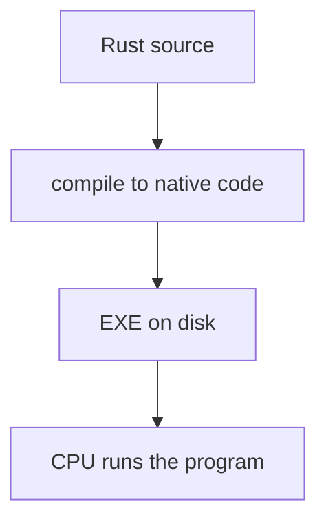
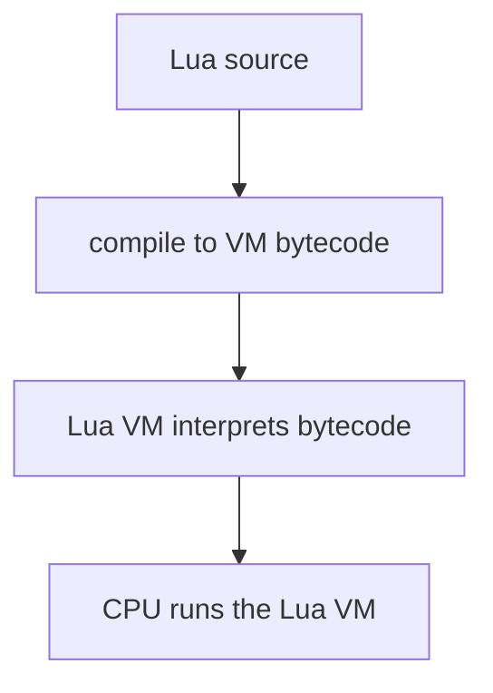

import { CodeGroup, Example, HoverCard, Tab } from '../../../../components/kit';
import MemoryStrip from '../../../../components/MemoryStrip.astro';
import Scene from '../../../../components/Scene.astro';
import MarginNote from '../../../../components/kit/MarginNote.astro';

The debugger shows instructions and addresses, while the programmer wrote
functions, fields, and variable names. Why are those two views different?
And why can an address found by a memory scan move after a restart even
though the game still applies the same rule?

These differences come from the stages that turn source into a running
process. First, distinguish several ways a language implementation can
run code. Then we can follow the native executable used in the Windows
memory labs and see which facts survive a restart, which require the
exact build, and which must be rediscovered after an update.

## Source code can take different routes to execution

**Source code** is the text a programmer edits. A CPU eventually executes
machine instructions, but the source does not always become a standalone
machine-code file first. Two routes used in this book are:

**Rust application:** source becomes native code before the program runs.


```mermaid
flowchart TD
    Rust["Rust source"] --> Native["compile to native code"]
    Native --> Exe["EXE on disk"]
    Exe --> CPU["CPU runs the program"]
```

**Lua script:** source becomes instructions for the Lua virtual machine
when a game loads the script.


```mermaid
flowchart TD
    Lua["Lua source"] --> VMCode["compile to VM bytecode"]
    VMCode --> VM["Lua VM interprets bytecode"]
    VM --> CPU["CPU runs the Lua VM"]
```

**Compilation** translates code from one representation to another. The
Rust route above compiles ahead of time to native instructions for a
particular target. A **virtual machine** is a program that understands its
own instruction set. Its **bytecode** is instructions for that virtual
machine, not the x86 instructions a debugger shows for the CPU. Lua also
compiles when it loads a source chunk; its virtual machine then
**interprets** the resulting bytecode by carrying out those instructions.
This is why “compiled” and “interpreted” are not mutually exclusive labels.
The [Lua reference manual](https://www.lua.org/manual/5.4/manual.html#3.3.2)
describes this load-and-execute sequence. [Lesson 10.1](/pages/12/01/)
shows what changes when a game embeds a Lua interpreter.

A **REPL** is a way to interact with a language tool: **read** a line,
**evaluate** it, **print** the answer, then **loop** for another line.
For instance, an interactive Lua session can evaluate `2 + 3` and show
`5` immediately. A file can contain the same calculation and be run later.
REPL describes the interaction, not whether the tool uses bytecode,
native compilation, or dynamic typing. The [Lua interpreter
manual](https://www.lua.org/manual/5.4/lua.html) describes both interactive
and file-based use.

## Type checking answers a different question

The route to execution is separate from **when a type mismatch is
detected**. The same job, giving one variable a number and then text, goes
differently in each language:

<CodeGroup sync="language">
<Tab label="Rust: statically typed">

Rust is **statically typed**: every value has a type known to the compiler,
often inferred without an explicit annotation. This fragment fails to compile,
because one variable cannot hold both a `u32` number and a string:

```rust
let mut score: u32 = 7;
score = "seven"; // rejected by the compiler
```

</Tab>
<Tab label="Lua: dynamically typed">

Lua is **dynamically typed**: values have types, and a variable can refer to
a number at one moment and text at another. This code can make both
assignments, but its final arithmetic operation fails when run:

```lua
score = 7
score = "seven"
print(score + 1) -- error: text cannot be used as this number
```

</Tab>
</CodeGroup>

The difference is about where that particular mistake is caught. Rust
can still have run-time errors, and Lua catches some mistakes, such as
malformed syntax, while loading code. Neither typing style alone tells
you whether code is compiled to native instructions, compiled to
bytecode, or entered through a REPL. The [Rust data-types
chapter](https://doc.rust-lang.org/book/ch03-02-data-types.html) and the
[Lua reference manual](https://www.lua.org/manual/5.4/manual.html#2.1)
give the language-specific rules.

The rest of this lesson follows the **native executable** route used for
Rust tools and the Windows game builds in the early memory labs. Lua's
virtual-machine route returns when we study scripting.

## Four stages, each deciding something different

A Windows **EXE** is an executable file for a program. A **DLL** (dynamic-link
library) is compiled code that a running program can load and call. Once
loaded, either one is a **module** with a starting address and a range of
code and data in the process.

<Scene name="source-to-process" />

Each stage keeps what the next stage needs. A release build may omit
information that helped the programmer but is unnecessary for execution.
Debug information can preserve some names separately; we will distinguish
that case below.

## The compiler decides layout, and stops needing your names

The compiler translates source into object code, often stored in `.obj`
files by the Microsoft toolchain used for these Windows C++ examples. Two
of its decisions matter throughout this book.

First, it chooses a compiled layout according to the language's rules.
For an example player structure, it may leave unused bytes between fields
<HoverCard kind="example" body="In a C or C++ structure, a one-byte field followed by a four-byte field normally puts the second at offset 4, so the 3 bytes between them are padding: 1 + 3 = 4.">so each field starts at an address suited to its type</HoverCard>. Those gaps are
**padding**, explored in the later [object-layout lesson](/pages/3/03/).
If health begins 48 bytes into the object, an instruction can identify it
by that distance rather than its name. A debugger may write this as
`[ecx+0x30]`: read at the address held in the `ecx` register, plus hexadecimal
`0x30`, which is decimal 48. The assembly lesson explains this notation in
detail; here it shows why a compiled field can survive without the word
`health`.

Second, the machine instruction no longer needs the word `health`. The
name helped the programmer refer to the field; the instruction uses its
distance from the object base. A normal release executable often omits
local and field names, though debug information can preserve them. A
missing name is not evidence that it was encrypted or hidden.

<MarginNote kind="brief">A compiled game keeps distances, not names. A missing name usually means the program never needed it to run.</MarginNote>

Function names survive slightly longer, because the linker still has work to do
with them.

## The linker resolves names, then it does not need them either

Your game is many object files plus libraries, and one file's call to a function
defined in another may still be an unresolved reference. The **linker** matches
references to definitions it has, lays the sections out into the final image,
and records the references that a loader must finish later. A call to an
internal game function can be resolved here; a call into a DLL still needs the
DLL's address at run time.

After that, many internal names have served their purpose. Debug
information can be kept — the Microsoft toolchain often puts it in a
separate `.pdb` file — but the EXE does not need it to run. Imports and
exports can still carry names in the executable; the next section shows
why an imported function name may remain.

This explains why a debugger may show an imported Windows function's name
but only a numeric address for an internal game function. A binary without
debug symbols is not necessarily obfuscated; it may simply lack source
names that execution does not require.

## Two things the linker deliberately leaves unfinished

Not everything can be decided at build time, and the two exceptions are exactly
the ones later chapters spend time on.

**Where the module will be.** The linker does not know which address Windows
will choose, so it records a preferred base and includes a table of every
location that would need adjusting if a different base is used. An offset
measures a distance from the beginning of that module. The later
[address-movement lesson](/pages/2/08/) uses the distinction: for the same
build, that distance can stay fixed while the loader chooses a different
starting address.

<MarginNote kind="alternative">Picture a street and a house number: the street can be built at a different place each day, but the house stays the same number along it.</MarginNote>

**Where the DLL functions will be.** The linker knows the game calls
`MessageBoxW` in `user32.dll`, but not the address, which will not exist until
the DLL is mapped. So it writes down the requirement — which DLL, which
function — and leaves a table of slots for the loader to fill with real
addresses. That table is the <HoverCard kind="reference" href="https://learn.microsoft.com/en-us/windows/win32/debug/pe-format" body="Microsoft's PE format specification describes the import tables, including the Import Address Table, field by field.">Import Address Table</HoverCard>:

<MemoryStrip
  column
  cells="on disk=a reference to the name MessageBoxW in user32.dll|in memory=the address of MessageBoxW, written by the loader"
  marks="1"
  caption="One Import Address Table slot. The game's code calls through the slot, so the call works only once the loader has written the real address there."
/>

Lesson 6.5 hooks a program's own copy of this table — a technique that works
precisely because the linker left the address for someone else to fill in.

## The loader turns a file into a process

The loader maps the sections into memory with the right permissions, applies
those relocations if it picked a different base, fills in the import table,
prepares **thread-local storage** (data kept separately for each thread), and
runs the initialisation code. The later [loader-boundary lessons](/pages/11/02/)
follow these details. They explain why a DLL's `DllMain` initialisation
function cannot safely perform every task a normal function can.

The [executable-file chapter](/pages/7/01/) will compare the two layouts:
content arranged for storage on disk and content arranged for execution
in memory. The loader is the connection between them; file positions do
not automatically equal positions in the running process.

### Follow one location across two runs

<Example title="One location across two runs">

Suppose the linker placed an instruction `0x1350` bytes from the beginning of
the game's module. In one run, Windows loads that module at `0x00400000`; in
another, it loads it at `0x00600000`. The instruction did not move *within the
module*, even though its absolute address changed:

| Run | Module base | Instruction offset | Instruction address |
|---|---:|---:|---:|
| first | `0x00400000` | `0x1350` | `0x00401350` |
| second | `0x00600000` | `0x1350` | `0x00601350` |

The same distinction applies inside an object, but the starting point is
different. If the compiler put `health` at `+0x30` within a player object,
and that object begins at `0x01A2B000` in the first run, its health field is at
`0x01A2B030`. A newly created player at `0x0208C000` puts the same field at
`0x0208C030`. The module offset measures from the **loaded module**; the field
offset measures from **that particular object**. Neither offset alone is a
complete address. Later pointer work uses this distinction every time it adds
an offset to a base address.

</Example>

## How updates affect locations

The practical payoff is knowing which kinds of location survive a new game
version.

| What you found | Safe to reuse? | Why |
|---|---|---|
| A raw address from one run | No reliable reuse after a restart | The module or object may have a different base |
| An offset from the module base | Usually after a restart of the same build | The linker fixed its place within that image |
| A field offset like `+0x30` | Usually for objects of that type in the same build | The compiler chose the layout |
| A byte pattern | Verify it in each build | Compilation or linking can change its bytes |
| "Health is 48 bytes in" | Recheck after a rebuild | A new field earlier in the structure may shift it |

That last row is the one Lesson 11.4 turns into a migration procedure. In
this fixed-order example, inserting a field moves the later fields and
leaves the earlier ones in place. Other layout rules can change more, so
measure the new build rather than assuming the same shift everywhere:

<MarginNote kind="narration">That is why an old offset note can break after a game patch: one added field is enough to shift every field that follows it.</MarginNote>

<MemoryStrip
  cells="+0x00=id|+0x04=health|+0x08=max_health|+0x0C=gold"
  caption="The player structure in one build."
/>

<MemoryStrip
  cells="+0x00=id|+0x04=armor|+0x08=health|+0x0C=max_health|+0x10=gold"
  marks="1"
  groups="2-4:each moved 4 bytes later"
  caption="The next build adds `armor`. `id` keeps its offset; every field after the new one moves."
/>

## Optimization is why the code does not match the source

One more consequence, and it explains a lot of confusing disassembly. An
optimising build is allowed to produce anything that behaves the same. It can
paste a small function into each of its callers so no call remains, keep a
variable only in a register so it never touches memory, drop a variable whose
result is never used, reorder work, and merge two identical functions.

So when a function you expected is missing, the usual explanation is not that
it was hidden. It is that the compiler decided the fastest way to do that work
did not involve a separate function. This is also why a debug build and a
release build of the same source can be so different to read, and why an
address or offset belongs to the exact build it came from.

## Why the stages matter in a debugger

The compiler chooses field layouts and may remove or transform source
functions. The linker fixes positions within a native image and records
DLL imports; the loader chooses a run-time base and fills in external
addresses. A module-relative offset can therefore survive a restart of
the same build while a raw address changes. Rebuilding after a field
insertion can shift later offsets, so old offsets need rechecking.
Release binaries may omit source names even while import names or
separate debug information remain.

We now know why a debugger can show addresses and transformed operations
instead of the source's original names. [How Assembly Describes a Running
Game](/pages/2/02/) gives those operations a readable vocabulary and follows
a small rule through its comparisons, branches, and arithmetic.
