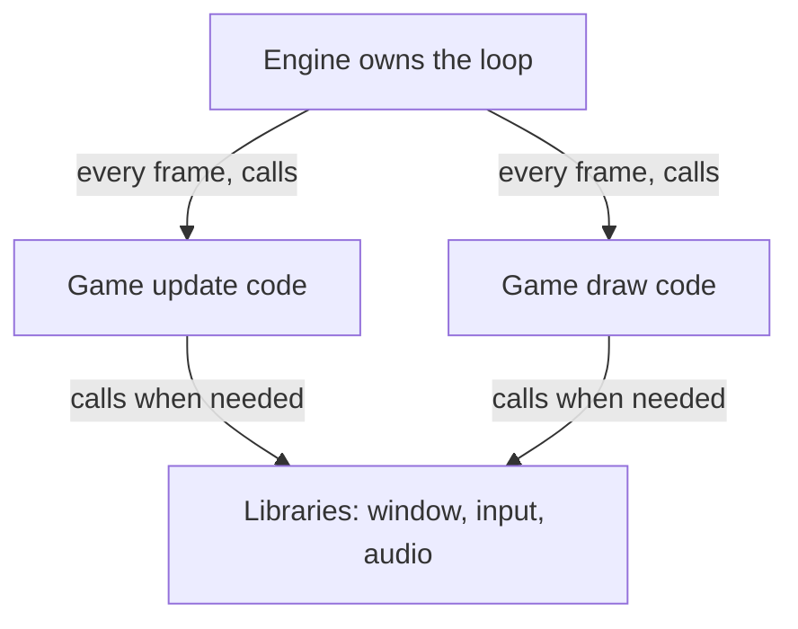
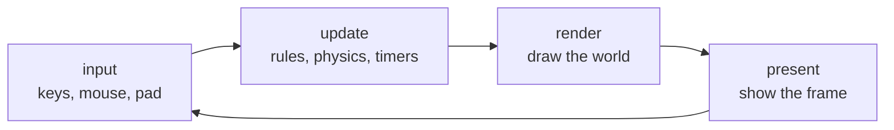
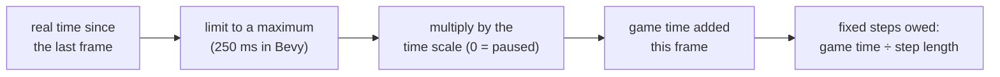
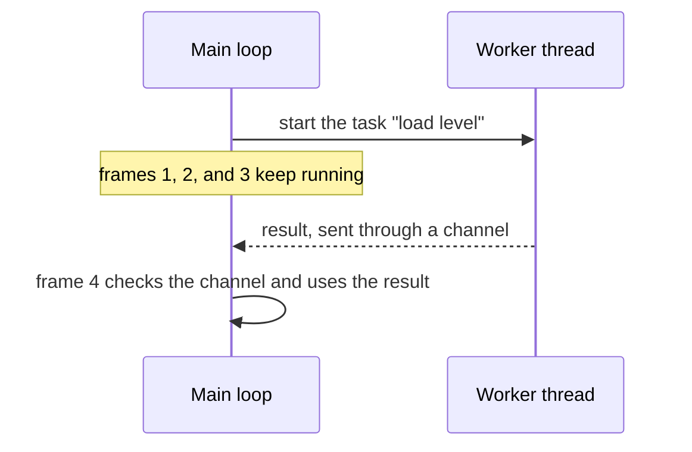
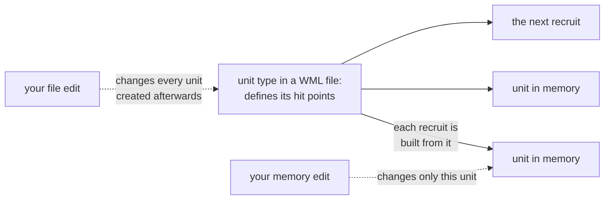

import { CardGrid, Column, Columns, Example, HoverCard, LinkCard, Math, Tooltip } from '../../../../components/kit';

The previous chapters followed values into instructions and turned remote
bytes into typed objects and collections. The next question is larger:
which system owns those objects, applies the rules, and updates the world?
A rule could come from native code, a script, or loaded game data. To choose
where to observe or change it, first separate the game's particular rules
from the machinery that runs them.

The game loop reads input, applies rules, changes state, and draws the
result. Games need other machinery too: something loads the level, stores
objects, and calls the renderer. A **game engine** supplies much of this
reusable machinery. Knowing where it stops and the game begins tells you
which technique in this book will work on a given problem.

## An engine is reusable game machinery

Many games need the same kinds of machinery, even when their rules and art are
different:

- a **game loop** that reads input, updates the world, and draws a frame, over
  and over (Lesson 1.3);
- a renderer that turns the world into pixels;
- a way to load art, sound, levels, and settings from disk;
- a model of the world: what objects exist, where they are, what they hold;
- collision, when objects can meet walls or one another;
- sound, input, menus, and sometimes networking and scripting.

Not every game needs every item: a text adventure may have no renderer or
collision system. For games that do need these pieces, reusing them can save
substantial work. A game about tanks and a game about farming can share the
machinery while supplying different rules and content.

A **game engine** is that reusable machinery: the software that runs the loop,
draws the frames, loads the files, and manages the objects, on which a
particular game's content and rules are built.

A spreadsheet program is a useful comparison, because it holds up when you push
on it. The program supplies the grid, the formulas, and the recalculation; each
spreadsheet file supplies its own numbers and formulas. A bug in how the program
recalculates breaks every spreadsheet you open. A wrong formula in one file
breaks only that file. And two files made in the same program share the same
structure, so once you understand one, the next is easier to read. All three
statements hold for engines and games too, which is exactly what makes the split
worth learning.

## Who calls whom

Games also use **libraries**. A useful first distinction is who controls the
main loop and calls whose code.

Your code calls a library. SDL, for example, is a library that Wesnoth's engine
uses to open a window, read the keyboard, and play sound. It has no idea what a
unit or a map is; it waits to be asked.

An engine often calls *your* code. It may own the loop and call the game's
update and draw functions at the moments it chooses. The game is a guest in a
loop the engine runs. Those update and draw functions are
**callbacks**: the game hands them to the engine, and the engine decides
when to run them.

This is a way to reason about control flow, not a rigid test for what a project
may call an engine. Engine code can call libraries, and game code can call
engine functions too.

Outside games, software that works this way is called a **framework**. A web
framework owns the loop that waits for requests and calls the handler you
registered for each address, so the same question — who calls whom — sorts
those tools too.



This matters later in a practical way. A repeated call near frame presentation
can be a useful meeting point when you verify that the game actually reaches it.
That is why Lesson 7.10 hooks `Present`: this game's rendering path calls it to
show finished frames, making it a good place to observe them.

## Starting up: plugins and settings

Before the first frame, the application starts up. It reads its **settings** from a file,
such as the resolution, the volume, and the key bindings. It creates the window, and it
sets up each part of the engine. Engines package those parts as **plugins**. A plugin is
a module that registers what it needs, such as its systems and the event types it uses,
with the application when it is added, and a **plugin group** adds several together, such
as the window, the input, the renderer, and the audio. The game itself is then a small
plugin of its own, and swapping one plugin, say for a different renderer, changes one part
without touching the rest. Changed settings are written back to the file, so they persist
the way a save does (Chapter 9).

## One frame, step by step

An engine that owns the loop does the same few jobs on every pass through it, in
the same order:

1. **Gather input.** Ask the operating system which keys, buttons, and mouse
   movements happened since the last pass, and turn them into actions
   (Lesson 1.3).
2. **Update the world.** Run the game's rules: move things, check contacts, count
   timers down, let characters decide.
3. **Draw.** Build the picture of the world as it is now.
4. **Present.** Hand the finished picture to the display, and, with vertical
   sync on, wait for the display's next refresh.



Frame time and frame rate are reciprocals of each other:

<Math block tex="t_{\text{frame}} = \frac{1000}{\text{fps}}\ \text{ms}" speak="the frame time in milliseconds equals one thousand divided by the frames per second" />

A display that refreshes 60 times each second takes a new picture every
1 ÷ 60 = 0.01667 seconds, which is 16.67 milliseconds. All four jobs must fit in
that **frame budget**, or the display refreshes before the new picture is ready
and shows the old one again. A frame that takes 25 ms gives 1 ÷ 0.025 = 40 frames
per second; one that takes 8.33 ms gives 120. This is why tools report **frame
time**, in milliseconds, as well as frames per second. Frame times add up, so a
4 ms update plus a 10 ms draw is a 14 ms frame, but frame rates do not add.

### Time inside the update

Lesson 1.3 showed that movement needs elapsed time: distance = speed × time. An
engine measures the **delta time**, the seconds since the previous frame, and
hands it to every update. Physics prefers steady steps, though. If one frame
moves a fast ball 3 pixels and the next moves it 30, a contact test that looks
only at positions can jump the ball clean over a wall 10 pixels thick. So many
engines run physics in a **fixed timestep**, such as 1/60 second, and carry the
leftover real time into the next frame:

<Example title="Three frames of fixed steps">

| Frame | Real time since the last frame (ms) | Time waiting to be simulated (ms) | Fixed steps run (16.67 ms each) | Left over (ms) |
|---|---|---|---|---|
| 1 | 20.00 | 0 + 20.00 = 20.00 | 1 | 20.00 − 16.67 = 3.33 |
| 2 | 20.00 | 3.33 + 20.00 = 23.33 | 1 | 23.33 − 16.67 = 6.67 |
| 3 | 30.00 | 6.67 + 30.00 = 36.67 | 2 | 36.67 − 33.33 = 3.33 |

After 70 ms of real time the game has run 4 steps, which is 4 × 16.67 = 66.67 ms
of game time, and 3.33 ms is waiting. The two add back to 70 ms, so no time was
lost. A slow frame runs several steps to catch up, and a quick one runs none.

</Example>

What is drawn after a frame is usually partway between two steps. The 3.33 ms
left over is 3.33 ÷ 16.67 = 20% of the way to the next step, and many engines
blend the last two steps by that fraction, so motion looks smooth even though
the rules advance in coarse steps (Lesson 4.7 shows how that blend is computed).

This tells you something when you scan memory. A value the rules change moves
once per step, and a value the drawing code keeps (an on-screen animation timer,
an interpolated position) can change once per frame. Counting how often a value
changes tells you which loop owns it.

A **cooldown** is a timer built the same way. When an ability is used, the game
stores how long remains, say 5.0 seconds, and subtracts the delta time on every
step: after 60 steps of 1/60 second the value has fallen by 1.0 to 4.0, and after
300 steps it reaches 0 and the ability is ready. Some games instead store the
moment it becomes ready (now + 5.0) and compare it with the clock. Either way the
cooldown is a number in memory that you can scan for.

### Real time, game time, and the clamp

The delta time an update receives is not always the time that really passed. Engines
keep two clocks. **Real time** is the <Tooltip tip="The time a clock on a wall shows. It keeps running whatever the game does, so pausing the game cannot stop it.">wall clock</Tooltip>: it never stops, and a loading
spinner or a menu animation uses it. **Game time** is what the rules use. Each frame
the engine takes the real time since the last frame, limits it to a maximum, and
multiplies it by a **time scale**:

<Math block tex="\Delta_{\text{game}} = \min(\Delta_{\text{real}},\ \Delta_{\max}) \times s" speak="the game delta equals the smaller of the real delta and the maximum delta, times the time scale s" />

A scale of 1 is normal speed, 0.5 is slow motion, 2 is fast forward, and 0 is a
pause. A pause stops game time but not real time, which is why a paused game still
draws its menu and answers the mouse. The scale also stretches every timer that
counts game time:

<Example title="One 16.67 ms frame at four time scales">

| Time scale | Game time added by the frame | A 5.0 s cooldown ends after |
|---|---|---|
| 1 (normal) | 16.67 ms | 5.0 ÷ 1 = 5.0 s of real time |
| 0.5 (slow motion) | 16.67 × 0.5 = 8.33 ms | 5.0 ÷ 0.5 = 10.0 s |
| 2 (fast forward) | 16.67 × 2 = 33.33 ms | 5.0 ÷ 2 = 2.5 s |
| 0 (paused) | 0 ms | never, while paused |

</Example>

The limit protects the rules from a frame that stalled. A laptop that sleeps, or a
window held still by the mouse for 3 seconds, would otherwise hand the next update a
delta of 3.0 s. A ball moving 150 pixels a second would jump 150 × 3.0 = 450 pixels
at once, straight through any wall, and a fixed-step loop would owe 3.0 ÷ (1/60) =
180 steps. Bevy's default limit is 250 ms, so the longest delta any frame can add is
0.25 s, and at 60 steps a second the loop owes at most 0.25 ÷ (1/60) = 15 steps.



The limit also ends a failure called the **spiral of death**. Suppose each fixed step
takes 20 ms of real time to compute but advances game time by only 16.67 ms. While
the engine computes one step, the real clock moves 20 ms, so the next frame owes
20 ms of game time, which is 20 ÷ 16.67 = 1.2 times as much as the step paid off.
The frame after that owes 1.2 times as much again. Each step leaves the game
20 − 16.67 = 3.33 ms further behind real time, so after 60 steps it is 60 × 3.33 =
200 ms behind, and running more steps to catch up only adds more debt. The clamp
throws the excess away, so the game falls behind real time and runs in slow motion
instead of freezing.

Scanning memory is easier with this in mind. A game's elapsed time may exist twice:
one value that always rises, and one that stops during a pause. A cooldown that
compares itself with the second pauses with the game, and one that compares itself
with the first keeps running behind the pause menu.

### Slow work leaves the frame

Reading a 3 MB file can take 30 ms. If the update waited for it, the game would
miss 30 ÷ 16.67 = 1.8, so two, refreshes. Engines give slow jobs, such as loading
files, decoding sound, or planning a path across a big map, to **worker
threads** (Lesson 11.8) as **tasks**. The main loop starts a task and keeps
running frames. When the task finishes, it sends its result through a
**channel**, a queue that one thread fills and another empties, and the main loop
checks the channel once per frame.



The result arrives on a frame nobody can predict, so the game has to handle
"not ready yet" with a loading screen or a stand-in. Lesson 4.11 uses the same
channel to move records from a game to a recorder without stalling it.

### Measuring the frame

Engines measure themselves. A **diagnostic** is a named measurement with a short
history, such as frame time over the last 120 frames, that can be switched on and
off while the game runs. An **FPS overlay** draws such numbers on the screen. A
**log** records events as lines of text, each with a severity such as error,
warning, info, or debug, to a console or a file.

An average can hide a stutter. Four frames of 16, 16, 16, and 66 ms average
(16 + 16 + 16 + 66) ÷ 4 = 28.5 ms, or 1000 ÷ 28.5 = 35 frames per second, even
though three frames in four were fine. The 66 ms frame is the one a player feels,
so a good diagnostic also reports the slowest frame.

The build changes the measurement as much as the code does. A **debug build** leaves
out most optimizations so that mistakes are easier to find, and engine code that loops
over thousands of entities can run many times slower in it than in a **release
build**. Suppose a system takes 0.4 ms in a release build and 12 ms in a debug build.
That is 12 ÷ 0.4 = 30 times slower, and 12 ms alone is 12 ÷ 16.67 = 72% of the frame
budget. A frame time means little until you know which kind of build produced it.

## Entities, components, and systems

Lesson 1.3 gave things identities, and Lesson 3.6 showed an engine keeping each
kind of field in its own collection. Many engines make that the whole design. In an
**entity component system** (ECS):

- an **entity** is only an identity, a number (with a generation, so a reused
  number is told apart from the old one, as Lesson 3.6 explained);
- a **component** is a plain bundle of data attached to an entity, such as
  `Position`, `Velocity`, or `Health`;
- a **system** is a function that runs on every update for all the entities that
  have a particular set of components.

A movement system says: for every entity with both `Position` and `Velocity`, add
velocity × delta time to position. A wall has a `Position` but no `Velocity`, so
the movement system never touches it, and nobody wrote an "if wall" test. What an
entity does comes from which components it has, not from what kind of object it
is.

| Entity | Components | Movement system | Collision system | Draw system |
|---|---|---|---|---|
| tank | Position, Velocity, Size, Sprite | runs | runs | runs |
| wall | Position, Size, Sprite | skips | runs | runs |
| coin | Position, Size, Sprite, Pickup | skips | runs | runs |
| hidden trigger | Position, Size | skips | runs | skips |

In memory, each kind of component sits in its own run. Ten thousand `Position`
components of two 4-byte floats each take 10,000 × 8 = 80,000 bytes in one
stretch, which is what Lesson 3.6 called a component pool. A system walks that
stretch from start to end, and a scan finds the whole run at once.

Engines add a few rules around this:

- A system should not add or remove entities while it is looping over them, or the
  loop could skip some and visit others twice. Instead it queues **commands**
  (spawn this, despawn that, add this component), and the engine applies them
  together at a safe moment between systems. A **delayed command** is one the
  engine holds back until a timer ends, such as removing an effect after 2
  seconds.
- **Disabling** an entity hides it from the systems without deleting it. A marker
  component such as `Disabled` makes the queries skip it. Its identity and data
  stay in memory, so it can come back unchanged. Despawning is different: the
  identity is freed and may be reused.
- An **observer** is code that runs when something happens, such as an entity
  being created, a component being removed, or "coin 42 was collected" (the
  event from Lesson 1.3), instead of checking every frame whether it happened.

Lesson 4.2 follows how systems share data through resources and events, how the
engine decides which system runs first and which can run at the same time, and how
it notices only what changed.

## Scenes: a world you can load

Once the world is made of entities, the engine needs a way to create many of them
at once. A **scene** is a group of entities with their components that can be
created together: a level, a menu screen, or one character with all its parts. A
scene usually lives in a file (a data format, Chapter 9) and is **spawned** at run
time: the engine reads the file, creates the entities, and fills in the
components.

Entities in a scene can form a **hierarchy**. A tank can have a child for its
turret and a grandchild for the gun barrel. A child's position is stored
**relative to its parent**, so moving the tank moves the turret and the barrel
with it, and despawning the tank despawns them too. Lesson 7.1 works out how a
child's position becomes a world position.

Games also organize scenes into **states**: a menu, a loading screen, the match,
the game-over screen. Entering a state spawns its scene, and leaving it despawns
it. A loading screen waits for every file the next scene needs. It counts the
files still loading, and when the count reaches 0 it switches to the match. This
matters when you hunt for addresses: the entities of one scene are freed when the
scene is left, so an address found in one level can mean nothing in the next.

## The five course games, sorted by engine

The games in this book cover most of the ways a game can relate to its engine:

| Game | Engine | Where most of its rules live |
|---|---|---|
| Wesnoth 1.14.9 | its own engine, written for this game | C++ engine code, WML data files, Lua scripts |
| AssaultCube 1.2.0.2 | Cube, an open-source engine | C++ engine code |
| Urban Terror 4.3.4 | ioquake3, the continuation of the open-sourced Quake III engine | C++ engine code |
| Flare 1.12 | Flare, an engine built to run content packages | text data files |
| Wyrmsun 5.0.1 | Wyrmgus, a fork of the Stratagus strategy engine | Lua scripts and data |

Flare shows the split most clearly. Flare is the engine; a campaign such as the
Empyrean Campaign from Lesson 9.2 is a content package the engine loads. Swap the
content package and the same executable runs a different game.

## Where a rule lives decides how you change it

Here is the most useful thing to take from this lesson. Every rule in a game
lives in one of a few places, and the place decides which part of this book
applies — and how long your change lasts.

Wesnoth shows two of them side by side:

<Columns cols={2}>
  <Column title="Gold during a match">

  A number in memory, updated by native engine code. Change it with the scan from
  [Lesson 1.9](/pages/1/09/) and it changes for this match. Start a new match and it begins from the
  scenario's starting gold again.

  </Column>
  <Column title="A unit's hit points">

  They come from a unit definition in a WML data file. Change one unit's hit points
  in memory and that single unit changes. Recruit another of the same type and it
  arrives with the file's value, because every new unit is built from the definition
  on disk. Change the file instead, and every unit of that type created afterwards
  has the new value.

  </Column>
</Columns>



Neither change is wrong. They answer different questions, and knowing which one
you are making saves an afternoon of wondering why a change "didn't stick."

| Where the rule lives | What you change | Where this book covers it |
|---|---|---|
| a data file | the file, before the game loads it | Chapter 9 |
| a script | the script, or what the host lets it do | Chapter 10 |
| native engine code | values in memory, or the instructions themselves | Chapters 2, 3, 5, and 6 |
| managed code, such as C# in Unity | often readable by decompiling it | Lesson 11.2 |

The data-file row deserves special attention. When a game exposes a file for
customization, editing it may be the simplest route. Keep a copy of the
original: a game update can still replace a file or change its format. Chapter 9 opens with this decision.

## Engines leave their own tools in the game

Engines are built by developers who need to debug them, and many ship with those
debugging tools still inside.

The rendering lessons will use some of these tools. Lesson 7.2 uses Urban Terror's **console variables**
— named settings the engine exposes — to switch entity drawing on and off.
Lessons 7.5 and 7.6 open AssaultCube's console with `~` and use commands such as
`idlebots 1`, `dbgpos 1`, and `showstats 1` to freeze the bots and print
positions on screen.

Those tools are gifts. A console variable that toggles a feature gives you a
clean experiment: flip it, and whatever changes in memory is connected to that
feature. A debug command that prints your position tells you what value to scan
for. Check what the engine already offers before reaching for a debugger.

### Overlays, gizmos, editors, and stress tests

Other developer tools are drawn by the engine itself:

- A **debug overlay** prints live numbers, such as frame time, on the screen.
- **Debug drawing**, called **gizmos** in some engines, draws shapes for a single
  frame without creating any game object: a line, an arrow, a box around a
  collision shape, the three coloured axes of an object's own directions, a circle
  for a light's reach, a text label. The code calls something like
  `draw_line(a, b, colour)` on every frame, and when it stops calling, the shape
  is gone. An editor's **transform gizmo** is the interactive version: three
  arrows you drag to move, turn, or scale a selected object. Lesson 7.9 draws the
  same kind of overlay over someone else's game.
- An **editor** lets designers place entities and save scenes, and draws a **grid** on the
  ground so the scale and the position of things can be read. A **viewer** shows
  one kind of data on its own, such as a 3D model or the buttons of a game
  controller, without running the whole game.
- A **stress test** deliberately runs a heavy load, such as ten thousand sprites,
  and watches the frame time to find where the game breaks down. If each sprite
  costs 0.002 ms, 10,000 of them cost 20 ms, which is already over the 16.67 ms
  budget. Lesson 7.3 shows where such costs come from.

## A whole game from these parts: Breakout

The parts fit together in a game small enough to hold in your head. In Breakout, a
paddle at the bottom of the screen bounces a ball upward into rows of bricks.

- **Entities and components.** The paddle has `Position`, `Size`, and
  `PlayerControlled`. The ball has `Position`, `Velocity`, and `Size`. Each of the
  40 bricks has `Position`, `Size`, and `Brick`.
- **Systems, in order, every fixed step.** Read input into the paddle's velocity.
  Move everything that has a `Velocity`. Test the ball against the walls, the
  paddle, and the bricks. A hit brick is despawned by a command and adds 1 to the
  score. If the ball falls below the paddle, switch the game's state to game over.
  After the steps, draw every entity that has a `Position` and a sprite.
- **State.** The score, the bricks left, and the lives are numbers in memory. So
  is the mode: menu, playing, or game over.

<Example title="One step of Breakout">

One step, with real numbers. The ball is at x = 794 with a velocity of 150 pixels
per second to the right, and a step is 1/60 second:

```text
move      = 150 × (1/60) = 2.5 pixels
new x     = 794 + 2.5 = 796.5
ball size = 16 pixels wide, so its right edge is 796.5 + 8 = 804.5
the wall is at x = 800, and 804.5 is past it, so the ball hits the wall
reply     = velocity x becomes −150, and x is moved back to 800 − 8 = 792
```

Nothing in that step names Breakout. It is the movement and contact rules of
Lesson 1.3 run by systems over entities, in the order the engine's loop calls
them.

</Example>

## Where each engine part is explained

This lesson names the parts. The lessons below explain how each one works, and
the small runnable examples of an open-source engine such as
<HoverCard kind="reference" href="https://bevy.org/examples/" body="The example gallery of the Bevy engine: small programs that each show one engine part, such as sprites, lighting, audio, UI, or picking.">Bevy</HoverCard>
show nearly every one in a few dozen lines.

| Engine part | What it does | Explained in |
|---|---|---|
| Application, window | starts the program, opens a window, owns the loop | this lesson; [Windows Input](/pages/8/06/#the-window-itself) |
| Entities, components, scenes | organize the world and load it | this lesson; [Collections](/pages/3/05/) |
| Resources, events, schedules, change detection | how systems share data, in what order they run, and what they skip | [Ordering and Sharing Work](/pages/4/12/) |
| Input | turns key, stick, and mouse events into actions | [How a Game Reads Input](/pages/8/11/); [Windows Input](/pages/8/06/) |
| Math, transforms | positions, directions, turning, blending | [Coordinates and Vectors](/pages/4/11/); [Camera Frames](/pages/5/01/) |
| Camera, picking | what is seen, and what is under the cursor | [Camera Frames](/pages/5/01/); [Camera Rays](/pages/5/05/) |
| 2D and 3D rendering, shaders | turn the world into pixels | [Rendering Pipeline](/pages/5/02/); [Draw Calls](/pages/5/03/) |
| Animation | change a pose over time | [Aim Geometry](/pages/5/06/) |
| Assets, glTF, audio | files the game loads and plays | [Game Files](/pages/9/01/) |
| UI, text | menus and on-screen controls | [Menus and Text](/pages/8/09/) |
| Gizmos, diagnostics, tools | developer views of the running game | this lesson; [Overlays](/pages/5/09/) |

## Recognizing an engine outside this book

Most commercial games are built on a small number of large engines. Three you
will meet often:

- **Unity** — game logic is usually written in C#, which changes how you find
  data, as Lesson 11.2 explains;
- **Unreal** — C++ engine code, with a visual scripting system called
  Blueprints;
- **Godot** — an open-source engine whose games are scripted in its own
  GDScript language or in C#.

Games built on the same engine may share code, naming patterns, and file
formats. Object layouts also depend on the game's code and engine version, so
use a familiar pattern as a clue and verify it in the next game.

Lesson 11.2 shows how to tell which engine a game uses from the files beside its
executable. Do that first. It takes a minute, and it tells you which of the rows
in the table above you are dealing with.

## Where the change belongs

An engine supplies reusable machinery; the game adds its particular
rules and content. A library responds when your code calls it, while an
engine also calls game code at the points it controls. The course games
use different engines, so a rule may live in data, a script, native
code, or managed code. A memory edit lasts for a running process; a
data-file edit can persist when the file is loaded again. Engine
consoles and debug commands expose named state that can help identify
the right layer before changing it.

To describe a match, a tool needs more than one verified field: it needs
the players and values that belong together at one moment. [From One
Player to a Game-State Snapshot](/pages/4/01/) builds that view while keeping
the engine's changing state separate from the tool's local copy.

## Where each engine part is taught in depth

<CardGrid>
  <LinkCard title="How an Engine Orders and Shares Its Work" description="Resources, events, schedules, and change detection." href="/pages/4/12/" />
  <LinkCard title="How a Game Reads Input" description="Edges, dead zones, key layouts, and the mouse." href="/pages/8/11/" />
  <LinkCard title="Camera Frames and Projection" description="Transforms, cameras, and projection." href="/pages/5/01/" />
  <LinkCard title="The Rendering Pipeline and Its State" description="Materials, light, passes, and 2D rendering." href="/pages/5/02/" />
  <LinkCard title="Game Files and Live Memory" description="How a file becomes an asset the game can use." href="/pages/9/01/" />
  <LinkCard title="Windows Input: Polling, Events, and Messages" description="The window, and how input reaches a game." href="/pages/8/06/" />
</CardGrid>
