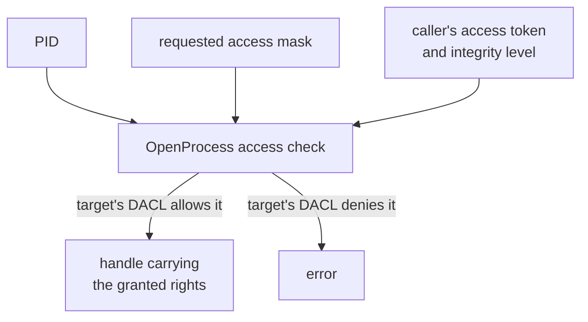

import CodeTrace from '../../../../components/CodeTrace.astro';
import Frame from '../../../../components/kit/Frame.astro';
import SpeedType from '../../../../components/kit/SpeedType.astro';
import { Accordion, Badge, Fields, GitHub, Panel, ParamField, ResponseField, CodeGroup, Tab } from '../../../../components/kit';

import MemoryStrip from '../../../../components/MemoryStrip.astro';
import MarginNote from '../../../../components/kit/MarginNote.astro';

## A PID identifies a process but grants no access

A build hash can tell us which executable we intend to inspect, and a PID can
tell us which running instance to ask about. Neither lets a program read its
memory. Windows makes access a separate decision when it issues a process
handle.

A process ID identifies a running process. It does not grant access to that process. To ask Windows for a usable process **handle**, a program calls `OpenProcess` with an **access mask**: a group of bits describing the operations it wants.

<Frame caption="A PID and a handle answer different questions">
  
</Frame>

<MarginNote kind="alternative">The PID names the building, while the handle is a key issued for particular doors. Finding the address does not provide that key.</MarginNote>

Windows checks whether the caller may obtain those rights to the target process. The call either returns a handle carrying the granted rights or fails with an error:



The handle is not the process itself. It is a Windows-managed reference plus a specific set of permissions.

Think of the PID as the number on a catalogue entry and the handle as a claim
ticket issued for a particular visit. Knowing the number lets you *ask*;
Windows checks the caller and the target before issuing a ticket marked with
the allowed operations. The analogy ends there: a handle is an opaque value
meaningful to Windows in this process, and an API checks its recorded rights,
not a handwritten label. This is why finding the right PID does not rescue a
handle that lacks `PROCESS_VM_READ`.

The call that issues the handle takes three arguments:

<Fields title="OpenProcess, argument by argument">
<ParamField name="dwDesiredAccess" type="access mask" required>

The rights to ask for, as bits ORed together. Ask for the smallest set the job
needs; the table further down lists the rights this course uses.

</ParamField>
<ParamField name="bInheritHandle" type="bool" default="false">

Whether a process this one starts later inherits the handle. The course passes
`false`, so nothing a tool launches quietly receives access.

</ParamField>
<ParamField name="dwProcessId" type="u32" required>

The PID of the target. It names the process and grants nothing by itself.

</ParamField>
<ResponseField name="return value" type="handle, or an error">

A handle carrying the granted rights, or an error such as “access denied” when
Windows refuses the requested access. Close a handle you no longer need.

</ResponseField>
</Fields>

Optional: practise the three-argument call below. For a supplied PID, this
helper asks only for basic process-query access and disables inheritance. A
successful call gives it an owned `HANDLE`, which it immediately closes; an
error returns through `?`. Real inspectors keep an ownership guard when more
fallible work happens between opening and closing. These are the course's
[`windows` 0.62 projected signatures](https://github.com/microsoft/windows-rs/blob/0.62.0/crates/libs/windows/src/Windows/Win32/System/Threading/mod.rs),
with the paired [handle-release contract](https://github.com/microsoft/windows-rs/blob/0.62.0/crates/libs/windows/src/Windows/Win32/Foundation/mod.rs).

<SpeedType id="win32-open-process-contract" title="Recall OpenProcess and its arguments" recall={[{"text": "OpenProcess(PROCESS_QUERY_LIMITED_INFORMATION, false, pid)", "mask": "OpenProcess", "kind": "api", "hint": "Call the documented function that opens the selected process with requested rights."}, {"text": "OpenProcess(PROCESS_QUERY_LIMITED_INFORMATION, false, pid)", "mask": "false", "kind": "argument", "hint": "Disable inheritance so a later child process does not receive this handle."}, {"text": "OpenProcess(PROCESS_QUERY_LIMITED_INFORMATION, false, pid)", "mask": "PROCESS_QUERY_LIMITED_INFORMATION", "kind": "argument", "hint": "Request basic process queries without asking for memory-writing rights."}, {"text": "CloseHandle(handle)", "mask": "CloseHandle", "kind": "api", "hint": "Release the owned process handle when this small helper is finished."}, {"text": "Foundation::{CloseHandle, HANDLE}", "mask": "HANDLE", "kind": "import", "hint": "Import the opaque object-handle type from the Foundation module."}, {"text": "Threading::{OpenProcess, PROCESS_QUERY_LIMITED_INFORMATION}", "mask": "OpenProcess", "kind": "import", "hint": "Import the process-opening API from the Threading module."}, {"text": "let handle: HANDLE", "mask": "HANDLE", "kind": "type", "hint": "Use the binding’s object-handle type for the value returned by the call."}, {"text": "pid: u32", "mask": "u32", "kind": "type", "hint": "Represent the PID as a thirty-two-bit unsigned integer."}, {"text": "Ok(())", "mask": "Ok", "kind": "logic", "hint": "Return the success variant after opening and closing the handle succeeded."}]}>

```rust
use windows::Win32::{
    Foundation::{CloseHandle, HANDLE},
    System::Threading::{OpenProcess, PROCESS_QUERY_LIMITED_INFORMATION},
};

fn probe_query_access(pid: u32) -> windows::core::Result<()> {
    // SAFETY: numeric PID, query-only rights, and inheritance disabled.
    let handle: HANDLE = unsafe { OpenProcess(PROCESS_QUERY_LIMITED_INFORMATION, false, pid) }?;
    // SAFETY: this function owns this valid handle and never uses it again.
    unsafe { CloseHandle(handle) }?;
    Ok(())
}
```

</SpeedType>

## Treat a handle as a capability

A capability combines a reference to an object with authority to perform particular operations. A process handle opened for limited queries can identify the process and ask for its image path, but it cannot become a memory-writing handle because a later function wishes it could.

<MarginNote kind="brief">A process handle carries specific granted operations; knowing the PID cannot expand those permissions.</MarginNote>

That is useful architecture, not just security etiquette. Give read-only observation code a type that owns only a query/read handle. Give patching code a separately created write-capable handle after the user selects an explicit lab action. Then ordinary scanner functions cannot accidentally grow into writers without changing their inputs and call sites.

Rights belong to the handle, not permanently to the PID. Opening the same PID twice with different access masks can produce two handles with different capabilities, and closing one does not close the other.

## The caller has an access token

When you sign in, Windows creates security information describing your account and groups. A process receives an **access token** representing its security context. That token includes identity information, privileges, restrictions, and an integrity level.

An **integrity level** is a boundary used by Windows to limit which processes may influence others. A normal desktop program commonly runs at medium integrity. A program started through an administrator approval may run at high integrity. A lower-integrity caller generally cannot gain powerful access to a higher-integrity target merely because both processes are visible in Task Manager.

An integrity level is not a score for whether software is good or bad. It is one input to an access decision.

## The target has a security descriptor

A process object also has a security descriptor. Its **DACL**—Discretionary Access Control List—describes which trustees may receive which rights. When `OpenProcess` runs, Windows checks the requested rights against this information and the restrictions on protected processes.

This explains a common beginner mistake: “I found the PID, so why did reading memory fail?” Finding and opening are separate steps with different permissions.

The access check happens when Windows creates or duplicates the handle. Afterward, APIs compare their required rights with the rights recorded on that handle. Asking for extra rights up front can make `OpenProcess` fail even when the smaller operation you actually needed would have been allowed.

## Name the right that matches the job

These course tools use several process rights:

<Panel title="Process access rights at a glance">

| Right | What it permits in this course |
|---|---|
| `PROCESS_QUERY_LIMITED_INFORMATION` | Ask for basic information such as the executable path. |
| `PROCESS_QUERY_INFORMATION` | Query information needed by several memory APIs. |
| `PROCESS_VM_READ` | Copy readable bytes from the target with `ReadProcessMemory`. |
| `PROCESS_VM_OPERATION` | Change or allocate virtual-memory regions. |
| `PROCESS_VM_WRITE` | Copy bytes into the target with `WriteProcessMemory`. |

</Panel>

`PROCESS_ALL_ACCESS` is not a convenient “make it work” flag. It requests many unrelated powers and makes failures harder to diagnose.

The original helper asks Windows for every process right just to query an executable path. `OwnedHandle` owns the returned handle, and `query_full_process_image_name` is the path-query helper below.

```rust title="Before: ask for every process right"
fn query_process_path(pid: u32) -> windows::core::Result<PathBuf> {
    // SAFETY: OpenProcess accepts a numeric PID; errors are returned normally.
    let process = unsafe { OpenProcess(PROCESS_ALL_ACCESS, false, pid) }?;
    let process = OwnedHandle::from_raw(process)?;
    query_full_process_image_name(process.raw())
}
```

**Least privilege** means requesting only the capability the next call uses. Windows still checks whether the caller may receive that right.

<CodeGroup>
<Tab label="Improved code">

```rust
fn query_process_path(pid: u32) -> windows::core::Result<PathBuf> {
    // SAFETY: OpenProcess accepts a numeric PID; errors are returned normally.
    let process = unsafe { OpenProcess(PROCESS_QUERY_LIMITED_INFORMATION, false, pid) }?;
    let process = OwnedHandle::from_raw(process)?;
    query_full_process_image_name(process.raw())
}
```

</Tab>
<Tab label="Show the diff">

```diff
 fn query_process_path(pid: u32) -> windows::core::Result<PathBuf> {
     // SAFETY: OpenProcess accepts a numeric PID; errors are returned normally.
-    let process = unsafe { OpenProcess(PROCESS_ALL_ACCESS, false, pid) }?;
+    let process = unsafe { OpenProcess(PROCESS_QUERY_LIMITED_INFORMATION, false, pid) }?;
     let process = OwnedHandle::from_raw(process)?;
     query_full_process_image_name(process.raw())
 }
```

</Tab>
</CodeGroup>

**Takeaway:** match the handle rights to the operation you actually need.

### Why this version?

The small request documents the tool's purpose. If Windows grants it, you know the program did not quietly obtain memory-write, thread-creation, handle-duplication, or termination rights.


<CodeTrace trace="handoff-handle-mask" />

## Build a limited query tool

<Badge text="Windows VM" variant="note" />

This program finds a named process through the shared ToolHelp code, opens it with only `PROCESS_QUERY_LIMITED_INFORMATION`, and asks Windows for the image path:


<Accordion title="Complete lab source: access_probe.rs">

<GitHub path="windows-labs/src/bin/access_probe.rs" />

```rust
#[cfg(windows)]
fn main() -> anyhow::Result<()> {
    use anyhow::Context;
    use gha_windows_labs::Process;
    use windows::{
        Win32::System::Threading::{
            PROCESS_NAME_WIN32,
            PROCESS_QUERY_LIMITED_INFORMATION,
            QueryFullProcessImageNameW,
        },
        core::PWSTR,
    };

    let process_name = std::env::args()
        .nth(1)
        .unwrap_or_else(|| "wesnoth.exe".to_owned());
    let entry = Process::find(&process_name)?;
    let process = Process::open_with_access(
        entry,
        PROCESS_QUERY_LIMITED_INFORMATION,
    )
    .context("Windows denied even limited process information")?;

    let mut path = vec![0_u16; 32_768];
    let mut length = u32::try_from(path.len())
        .context("path buffer is too large")?;
    // SAFETY: path owns length writable UTF-16 units, and length remains
    // valid while Windows replaces it with the number actually used.
    unsafe {
        QueryFullProcessImageNameW(
            process.raw_handle(),
            PROCESS_NAME_WIN32,
            PWSTR(path.as_mut_ptr()),
            &mut length,
        )?;
    }
    path.truncate(usize::try_from(length)?);

    println!("Process: {} (PID {})", process.name(), process.id());
    println!("Image:   {}", String::from_utf16_lossy(&path));
    println!("Rights:  PROCESS_QUERY_LIMITED_INFORMATION");
    println!("No memory-read, memory-write, thread, or debug right was requested.");
    Ok(())
}

#[cfg(not(windows))]
fn main() {
    eprintln!("This access-rights lab must run on Windows.");
}
```

</Accordion>

## Read the unsafe block slowly

`QueryFullProcessImageNameW` writes UTF-16 text into caller-owned memory. The compiler cannot prove what the operating system will do, so the call is `unsafe`.

The comment states the exact proof:

1. `path` owns the buffer;
2. `length` begins as the buffer capacity;
3. both remain alive during the call;
4. Windows reports the number of UTF-16 units it wrote;
5. The wrapper truncates the vector before converting the used portion to a string.

`unsafe` does not mean “skip safety.” It means the programmer must supply the proof the compiler cannot check.

## Run the experiment

Start a local match, then use a normal, non-administrator terminal:

```powershell
cd windows-labs
cargo run --release --target i686-pc-windows-msvc `
  --bin access_probe -- wesnoth.exe
```

Repeat with:

```powershell
cargo run --release --target i686-pc-windows-msvc `
  --bin access_probe -- ac_client.exe

cargo run --release --target i686-pc-windows-msvc `
  --bin access_probe -- Quake3-UrT.exe
```

The result should show the exact executable path. That helps prevent a tool from acting on a different file that happens to share a familiar process name.

## Why another process may still reject you

Possible reasons include:

- the target runs under another account or at a higher integrity level;
- the DACL does not grant the requested rights;
- Windows restricts access because the target is a protected process;
- the process exited between enumeration and `OpenProcess`;
- the PID was reused after the old process ended;
- the caller requested more rights than the job required.

The first troubleshooting step is to print the exact error and requested mask. Do not automatically enable debug privileges or elevate the whole tool. For the offline open-source course games, matching the user and integrity level is normally enough.

<MarginNote kind="narration">Requesting unrelated rights can make a simple query fail. The exact access mask and error explain more than immediately rerunning the entire tool with higher privileges.</MarginNote>

## How the writable labs stay explicit

The shared `Process` wrapper starts with query and read rights. It adds operation and write rights only when the caller passes `allow_write: true`:

Optional: practise the access-mask decision that adds write rights only when requested.

<SpeedType id="explicit-process-write-rights" title="Choose process access rights" recall={[{"text": "PROCESS_VM_READ", "hint": "Include the right that permits reading the target process memory."}, {"text": "allow_write", "hint": "Use the caller’s explicit choice before adding operation and write rights."}]}>

```rust
let mut access = PROCESS_QUERY_INFORMATION | PROCESS_VM_READ;
if allow_write {
    access |= PROCESS_VM_OPERATION | PROCESS_VM_WRITE;
}
```

</SpeedType>

That boolean is a visible decision at the call site. A scanner can open read-only; a verified patcher must deliberately opt into writing.

The "group of bits" from the top of this lesson is not a metaphor. Microsoft documents `PROCESS_QUERY_INFORMATION` as `0x0400` and `PROCESS_VM_READ` as `0x0010`. ORing them sets bit 10 and bit 4 of one 32-bit value and leaves every other bit 0, producing `0x0410`. Allowing writes ORs in `PROCESS_VM_OPERATION` (`0x0008`) and `PROCESS_VM_WRITE` (`0x0020`), setting two more bits for a final mask of `0x0438`. `OpenProcess` compares that exact bit pattern against what the target's DACL permits; there is no separate "and also let me read memory" step hiding behind the named constant.

<MemoryStrip
  cells="QUERY_INFO=1|VM_OPERATION=0|VM_READ=1|VM_WRITE=0"
  caption="Read-only tools OR together `PROCESS_QUERY_INFORMATION` (`0x0400`, bit 10) and `PROCESS_VM_READ` (`0x0010`, bit 4) for mask `0x0410`. `PROCESS_VM_OPERATION` (bit 3) and `PROCESS_VM_WRITE` (bit 5) stay 0."
/>

<MemoryStrip
  cells="QUERY_INFO=1|VM_OPERATION=1|VM_READ=1|VM_WRITE=1"
  marks="1|3"
  caption="Opting into writes also sets `PROCESS_VM_OPERATION` and `PROCESS_VM_WRITE`, producing mask `0x0438` — exactly the bits the wrapper's `if allow_write` branch adds."
/>

The complete buildable tool is [`access_probe.rs`](/windows-labs/src/bin/access_probe.rs).

References: [Microsoft process security and access rights](https://learn.microsoft.com/en-us/windows/win32/procthread/process-security-and-access-rights), [`OpenProcess`](https://learn.microsoft.com/en-us/windows/win32/api/processthreadsapi/nf-processthreadsapi-openprocess), and [`QueryFullProcessImageNameW`](https://learn.microsoft.com/en-us/windows/win32/api/winbase/nf-winbase-queryfullprocessimagenamew).

Transfer the idea to a file: `CreateFileW` can return a handle opened for
reading only. Knowing the path does not turn that existing handle into a
writing one. The file API may succeed at a read and refuse a write for the
same reason this chapter's query-only process handle cannot read game memory.
