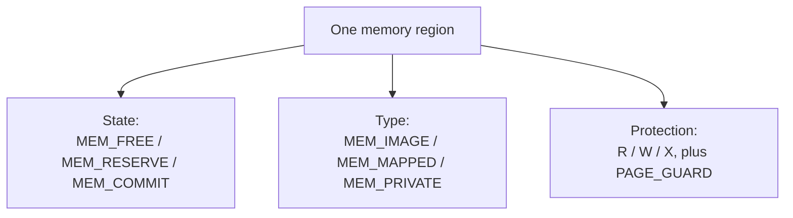
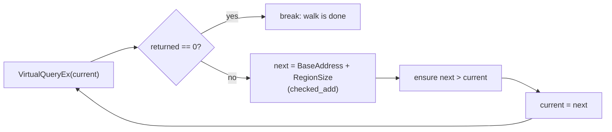

import CodeTrace from '../../../../components/CodeTrace.astro';
import Frame from '../../../../components/kit/Frame.astro';
import { Accordion, Badge, Fields, GitHub, ResponseField, CodeGroup, Tab } from '../../../../components/kit';

import MemoryStrip from '../../../../components/MemoryStrip.astro';
import MarginNote from '../../../../components/kit/MarginNote.astro';

## Memory is managed in pages

A correctly owned process handle with read rights answers *who may ask* for
memory. It does not say whether any particular address can be read. The target
process has a changing map of pages, and each page has its own state and
protection. We need both checks before interpreting a scanner failure.

A process sees memory as a huge range of numbered virtual addresses. Windows does not manage that range one byte at a time. It groups adjacent addresses into fixed-size **pages**, commonly 4 KiB on x86 and x86-64 systems.

<Frame caption="A handle does not make every page readable">
  
</Frame>

Pages that share the same state and protection are reported together as a **region**. A 200 KiB read-only region is therefore a run of many pages with matching state and protection, not one enormous hardware page.

This matters to every scanner and patcher in the course. An address can be a perfectly valid integer while the page at that address is absent, guarded, read-only, or non-executable.

:::note
🛡️ **Permission check:** a believable address is not enough. Ask Windows whether the page exists and whether your exact operation is allowed before touching it.
:::

## A virtual address is part of a process's map

The address printed by a debugger is a **virtual address**. It names a location
inside one process's address space; it does not directly name a RAM chip cell.
Windows and the CPU use page tables to translate the virtual page into a
physical frame when the page is present.

For any page size, an address can be split into two pieces:

<MarginNote kind="alternative">Split an address like a book reference: the virtual page selects the mapped page, and the offset picks a byte within it.</MarginNote>

```rust
fn split_address(address: usize, page_size: usize) -> Option<(usize, usize)> {
    if page_size == 0 {
        return None;
    }

    let virtual_page = address / page_size;
    let offset_inside_page = address % page_size;
    Some((virtual_page, offset_inside_page))
}
```

With a 4 KiB page, address `0x1234_5ABC` has offset `0xABC` inside its page.
The remaining upper part identifies the virtual page. The translation changes
the page part; the offset stays the same because it selects one byte inside that
page.

<MemoryStrip
  cells="=1|=2|=3|=4|=5|=A|=B|=C"
  groups="0-4:virtual page number: 0x12345"
  groups2="5-7:offset inside the page: 0xABC"
  caption="Splitting the hex digits of `0x1234_5ABC` at a 4 KiB (3 hex digit) boundary. Translation changes the page-number part; the offset is untouched."
/>

Two games can both use virtual address `0x0040_0000` while those addresses map
to different physical memory. One process can also have no mapping there at
all. `ReadProcessMemory` takes a process handle precisely so Windows knows
**which process map** should interpret the address.

Committed also does not mean “currently sitting in physical RAM.” Windows may
bring a committed page back from its backing storage when accessed. That event
is a page fault handled by the operating system; it is not automatically a bug
in the game or scanner.

## State, type, and protection answer different questions

Windows describes a region using three groups of facts — and they are independent axes, not a hierarchy:

<MarginNote kind="brief">Region state, mapping type, and access protection describe different facts; check all relevant fields before reading.</MarginNote>



**State** says whether storage is ready:

- `MEM_FREE`: no address range is reserved there;
- `MEM_RESERVE`: the address range is set aside, but physical/page-file storage is not committed;
- `MEM_COMMIT`: Windows has committed storage and the process may use it according to its protection.

**Type** says where committed pages came from:

- `MEM_IMAGE`: a mapped PE image such as an EXE or DLL;
- `MEM_MAPPED`: a mapped file or shared section;
- `MEM_PRIVATE`: private process memory such as many heap allocations.

**Protection** says which operations are allowed. The course prints the three permissions as `R`, `W`, and `X`:

| Display | Meaning |
|---|---|
| `R--` | Data can be read but not written or executed. |
| `RW-` | Data can be read and written but not executed. |
| `R-X` | Instructions can be read and executed but not normally edited. |
| `RWX` | The same page can be read, written, and executed. |
| `---` | The wrapper considers the region inaccessible. |

`PAGE_GUARD` is an extra flag. The first access raises an exception and clears the guard flag. Windows uses guard pages for mechanisms such as growing thread stacks. A scanner should skip them instead of treating the exception as ordinary data.

## Why writable plus executable deserves attention

Normal compiled code is usually readable and executable. Writable data is usually non-executable. Keeping those roles separate follows the **write xor execute** idea: memory should normally be writable or executable, not both at once.

Some legitimate runtimes generate code dynamically, and old software may use broad permissions. An `RWX` region is therefore a question, not a conviction:

- Which component created it?
- Is it inside the expected image or private memory?
- Does it exist in a clean run of the same build?
- Does its lifetime match a known feature?

This lab reports `RWX` regions but never writes to them or starts a thread there.

## `VirtualQueryEx` returns one matching run

The shared `Process::regions` wrapper begins at an address, calls `VirtualQueryEx`, records the returned `MEMORY_BASIC_INFORMATION`, and advances by `RegionSize`:



```rust
let returned = unsafe {
    // 🔍 Ask about the run containing `current`; this describes pages but does
    // not copy bytes from them or grant permission to read/write them.
    VirtualQueryEx(
        process_handle,
        Some(current as *const c_void),
        &mut information,
        size_of::<MEMORY_BASIC_INFORMATION>(),
    )
};
if returned == 0 {
    // ✅ Zero ends the walk. No stale MEMORY_BASIC_INFORMATION is consumed.
    break;
}

// 📏 Move from the returned base—not merely from `current`—to the first address
// after this entire run of pages with identical attributes.
let next = (information.BaseAddress as usize)
    .checked_add(information.RegionSize)
    .context("memory map overflowed")?;
anyhow::ensure!(next > current, "memory map did not advance");
current = next;
```

The checked addition prevents an invalid region from wrapping to a low address. The progress check prevents an endless loop if the reported range does not move forward.

The fields of `MEMORY_BASIC_INFORMATION` that the walk and the scanner rely on:

<Fields title="What VirtualQueryEx reports about one run">
<ResponseField name="BaseAddress" type="pointer">

Where the run starts. Pages are 4 KiB, so this is the queried address rounded down to a page boundary. The walk advances from here, not from the address it asked about.

</ResponseField>
<ResponseField name="RegionSize" type="bytes">

How long the run is. Every page from `BaseAddress` for this many bytes shares one state, one type, and one protection, and a new run begins wherever any of the three changes.

</ResponseField>
<ResponseField name="State" type="MEM_COMMIT, MEM_RESERVE, or MEM_FREE">

Whether storage is ready. Only committed pages can hold bytes a scanner may read.

</ResponseField>
<ResponseField name="Type" type="MEM_IMAGE, MEM_MAPPED, or MEM_PRIVATE">

Where committed pages came from: a PE image, a mapped file or shared section, or private process memory.

</ResponseField>
<ResponseField name="Protect" type="PAGE_* flags">

Which operations the pages allow. The course prints the read, write, and execute bits as `R`, `W`, and `X`, and treats `PAGE_GUARD` as a reason to skip the run.

</ResponseField>
<ResponseField name="AllocationBase" type="pointer">

Where the whole allocation begins. Several runs with different protections can belong to one allocation, so they share this value.

</ResponseField>
</Fields>

## Build a read-only module mapper

<Badge text="Windows VM" variant="note" />

The complete tool opens the process without write rights, finds one module, clips every returned region to that module, and prints an access summary.

<Accordion title="Complete lab source: memory_map.rs">

<GitHub path="windows-labs/src/bin/memory_map.rs" />

```rust
#[cfg(windows)]
fn main() -> anyhow::Result<()> {
    use anyhow::Context;
    use gha_windows_labs::Process;

    let mut arguments = std::env::args().skip(1);
    let process_name = arguments.next()
        .unwrap_or_else(|| "wesnoth.exe".to_owned());
    let module_name = arguments.next()
        .unwrap_or_else(|| process_name.clone());

    let process = Process::open_by_name(&process_name, false)?;
    let (module_base, module_size) = process.module(&module_name)?;
    let module_end = module_base.checked_add(module_size)
        .context("module range overflowed")?;
    let regions = process.regions(module_base, module_end)?;

    println!("{} (PID {})", process.name(), process.id());
    println!("Module: {module_name} {module_base:#010x}..{module_end:#010x}");
    println!("Range                         Size       Access");

    let mut rwx_count = 0_usize;
    for region in regions {
        if region.base >= module_end {
            break;
        }
        let region_end = region.base.checked_add(region.size)
            .context("memory region overflowed")?
            .min(module_end);
        let shown_size = region_end.saturating_sub(region.base);
        let access = format!(
            "{}{}{}",
            if region.readable { 'R' } else { '-' },
            if region.writable { 'W' } else { '-' },
            if region.executable { 'X' } else { '-' },
        );
        if region.readable && region.writable && region.executable {
            rwx_count += 1;
        }
        println!(
            "{:#010x}..{:#010x}  {:#010x}  {access}",
            region.base,
            region_end,
            shown_size,
        );
    }

    println!("RWX regions in this module: {rwx_count}");
    println!("The tool queried page metadata and changed nothing.");
    Ok(())
}

#[cfg(not(windows))]
fn main() {
    eprintln!("This virtual-memory map must run on Windows.");
}
```

</Accordion>

`false` in `open_by_name(&process_name, false)` is important. It means the wrapper requests query and read rights without `PROCESS_VM_OPERATION` or `PROCESS_VM_WRITE`.

The original helper opens a writable process handle even though it only lists module regions. In this course wrapper, `true` requests write-related rights; `print_regions` only formats the returned metadata.

```rust title="Before: open a writable handle to inspect pages"
fn inspect_module(process_name: String, module_name: String) -> anyhow::Result<()> {
    let process = Process::open_by_name(&process_name, true)?;
    let (module_base, module_size) = process.module(&module_name)?;
    let regions = process.regions(module_base, module_base + module_size)?;
    print_regions(&regions);
    Ok(())
}
```

Request observation rights with `false`. Also use **checked arithmetic** for the module end, so an invalid size cannot wrap the region boundary.

<CodeGroup>
<Tab label="Improved code">

```rust
fn inspect_module(process_name: String, module_name: String) -> anyhow::Result<()> {
    let process = Process::open_by_name(&process_name, false)?;
    let (module_base, module_size) = process.module(&module_name)?;
    let module_end = module_base.checked_add(module_size)
        .context("module end overflowed")?;
    let regions = process.regions(module_base, module_end)?;
    print_regions(&regions);
    Ok(())
}
```

</Tab>
<Tab label="Show the diff">

```diff
 fn inspect_module(process_name: String, module_name: String) -> anyhow::Result<()> {
-    let process = Process::open_by_name(&process_name, true)?;
+    let process = Process::open_by_name(&process_name, false)?;
     let (module_base, module_size) = process.module(&module_name)?;
-    let regions = process.regions(module_base, module_base + module_size)?;
+    let module_end = module_base.checked_add(module_size)
+        .context("module end overflowed")?;
+    let regions = process.regions(module_base, module_end)?;
     print_regions(&regions);
     Ok(())
 }
```

</Tab>
</CodeGroup>

**Takeaway:** an inspection tool should request inspection rights and reject an overflowing range.

### Why this version?

The lab is answering “what permissions exist?” It does not need permission to change them. The handle should match the question.

## Run it against the course games

Start each game before running its command. The first argument names the
process to open; the second names the module whose live pages to report. The
output groups regions by state, type, and protection so you can compare a
mapped image with its section flags on disk.

```powershell
cd windows-labs
cargo build --release --target i686-pc-windows-msvc --bin memory_map

.\target\i686-pc-windows-msvc\release\memory_map.exe `
  wesnoth.exe wesnoth.exe
.\target\i686-pc-windows-msvc\release\memory_map.exe `
  ac_client.exe ac_client.exe
.\target\i686-pc-windows-msvc\release\memory_map.exe `
  Quake3-UrT.exe Quake3-UrT.exe
```

Compare the regions with the PE section flags printed by `pe_inspector`. The on-disk section table describes intended mapping characteristics; `VirtualQueryEx` describes the live pages in this run.

Keep these address ideas separate:

| Name | Meaning in this course |
|---|---|
| file offset | byte position inside the EXE or DLL file |
| RVA | position relative to the image base |
| virtual address | live address inside one process |
| physical address | hardware-memory location after page translation |

A normal user-mode pattern scanner needs the live virtual address and lets
Windows perform translation. It should not guess physical addresses. The
offline DMA chapter introduces page-table translation separately because a raw
capture file has no running Windows process to translate addresses for it.

## Why a scanner skips some pages

The memory scanner visits only committed, readable, non-guarded regions. That avoids predictable failures and reduces wasted work. A later `ReadProcessMemory` can still fail because the process continues running and page state can change between the query and read.

<MarginNote kind="narration">A page can become unreadable between the map query and the read. A scanner needs to handle that ordinary race even after careful filtering.</MarginNote>

This is another time-of-check/time-of-use race. A robust scanner treats a failed region read as a normal event, reports useful context, and continues when safe.

The buildable tool is [`memory_map.rs`](/windows-labs/src/bin/memory_map.rs), and the shared query implementation is in [`process.rs`](/windows-labs/src/windows_impl/process.rs).

References: [`VirtualQueryEx`](https://learn.microsoft.com/en-us/windows/win32/api/memoryapi/nf-memoryapi-virtualqueryex) and [memory protection constants](https://learn.microsoft.com/en-us/windows/win32/memory/memory-protection-constants).

<CodeTrace trace="handoff-page-read" />
