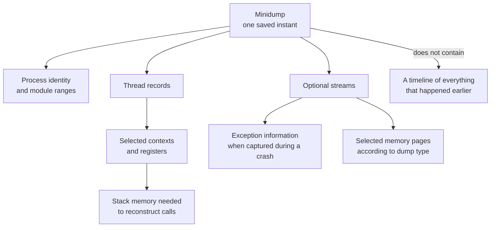

import MemoryStrip from '../../../../components/MemoryStrip.astro';

## A dump is a saved debugging snapshot

A live debugger reads a running process. A **dump file** saves selected process state so it can be inspected later. A minidump may include:

- basic process and operating-system information;
- loaded and recently unloaded modules;
- thread records and selected thread context;
- stack memory needed to reconstruct calls;
- exception information when captured during a crash.

The word “mini” describes a selectable subset, not a harmless text log. Dumps can contain file paths, arguments, stack data, and other private values. Treat them like diagnostic data, not screenshots.



The dump type decides which optional streams are saved. That is why a missing
heap object or exception record may mean “not captured,” not “never existed.”

## Why dumps help reverse engineering

A reproducible crash often disappears when you attach a debugger and change timing. A dump saves the process state close to the failure without a debugger attached, and from that file alone you can answer:

- Which thread failed?
- Which module contained the instruction pointer?
- What calls led to that point?
- Which game and DLL versions were loaded?
- Did the crash occur inside the course patch, the game, or a system DLL?

A dump does not record every earlier event. Combine it with logs or an ETW trace when the history matters.

## Scope this lab to the current process

`MiniDumpWriteDump` can accept a process handle and PID. This course program deliberately uses `GetCurrentProcess` and `GetCurrentProcessId`, so it can dump only itself through this code path. It does not search for a game PID or request another process handle.

It also avoids `MiniDumpWithFullMemory`. A normal dump plus thread and unloaded-module information is enough to learn the workflow without copying every private page in the process.

In the source, that choice is the `dump_type` value. Each optional stream has its own bit, and `|` sets several bits at once:

<MemoryStrip
  cells="bits 15–12=0001|bits 11–8=0000|bits 7–4=0010|bits 3–0=0000"
  marks="0|2"
  groups="0:bit 12, thread info|2:bit 5, unloaded modules|3:bit 1, full memory, left 0"
  caption="`dump_type` in binary. `MiniDumpWithThreadInfo` is `0x1000` = 4,096 = 2^12, so it is bit 12. `MiniDumpWithUnloadedModules` is `0x20` = 32 = 2^5, bit 5. `MiniDumpNormal` is 0: it sets no bit and names the baseline dump. Together they make `0x1020` = 4,096 + 32 = 4,128. `MiniDumpWithFullMemory` would be `0x2`, bit 1, and this lab leaves it clear."
/>

<details class="lab-source">
<summary>Complete lab source: self_minidump.rs</summary>

```rust
#[cfg(windows)]
fn main() -> anyhow::Result<()> {
    use std::{
        fs::OpenOptions,
        os::windows::io::AsRawHandle,
        path::PathBuf,
    };
    use anyhow::{Context, ensure};
    use windows::Win32::{
        Foundation::HANDLE,
        System::{
            Diagnostics::Debug::{
                MiniDumpNormal,
                MiniDumpWithThreadInfo,
                MiniDumpWithUnloadedModules,
                MiniDumpWriteDump,
            },
            Threading::{GetCurrentProcess, GetCurrentProcessId},
        },
    };

    let output = std::env::args_os()
        .nth(1)
        .map(PathBuf::from)
        .unwrap_or_else(|| PathBuf::from("gha-self.dmp"));
    ensure!(
        !output.exists(),
        "refusing to overwrite {}",
        output.display()
    );
    let file = OpenOptions::new()
        .write(true)
        .create_new(true)
        .open(&output)
        .with_context(|| format!("could not create {}", output.display()))?;
    let file_handle = HANDLE(file.as_raw_handle());

    // SAFETY: these calls take no pointers and return identifiers for this process.
    let (process, process_id) = unsafe {
        (GetCurrentProcess(), GetCurrentProcessId())
    };
    let dump_type = MiniDumpNormal
        | MiniDumpWithThreadInfo
        | MiniDumpWithUnloadedModules;
    // SAFETY: both handles belong to this process, the file stays open during
    // the call, and no optional exception/user/callback pointer is supplied.
    unsafe {
        MiniDumpWriteDump(
            process,
            process_id,
            file_handle,
            dump_type,
            None,
            None,
            None,
        )?;
    }
    drop(file);

    println!("Wrote {}", output.display());
    println!("The dump contains this lab process, not another process.");
    println!("Open it with: windbgx -z {}", output.display());
    Ok(())
}

#[cfg(not(windows))]
fn main() {
    eprintln!("This self-dump lab must run on Windows.");
}
```

</details>

## Translate the raw file handle carefully

`File` owns a Windows file handle. `AsRawHandle` borrows the numeric handle so the Windows API can use it. The `File` must stay alive until `MiniDumpWriteDump` returns.

That is why `drop(file)` appears after the Windows call. Closing it first would leave `file_handle` as a stale number.

The output uses `create_new(true)`, which refuses to replace an existing dump. Running the same command twice should not destroy the first dump.

## Build and capture

```powershell
cd windows-labs
cargo build --release --target i686-pc-windows-msvc `
  --bin self_minidump

.\target\i686-pc-windows-msvc\release\self_minidump.exe `
  .\gha-self-first.dmp
```

The program should print the saved path. Its complete buildable source is [`self_minidump.rs`](/windows-labs/src/bin/self_minidump.rs).

## Open the dump in WinDbg

Install WinDbg from Microsoft, then open the file from the UI or run:

```powershell
windbgx -z .\gha-self-first.dmp
```

These first commands answer different questions:

```text
!analyze -v   summarize an exception if the dump contains one
lm            list loaded modules and their address ranges
~             list threads
~* k          show a stack trace for every thread
r             show registers for the selected thread
```

The self-dump is captured during a normal function call, so it does not contain a crash exception. That is useful: you can learn module, thread, register, and stack navigation without deliberately causing undefined behavior.

## Read a stack from bottom to top

A stack trace is a chain of function frames. The top frame is where the selected thread was when captured. Frames below it are callers that led there.

<MemoryStrip
  column
  cells="top=inside MiniDumpWriteDump|=self_minidump::main|=Rust runtime start-up|=C runtime start-up|bottom=Windows thread start-up in kernel32 and ntdll"
  marks="0"
  groups="0:where the thread was at capture|1-4:callers, each waiting for the frame above it to return"
  caption="A simplified `k` listing for the thread that wrote the self-dump, newest call on top. Read from the bottom up, it replays the calls in the order they happened: Windows starts the thread, the C and Rust runtimes start up, `main` runs, and `main` calls `MiniDumpWriteDump`. A real listing splits each box into several frames."
/>

Names may be missing when matching symbols are unavailable. In that case, WinDbg may show a module plus an offset:

```text
self_minidump+0x1234
```

The offset is still useful when paired with the exact build hash and module base: it names the byte `0x1234` past the start of `self_minidump.exe` as loaded, and in one exact build that is one specific instruction.

## Create a controlled crash exercise safely

Do not corrupt a running game's memory just to obtain a dump. Instead, make a tiny separate test program that crashes on purpose, enable Windows Error Reporting local dumps for that one executable in a disposable VM, and inspect the result.

Not every Rust failure is a crash that Windows Error Reporting can see. Returning an error from `main` prints it and exits with code 1. A panic under Rust's default unwinding strategy is caught by the runtime, which prints the message and exits with code 101. Both are ordinary exits, so there is nothing to dump. A panic in a program built with `panic = "abort"` is different: it ends in a fail-fast exception, code `0xC0000409`, which Windows Error Reporting does capture, and `!analyze` then reports that exception rather than an access violation.

## Dump limitations

- A small dump may omit heap data needed to inspect a particular object.
- A dump records one instant, not the earlier event timeline.
- Unresolved symbols make stacks harder to name.
- Optimized code may inline functions or keep values only in registers.
- A module path and timestamp help, but a trusted hash is stronger build identity.

Start small. Capture more data only when a specific debugging question requires it, and keep diagnostic files with the exact build record and test logs they describe.

References: [`MiniDumpWriteDump`](https://learn.microsoft.com/en-us/windows/win32/api/minidumpapiset/nf-minidumpapiset-minidumpwritedump), [Minidump files](https://learn.microsoft.com/en-us/windows/win32/dxtecharts/crash-dump-analysis), and [WinDbg overview](https://learn.microsoft.com/en-us/windows-hardware/drivers/debugger/).
