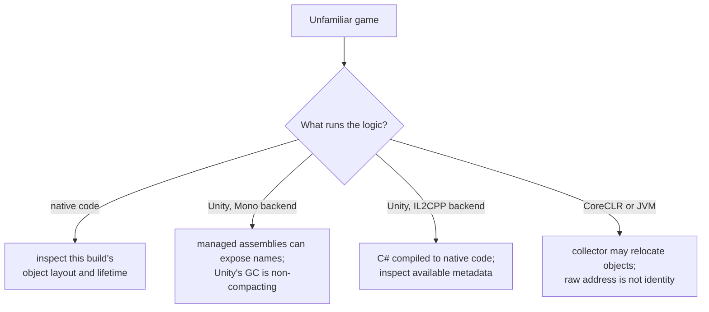

import Frame from '../../../../components/kit/Frame.astro';
import MemoryStrip from '../../../../components/MemoryStrip.astro';
import MarginNote from '../../../../components/kit/MarginNote.astro';

An executable has become a running process, but its address space does not yet
tell us **what runs the game's logic**. Before reading a memory map or applying
a native-code method to an unfamiliar game, identify its engine and runtime.
Wesnoth, AssaultCube, and Urban Terror let us practice with compiled native
code. A game using a managed runtime or script host may give us names and
types that those labs had to infer, and its objects may follow different
lifetime rules.

For example, searching for a field at `player base + 0x138` assumes that we
have the right kind of player object, that the field has that layout in this
build, and that the object is still alive when we read it. Discover the runtime
first; then choose what evidence can answer the health question.

## The runtime decides what an address means

The branches are not different difficulty levels. They are different questions.
In any branch, an offset describes a layout in a particular build; it does not
keep an object alive. The runtime changes what evidence is available for
recovering that layout and whether the object can move during its lifetime.

<Frame caption="An address is not a lifetime guarantee">
  
</Frame>

<MarginNote kind="brief">An offset describes one layout; it cannot keep the object alive or prevent its storage from moving.</MarginNote>

## Read the folder before you attach anything

The quickest answer is on disk and costs nothing:

| What you see beside the executable | Very likely |
|---|---|
| `<Game>_Data/Managed/Assembly-CSharp.dll` | Unity, Mono backend |
| `GameAssembly.dll` and `il2cpp_data/Metadata/global-metadata.dat` | Unity, IL2CPP backend |
| `<Game>/Binaries/Win64/<Game>-Win64-Shipping.exe`, `Engine/` | Unreal Engine |
| A large `.pck` beside a small executable | Godot |
| `coreclr.dll` or a `.runtimeconfig.json` | .NET |
| `jvm.dll`, `.jar` files | Java |
| Only an EXE and ordinary DLLs | Possibly native code; inspect the loaded modules before deciding |

Confirm it against the process's loaded-module list, because a folder can lie
and a launcher can start something other than the executable you inspected.
The folder shows what is installed; the module list shows what the running
process actually mapped. Lesson 12.1 later shows a tool for collecting that
list.

<MarginNote kind="alternative">The installation folder is a proposed inventory; the loaded-module list is the running process’s actual inventory. Compare both before classifying the runtime.</MarginNote>

## Native: reuse the earlier method, with its checks

For a native build, the debugger and PE techniques from Chapters 2, 3, and 5
remain useful. An object layout can have fixed field offsets *within that
build*. The object base can still change after allocation, collection growth,
destruction, or a restart, as Lessons 1.8 and 3.6 explained. Reconfirm the
module, object identity, and lifetime before reusing an address.

## Unity with the Mono backend: the code is readable

`Assembly-CSharp.dll` is not a native DLL. It holds .NET intermediate
language, which keeps class names, method names, and field names in its
metadata. A decompiler shows something close to the original C#, including the
field you are looking for and the method that changes it.

This changes the shape of the work completely. You are no longer inferring that
offset `0x138` behaves like health across controlled tests. You are reading a
field called `health` and the method called `TakeDamage` that writes it. The
recovery skills from Chapter 3 still matter, but they become confirmation
rather than discovery.

One useful nuance: Unity documents its managed garbage collector as
**non-compacting**. It does not move surviving managed objects merely to close
gaps in the heap. That removes one reason an address might change, but it does
not make a pointer chain a permanent identity: the game can destroy and
recreate an object, reuse storage, or change the layout in another build.

## Unity with IL2CPP: native code with some metadata

IL2CPP converts the same C# ahead of time into C++ and compiles it, so the
logic ships as native code inside `GameAssembly.dll`. There is no
`Assembly-CSharp.dll` to decompile, and at first glance you are back to reading
disassembly.

The runtime also needs metadata for the managed features that remain in the
build. A typical Unity IL2CPP layout has `global-metadata.dat`; it can reveal
useful names and type relationships. It is not a promise that every original
class, method, or field name survived: build stripping and packaging affect
what remains. Correlate the metadata you can actually inspect with the native
code and with a controlled observation in that exact build.

## CoreCLR and the JVM: addresses that can move

A .NET game running on CoreCLR is the case where the earlier assumption really
does break. CoreCLR's garbage collector is generational and **compacting**: it
relocates surviving objects to remove gaps. An object's address is therefore
valid only until the next collection that moves it.

<MemoryStrip
  cells="t0=object at 0x5000|t1, after GC=object at 0x5000"
  caption="With Unity's non-compacting collector, this surviving object stays at the same address across a collection. Destruction and recreation can still change its address later."
/>

<MemoryStrip
  cells="t0=object at 0x5000|t1, after GC=object moved to 0x5A00"
  marks="1"
  caption="CoreCLR or a moving JVM collector such as G1 can relocate a surviving object; after this example collection, its old raw address is no longer valid."
/>

That differs from Unity's non-compacting collector. Both are "managed" and
"garbage collected"; those words alone do not tell you whether a particular
object may move. Check the runtime and collector, as well as the object's
lifetime.

Where objects can move, a raw address is not a durable identity. Use a
runtime-supported reference, a validated handle, or a fresh lookup when the
runtime exposes one. Lesson 3.6 built slot-and-generation handles for a
similar identity problem: storage can be reused even when nothing moves.

Many JVM collectors, including G1, also move surviving objects. The collector
and configuration matter; do not infer a permanent address from the word
"Java" alone.

## Unreal: native, with its own directory

Unreal combines native C++ code with an engine object system. Its reflected
`UObject` types carry class and property information, while ordinary native
types and unreflected fields can still require the earlier layout method.
That makes the engine's object and name facilities useful orientation points,
not a guarantee that every gameplay value is listed there. Inspect the exact
game build before choosing a search target.

## Other engines: classify the build, not its logo

A `.pck` file may suggest Godot, but a game can add native extensions or use a
different scripting arrangement. A launcher can also start a different
executable from the one beside the package you inspected. Treat the folder
clues as a starting hypothesis and verify it with the loaded-module inventory
and one observed behavior.

## The answer belongs to one build

A runtime classification goes stale the same way an offset does. Unity lets a
studio switch a project's scripting backend between Mono and IL2CPP, so an
early-access release and the finished game can land on different branches of
the flowchart above. The classification holds for the exact build you
inspected; a new build means reading the folder and the loaded
modules again.

<MarginNote kind="narration">A later release can switch scripting backends while keeping the same game name. Recheck the build instead of carrying the old runtime assumption forward.</MarginNote>

Apply the method to a second folder. Suppose you see `GameAssembly.dll` and
`il2cpp_data/Metadata/global-metadata.dat`, but no
`Assembly-CSharp.dll`. Unity IL2CPP is a useful first hypothesis, so inspect
the loaded modules and available metadata. It would be a mistake to conclude
that every old field name survived, or that a pointer found today will still
identify the same object after a scene reload. If the next build instead
loads `coreclr.dll`, revisit the collector and reference model before reusing
any raw object address. The transferable rule is to verify **runtime, build,
and object lifetime** separately.

References: [Unity scripting back ends](https://docs.unity3d.com/Manual/scripting-backends-intro.html),
[Unity garbage-collection modes](https://docs.unity.com/en-us/engine/6000.6/manual/analysis/performance-memory/managed-memory/incremental-garbage-collection),
[.NET garbage collection](https://learn.microsoft.com/en-us/dotnet/standard/garbage-collection/fundamentals),
[Oracle G1 garbage collection](https://docs.oracle.com/en/java/javase/21/gctuning/garbage-first-g1-garbage-collector1.html),
and [Unreal's reflection system](https://dev.epicgames.com/documentation/unreal-engine/reflection-system-in-unreal-engine).
