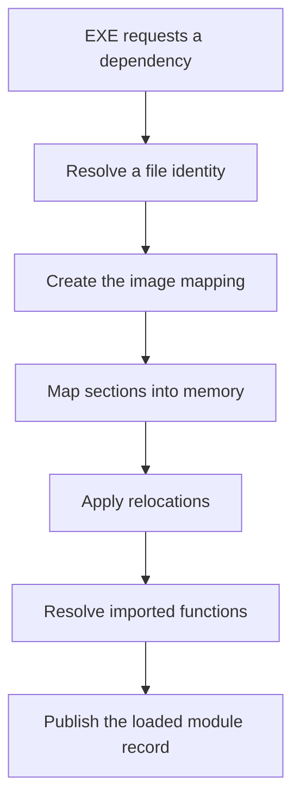
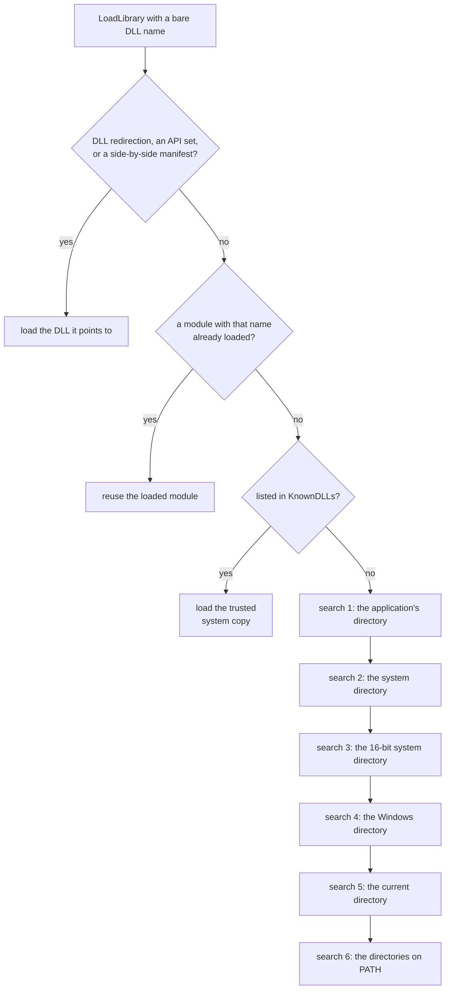
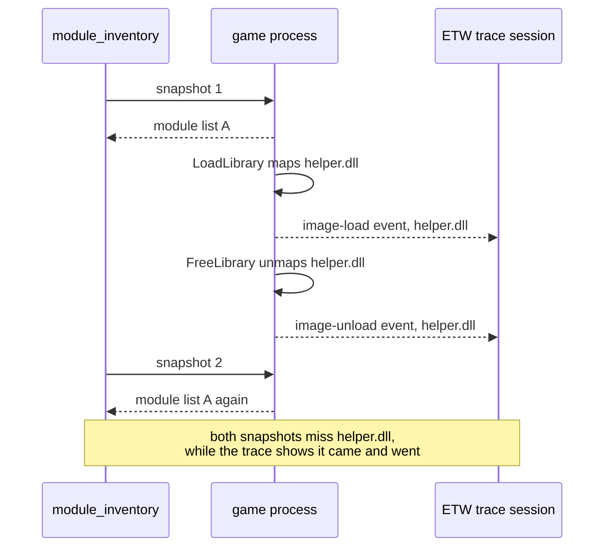

import MemoryStrip from '../../../../components/MemoryStrip.astro';

## A module name is not a full identity

A game may report that it loaded `opengl32.dll`, `zlib1.dll`, or another familiar name. The name alone does not say which file supplied the bytes. The full path, file hash, signer, architecture, and loaded range provide stronger identity.

That matters for debugging as well as defense. Loading the wrong version of a legitimate DLL can cause missing exports, crashes, changed structure layouts, or code patterns that no longer match the ones this course uses.

## Imports begin a dependency graph

The PE import table names DLLs and functions the image expects. The Windows loader must locate suitable DLL files, map them, resolve imported function addresses, and repeat the process for those DLLs' dependencies.

```text
game.exe
├─ SDL2.dll
│  └─ system dependencies
├─ game-specific support.dll
└─ Windows system DLLs
```

The final loaded set can also include modules requested later with `LoadLibrary`, graphics layers, accessibility tools, capture software, overlays, or optional game components.

The loader owns the transition from a requested dependency name to a mapped,
registered module in the process:



A module snapshot observes the published records after these steps. It does not
own the mappings and must not treat a snapshot entry as permission to unload one.

## Search order is a compatibility and security boundary

When code supplies only a DLL name instead of a full path, Windows follows documented resolution rules. Those rules depend on factors such as packaged-app identity, **API sets** (virtual DLL names that Windows redirects to whichever real DLL implements them on that build), side-by-side manifests, already loaded modules, the **KnownDLLs** list (a fixed set of core system DLLs, recorded in the registry, that Windows always loads from the trusted system directory instead of searching for them), **safe DLL search mode** (a per-process setting that moves the current working directory later in the search order, so a file planted there is less likely to be picked over the real system DLL), the executable directory, system directories, and configured search paths.

Do not reduce that to “Windows always checks this one folder first.” The precise order depends on how the load was requested and the Windows environment.

For the most common case, an unpackaged desktop program that calls `LoadLibrary` with a bare name while safe DLL search mode is on (the default), Microsoft documents this order:



The first searched folder that contains a file with that name supplies the DLL. Every check above the numbered searches happens before any folder is searched, which is why a planted file cannot stand in for a KnownDLL. With safe DLL search mode off, the current directory moves up to second place, right after the application's directory; holding it back at fifth place, behind the system directories, is what the setting does. Packaged apps and a few redirection features add steps that the diagram leaves out.

Safer application design uses:

- supported installation directories with controlled permissions;
- manifests and supported side-by-side versioning where appropriate;
- `LoadLibraryEx` flags that express the intended search scope;
- absolute paths for application-controlled plug-ins when practical;
- no writable current-working directory inserted into dependency search.

This lesson observes what actually loaded. It does not place replacement DLLs into candidate folders or redirect the loader.

## Take a ToolHelp module snapshot

`TH32CS_SNAPMODULE` lists modules matching the tool's native architecture. `TH32CS_SNAPMODULE32` also asks a 64-bit inspector to include 32-bit modules. The course uses both because the historical game builds are 32-bit.

Each `MODULEENTRY32W` includes:

- `modBaseAddr`: live module base;
- `modBaseSize`: mapped image size;
- `szModule`: short module name;
- `szExePath`: full file path;
- the owner PID and module handles used by Windows.

The structure has a fixed layout, and the caller must set `dwSize` first because that layout's size differs between 32-bit and 64-bit builds. In the 32-bit build this course uses, it looks like this:

<MemoryStrip
  column
  cells="+0x000=dwSize|+0x004=th32ModuleID|+0x008=th32ProcessID|+0x00C=GlblcntUsage|+0x010=ProccntUsage|+0x014=modBaseAddr|+0x018=modBaseSize|+0x01C=hModule|+0x020=szModule, 256 UTF-16 units|+0x220=szExePath, 260 UTF-16 units"
  marks="5-6|8-9"
  groups="0:the caller sets this|5-6:the module's loaded range|8-9:NUL-terminated names"
  caption="`MODULEENTRY32W` in a 32-bit build. The first eight fields are 4 bytes each, so they fill 8 × 4 = 32 = 2 × 16 = `0x20` bytes. `szModule` holds 256 UTF-16 units of 2 bytes each: 512 = 2 × 256 = `0x200` bytes, so `szExePath` starts at `0x20` + `0x200` = `0x220`. It holds 260 units: 520 = 512 + 8 = `0x208` bytes, so the structure ends at `0x220` + `0x208` = `0x428`, which is 4 × 256 + 2 × 16 + 8 = 1,064 bytes. That is the size Rust's `size_of` reports for the structure, and so the value the lab puts in `dwSize` for this build. A 64-bit build widens the two pointer fields to 8 bytes and aligns them, so its size is different."
/>

<details class="lab-source">
<summary>Complete lab source: module_inventory.rs</summary>

```rust
#[cfg(windows)]
fn main() -> anyhow::Result<()> {
    use std::mem::size_of;
    use gha_windows_labs::{OwnedHandle, Process};
    use windows::Win32::{
        Foundation::ERROR_NO_MORE_FILES,
        System::Diagnostics::ToolHelp::{
            CreateToolhelp32Snapshot,
            MODULEENTRY32W,
            Module32FirstW,
            Module32NextW,
            TH32CS_SNAPMODULE,
            TH32CS_SNAPMODULE32,
        },
    };

    fn wide_text(buffer: &[u16]) -> String {
        let end = buffer.iter()
            .position(|unit| *unit == 0)
            .unwrap_or(buffer.len());
        String::from_utf16_lossy(&buffer[..end])
    }

    fn no_more_files(error: &windows::core::Error) -> bool {
        error.code() == ERROR_NO_MORE_FILES.to_hresult()
    }

    let process_name = std::env::args().nth(1)
        .unwrap_or_else(|| "wesnoth.exe".to_owned());
    let process = Process::find(&process_name)?;
    let flags = TH32CS_SNAPMODULE | TH32CS_SNAPMODULE32;
    // SAFETY: the PID is a value and OwnedHandle owns the snapshot.
    let snapshot = unsafe {
        CreateToolhelp32Snapshot(flags, process.id)
    }?;
    let snapshot = OwnedHandle::from_raw(snapshot)?;
    let mut entry = MODULEENTRY32W {
        dwSize: size_of::<MODULEENTRY32W>() as u32,
        ..Default::default()
    };

    // SAFETY: entry has the required size and is writable.
    unsafe { Module32FirstW(snapshot.raw(), &mut entry) }?;
    let mut modules = Vec::new();
    loop {
        modules.push((
            entry.modBaseAddr as usize,
            entry.modBaseSize as usize,
            wide_text(&entry.szModule),
            wide_text(&entry.szExePath),
        ));
        // SAFETY: entry remains a valid output structure.
        match unsafe { Module32NextW(snapshot.raw(), &mut entry) } {
            Ok(()) => {}
            Err(error) if no_more_files(&error) => break,
            Err(error) => return Err(error.into()),
        }
    }

    modules.sort_unstable_by_key(|(base, _, _, _)| *base);
    println!(
        "{} (PID {}) loaded {} module(s)",
        process.name,
        process.id,
        modules.len(),
    );
    for (base, size, name, file) in modules {
        println!("  {base:#010x}  {size:#010x}  {name}");
        println!("              {file}");
    }
    println!("The snapshot was read-only; loader state was unchanged.");
    Ok(())
}

#[cfg(not(windows))]
fn main() {
    eprintln!("This read-only module inventory must run on Windows.");
}
```

</details>

## Run a clean baseline

Start a fresh local game without optional overlays or mod loaders:

```powershell
cd windows-labs
cargo build --release --target i686-pc-windows-msvc `
  --bin module_inventory

.\target\i686-pc-windows-msvc\release\module_inventory.exe wesnoth.exe
```

Capture the result again after entering a match. Some games delay-load graphics, audio, or networking components, so a later list may legitimately be longer.

Repeat the experiment for AssaultCube and Urban Terror:

```powershell
.\target\i686-pc-windows-msvc\release\module_inventory.exe ac_client.exe
.\target\i686-pc-windows-msvc\release\module_inventory.exe Quake3-UrT.exe
```

## Turn the list into a baseline

An approved baseline describes each non-system module with:

- full canonical path;
- SHA-256 hash from the integrity-manifest lesson;
- file size and version;
- expected publisher or project source;
- why and when the game loads it;
- which exact game build the entry belongs to.

A different module is not automatically malicious. It may be a graphics capture layer, accessibility tool, language pack, supported mod, or updated dependency. Investigate before removing anything.

## Snapshot limitations

The module list is a moment-in-time view. A DLL may load or unload immediately afterward. A module manually mapped without normal loader registration may not appear in the ToolHelp loader list. A protected or cross-architecture target may restrict enumeration.

A DLL that loads and unloads between two snapshots appears in neither list, even
though its code ran inside the game:



Each of these sources sees module loading from a different place, so each one
covers something another misses:

- ToolHelp module list: the modules the loader has registered, at one instant;
- ETW image-load events: every image mapping and unmapping over time, including
  DLLs that came and went between snapshots;
- file hashes and signatures: which bytes are on disk, and who signed them;
- the process memory map: every committed region, including executable memory
  that no module in the list accounts for;
- the PE import table: which DLLs the executable declares it needs before it runs;
- debugger module events: load and unload notifications as they happen.

## Keep defensive observation separate from loader manipulation

The course does not hide modules, unlink loader entries, overwrite an existing module, or exploit search-order mistakes. Those actions corrupt the loader records that this chapter's tools read, and that debuggers and crash reporters rely on too.

The complete inventory is [`module_inventory.rs`](/windows-labs/src/bin/module_inventory.rs). Combine its paths with [`integrity_manifest.rs`](/windows-labs/src/bin/integrity_manifest.rs) for a repeatable baseline.

References: [dynamic-link library search order](https://learn.microsoft.com/en-us/windows/win32/dlls/dynamic-link-library-search-order), [ToolHelp snapshots](https://learn.microsoft.com/en-us/windows/win32/toolhelp/snapshots-of-the-system), and [`MODULEENTRY32W`](https://learn.microsoft.com/en-us/windows/win32/api/tlhelp32/ns-tlhelp32-moduleentry32w).
