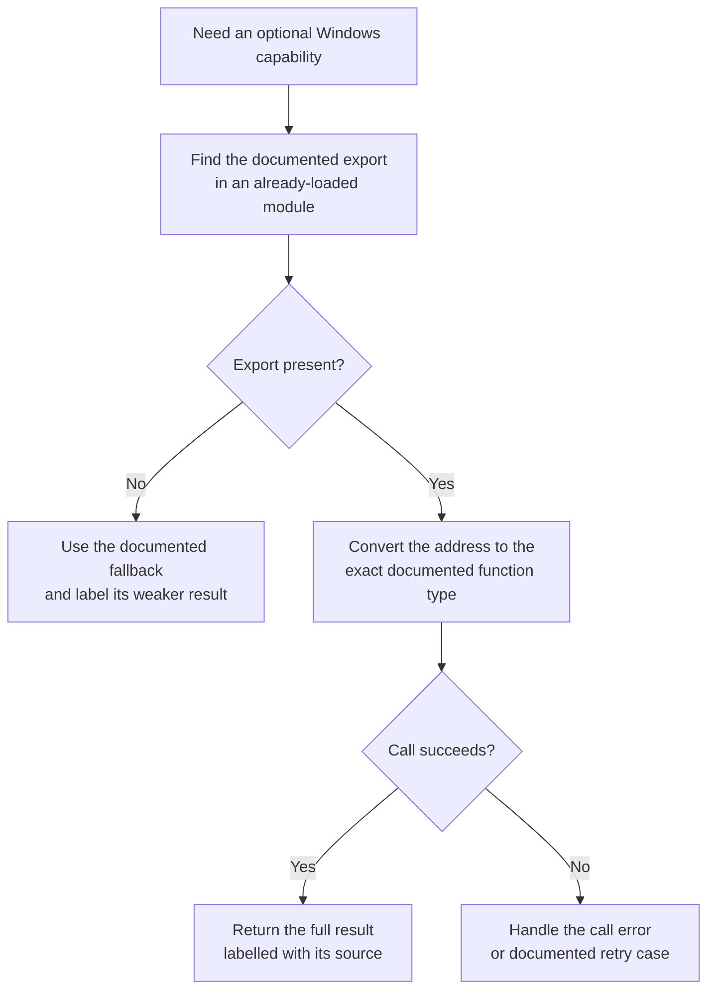

import MemoryStrip from '../../../../components/MemoryStrip.astro';

## Import tables are not the only way to call an API

Normally the Windows loader resolves a program's imports before `main`. Sometimes a tool supports several Windows versions and wants to use a newer API only when it exists. Then it can:

1. obtain a handle to the system DLL;
2. look up the named export;
3. convert the address to one proven function-pointer type;
4. call it or choose a fallback.

This is useful compatibility work. It is not a reason to hide imports or replace well-supported APIs with undocumented ones.

## Detect the capability you need

Do not infer one API's presence only from a Windows version string. Compatibility settings, servicing changes, and alternative implementations can make version checks lie about the capability that matters. Look up the documented export, validate the result, and take the fallback when it is absent.

Presence still does not guarantee that one call will succeed. The handle may lack rights, the buffer may be too small, or the target may exit. Feature detection chooses a code path; normal error handling still applies inside that path.

## Define the contract from documentation and assembly

For a known API, the Windows SDK declaration is the primary contract. Static analysis can confirm what the compiled caller does: argument registers, stack space, result checks, and error handling.

Keep the type alias beside the resolver:

```rust
use windows::Win32::Foundation::{BOOL, HANDLE};

type QueryFullProcessImageNameW = unsafe extern "system" fn(
    process: HANDLE,
    flags: u32,
    name: windows::core::PWSTR,
    size: *mut u32,
) -> BOOL;
```

The pointer type says more than “address of a function.” It records ABI, argument order, mutability, and result width.

`extern "system"` names a different calling convention on each of the two targets this course builds, so the same alias arranges the same four values in two different ways. On 32-bit x86 it means **stdcall**: the caller pushes the arguments from last to first, so when the function starts they sit just above the return address, one per 4-byte stack slot, and the function removes them itself before returning.

<MemoryStrip
  cells="[esp]=return address|[esp+0x04]=process|[esp+0x08]=flags|[esp+0x0C]=name|[esp+0x10]=size"
  marks="1-4"
  groups="1-4:4 arguments × 4 bytes = 16 = `0x10` bytes, removed by `ret 0x10`"
  caption="32-bit stdcall: the stack as `QueryFullProcessImageNameW` begins. Each argument slot is 4 bytes above the previous one, so the offsets run `0x04`, `0x08`, `0x0C` (12), `0x10` (16)."
/>

On x86-64, Windows passes the first four integer or pointer arguments in registers, in order, and returns an integer result in `EAX`, the low 32 bits of `RAX`:

<MemoryStrip
  cells="RCX=process|RDX=flags|R8=name|R9=size|EAX=BOOL result"
  marks="4"
  groups="0-3:arguments, first to fourth|4:return value"
  caption="The x86-64 Windows calling convention: four arguments, four registers. `BOOL` is a 32-bit integer, so `EAX` is enough to carry it."
/>

That is why a “close enough” signature fails in ways that have nothing to do with pointer size. Declare three parameters instead of four, and a 32-bit caller pushes 12 bytes while the function still removes 16 with `ret 0x10`, leaving the stack pointer 4 bytes away from where the caller expects it. On x86-64 the function reads a fourth argument from `R9` anyway, whatever that register happens to hold, and writes the result length through it as if it were a pointer.

## Resolve from an already loaded system module

```rust
use windows::{
    Win32::System::LibraryLoader::{GetModuleHandleW, GetProcAddress},
    core::{PCSTR, w},
};

unsafe fn resolve_query_name() -> anyhow::Result<Option<QueryFullProcessImageNameW>> {
    // SAFETY: kernel32.dll is a NUL-terminated static string. 🔎
    let module = unsafe { GetModuleHandleW(w!("kernel32.dll")) }?;
    // SAFETY: the export name is a NUL-terminated static byte string.
    let Some(raw) = (unsafe {
        GetProcAddress(module, PCSTR(b"QueryFullProcessImageNameW\0".as_ptr()))
    }) else {
        return Ok(None);
    };

    // SAFETY: the SDK declaration and export name establish this system ABI.
    let typed = unsafe {
        core::mem::transmute::<unsafe extern "system" fn() -> isize, QueryFullProcessImageNameW>(raw)
    };
    Ok(Some(typed))
}
```

The `Option` is intentional. “Export absent” is a supported compatibility state, not necessarily a fatal error.

Cache the typed result only when module lifetime makes that safe. An address obtained from a module becomes invalid if that module can unload. System modules used for the process lifetime are simpler, but a plug-in resolver should keep module ownership and function-pointer lifetime together.

## Call with a retryable buffer

Windows text APIs often accept a buffer plus an in/out length. Treat the length as untrusted after every call:

```rust
fn query_image_name(
    function: QueryFullProcessImageNameW,
    process: HANDLE,
) -> anyhow::Result<String> {
    let mut buffer = vec![0_u16; 32_768];
    let mut length = u32::try_from(buffer.len())?;

    // SAFETY: the buffer is writable for `length` UTF-16 units, and the handle
    // remains valid for the call. Windows writes the resulting unit count.
    let ok = unsafe {
        function(
            process,
            0,
            windows::core::PWSTR(buffer.as_mut_ptr()),
            &mut length,
        )
    };
    anyhow::ensure!(ok.as_bool(), "QueryFullProcessImageNameW failed");

    let used = usize::try_from(length)?;
    anyhow::ensure!(used <= buffer.len(), "Windows returned an invalid length");
    Ok(String::from_utf16_lossy(&buffer[..used]))
}
```

`length` means two different things on the two sides of the call. Suppose the process is Wesnoth at `C:\Games\Wesnoth 1.14.9\wesnoth.exe`, a 35-character path:

<MemoryStrip
  cells="[0]=C|[1]=:|=· · ·|[33]=x|[34]=e|[35]=NUL|=· · ·|[32767]=0"
  marks="0-4"
  groups="0-4:35 units of text, so `length` comes back as 35|5:not counted|6-7:never read"
  caption="The buffer after a successful call. Going in, `length` was 32,768, the vector's full size: 2^15 units, room for the longest extended-length Windows path of 32,767 characters plus its terminator. Coming back, it is the number of units written without the terminator, so `buffer[..35]` is exactly the path. The `ensure!` rejects a returned length larger than the buffer, because slicing past the end would panic."
/>

Use an RAII-owned process handle from the earlier Windows chapters. The dynamic call does not change ownership rules.

## Design the fallback before lookup

An optional API is useful only if the missing case has a defined behavior:

```rust
enum ImageNameSource {
    FullProcessImageName,
    ToolHelpSnapshot,
}
```

If the full-path API is unavailable, a ToolHelp snapshot can still provide the executable name. That fallback contains less information, so label the source instead of pretending the results are equivalent.



Notice that a failed call does not automatically choose the fallback. The API
can exist while the handle, buffer, or target state is invalid. Preserve that
difference so compatibility logic does not hide an ordinary error.

## Detect bad assumptions

Test the resolver with:

- the correct export name;
- one deliberately misspelled name;
- 32-bit and 64-bit builds;
- a closed or insufficient-rights process handle;
- a buffer whose returned length reaches its bound;
- an ordinary imported call, then compare results.

Never call an unresolved address. Never replace `None` with address zero. Never choose a “close enough” function signature because two pointer sizes happen to match.

## Why this belongs in reversing

When you inspect a game or tool, dynamic resolution explains a common pattern: a string names an API, `GetProcAddress` returns a pointer, and a later indirect call uses it. Reconstructing that chain turns anonymous control flow into a documented contract.

The responsible end state is boring and clear: one typed resolver, one fallback, visible errors, and no hidden capability. That is what good low-level code should look like.
