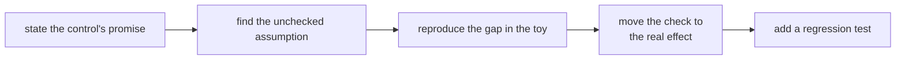
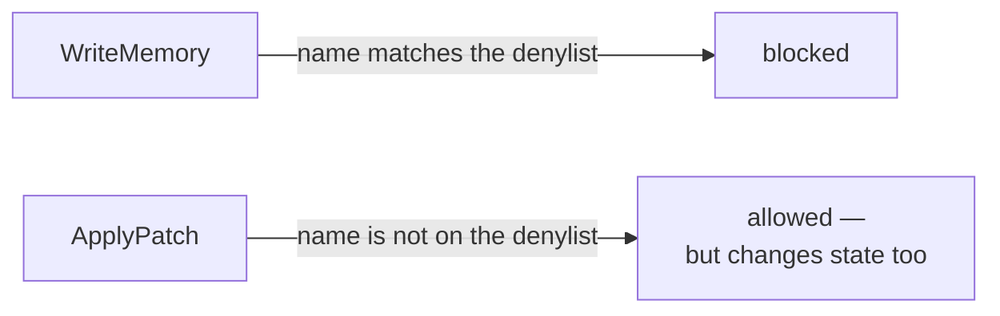
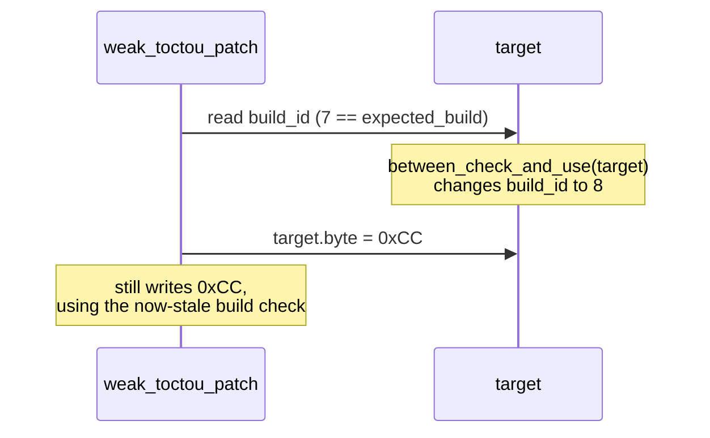
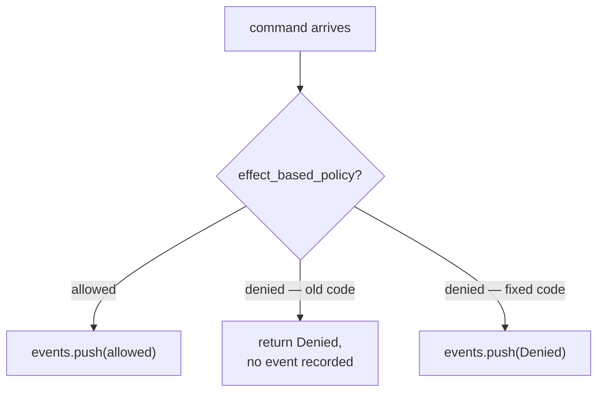

## Research the failure without targeting a real defense

This lesson uses a tiny program with no Windows APIs, drivers, processes,
networking, persistence, or security-product interaction. The “attacker” is a
test function calling an intentionally bad policy. That lets us study the
computer-science shape of an evasion while keeping the recipe useless against
a real anti-cheat or endpoint defense. 🧪

The buildable source is
[`toy_evasion_lab.rs`](/rust-labs/src/bin/toy_evasion_lab.rs).
Run it with:

```powershell
cd rust-labs
cargo run --bin toy_evasion_lab
cargo test --bin toy_evasion_lab
```

Each exercise follows the same research loop:



## Recipe 1: test a name-based rule with an equivalent command

The toy has three commands:

```rust
enum LabCommand {
    Observe,
    WriteMemory,
    ApplyPatch,
}
```

Both `WriteMemory` and `ApplyPatch` change state. The weak policy blocks only
the command whose name it recognizes:

```rust
fn weak_name_based_policy(command: LabCommand) -> bool {
    command != LabCommand::WriteMemory
}
```

### Reproduce the toy evasion

1. Set the lab to read-only mode.
2. Ask the weak policy about `WriteMemory`; it says no.
3. Ask about `ApplyPatch`; it says yes.
4. Observe that the second spelling reaches the same kind of state-changing
   effect the policy claimed to prevent.



The weakness is **coverage by spelling**. Adding more forbidden names would
become an endless denylist. Classify the effect instead:

```rust
enum Effect {
    ReadOnly,
    ChangesState,
}

fn effect_based_policy(command: LabCommand, writes_allowed: bool) -> bool {
    match effect_of(command) {
        Effect::ReadOnly => true,
        Effect::ChangesState => writes_allowed,
    }
}
```

Look at what changed about the question being asked. The weak version asked
"which command is this?", which has as many answers as there are names. The
enum asks "what does this command do to state?", and that has exactly two
answers. A question with a fixed number of answers can be answered completely;
a question about names cannot.

`effect_of` is now the single place that judgement lives. Adding a command to
the lab means classifying it there, and the `match` makes that unavoidable —
leave the new variant out and the code does not compile. The denylist that
would have needed extending forever has become a decision the compiler insists
you make once.

```diff
- fn policy(command: LabCommand, writes_allowed: bool) -> bool {
-     command != LabCommand::WriteMemory
- }
+ fn policy(command: LabCommand, writes_allowed: bool) -> bool {
+     match effect_of(command) {
+         Effect::ReadOnly => true,
+         Effect::ChangesState => writes_allowed,
+     }
+ }

 if policy(command, settings.writes_allowed) {
     execute_at_shared_boundary(command)?;
 }
```

The regression test iterates over every state-changing enum variant. Adding a
new variant then forces the programmer to classify it.

## Recipe 2: test a change between validation and use

The weak function checks a target build, calls a lab-only hook that simulates a
change, and then writes:

```rust
if target.build_id != expected_build {
    return Err("wrong build");
}

between_check_and_use(target); // the fixture changes here
target.byte = replacement;
```

### Reproduce the toy evasion

1. Start with build ID `7` and byte `0x90`.
2. Let the first build check succeed.
3. In the supplied test hook, replace the build ID with `8`.
4. Observe that the weak function still writes `0xCC` because it uses an old
   decision.



This is a **time-of-check/time-of-use** gap. The repair validates the build and
expected old byte immediately beside the side effect:

```rust
if target.build_id != expected_build {
    return Err("wrong build");
}
if target.byte != expected_byte {
    return Err("state changed");
}
target.byte = replacement;
```

For a real game process, Windows can still change the target between
two calls. You cannot make another process freeze by wishing. Keep the interval
small, compare expected bytes, report mismatch as a normal refusal, and make
the operation reversible.

## Recipe 3: test a state-changing branch the logger misses

The third toy control logs allowed work but returns early for denied work:

```rust
if !effect_based_policy(command, false) {
    return AuditResult::Denied; // ❌ no event was recorded
}
events.push(format!("allowed {command:?}"));
```

### Reproduce the toy evasion

1. Submit `WriteMemory` while writes are disabled.
2. Confirm that the policy denies it.
3. Inspect the event list; it is empty.
4. A reviewer looking only at the log cannot distinguish “nothing happened”
   from “a prohibited request was blocked.”



This is a **telemetry gap**, not a control bypass. It still matters because
missing evidence hides repeated mistakes and makes a control difficult to
test. Compute the decision, then record both outcomes:

```rust
let result = if effect_based_policy(command, false) {
    AuditResult::Allowed
} else {
    AuditResult::Denied
};
events.push(format!("{result:?} {command:?}"));
```

Do not log secrets, raw memory, authentication keys, or giant payloads. A useful
event records time, operation category, verified target identity, allow/deny
decision, and a bounded reason code.

## Turn a public “recipe” into a safe research question

When you encounter an evasion claim, translate it into this worksheet instead
of copying its operational commands:

| Question | Example answer from this lab |
|---|---|
| What promise did the control make? | Read-only mode prevents state change |
| Which input or path was checked? | One command name |
| Which equivalent effect was not checked? | Another command reached the same sink |
| What observable evidence proves the gap? | Weak policy returned true for `ApplyPatch` |
| Where should the invariant live? | At the shared state-changing boundary |
| What regression test keeps it fixed? | Every `ChangesState` variant is denied in read-only mode |

This method is original and reproducible.
It teaches the reasoning behind bypasses without packaging real-world evasion
steps that could be aimed at someone else's machine.

## A detector observes proxies, not intent

No program can directly read a person's intent. A detector measures observable
signals—for example a debug flag, an unusual timing gap, a changed byte, an
unexpected handle, or a forbidden state transition—and applies a rule. That
rule can be wrong in two directions:

| Outcome | Plain-English meaning |
|---|---|
| True positive | The measured signal and prohibited condition are both present |
| False positive | A harmless tool or environment produces the same signal |
| True negative | Normal behavior is accepted |
| False negative | The prohibited effect occurs without the expected signal |

This is why a strong repair protects the important **effect boundary** instead
of trusting one environmental clue. In the toy lab, “state must not change in
read-only mode” is an invariant. A process name, timing threshold, or single
flag is only evidence that might help explain a violation; it is not the
invariant itself.

For a controlled fixture, vary one condition at a time and write down a small
confusion matrix. Test attached and detached runs, slow and fast machines, and
expected diagnostic tools. If the rule blocks legitimate observation, that is
a compatibility bug worth fixing rather than proof that every observer is
hostile.

Use signal families as a checklist for honest tests and false-positive review,
not as a list of concealment tricks. The goal is to understand what the detector
actually measures and then protect the real invariant at the shared boundary.

## Checkpoint

You should now be able to explain:

- why denylisting names is weaker than authorizing effects;
- why validation can become stale before a side effect;
- why denied decisions need telemetry too;
- how a regression test turns one bypass finding into a lasting fix;
- why the toy boundary isolates the concept being tested.
