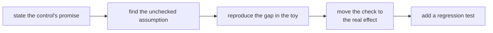
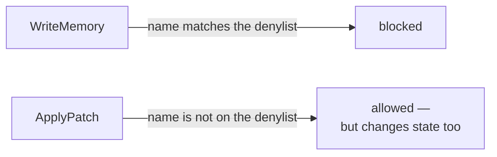
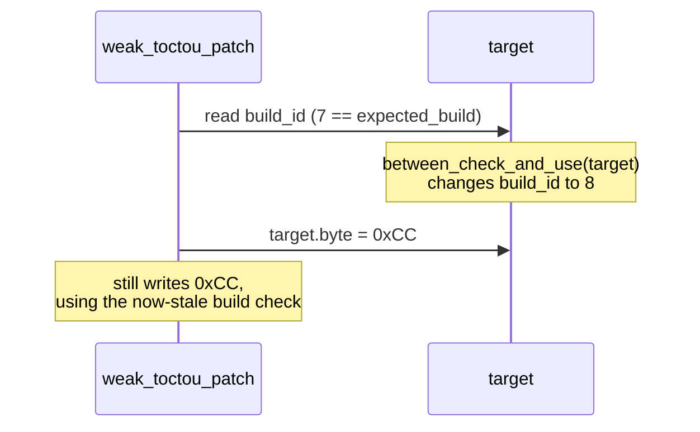
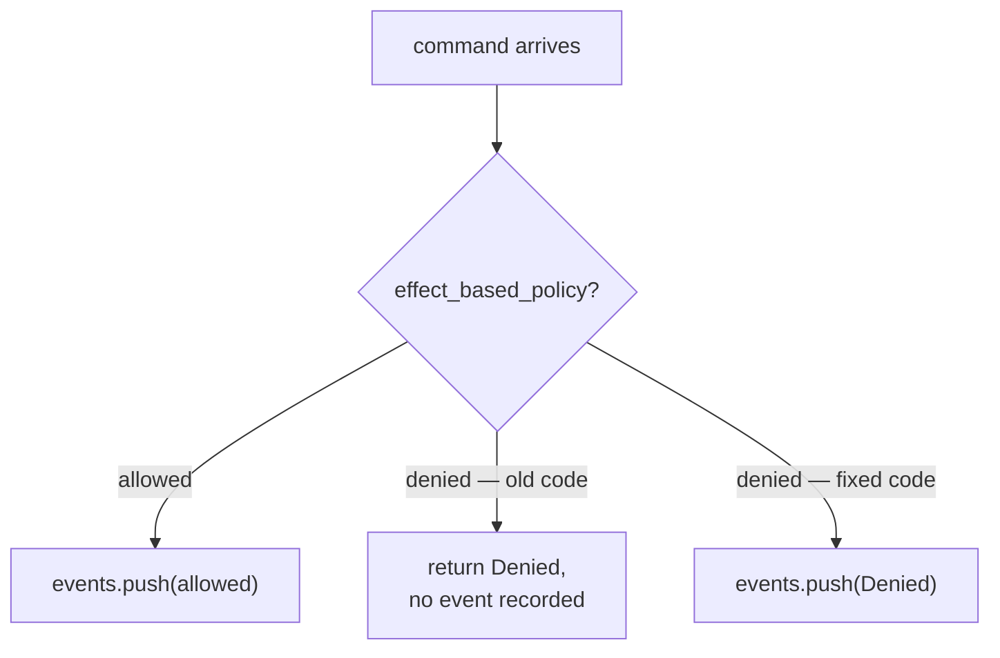

import Frame from '../../../../components/kit/Frame.astro';
import { GitHub, Steps, CodeGroup, Tab } from '../../../../components/kit';
import ConceptLab from '../../../../components/ConceptLab.astro';
import MarginNote from '../../../../components/kit/MarginNote.astro';

The earlier chapters showed how a value, hook, or object layout can
change while a game still appears to run normally. The next question is
whether a check guards the effect it claims to guard. A perfect module
inventory cannot rescue a rule that checks the wrong path. Three deliberately
weak rules in a small program make that gap visible before we examine game
logic controls and further trust-boundary failures.

## Research the failure without targeting a real defense

This lesson uses a tiny program with no Windows APIs, drivers, processes,
networking, persistence, or security-product interaction. The “attacker” is a
test function calling an intentionally bad policy. That lets us study the
computer-science shape of an evasion while keeping the recipe useless against
a real anti-cheat or endpoint defense. 🧪

<GitHub path="rust-labs/src/bin/toy_evasion_lab.rs" />

The buildable source is
[`toy_evasion_lab.rs`](/rust-labs/src/bin/toy_evasion_lab.rs).
Run it with:

```powershell
cd rust-labs
cargo run --bin toy_evasion_lab
cargo test --bin toy_evasion_lab
```

Each exercise follows the same research loop:


```mermaid
flowchart LR
    A["state the control's promise"] --> B["find the unchecked assumption"]
    B --> C["reproduce the gap in the toy"]
    C --> D["move the check to<br/>the real effect"]
    D --> E["add a regression test"]
```

## Recipe 1: test a name-based rule with an equivalent command

The toy has three commands:

```rust
enum LabCommand {
    Observe,
    WriteMemory,
    ApplyPatch,
}
```

Both `WriteMemory` and `ApplyPatch` change state. The weak policy blocks only
the command whose name it recognizes:

```rust
fn weak_name_based_policy(command: LabCommand) -> bool {
    command != LabCommand::WriteMemory
}
```

### Reproduce the toy evasion

<Steps>

1. Set the lab to read-only mode.
2. Ask the weak policy about `WriteMemory`; it says no.
3. Ask about `ApplyPatch`; it says yes.
4. Observe that the second spelling reaches the same kind of state-changing
   effect the policy claimed to prevent.

</Steps>

<Frame caption={"In this isolated toy, WriteMemory is denied while ApplyPatch reaches the same kind of state-changing effect. A read-only rule must check that effect."}>
  
</Frame>


```mermaid
flowchart LR
    A["WriteMemory"] -->|"name matches the denylist"| B["blocked"]
    C["ApplyPatch"] -->|"name is not on the denylist"| D["allowed —<br/>but changes state too"]
```

The weakness is **coverage by spelling**. Adding more forbidden names would
become an endless denylist. Classify the effect instead:

```rust
enum Effect {
    ReadOnly,
    ChangesState,
}

fn effect_based_policy(command: LabCommand, writes_allowed: bool) -> bool {
    match effect_of(command) {
        Effect::ReadOnly => true,
        Effect::ChangesState => writes_allowed,
    }
}
```

Look at what changed about the question being asked. The weak version asked
"which command is this?", which has as many answers as there are names. The
enum asks "what does this command do to state?", and that has exactly two
answers. A question with a fixed number of answers can be answered completely;
a question about names cannot.

<MarginNote kind="alternative">Group the toy commands by what they change, like sorting tools by their job rather than by the name printed on the handle.</MarginNote>

`effect_of` is now the single place that judgement lives. Adding a command to
the lab means classifying it there, and the `match` makes that unavoidable —
leave the new variant out and the code does not compile. The denylist that
would have needed extending forever has become a decision the compiler insists
you make once.

The original policy blocks only the command named `WriteMemory`; every other name passes, even when writes are disabled. The final `if` is the call-site fragment inside the lab's command handler: it shows the shared execution boundary where that decision is used.

```rust title="Before: block only one command name"
 fn policy(command: LabCommand, writes_allowed: bool) -> bool {
     command != LabCommand::WriteMemory // Ignores the setting and other write commands.
 }

if policy(command, settings.writes_allowed) {
    execute_at_shared_boundary(command)?;
}
```

Classify the **effect** of each command once, then apply the setting to every state-changing effect. The enum and exhaustive match keep new command variants from silently falling outside the rule.

<CodeGroup>
<Tab label="Improved code">

```rust
 fn policy(command: LabCommand, writes_allowed: bool) -> bool {
     match effect_of(command) {
         Effect::ReadOnly => true,
         Effect::ChangesState => writes_allowed,
     }
 }

if policy(command, settings.writes_allowed) {
    execute_at_shared_boundary(command)?;
}
```

</Tab>
<Tab label="Show the diff">

```diff
- fn policy(command: LabCommand, writes_allowed: bool) -> bool {
-     command != LabCommand::WriteMemory // Ignores the setting and other write commands.
- }
+ fn policy(command: LabCommand, writes_allowed: bool) -> bool {
+     match effect_of(command) {
+         Effect::ReadOnly => true,
+         Effect::ChangesState => writes_allowed,
+     }
+ }

 if policy(command, settings.writes_allowed) {
     execute_at_shared_boundary(command)?;
 }
```

</Tab>
</CodeGroup>

**Takeaway:** permission checks should follow what an operation does, not just what it is called.

The regression test iterates over every state-changing enum variant. Adding a
new variant then forces the programmer to classify it.

## Recipe 2: test a change between validation and use

The weak function checks a target build, calls a lab-only hook that simulates a
change, and then writes:

<MarginNote kind="narration">An accepted check can go stale before use. Keep the toy’s changed-between-stages case as a regression test for the repaired boundary.</MarginNote>

```rust
if target.build_id != expected_build {
    return Err("wrong build");
}

between_check_and_use(target); // the fixture changes here
target.byte = replacement;
```

### Reproduce the toy evasion

<Steps>

1. Start with build ID `7` and byte `0x90`.
2. Let the first build check succeed.
3. In the supplied test hook, replace the build ID with `8`.
4. Observe that the weak function still writes `0xCC` because it uses an old
   decision.

</Steps>


```mermaid
sequenceDiagram
    participant P as weak_toctou_patch
    participant T as target
    P->>T: read build_id (7 == expected_build)
    Note over T: between_check_and_use(target)<br/>changes build_id to 8
    P->>T: target.byte = 0xCC
    Note over P: still writes 0xCC,<br/>using the now-stale build check
```

This is a **time-of-check/time-of-use** gap. The repair validates the build and
expected old byte immediately beside the side effect:

```rust
if target.build_id != expected_build {
    return Err("wrong build");
}
if target.byte != expected_byte {
    return Err("state changed");
}
target.byte = replacement;
```

For a real game process, Windows can still change the target between
two calls. You cannot make another process freeze by wishing. Keep the interval
small, compare expected bytes, report mismatch as a normal refusal, and make
the operation reversible.

<ConceptLab
  id="recheck-write-explore"
  lab="blanks-recheck-write"
  label="Explore the check-then-write by changing one piece"
/>

## Recipe 3: test a state-changing branch the logger misses

The third toy control logs allowed work but returns early for denied work:

```rust
if !effect_based_policy(command, false) {
    return AuditResult::Denied; // ❌ no event was recorded
}
events.push(format!("allowed {command:?}"));
```

### Reproduce the toy evasion

<Steps>

1. Submit `WriteMemory` while writes are disabled.
2. Confirm that the policy denies it.
3. Inspect the event list; it is empty.
4. A reviewer looking only at the log cannot distinguish “nothing happened”
   from “a prohibited request was blocked.”

</Steps>


```mermaid
flowchart TD
    A["command arrives"] --> B{"effect_based_policy?"}
    B -->|"allowed"| C["events.push(allowed)"]
    B -->|"denied — old code"| D["return Denied,<br/>no event recorded"]
    B -->|"denied — fixed code"| E["events.push(Denied)"]
```

This is a **telemetry gap**, not a control bypass. It still matters because a
denial that leaves no event hides repeated mistakes and makes the control
difficult to test. The fix computes the decision first and then logs it,
whichever way it went:

```rust
let result = if effect_based_policy(command, false) {
    AuditResult::Allowed
} else {
    AuditResult::Denied
};
events.push(format!("{result:?} {command:?}"));
```

Do not log secrets, raw memory, authentication keys, or giant payloads. A useful
event records time, operation category, verified target identity, allow/deny
decision, and a bounded reason code.

## The anatomy of a bypass

Published evasion write-ups are usually operational recipes. Underneath the
commands, each one describes the same parts, and this lab's bypass contains
every one of them:

| Part | In this lab |
|---|---|
| The promise the control made | Read-only mode prevents state change |
| What the control actually checked | One command name |
| The equivalent effect it missed | Another command reached the same sink |
| The observable result | The weak policy returned true for `ApplyPatch` |
| Where the invariant belongs | At the shared state-changing boundary |
| The regression test that keeps it fixed | Every `ChangesState` variant is denied in read-only mode |

Described by its parts, a bypass is a gap between what a control promised and
what it checked. That is something a defender can close, and nothing in the
description is a step that could be aimed at someone else's machine.

## A detector observes proxies, not intent

No program can directly read a person's intent. A detector measures observable
signals—for example a debug flag, an unusual timing gap, a changed byte, an
unexpected handle, or a forbidden state transition—and applies a rule. That
rule can be wrong in two directions:

| Outcome | Plain-English meaning |
|---|---|
| True positive | The measured signal and prohibited condition are both present |
| False positive | A harmless tool or environment produces the same signal |
| True negative | Normal behavior is accepted |
| False negative | The prohibited effect occurs without the expected signal |

This is why a strong repair protects the important **effect boundary** instead
of trusting one environmental clue. In the toy lab, “state must not change in
read-only mode” is an invariant. A process name, timing threshold, or single
flag is only a signal that often accompanies a violation; it is not the
invariant itself.

<MarginNote kind="brief">Protect the effect you promise to prevent; a familiar name or environmental signal may only be a clue about that effect.</MarginNote>

The four-outcome table above is called a **confusion matrix**. Testing a rule
against a controlled fixture fills it in one condition at a time: attached and
detached runs, slow and fast machines, and the diagnostic tools a legitimate
user is expected to run. A rule that fires on a legitimate debugger or profiler
lands in the false-positive row, and that is a compatibility bug worth fixing
rather than proof that every observer is hostile.

Use signal families as a checklist for honest tests and false-positive review,
not as a list of concealment tricks. The goal is to understand what the detector
actually measures and then protect the real invariant at the shared boundary.

## What the three failures share

A name can change, an earlier validation can go stale, and a denied decision
can disappear from the record. Authorize the effect at its shared boundary,
record both allowed and denied outcomes, and keep the failed case as a
regression test. The toy boundary makes each failure observable without
conflating it with the behavior of a real game's defenses.
