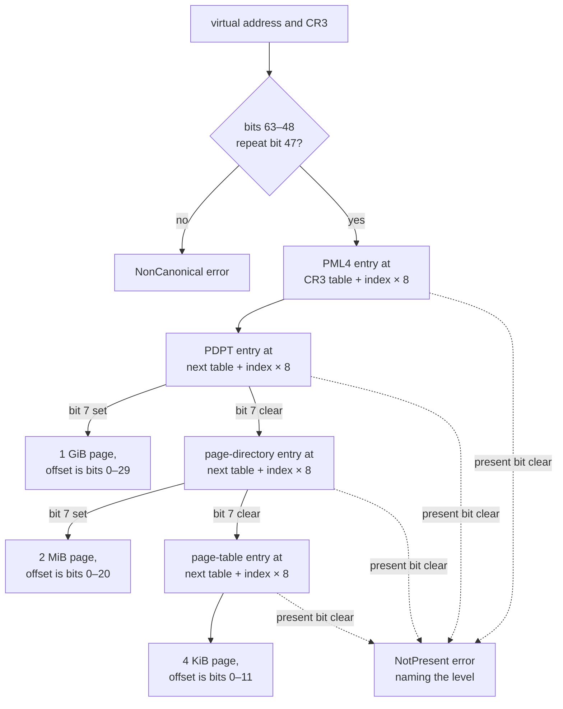

import MemoryStrip from '../../../../components/MemoryStrip.astro';

## Give address spaces different types

A physical address and a virtual address are both `u64` values, but mixing them is a serious logic error. Newtypes make the compiler help:

```rust
#[derive(Debug, Clone, Copy, PartialEq, Eq)]
pub struct PhysicalAddress(pub u64);

#[derive(Debug, Clone, Copy, PartialEq, Eq)]
pub struct VirtualAddress(pub u64);
```

Now `read_physical` cannot accidentally accept a `VirtualAddress` without an explicit conversion.

## Bounds-check every physical read

The capture is untrusted binary input. A page-table entry can point beyond the end of the file, so the reader checks the complete range:

```rust
pub fn read_physical(
    &self,
    address: PhysicalAddress,
    output: &mut [u8],
) -> Result<(), MemoryError> {
    let start = usize::try_from(address.0)
        .map_err(|_| MemoryError::OutOfRange { address, length: output.len() })?;
    let end = start
        .checked_add(output.len())
        .ok_or(MemoryError::OutOfRange { address, length: output.len() })?;
    let source = self.bytes
        .get(start..end)
        .ok_or(MemoryError::OutOfRange { address, length: output.len() })?;

    output.copy_from_slice(source);
    Ok(())
}
```

Three checks handle three different failures: the address may not fit `usize`, addition may overflow, or the final range may be outside the capture.

## Read one table entry

Each table entry is eight little-endian bytes. Its low present bit must be set before the address bits are trusted:

```rust
fn table_entry(
    &self,
    table: u64,
    index: u64,
    level: &'static str,
) -> Result<u64, MemoryError> {
    let entry_address = PhysicalAddress(table + index * 8);
    let entry = self.read_u64(entry_address)?;

    if entry & 1 == 0 {
        return Err(MemoryError::NotPresent { level, entry_address });
    }
    Ok(entry)
}
```

The error includes the failed level and physical entry address. That context is far more useful than “read failed.”

Here is one real entry: the first PML4 entry of the synthetic capture used in the tests later in this lesson, stored at physical address `0x1000`:

<MemoryStrip
  cells="0x1000=01|0x1001=20|0x1002=00|0x1003=00|0x1004=00|0x1005=00|0x1006=00|0x1007=00"
  marks="0-1"
  groups="0:present bit set|1:bit 13 set|2-7:higher bits, all 0"
  groups2="0-7:one little-endian `u64`, value `0x0000_0000_0000_2001`"
  caption="Little-endian means the lowest byte comes first, so byte `0x01` is bits 0–7 and byte `0x20` is bits 8–15. `0x20` is binary `0010 0000`, bit 5 of its byte, which is bit 8 + 5 = 13 of the entry, worth 2^13 = 8,192 = `0x2000`. So the entry is `0x2000` + 1 = `0x2001`: `entry & 1` is 1, so it is present, and clearing the flag bits leaves `0x2000`, the physical address of the next table."
/>


## Walk all four levels

Before reading the code, it pays to see where its constants come from, because
none of them are arbitrary. A 64-bit virtual address is cut into six fields, and
two sizes fix every boundary:

- A page is 4,096 bytes, and 4,096 = 2^12, so the lowest 12 bits, 0–11, pick a
  byte inside the page.
- A table holds 512 entries, and 512 = 2^9, so each table index takes 9 bits.
  Stacking four indices above the offset puts the page-table index at bits
  12–20 (the next field starts at 12 + 9 = 21), the page-directory index at
  21–29, the PDPT index at 30–38, and the PML4 index at 39–47.
- That accounts for 12 + 4 × 9 = 48 bits. The remaining 16 bits, 48–63, carry
  no information of their own: they must repeat bit 47, which is what makes an
  address canonical.

Take the address from the page-crossing example later in this lesson,
`0x0000_7FF6_1234_0FF8`. Every hex digit is exactly four bits, so its low twelve
digits spell out bits 47 down to 0:

```text
hex digit     7    F    F    6    1    2    3    4    0    F    F    8
binary        0111 1111 1111 0110 0001 0010 0011 0100 0000 1111 1111 1000
highest bit   47   43   39   35   31   27   23   19   15   11   7    3
```

Cutting those 48 bits at the boundaries above, working from the right (12 bits,
then four groups of 9), gives the six fields:

<MemoryStrip
  column
  cells="bits 63–48=0000 0000 0000 0000|bits 47–39=0 1111 1111|bits 38–30=1 1101 1000|bits 29–21=0 1001 0001|bits 20–12=1 0100 0000|bits 11–0=1111 1111 1000"
  groups="0:sign extension|1:PML4 index|2:PDPT index|3:PD index|4:PT index|5:page offset"
  groups2="0:all 0, like bit 47|1:`0x0FF`, 255|2:`0x1D8`, 472|3:`0x091`, 145|4:`0x140`, 320|5:`0xFF8`, 4,088"
  caption="`0x0000_7FF6_1234_0FF8` split into its fields. Each field is written in groups of four bits counted from the right, so it reads straight off as hex."
/>

Converting each field to decimal is ordinary place value:
`0x0FF` = 15 × 16 + 15 = 255; `0x1D8` = 1 × 256 + 13 × 16 + 8 = 472; `0x091` = 9 × 16 + 1 = 145;
`0x140` = 1 × 256 + 4 × 16 = 320; and `0xFF8` = 15 × 256 + 15 × 16 + 8 = 4,088.
This address therefore uses PML4 entry 255, PDPT entry 472, page-directory
entry 145, page-table entry 320, and byte 4,088 of the final page.

The same layout accounts for every mask in the walk below:

- **The shifts of 39, 30, 21, and 12** slide each index field down to bit zero
  so it can be used as a table index. For the example address,
  `(value >> 39) & 0x1FF` is exactly the PML4 field, 255.
- **`& 0x1FF`** keeps nine bits, because `0x1FF` is 511 and each table holds
  512 entries. Nine bits is not a coincidence: 512 entries of eight bytes each
  comes to exactly 4,096 bytes, so every page table is itself exactly one page.
- **`& 0xFFF`** keeps twelve bits — the offset within a 4 KiB page, since
  `0xFFF` is 4,095.
- **`& 0x000F_FFFF_FFFF_F000`** keeps bits 12 through 51 of an entry. The low
  twelve bits are cleared because an entry stores flags there (present,
  writable, user-accessible, large-page), and the high bits are cleared because
  they hold further flags rather than address. What remains is the physical
  address of the next table — which is page-aligned, and therefore always had
  twelve spare zero bits for those flags to live in.

The complete implementation masks flag bits from each next-table address:

```rust
let pml4e = self.table_entry(root, (value >> 39) & 0x1FF, "PML4")?;
let pdpte = self.table_entry(
    pml4e & 0x000F_FFFF_FFFF_F000,
    (value >> 30) & 0x1FF,
    "PDPT",
)?;
let pde = self.table_entry(
    pdpte & 0x000F_FFFF_FFFF_F000,
    (value >> 21) & 0x1FF,
    "page directory",
)?;
let pte = self.table_entry(
    pde & 0x000F_FFFF_FFFF_F000,
    (value >> 12) & 0x1FF,
    "page table",
)?;

let physical = (pte & 0x000F_FFFF_FFFF_F000) | (value & 0xFFF);
```

The real file also checks the large-page bit, bit 7 of an entry (`1 << 7` = `0x80`), at the PDPT and page-directory levels. When it is set, the walk stops early, and the index fields it skipped become part of the offset. A 1 GiB page is 2^30 bytes, so its offset is the low 30 bits, `value & 0x3FFF_FFFF`. A 2 MiB page is 2^21 bytes, so its offset is the low 21 bits, `value & 0x1F_FFFF`. Each mask is one less than its page size: `0x4000_0000` = 4 × 16^7 = 2^2 × 2^28 = 2^30, and `0x20_0000` = 2 × 16^5 = 2 × 2^20 = 2^21.



Every entry in the chart is read through `read_physical`, so an entry address beyond the end of the file stops the walk with `OutOfRange` at whichever level it occurs.

## A read can cross a page boundary

Translating only the starting address is a subtle bug. Virtual memory looks
contiguous; the physical memory behind it is not. Two virtual pages sitting
side by side can be backed by physical pages nowhere near each other.

Suppose a 32-byte read begins 8 bytes before the end of a page:

```text
requested: 32 bytes at virtual 0x0000_7FF6_1234_0FF8

bytes  1..8    live in the page at virtual ...0000  ->  physical 0x0512_3000
bytes  9..32   live in the page at virtual ...1000  ->  physical 0x0091_A000
```

This is the worked address from the walk above. Its page offset is `0xFF8`, and
the page ends at offset `0x1000`, so `0x1000` − `0xFF8` = 4,096 − 4,088 = 8 bytes
remain in the first page. Byte 9 sits at `0x0000_7FF6_1234_1000`, where the
page-table index is `0x141` = 321 instead of 320 and the offset is 0. The two
halves of the read are translated by neighbouring entries of the same page
table, at byte offsets 320 × 8 = 2,560 and 321 × 8 = 2,568, and nothing
requires those two entries to hold neighbouring physical addresses.

Nothing warns you when this happens. Translating once and then reading 32
consecutive physical bytes quietly returns 24 bytes belonging to whatever
follows the first page in physical memory — a completely unrelated allocation,
another process's data, or nothing mapped at all. The bytes come back looking
perfectly ordinary.

`read_virtual` therefore loops:

1. translate the current virtual address;
2. calculate bytes remaining in its page;
3. copy the smaller of that amount and the requested remainder;
4. translate again after crossing the boundary.

This is why the public method returns a new byte vector rather than a borrowed slice of one physical region.

## Test with synthetic page tables

The unit test constructs a tiny fake physical image:

```rust
let mut bytes = vec![0_u8; 0x7000];
put_u64(&mut bytes, 0x1000, 0x2000 | 1); // PML4 -> PDPT ✅
put_u64(&mut bytes, 0x2000, 0x3000 | 1); // PDPT -> PD
put_u64(&mut bytes, 0x3000, 0x4000 | 1); // PD -> PT
put_u64(&mut bytes, 0x4000, 0x5000 | 1); // PT -> data page
bytes[0x5123..0x512A].copy_from_slice(b"GHA DMA");
```

The fixture is `0x7000` bytes: 7 × `0x1000` = 7 × 4,096 = 28,672 bytes, or seven
4 KiB pages. The lab's capture format has no header. File offset N holds
physical address N, so each page of the file is one physical page:

<MemoryStrip
  column
  cells="0x0000=zeros|0x1000=PML4 table|0x2000=PDPT|0x3000=page directory|0x4000=page table|0x5000=data page|0x6000=zeros"
  marks="5"
  groups="1:entry 0 holds `0x2001`|2:entry 0 holds `0x3001`|3:entry 0 holds `0x4001`|4:entry 0 holds `0x5001`|5:`GHA DMA` at `0x5123`"
  caption="The synthetic capture, one box per 4 KiB page. Virtual `0x0123` is less than `0x1000`, so bits 12–47 are all 0 and every table index is 0. The walk therefore reads entry 0 of each table, which is the table's first 8 bytes, and follows `0x2000`, `0x3000`, `0x4000`, then `0x5000`. The offset `0x123` then selects physical address `0x5000` + `0x123` = `0x5123`."
/>

With `CR3 = 0x1000`, virtual address `0x0123` should translate to physical `0x5123`. Tests also cover a missing present bit and a noncanonical virtual address.

Synthetic tests are powerful because every byte is known. A failure means the translator is wrong, not that an unknown capture changed.

## Run the complete tool

The checked implementation is in `advanced-memory-labs/src/dma.rs`; the command-line wrapper is `src/bin/dma_capture.rs`.

```powershell
cargo test --manifest-path advanced-memory-labs/Cargo.toml dma
cargo run --manifest-path advanced-memory-labs/Cargo.toml --bin dma_capture -- `
    capture.bin 0x1000 0x00007FF612341000 64
```

Arguments are:

1. path to an offline physical capture with recorded provenance;
2. physical CR3 value in hexadecimal;
3. virtual address in hexadecimal;
4. byte count from 1 through 4096.

The maximum is deliberately small. A learning tool should make unexpectedly huge reads impossible by default.

## Why a translation may fail

| Error | Likely meaning |
|---|---|
| noncanonical virtual address | typo or wrong architecture assumption |
| PML4/PDPT/PD/PT not present | page absent, wrong CR3, or incomplete capture |
| physical range outside capture | corrupt entry or capture omitted that RAM range |
| plausible bytes but wrong object | wrong address space, stale pointer, or wrong build model |

Never “fix” an error by masking more bits until output appears. Compare the entry format with the architecture manual, confirm the capture layout, and keep the failure visible.
