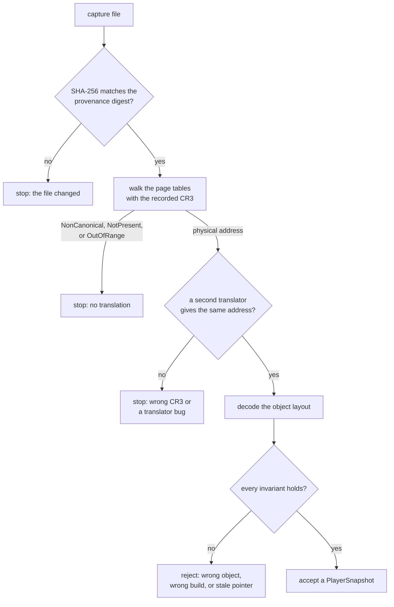
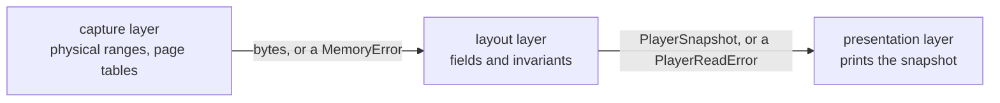
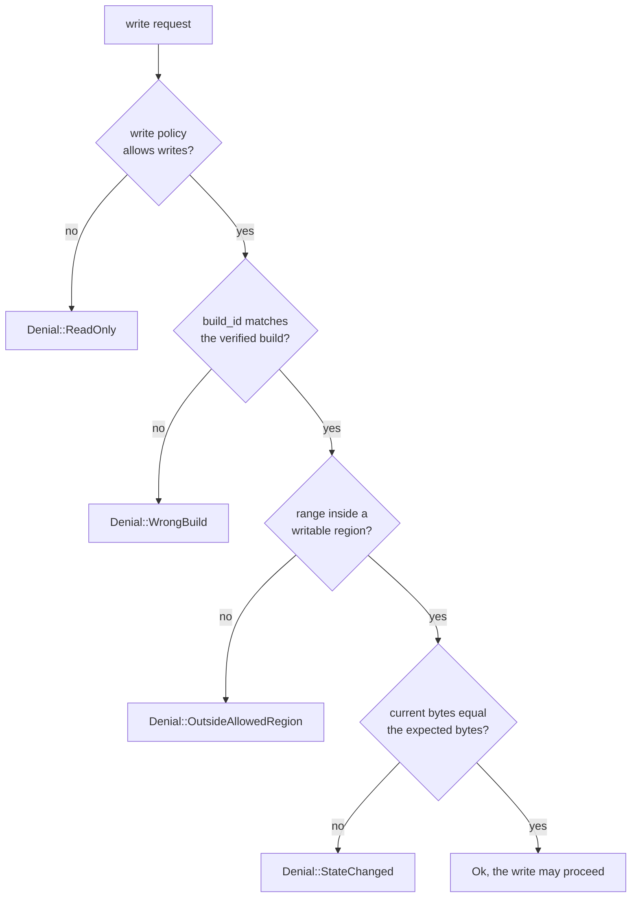

import MemoryStrip from '../../../../components/MemoryStrip.astro';

## A clean translation can still be the wrong one

Page-table translation can produce an address and still answer the wrong question. You may have the wrong CR3, a stale object pointer, a different build, or a capture taken between two related updates.

None of those mistakes makes the walk fail. A wrong CR3 is still a valid page-table root for some other address space, a stale pointer can still land on mapped memory, and another build's object still has bytes where the old layout expects fields. A successful walk means only that the page tables in the file lead somewhere; each stage below checks, in a different way, that the somewhere is the object you meant:



## Preserve capture provenance

A capture file is only bytes; nothing inside it says where it came from. The facts needed to interpret it travel beside it, in a provenance record that covers:

- who created it and how it was captured;
- source machine or virtual machine;
- operating-system and game build;
- CPU architecture and paging mode;
- capture tool and settings;
- UTC capture time;
- physical address ranges included or omitted;
- CR3 source and the process it belongs to;
- SHA-256 digest of the unchanged file.

Keep the original read-only and run experiments on a working copy, so a mistake can never alter the only copy. If the original's digest stops matching the record, stop: every translation made from the file assumed the recorded bytes, so none of them can be trusted until the change is explained.

## Cross-check a translation three ways

Three independent checks catch different mistakes:

1. the capture translator’s physical result;
2. a debugger or hypervisor translation for the same snapshot;
3. semantic structure checks on the resulting bytes.

The second translator catches a bug in the first. The structure checks catch the case both translators share: a correct translation of the wrong thing.

For an object model, semantic checks might include:

- vptr points into the expected module’s read-only section;
- several vtable slots point into executable sections;
- health falls within the game’s valid range;
- position components are finite floating-point values;
- name length and termination are bounded;
- container begin/end/capacity relationships make sense;
- handles resolve with matching generations.

Here is how several of those checks land on one small object, a toy 64-bit player layout:

<MemoryStrip
  cells="+0x00=vptr|+0x08=health|+0x0C=x|+0x10=y|+0x14=z|+0x18=begin|+0x20=end|+0x28=capacity"
  groups="0:in module `.rdata`|1:0 to max|2-4:finite floats, no NaN or infinity|5-7:item list, begin ≤ end ≤ capacity"
  caption="A 48-byte `PlayerLayout`: an 8-byte vtable pointer, a 4-byte health value, three 4-byte floats, and three 8-byte container pointers, so 8 + 4 + 3 × 4 + 3 × 8 = 48 = 3 × 16 = `0x30` bytes, and `PlayerLayout::SIZE` is 48. Each brace is a check on different bytes."
/>

A single field can look right by accident: plenty of unrelated memory holds a small integer that could pass for health. Four checks on different bytes, each failing in its own way, rarely all pass at a wrong address, so an object that passes every one is far more likely to be the one you meant.

## Separate capture parsing from game meaning

Use layers:

```rust
fn read_player(
    capture: &Capture,
    cr3: PhysicalAddress,
    address: VirtualAddress,
) -> Result<PlayerSnapshot, PlayerReadError> {
    let bytes = capture.read_virtual(cr3, address, PlayerLayout::SIZE)?;
    PlayerLayout::decode(&bytes)
}
```

The capture layer understands physical ranges and page tables. The layout layer understands fields and invariants. The presentation layer prints a `PlayerSnapshot`.



This separation keeps an object-layout mistake from corrupting translation code and makes each layer independently testable.

## Account for IOMMU and platform protections

Modern systems use an IOMMU and operating-system policy to restrict DMA-capable devices. On supported Windows systems, Kernel DMA Protection can isolate peripherals and block unsafe access, especially around externally accessible buses.

For defensive validation:

- check Windows Security or System Information for the reported protection state;
- keep firmware, Windows, and device drivers updated;
- use trusted devices and cables;
- lock or shut down a machine before leaving it unattended;
- follow organizational policy for external PCIe/Thunderbolt devices;
- investigate unexpected DMA-capable hardware.

Do not disable Secure Boot, virtualization-based protections, an IOMMU, or Kernel DMA Protection to make an experiment easier. A blocked path is a successful defense, not a translation failure.

## Study “bypasses” as failed assumptions

A bypass is not magic. It usually means a protection checked one signal while
the unwanted behavior arrived through a different path. Each kind of gap is one
wrong assumption inside the control, and each can be tested in a toy lab without
writing an evasion recipe:

| Defensive gap | What the control wrongly assumed | Safer lab test |
|---|---|---|
| Coverage gap | Every execution, input, and memory path passes the point it observes | Send labeled events through toy paths and compare logs |
| Identity gap | The name, signer, PID, or handle it trusted cannot change | Restart/rebuild the toy target and verify identity is re-evaluated |
| Time gap | Trusted state stays the same between the check and the use | Pause between validation and use, mutate a fixture, and expect rejection |
| Parser gap | Producer and consumer agree about lengths and encodings | Feed a corpus of bounded malformed fixtures into both parsers |
| Privilege gap | Requests reaching a higher-privilege component are already safe to accept | Exercise a fake broker with least-privilege test tokens |
| Telemetry gap | A blocked action needs no event of its own | Assert that every allow, deny, timeout, and parse failure has an event |
| Recovery gap | A crash cannot leave hooks, input, bytes, or handles in a bad state | Inject worker errors and verify reverse-order cleanup |

An assumption becomes testable once it is stated as an **invariant**, a condition
that must hold every time. For example: “a write command is accepted only when
the target build matches, the address belongs to an expected writable region,
the old bytes match, and observation-only mode is off.” A toy adapter can then
exercise every rejected condition. This shows why controls fail and how to
strengthen them without distributing anti-cheat or endpoint-defense evasion
techniques.

```rust
fn validate_write_request(request: &WriteRequest, state: &LabState) -> Result<(), Denial> {
    // ✅ Each independent assumption gets a named, testable rejection.
    state.write_policy.allows_writes().then_some(()).ok_or(Denial::ReadOnly)?;
    (request.build_id == state.verified_build).then_some(()).ok_or(Denial::WrongBuild)?;
    state.memory_map.contains_writable(request.range()).then_some(())
        .ok_or(Denial::OutsideAllowedRegion)?;
    (request.expected_bytes == state.current_bytes(request.range())?)
        .then_some(())
        .ok_or(Denial::StateChanged)?;
    Ok(())
}
```

Each `?` is a separate exit, so each broken assumption produces its own named denial, and a test can target exactly one of them:



The byte comparison runs last, immediately before the write would happen, which keeps the time gap between that check and the use as short as the code allows.

The defensive lesson is to make assumptions explicit, require several
independent signals, keep permissions narrow, and fail closed with useful
telemetry. Copying a public bypass playbook would teach the opposite habit and
would also undermine the original-work requirement for this book.

## What this chapter intentionally does not provide

The chapter does not include:

- live DMA device setup;
- custom device firmware;
- kernel-driver installation for memory access;
- anti-cheat bypass or stealth;
- memory writes to a running game;
- credential or key extraction;
- targeting a third-party machine.

Those actions are unnecessary for learning page tables, memory models, object patterns, obfuscation, encryption, or forensic validation. The offline lab teaches the computer science directly and remains reproducible for every reader.

## A final advanced workflow

1. Choose an open-source game or toy program you can rebuild with symbols.
2. Reconstruct one class or component from the stripped build.
3. Locate its constructors, destructors, vtable, containers, and ownership patterns.
4. Create an offline snapshot or synthetic fixture.
5. Translate one virtual address with the capture reader.
6. Decode only bounded fields into a typed snapshot.
7. Validate the snapshot with several invariants.
8. Check the reconstruction against the debug symbols or source.
9. Turn every discovered assumption into a unit test.
10. Store or delete the capture according to its data-handling rules.
