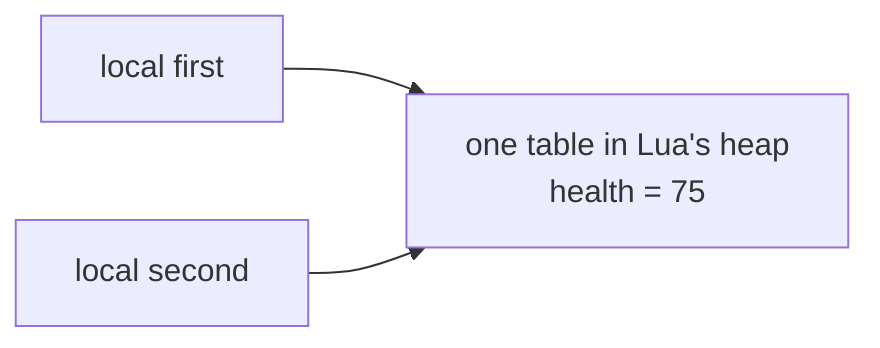

import { Badge } from '../../../../components/kit';
import Scene from '../../../../components/Scene.astro';
import MarginNote from '../../../../components/kit/MarginNote.astro';


Chapter 9 followed game files and mods through their formats, integrity
checks, and loading rules. Some games also offer a supported way to run small
rules *inside* the game. That changes the first question: instead of asking
where a value lives in memory, ask which values and actions the game
deliberately gives to a script. Lua is one common language for that boundary.

We will first write small Lua scripts and define the host API that contains
them. Once those pieces work, we will open the interpreter itself: source text
becomes bytecode, and bytecode runs on a virtual machine with its own values,
stack, and lifetime rules.

## Compiled engine, flexible script

The native host is normally compiled ahead of time into machine code. Changing its source means building a new executable or library.

Lua is a small programming language commonly **embedded** inside a larger program. The game owns a Lua interpreter and asks it to run text scripts. A designer can change a quest, unit rule, or user-interface behavior without rebuilding the whole engine.

Use the host-boundary model:

<Scene name="lua-capabilities" />

The engine owns the runtime and decides which values and functions cross the API
boundary. A script cannot automatically do everything the engine can do; it sees
only the capabilities that the host deliberately exposes.

## From a script file to one visible result

The host loads Lua source, checks that it is valid Lua, and asks the Lua runtime
to execute it. When the script calls `game.log`, execution crosses back to a
function the host supplied.

<MarginNote kind="alternative">Embedding Lua is a conversation: the host asks the interpreter to run a script, and a registered callback lets the script ask the host for one service.</MarginNote>

The interpreter inside that runtime is also called a Lua **virtual machine**,
or VM: it follows internal instructions made from the script. That is enough
to understand why a host can later count script steps. Lesson 10.8 opens the
VM and shows the instructions themselves.

We can observe the host crossing without changing any game state:

```lua
game.log("observer started")
```

Here `game` is a table of functions supplied by our lab host, `log` is one of
those functions, and the quoted text is its argument. The host decides where
the message appears. For this first script, we only need to know who runs it
and who supplies `game.log`.

## Lua is dynamically typed

The host language knows a variable's type at compile time:

```rust
let health: u32 = 100;
```

In Lua, a variable can refer to values of different types at different times:

```lua
local health = 100
health = "unknown"
```

That flexibility is convenient for configuration and gameplay rules. It also moves many mistakes from compile time to runtime. Clear names, validation, tests, and small APIs matter even more.

For these lessons we pin the lab to **Lua 5.4** through `mlua 0.12`. Other games may embed Lua 5.1, LuaJIT, Lua 5.5, or a customized dialect. Check the target's documentation or version string before assuming features exist.

## The values you meet first

These declarations put seven different kinds of value behind local names.
Nothing runs merely because the function value is created; `decide` can be
called later, while the other values can be read or changed by later code.

```lua
local name = "bot_alpha"       -- string
local health = 100              -- integer number
local distance = 12.5           -- floating-point number
local alive = true              -- boolean
local target = nil              -- no value
local position = { x = 4, y = 9, z = 2 } -- table
local decide = function() end   -- function
```

Lua also has threads/coroutines and userdata supplied by a host. A table is the main container: it can behave like a list, dictionary, record, namespace, or object.

A table variable refers to one table object. Assigning it to another name
copies that reference, so two names can reach the same table:

```lua
local first = { health = 100 }
local second = first
second.health = 75
assert(first.health == 75) -- both names reach the same table
```



`second = first` copied the reference, the arrow, not the table it points to.
There is only one `health` field, so the write through `second` is the value
read through `first`.

This shared reference is called **aliasing**. Lesson 10.2 develops tables and
their iteration rules; Lesson 10.9 explains how the runtime represents values
and eventually reclaims unreachable tables. When a table crosses into a host
function, the host must still validate the fields it receives.

## Local versus global names

The two assignments below look similar, but only the first declares a name
private to its scope. The second writes into Lua's shared global environment.

```lua
local selected = nil -- visible only in this scope ✅
state = "running"   -- creates or replaces a global name ⚠️
```

Prefer `local` unless you intentionally publish a value. Accidental globals let separate scripts overwrite each other's state and make spelling mistakes difficult to find.

<MarginNote kind="narration">A misspelled global assignment can quietly create shared state. Local names keep that mistake from changing what another script sees.</MarginNote>

## The host API is the security boundary

A poor host might expose an all-powerful function:

```lua
-- ❌ A script can ask for any address, size, and write.
memory.write(address, bytes)
```

The book's lab exposes a narrow interface instead:

```lua
local entities = game.snapshot()
if entities[2] then
    game.request({ kind = "select_entity", id = entities[2].id })
end
```

`game.snapshot()` returns copied sample data. If a second entity exists, the
script asks to select its ID; the host can still reject the request if that ID
is no longer valid. `game.request` accepts only a small list of validated
actions. The script never receives a process handle, arbitrary pointer,
command shell, or raw Windows API.

<MarginNote kind="brief">A script can act only through the host functions it receives; copied observations do not grant arbitrary memory access.</MarginNote>

This is **capability design**: code can do only what the values and functions in its environment allow.

## Your first observer

The file `lua-labs/scripts/observer.lua` contains:

First, `game.snapshot()` supplies a list of copied entity tables. Lua's
`ipairs(entities)` then visits list entries in order. In the `for` line below,
`_` discards the numeric position and `entity` names the current entry.
The `alive and "alive" or "dead"` expression chooses one of two words, and
`string.format` fills the `%s` text slots and `%.1f` one-decimal number slots.
Those pieces turn one copied list into readable output:

```lua
local entities = game.snapshot()

for _, entity in ipairs(entities) do
    local state = entity.alive and "alive" or "dead"
    game.log(string.format(
        "%s: %s at (%.1f, %.1f, %.1f)",
        entity.name,
        state,
        entity.position.x,
        entity.position.y,
        entity.position.z
    ))
end
```

Read it as a sequence:

1. ask for one snapshot;
2. visit each entity in its list order;
3. choose a readable state word;
4. format one message;
5. send that text to the host logger.

Nothing here edits a game. It proves the language, table shape, and host boundary before later automation.

## Run the lab

<Badge text="Any computer" variant="success" />

From the repository root:

```powershell
cargo run --manifest-path lua-labs/Cargo.toml -- scripts/observer.lua
```

The host works on Windows, macOS, and Linux because it uses a simulated snapshot. Later you can connect the same API shape to one of the book's read-only Windows observers.

## Versions and trust differ between games

Games that load Lua mods differ in each of these, and each one changes what a
script can do or how its failures show up:

- Lua version or dialect;
- search paths and file names;
- which standard libraries are available;
- host-provided functions and their argument rules;
- whether scripts are trusted, signed, or user-authored;
- CPU, memory, and action limits;
- how a script error is reported and disabled.

Lua makes behavior easier to change. A well-designed host also makes the boundaries easier to explain.
