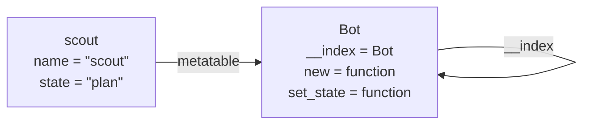
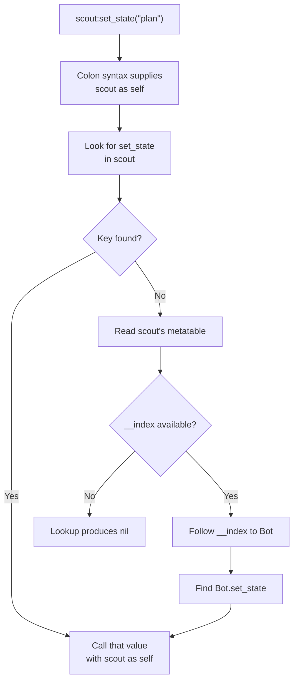

import MemoryStrip from '../../../../components/MemoryStrip.astro';

## Lua tables represent arrays, records, and maps

A Lua table maps keys to values. These are all tables:

```lua
local list = { "sword", "shield", "potion" }
local position = { x = 10.0, y = 5.5, z = 2.0 }
local by_id = { [7] = "archer", [12] = "mage" }
```

The first table uses integer keys `1`, `2`, and `3`. Lua sequences conventionally start at **one**, not zero.

A table is not “an array that sometimes has names.” It is one mapping abstraction that accepts several kinds of keys. Sequence operations add conventions on top: positive integer keys beginning at one, usually without holes. The length operator and `ipairs` are easiest to reason about when the script preserves that shape.

Before crossing the host/Lua boundary, name the promised shape:

```text
entity sequence: keys 1..n, every value is an entity table
entity record: named keys id, alive, and position
lookup map: arbitrary entity IDs mapped to records; order is not promised
```

The same Lua table implementation can represent all three, but host validation and iteration rules differ.

```lua
print(list[1]) -- sword ✅
print(list[0]) -- nil
```

When the host turns a `Vec` into a Lua sequence, it must add one to the zero-based index. The implementation in `lua-labs/src/main.rs` does exactly that.

### How a map finds a key

Inside, a Lua table has two parts: an **array part** for the keys 1, 2, 3, … of
a sequence, and a **hash part** for every other key. The hash part is a hash
table. Lua turns the key into a number, its **hash**, and uses that number to
pick one slot, so finding `position.y` means computing one hash and checking one
slot, however many keys the table holds.

Suppose the hash part has 4 slots, numbered 0 to 3, and the string `"y"` hashes
to 22. Lua keeps the remainder after dividing by the slot count: 22 ÷ 4 is 5
remainder 2, so `y` goes in slot 2. Slot counts are powers of two, so that
remainder is simply the hash's lowest bits: 22 is `10110` in binary, and its
last two bits, `10`, are 2.

<MemoryStrip
  cells="slot 0=z · 2.0|slot 1=empty|slot 2=y · 5.5|slot 3=x · 10.0"
  marks="2"
  groups="2-2:22 ÷ 4 leaves 2"
  caption="An illustration of the hash part of `position` with 4 slots, assuming the key `y` hashes to 22. Each key sits where its hash sends it, not where the script wrote it."
/>

Two things follow. `pairs` walks the slots in slot order, so keys come out in
hash order rather than the order the script wrote them, and the order can change
completely when the table grows and Lua moves every key into a larger set of
slots. And two keys can hash to the same slot, a **collision**; Lua then links
the second key from the first, so lookups still work but slow down a little when
many keys collide. [Lesson 3.5](/pages/3/05/#a-hash-table-arithmetic-picks-the-bucket)
shows what the same idea looks like in a compiled C++ program.

## Iterate according to the shape

Use `ipairs` for a dense integer sequence:

```lua
for index, item in ipairs(list) do
    print(index, item)
end
```

`ipairs` starts at key 1 and stops at the first missing key. A **hole**, a
missing key in the middle of a sequence, therefore ends the loop early:

```lua
list[2] = nil -- { "sword", "shield", "potion" } now has a hole at key 2
```

<MemoryStrip
  cells="1=sword|2=nil|3=potion|4=nil"
  marks="1"
  groups="0:visited by `ipairs`|1:`ipairs` stops here|2-3:never reached"
  caption="After `list[2] = nil`, `ipairs` never sees `potion`. The length operator is no safer: `#list` may return 1 or 3, because each is a **border**, a key whose value is present while the next key's value is missing, and Lua promises only that `#` returns some border."
/>

Use `pairs` when keys are not a simple sequence:

```lua
for key, value in pairs(position) do
    print(key, value)
end
```

Do not rely on a meaningful order from `pairs`: it follows the hash part's slot order, as the previous section showed. If order matters, store an explicit sequence or sort the keys.

## Functions are values

```lua
local function squared_distance(a, b)
    local dx = b.x - a.x
    local dy = b.y - a.y
    return dx * dx + dy * dy
end

local scoring_rule = squared_distance
print(scoring_rule({ x = 0, y = 0 }, { x = 3, y = 4 })) -- 25
```

A function can be stored in a table, passed to another function, and returned. This is why a game can register callbacks such as `on_turn_started`.

## Closures remember surrounding values

```lua
local function make_cooldown(required_ticks)
    local remaining = 0

    return function(triggered)
        if remaining > 0 then
            remaining = remaining - 1
            return false
        end
        if triggered then
            remaining = required_ticks
            return true
        end
        return false
    end
end

local ready_once = make_cooldown(3)
```

The returned function keeps access to `remaining` after `make_cooldown` has
returned. That remembered environment is a closure.

The practical payoff is that each call to `make_cooldown` produces its own
private `remaining`. Two cooldowns created this way count down independently,
with no shared global and no counter passed around by hand:

```lua
local attack_ready = make_cooldown(3)
local heal_ready = make_cooldown(10)   -- separate remaining, separate countdown
```

Following `attack_ready(true)` through five calls in a row shows the private
`remaining` at work. The first call finds `remaining` at 0, so it fires and
sets `remaining` to 3; each later call finds it above 0, subtracts 1, and
refuses, until it is back at 0 and the next call fires again:

<MemoryStrip
  cells="call 1=fires, 3|call 2=blocked, 2|call 3=blocked, 1|call 4=blocked, 0|call 5=fires, 3"
  marks="0|4"
  caption="The result of each `attack_ready(true)` call and the value `remaining` holds afterward. `heal_ready` owns a different `remaining`, so none of these calls moves its countdown."
/>

That is why closures suit bot code so well: each piece of timed behavior can
own its own state without the rest of the script being able to reach in and
disturb it.

## The colon supplies `self`

```lua
local Bot = {}

function Bot:set_state(next_state)
    self.state = next_state
end

local bot = { state = "observe" }
Bot.set_state(bot, "plan") -- dot form: pass bot explicitly
Bot:set_state("plan")      -- colon form: Bot becomes self
```

Colon syntax is convenient, but the last line above changes the `Bot` table itself, not `bot`. To share methods through a prototype, Lua code commonly uses a metatable.

## Metatables change fallback behavior

```lua
local Bot = {}
Bot.__index = Bot

function Bot:new(name)
    local instance = { name = name, state = "observe" }
    return setmetatable(instance, self)
end

function Bot:set_state(next_state)
    self.state = next_state
end

local scout = Bot:new("scout")
scout:set_state("plan")
```

The line that confuses nearly everyone is `Bot.__index = Bot`. Two separate
things are happening there, and it helps to state them apart.

A **metatable** is a table you attach to another table to say what should
happen when an ordinary operation on it does not work out — a key that is
missing, an addition, a comparison. Lua looks inside it for specially named
keys such as `__index` or `__add`, and uses whatever it finds there.

Attaching one by itself changes nothing about how keys are looked up. What does the work is the
`__index` key *inside* that metatable: when a lookup on the original table
fails, Lua checks the metatable for `__index`, and if it finds a table there,
repeats the lookup in that table.

So `setmetatable(instance, Bot)` says “if a key is missing from this instance,
ask `Bot` what to do,” and `Bot.__index = Bot` says “what to do is: look inside
`Bot` itself.” Compressed into one line it reads as circular; separated into
two steps it is ordinary. Forgetting to set `__index` is the classic beginner
mistake — the metatable is attached, every method lookup still returns `nil`,
and nothing in the error explains why.

Drawn out, the whole arrangement is two references. `scout`'s metatable is
`Bot`, and `Bot.__index` points back at `Bot` itself:



`set_state` appears only in the right-hand box. A lookup that misses in `scout`
follows the metatable arrow, finds `__index`, and follows the loop to search
`Bot`, where the key exists.

When `scout` has no `set_state` key, its metatable's `__index` points to `Bot`, so Lua looks there. This resembles method lookup, but it is not a compiled C++ vtable. It is a runtime table rule that scripts can inspect and change.

Read the expression `scout:set_state("plan")` in two stages. Colon syntax first supplies `scout` as the hidden first argument. Normal table lookup then searches `scout` for `set_state` and follows the `__index` rule to `Bot` when the key is absent. Keeping argument passing separate from lookup makes metatable behavior much less mysterious.



The left side of the process chooses the first argument. The right side finds
the function value. They cooperate, but they are separate rules.

## Validate host-shaped tables

Dynamic types do not remove the need for contracts:

```lua
local function require_entity(value)
    assert(type(value) == "table", "entity must be a table")
    assert(type(value.id) == "number", "entity.id must be a number")
    assert(type(value.position) == "table", "entity.position must be a table")
    assert(type(value.alive) == "boolean", "entity.alive must be a boolean")
    return value
end
```

Validate at the boundary, then let internal code use the checked shape. The host must still validate every value coming back from Lua; a script can mutate its table after validation.

## Avoid clever metatable surprises

Metamethods such as `__index`, `__newindex`, `__add`, and `__call` can make expressive APIs. They can also hide control flow.

For beginner-friendly game scripts:

- prefer ordinary fields for data;
- use a small prototype pattern only when shared methods help;
- avoid changing global metatables;
- do not run arbitrary behavior during simple field reads;
- validate tables received from scripts at the host boundary.

Plain tables and plain functions are enough for most observers, mod rules, and state machines. Learn the mechanism, then use only as much magic as the reader can still explain.
