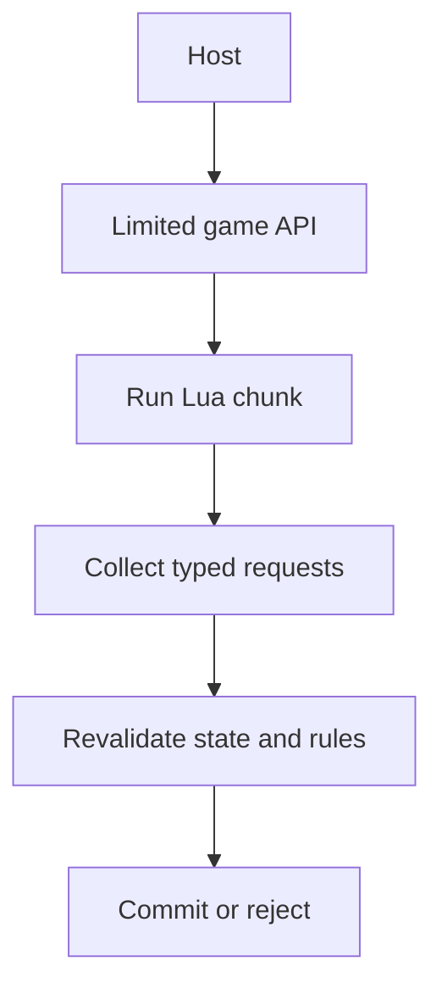
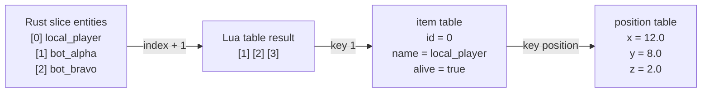

import SpeedType from '../../../../components/kit/SpeedType.astro';
import Frame from '../../../../components/kit/Frame.astro';
import CodeTrace from '../../../../components/CodeTrace.astro';
import { Badge, Steps } from '../../../../components/kit';
import MemoryStrip from '../../../../components/MemoryStrip.astro';
import MarginNote from '../../../../components/kit/MarginNote.astro';

## The host owns the interpreter

`mlua` creates and controls a Lua virtual machine from the host. The project pins:

```toml
[dependencies]
anyhow = "1.0"
mlua = { version = "0.12", features = ["lua54", "vendored", "error-send"] }
```

`lua54` chooses Lua 5.4. `vendored` builds the matching Lua implementation with the crate, so a learner does not need to find a separate Lua DLL. `error-send` lets contextual host error-reporting carry a Lua failure through `anyhow` without discarding its details.

The interpreter is a subsystem with its own state, memory manager, call stack, and error reporting. Embedding does not merge Lua and the host into one language. `mlua` builds a checked bridge that converts values and controls when execution crosses between them.

Treat each crossing as an interface:

- host-to-Lua inputs need a documented table shape and units;
- Lua-to-host requests need type checks and validation against current game state;
- errors need enough context to identify the script and boundary;
- callbacks need time and resource limits appropriate to the host loop.

The safest design passes snapshots and requests, not borrowed pointers into live game objects.

The host remains in charge even while Lua decides what it would like to do:



Lua plans with owned data; the host decides whether each plan is still valid at commit time.

## Load only the libraries you need

The Rust host creates the interpreter and selects three standard-library
groups. `new_with` returns an error if setup fails; `?` passes that error to
the caller before any script runs.

```rust
use mlua::{Lua, LuaOptions, StdLib};

let lua = Lua::new_with(
    StdLib::TABLE | StdLib::STRING | StdLib::MATH,
    LuaOptions::default(),
)?;
```

This lab needs table helpers, string formatting, and math. It does not load the Lua `io`, `os`, `debug`, or package libraries.

Removing libraries is not a complete hostile-code sandbox. It is still good capability hygiene: a script cannot call a function that does not exist in its environment.

## Expose one host function

The script needs a way to report what it observed. This closure accepts one
Lua string, prints it with a prefix in the host process, and returns success;
registering it under `log` makes the name callable from Lua.

Optional: practise the named operations and their inputs with a few whole-token blanks.

<SpeedType id="lua-host-log-contract" title="Recall the host callback boundary" recall={[{"text": "lua.create_function", "mask": "create_function", "kind": "api", "hint": "Build a typed host callback callable by Lua."}, {"text": "message: String", "mask": "String", "kind": "type", "hint": "Request a host string for the Lua argument."}, {"text": "lua.globals().set", "mask": "globals", "kind": "api", "hint": "Get the VM global table before registering the callback."}, {"text": "lua.globals().set(\"log\", log)", "mask": "log", "kind": "argument", "hint": "Register the callback value in that global table."}]}>

```rust
let log = lua.create_function(|_, message: String| {
    println!("[lua] {message}");
    Ok(())
})?;

lua.globals().set("log", log)?;
```

</SpeedType>

`create_function` converts Lua arguments into the requested host type. Passing a table where a `String` is required produces a Lua error instead of an unchecked cast.

<Frame caption={"Two separate calls to the registered log callback: a string is converted to String; a table fails the callback’s type conversion."}>
  
</Frame>

The first closure argument is the active `Lua` handle. It is named `_` here because logging does not need to create any Lua values.

Underneath, every call into a host function travels through Lua's value stack:
the caller supplies arguments, and the host function returns results through
that stack. The lab's `game.distance(a, b)` takes two position tables and
returns one number. Take this call, and call its first table `p` and its second
`q`:

```lua
local d = game.distance({ x = 0, y = 0, z = 0 }, { x = 3, y = 4, z = 0 })
```

The stack passes through three states:

<MemoryStrip
  column
  cells="top →=table q|=table p|=game.distance"
  caption="1. The Lua caller pushes the function value, then the two arguments in order. Each argument slot holds a reference to a table, not a copy of it."
/>

<MemoryStrip
  column
  cells="index 2 →=table q|index 1 →=table p"
  caption="2. The host function sees only its arguments, numbered from 1. mlua converts index 1 and index 2 into the closure's `(Table, Table)` parameters. A string or number in either slot fails that conversion and becomes a Lua error before the closure body runs."
/>

<MemoryStrip
  column
  cells="top →=5.0"
  marks="0"
  caption="3. The closure takes the differences 0 − 3 = −3, 0 − 4 = −4, and 0 − 0 = 0, and returns √((−3)² + (−4)² + 0²) = √(9 + 16 + 0) = √25 = 5.0. mlua pushes that one result and reports a count of 1, and Lua puts it where the function and both arguments used to be."
/>

## Prefer a namespace table

The single global `log` works for a first example, but a host with many
functions needs an obvious boundary. Put those functions under one `game`
table, so the next script call spells out who supplied the behavior:

<MarginNote kind="alternative">The `game` table is a labelled service counter: grouping callbacks makes it clear which operations come from the host.</MarginNote>

```rust
let game = lua.create_table()?;
game.set("log", lua.create_function(|_, message: String| {
    println!("[lua] {message}");
    Ok(())
})?)?;
lua.globals().set("game", game)?;
```

Lua then calls:

```lua
game.log("observer started")
```

The `game` table becomes the documented boundary between engine and script.

## Convert host records into Lua tables

The complete host creates a table for each copied entity:

```rust
fn snapshot_table(lua: &Lua, entities: &[EntitySnapshot]) -> mlua::Result<mlua::Table> {
    let result = lua.create_table()?;

    for (index, entity) in entities.iter().enumerate() {
        let item = lua.create_table()?;
        item.set("id", entity.id)?;
        item.set("name", entity.name)?;
        item.set("alive", entity.alive)?;

        let position = lua.create_table()?;
        position.set("x", entity.position[0])?;
        position.set("y", entity.position[1])?;
        position.set("z", entity.position[2])?;
        item.set("position", position)?;

        result.set(index + 1, item)?; // Lua sequences begin at one. 🔢
    }
    Ok(result)
}
```

Nested tables make the script readable: `entity.position.x` is clearer than `entity[4]`.

For the lab's sample data, the conversion produces this shape. Every Rust index
moves up by one key, and each entity becomes two tables, one nested in the
other:



The entity with `id = 0` sits at Lua key 1: the ID is data copied from the
game, and the key is only its place in the sequence.

## Load a named script with context

`script_path` is the file the host chose to run. Rust reads its text, gives the
Lua chunk that path as a name for errors, and executes it; failure at any step
returns to the host through `?`.

```rust
let source = std::fs::read_to_string(&script_path)?;
lua.load(&source)
    .set_name(script_path.to_string_lossy())
    .exec()?;
```

Naming the chunk gives errors a useful file label. The complete lab adds `anyhow::Context` so the host error also says which script failed.

## Separate setup, execution, and results

A clear host follows this order:

<Steps>

1. create the Lua state;
2. apply resource limits;
3. construct the host API;
4. load script text;
5. execute it once or register callbacks;
6. collect bounded requested actions;
7. validate those actions in the host;
8. report errors without crashing the engine.

</Steps>

Do not let a script run during partial API construction. Do not hold a mutable game-state lock across script execution. Give Lua a copied snapshot and collect requests for later processing.

<MarginNote kind="narration">A script can call back into the host while it runs. Keeping an engine lock across that call can make otherwise valid work wait on itself.</MarginNote>

This is a two-phase boundary. During **planning**, Lua reads an immutable snapshot and returns proposed actions. During **commit**, the host checks that the target, snapshot version, and entity IDs still match, and that the action is permitted in the current state. A plan based on an old snapshot is rejected instead of being applied to a different moment.


<CodeTrace trace="handoff-script-commit" />

## Run all three useful scripts

<Badge text="Any computer" variant="success" />

The observer logs copied entity data. The nearest-entity script measures living
candidates and proposes one selection; the state-machine script proposes a
marker and then stops. Compare those proposals with the host's accepted-action
output after each run.

```powershell
cargo run --manifest-path lua-labs/Cargo.toml -- scripts/observer.lua
cargo run --manifest-path lua-labs/Cargo.toml -- scripts/nearest_entity.lua
cargo run --manifest-path lua-labs/Cargo.toml -- scripts/state_machine.lua
```

The host prints accepted actions after the script returns. That delay is deliberate: Lua proposes data, and the host remains the authority that decides what happens.

<MarginNote kind="brief">Lua proposes data; the host checks and applies the proposal after script execution returns successfully.</MarginNote>

## Why the host still needs validation

`mlua` safely converts values at the language boundary, but it cannot decide whether an entity exists or an action is currently allowed. The host must still check:

- entity IDs exist in the current snapshot;
- coordinates are finite and within the map;
- an action is allowed in the current state;
- the script has not exceeded a rate limit;
- the target still matches the verified local build.

Converting a value safely does not prove that the resulting action is allowed. A good host checks both.
