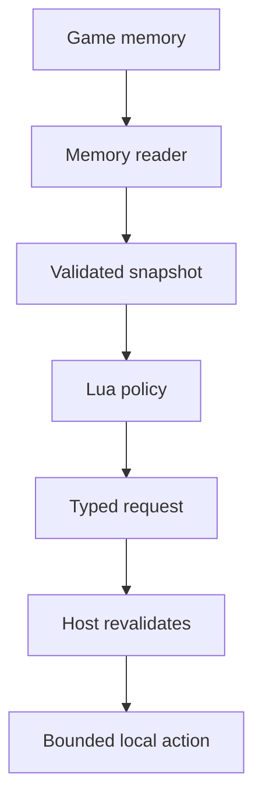
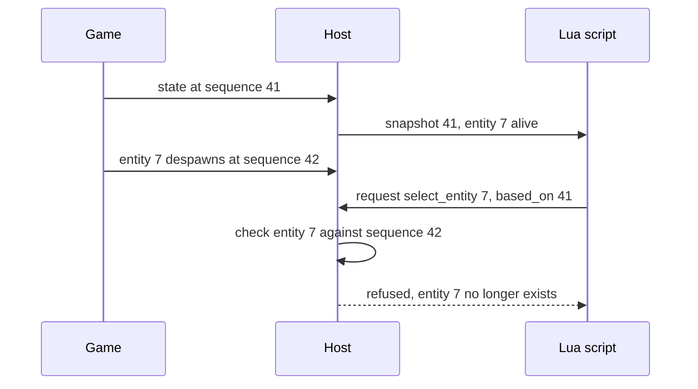

import MemoryStrip from '../../../../components/MemoryStrip.astro';

## Do not turn Lua into an untyped memory API

After building a memory reader, it is tempting to expose this:

```lua
-- ❌ Every version rule, bound, and permission now leaks into every script.
local bytes = memory.read(address, count)
memory.write(address, replacement)
```

That design gives a typo the power of the process handle. It also couples scripts to exact offsets and makes every mod responsible for pointer validation.

Expose domain meaning instead:

```lua
local entities = game.snapshot()
game.request({ kind = "select_entity", id = entities[2].id })
```

## The host owns collection and validation

The Windows layer should:

1. open the target with the least required rights;
2. verify game build and architecture;
3. resolve versioned roots and pointer paths;
4. copy fields with bounds and plausibility checks;
5. create ordinary owned records;
6. close or retain handles according to one clear owner.

Only step 5 crosses into Lua.

The boundary turns unstable bytes into stable meaning, then turns script intent back into checked data:



Addresses stop at the memory reader; Lua receives fields with names, units, and a snapshot version.

```rust
#[derive(Clone, Debug)]
struct EntitySnapshot {
    id: u32,
    name: String,
    position: [f32; 3],
    alive: bool,
}
```

There are no process addresses in this type. A script cannot keep a stale pointer because it never receives one.

Here is one entity as a hypothetical build lays it out in game memory, and the
same entity after the observer has copied it into a snapshot and the host has
turned that into a Lua table:

<MemoryStrip
  cells="+0x10=7|+0x30=4.0|+0x34=9.0|+0x38=2.0|+0x3C=1|+0x40=0x1F2A8C40"
  groups="0:id, `u32`|1-3:position, three `f32`|4:alive byte|5:name pointer"
  caption="Game memory, labelled by offset from the start of the object; only the fields the snapshot needs are shown. Each `f32` is 4 bytes wide, so `x`, `y`, and `z` sit at `0x30`, `0x30 + 4 = 0x34`, and `0x34 + 4 = 0x38`. The one-byte alive flag at `0x3C` is followed by 3 unused bytes, because an 8-byte pointer starts on a multiple of 8 and `0x40` (64 = 8 × 8) is the next one. The name itself is not stored here: the object holds the address of text kept elsewhere, which the observer follows and copies with a length limit."
/>

<MemoryStrip
  cells="id=7|name=archer|position.x=4.0|position.y=9.0|position.z=2.0|alive=true"
  caption="The Lua table the script receives. Every value arrives under a name, the alive byte `1` has become the boolean `true`, and no offset or pointer survives the copy."
/>

## A snapshot has a time and version

Real snapshots should carry metadata:

```rust
#[derive(Clone, Debug)]
struct GameSnapshot {
    sequence: u64,
    captured_at_ms: u64,
    profile: String,
    entities: Vec<EntitySnapshot>,
}
```

## Put an abstraction barrier between bytes and game meaning

An **abstraction barrier** is a rule about who may know a representation. The
observer below the barrier knows that one build stores an entity position at a
particular pointer path. Lua above the barrier knows only that an entity has an
`id`, `name`, `position`, and `alive` state.

```text
Lua automation
  depends on: snapshot fields and bounded request meanings
---------------- abstraction barrier ----------------
memory observer
  depends on: Windows handles, build profiles, offsets, encodings, and bounds
```

If a later build moves the position field, only the observer and
its target profile should change. Every script should not learn a new offset.

Make the source of snapshots replaceable too:

```rust
trait SnapshotSource {
    fn next_snapshot(&mut self) -> anyhow::Result<GameSnapshot>;
}

fn collect_for_lua(source: &mut impl SnapshotSource) -> anyhow::Result<GameSnapshot> {
    let snapshot = source.next_snapshot()?;
    anyhow::ensure!(
        snapshot.entities.len() <= 256,
        "snapshot exceeds the published entity limit"
    );
    Ok(snapshot)
}
```

A live Windows observer and a replay-file reader can both implement
`SnapshotSource`. The same Lua state machine can then run against recorded data
in a test and against the verified game in the lab. That is not just reuse: it
lets you test automation without giving the test a process handle.

When Lua requests an action, include the sequence it observed:

```lua
game.request({
    kind = "select_entity",
    entity_id = target.id,
    based_on = snapshot.sequence,
})
```

The host can reject a request based on a snapshot that is too old. This is safer than pretending copied data is live.



The script did nothing wrong: entity 7 really was alive in snapshot 41. The
game moved on while the script was deciding, and `based_on` lets the host see
that the request describes a moment that has already passed.

## Requests are data, not commands

Bad interface:

```lua
game.execute("select " .. target.id) -- ❌ a command-language injection boundary
```

Better interface:

```lua
game.request({ kind = "select_entity", id = target.id }) -- ✅ structured data
```

The host matches an explicit enum:

```rust
enum RequestedAction {
    SelectEntity(u32),
    PlaceMarker { x: f32, y: f32, z: f32 },
}
```

Unknown `kind` values fail. No string becomes PowerShell, a console command, or arbitrary game code.

## Validate again at action time

Between snapshot and request processing, an entity may disappear. Check:

- the sequence is recent;
- the entity still exists;
- its current state permits the action;
- all numbers are finite;
- coordinates remain within known map bounds;
- the per-script action budget is not exhausted.

This is a time-of-check/time-of-use issue. Validation during snapshot creation does not guarantee future state.

## Keep read and write capabilities separate

Most analysis scripts need only snapshots and logs. Give them an observer API with no request function at all.

When an offline automation lab needs actions, load it with a different capability set:

```text
ObserverScript: snapshot + log
AutomationScript: snapshot + log + two bounded requests
DeveloperScript: extra diagnostics in a disposable test build
```

Do not decide permissions from a script-provided name. The host chooses the API before executing the script.

## Test the boundary without a game

The `lua-labs` host uses a simulated snapshot. Add tests where Lua requests:

- a missing entity ID;
- `0/0` or infinity as a coordinate;
- an unknown action;
- too many actions;
- an action from an expired sequence.

The host should reject each request with a useful error and remain alive.

This architecture also makes the script portable. The same Lua logic can consume a recorded replay, a simulated world, or a live observer because it depends on the snapshot contract rather than Windows memory details.
