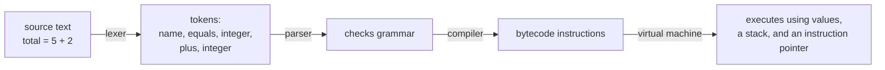

import MemoryStrip from '../../../../components/MemoryStrip.astro';

## An interpreter is a pipeline

When Lua reads `total = 5 + 2`, it does not ask the CPU to execute the characters `+` and `=` directly. Several layers turn text into actions:

1. a **lexer** groups characters into tokens such as name, equals, integer, plus, integer;
2. a **parser** checks that the token order follows the language grammar;
3. a compiler turns the meaning into compact bytecode instructions;
4. a virtual machine executes those bytecodes using values, a stack, and an instruction pointer.



Real Lua is carefully optimized. Our tiny VM is intentionally smaller so every moving part fits on one page.

These stages are common, but they are not the definition of every interpreter. One
interpreter may walk a syntax tree directly; another may compile to bytecode first;
a just-in-time compiler may later translate hot bytecode into native machine code.
The language's meaning can stay the same while its implementation changes.

That gives us an important abstraction boundary:

```text
language rule:  `+` adds two numbers and produces a number
implementation: pop two VM values, check their variants, add, push the result
machine work:    host code becomes native instructions executed by the CPU
```

Do not explain Lua semantics by accident from one current bytecode layout. The
source rule is the contract; tokens, syntax trees, bytecodes, stacks, and native
instructions are replaceable representations used to carry it out.

## Bytecode names small operations

The lab uses an enum instead of raw bytes:

```rust
enum Instruction {
    Constant(usize),
    Add,
    GreaterThan,
    JumpIfFalse(usize),
    Jump(usize),
    Print,
    Halt,
}
```

`Constant(2)` means “copy constant number two onto the value stack.” `Add` pops two integers and pushes their sum. `JumpIfFalse(9)` changes the VM instruction pointer when the popped condition is false.

An enum makes this teaching VM easy to inspect. A full game-scripting
interpreter may encode opcodes and operands more densely after profiling shows
that bytecode size or dispatch speed matters.

That `9` is not decoration. Jump operands are positions in the bytecode vector,
so they only mean anything once you can see the whole program. Here is the
lab's example, `if (5 + 2) > 6 then print(1) else print(0)`, after compilation.
The constants are collected into a pool, and the instructions refer to them by
index:

<MemoryStrip
  cells="0=5|1=2|2=6|3=1|4=0"
  caption="The constant pool for `if (5 + 2) > 6 then print(1) else print(0)`. Instructions refer to these by index, never by value directly."
/>

```text
constant pool:  0:5   1:2   2:6   3:1   4:0

  0  Constant(0)        push 5
  1  Constant(1)        push 2
  2  Add                pop two, push 7
  3  Constant(2)        push 6
  4  GreaterThan        pop two, push true
  5  JumpIfFalse(9)     condition false -> continue at 9
  6  Constant(3)        push 1          <- then branch
  7  Print
  8  Jump(11)           skip the else branch
  9  Constant(4)        push 0          <- else branch
 10  Print
 11  Halt
```

Now the operands read as addresses within this listing. `JumpIfFalse(9)` sends
a false condition to index 9, which is exactly where the else branch begins.
`Jump(11)` carries the then branch past the else branch to the `Halt`. The
`if`/`else` structure you wrote in Lua has become two jumps and a layout — the
compiler kept the meaning and threw away the shape.

## The VM has its own instruction pointer

The CPU has an instruction pointer such as `RIP`. The VM also needs one, but it points into the bytecode vector:

```rust
let instruction = *self.code
    .get(self.instruction_pointer)
    .ok_or_else(|| VmError("instruction pointer left the program".into()))?;
self.instruction_pointer += 1; // 🧭 Default to the next bytecode.
```

A jump replaces that default next location. Bounds checks prevent corrupt bytecode from jumping outside the program.

## Model the VM as state plus one transition function

At any instant, this tiny machine is completely described by a small state:

```text
instruction pointer
bytecode vector
constant pool
value stack
remaining step budget
output produced so far
```

One interpreter-loop iteration reads the current instruction and changes that
state. `Constant` advances the pointer and grows the stack. `Add` removes two
values and adds one. `Jump` changes the pointer. `Print` moves a value to observable
output. `Halt` ends the transition loop.

This state-machine view is more reliable than imagining that the VM “somehow runs
Lua.” It lets you state an invariant for every instruction: required stack inputs,
resulting stack height, legal jump targets, possible error, and instruction-pointer
change.

## The value stack carries temporary results

Indices 0 to 4 of that listing compute `(5 + 2) > 6`. Watching the stack
through those five steps shows where the intermediate values live:

| Step | Bytecode | Stack after step |
|---:|---|---|
| 1 | constant 5 | `5` |
| 2 | constant 2 | `5, 2` |
| 3 | add | `7` |
| 4 | constant 6 | `7, 6` |
| 5 | greater-than | `true` |

<MemoryStrip
  column
  cells="top →=2|=5"
  caption="The value stack right after step 2 (`Constant(1)` pushed `2` on top of the `5` pushed in step 1)."
/>

`Add` pops the right side first because it was pushed last. This last-in, first-out order is the same basic idea as a call stack, although a real VM may use separate regions or registers for different jobs.

## Keep dynamic types explicit

Lua values can have several types. Our tiny subset has two:

```rust
enum Value {
    Integer(i64),
    Boolean(bool),
}
```

`pop_integer` checks the variant. Adding a Boolean produces a useful VM error rather than reinterpreting its bytes as a number. Dynamic typing means the check happens at run time; it does not mean “types do not exist.”

A larger Lua VM also needs an **environment** that maps names to values. Functions
capture environments through closures, tables hold references to other values, and
garbage collection decides when unreachable heap objects can be reclaimed. Those
features enlarge the state, but they do not change the basic model: each operation
checks its inputs and moves the machine from one valid state to the next.

## Separate four kinds of failure

Keeping stages separate produces clearer errors:

| Stage | Example failure |
|---|---|
| Lexing | unfinished quoted string |
| Parsing | `if` without the required structure |
| Bytecode validation | jump target outside the program |
| Execution | adding a Boolean to an integer or exhausting the budget |

If all four become “script failed,” the host cannot tell whether the author wrote
invalid Lua, the compiler produced invalid code, or a valid script exceeded the
game tool's resource policy.

## Budgets belong inside the execution loop

Every instruction consumes one step:

```rust
if self.steps_left == 0 {
    return Err(VmError("instruction budget exhausted".into()));
}
self.steps_left -= 1;
```

The test program `Jump(0)` would loop forever without this guard. This miniature rule connects directly to the instruction hook used by the `mlua` host earlier in the chapter.

## Run the original lab

```powershell
cargo run --manifest-path lua-labs/Cargo.toml --bin mini_vm
cargo test --manifest-path lua-labs/Cargo.toml --bin mini_vm
```

The executable evaluates `if (5 + 2) > 6 then print(1) else print(0)`. Tests prove that an invalid jump is rejected and an infinite loop reaches its budget.

For a much larger interpreter-building journey, [Build a Lua Interpreter in Rust](https://wubingzheng.github.io/build-lua-in-rust/en/) develops tokens, bytecode, values, tables, control flow, functions, and closures over many stages. This book’s VM and wording are original and deliberately smaller; the linked book is useful further reading when you want to build a language implementation rather than embed an existing Lua runtime.
