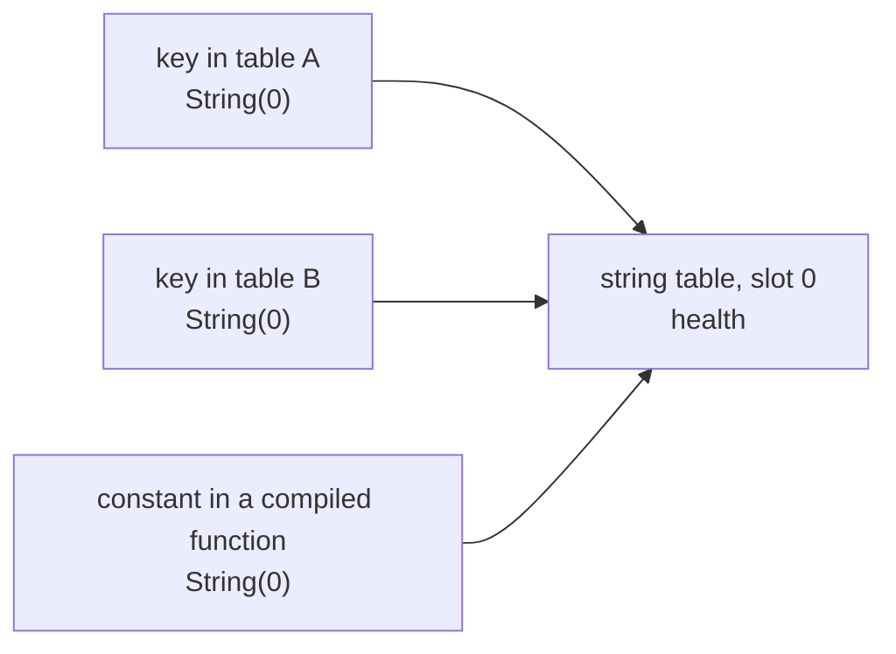
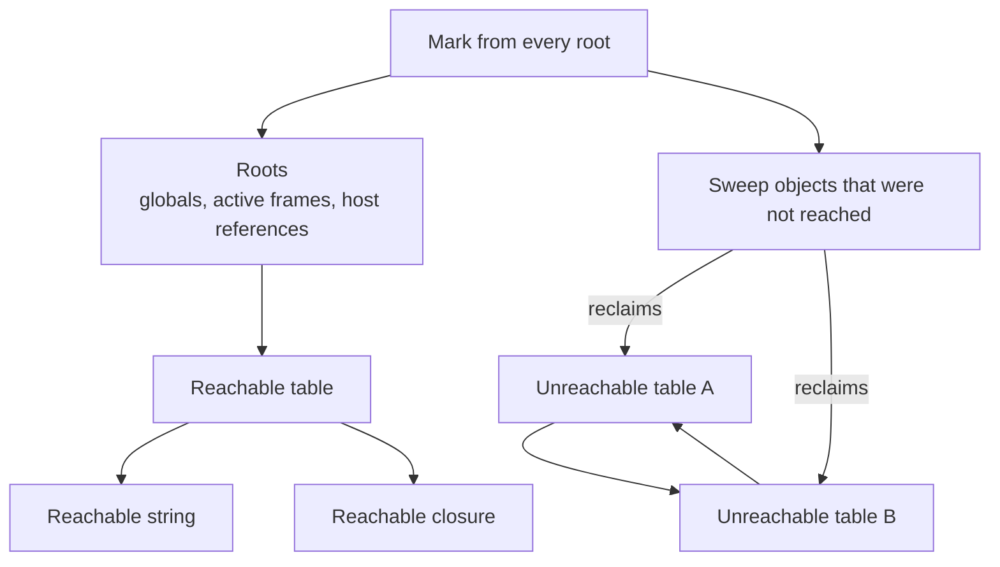

import MemoryStrip from '../../../../components/MemoryStrip.astro';

## Dynamic values still need a representation

The host often knows a value’s type at compile time. Lua decides many operations at run time. An interpreter therefore carries a tag with each value:

```rust
enum Value {
    Nil,
    Boolean(bool),
    Integer(i64),
    Float(f64),
    String(StringId),
    Table(TableId),
    Function(FunctionId),
}
```

The IDs here are handles into VM-owned storage. That keeps interpreter objects under one memory manager instead of handing scripts raw native pointers.

Three stack slots show the idea. Each value carries its tag beside its payload,
and an operation reads the tags before it touches any payload:

<MemoryStrip
  cells="tag=Integer|payload=42|tag=Table|payload=id 3|tag=Nil|payload=unused"
  groups="0-1:`Value::Integer(42)`|2-3:`Value::Table(TableId(3))`|4-5:`Value::Nil`"
  caption="`+` checks both tags first. Two `Integer` tags let it add the payloads; an `Integer` beside a `Table` fails the check, and this VM raises a type error instead of adding a number to a handle (real Lua first looks for an `__add` metamethod). The `Table` payload is not a pointer: id 3 is looked up in storage the VM owns."
/>

## A Lua table combines array-like and map-like storage

Lua uses tables for sequences, records, dictionaries, objects, and module namespaces. An implementation can optimize common integer keys with an array part while keeping other keys in a hash-map part:

```lua
local palette = { "red", "green", "blue", name = "palette", selected = 2 }
```

<MemoryStrip
  cells="1=red|2=green|3=blue|name=palette|selected=2"
  groups="0-2:array part: keys 1 to 3, found by position|3-4:hash part: found by hashing the key"
  caption="One table, two storage areas, as the Lua 5.4 implementation builds it. The constructor counts three positional values and two named fields, so it sizes a 3-slot array part and a 2-node hash part. `palette[2]` is a direct array read; `palette.name` hashes the string `name` to choose a node."
/>

This is an implementation strategy, not two separate Lua values. The language still presents one table. It also explains why `pairs` promises no meaningful order: it walks the array part first and then the hash nodes in node order, and node order follows the keys' hash values rather than the order they were written.

When the host converts a `Vec` to Lua, it writes keys `1`, `2`, and `3`. When it converts a record, it writes named keys such as `health` and `position`. The script can use both forms, but the host should document which shape it promises.

## Strings need ownership too

Repeated source names and table keys can create many duplicate strings. An interpreter may **intern** strings: store one canonical copy and let values carry a small ID or shared reference.



Checking whether two interned strings are equal is then one integer comparison,
`0 == 0`, however long the text is. Interning makes equality fast, but it adds lifetime work. The interpreter must know when no live value, table key, closure, or compiled function still needs the string.

## Reference counting handles sharing, not every cycle

`Rc<T>` counts strong owners. It frees the value when the count reaches zero. That works for many interpreter objects, but tables can form cycles:

```lua
local a = {}
local b = {}
a.friend = b
b.friend = a
```

If each table strongly owns the other, both counts stay above zero even after the script drops `a` and `b`. Follow the arithmetic:

```text
after a = {} and b = {}      table A: 1 (a)             table B: 1 (b)
after a.friend = b           table A: 1                 table B: 2 (b, A.friend)
after b.friend = a           table A: 2 (a, B.friend)   table B: 2
a and b leave scope          table A: 1 (B.friend)      table B: 1 (A.friend)
```

Both counts settle at one, each held up solely by the other. Nothing in the
running program can reach either table any more, yet neither will ever be
freed. That is the shape of every reference-counting leak: the objects have
become unreachable without becoming unreferenced, and counting alone cannot
tell those two conditions apart.

A tracing garbage collector can start from roots—globals, active stacks, and live closures—mark reachable objects, then reclaim unmarked cycles.

Do not assume `Rc` by itself is a complete Lua garbage collector. A small non-cyclic interpreter can use it while learning, but a general implementation needs a cycle strategy.

## Roots answer “what is still reachable?”

Typical roots include:

- the global environment;
- each active function frame;
- values on VM stacks or registers;
- open upvalues captured by closures;
- host references intentionally kept alive.



The cycle between the two unreachable tables keeps both reference counts above
zero, but neither table can be reached from a root. A tracing collector can tell
the difference because it asks about reachability, not just owner counts.

A host API that retains a Lua table may accidentally keep a large graph alive. Resource limits should measure actual interpreter memory, not merely the size of the source file.

## Tables are capability containers

In our embedded host, the `game` table contains only selected callbacks. This is more than neat organization:

```lua
game.snapshot()
game.distance(a, b)
game.log("ready")
```

If `game.open_process`, `game.read_any_address`, or `os.execute` never enters the environment, ordinary scripts cannot call it. Table construction becomes part of the security boundary.

## Questions to ask while reversing an embedded VM

In a debug build, look for:

- a tagged-value dispatch that checks type before an operation;
- one central table lookup routine;
- a VM instruction pointer separate from the CPU instruction pointer;
- arrays of constants or bytecodes owned by compiled functions;
- root enumeration during garbage collection;
- native host callbacks registered under readable names.

Use these structures to explain tagged values, object reachability, table lookup, and callback dispatch in the scripting system.

## Further reading

The [Lua 5.4 reference manual](https://www.lua.org/manual/5.4/) is the source of truth for language behavior. [Build a Lua Interpreter in Rust](https://wubingzheng.github.io/build-lua-in-rust/en/) provides an extended implementation path through strings, tables, expressions, control structures, functions, and closures. Use both to understand the model, then write and test your own representation for the subset you intend to support.
