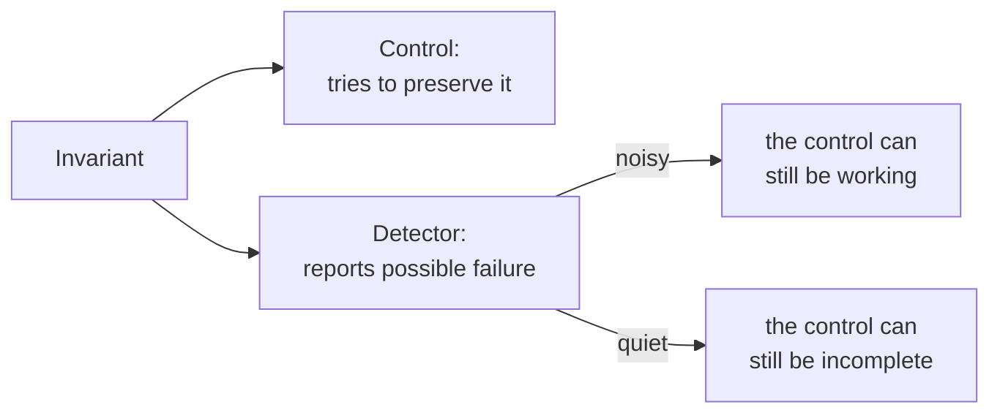
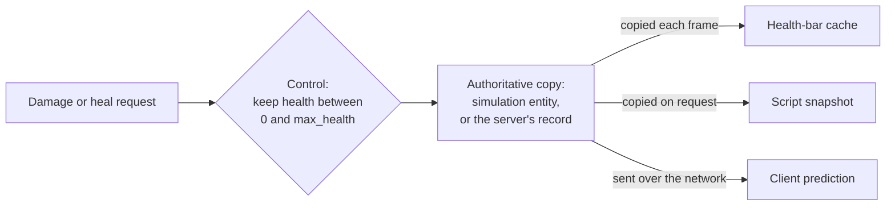
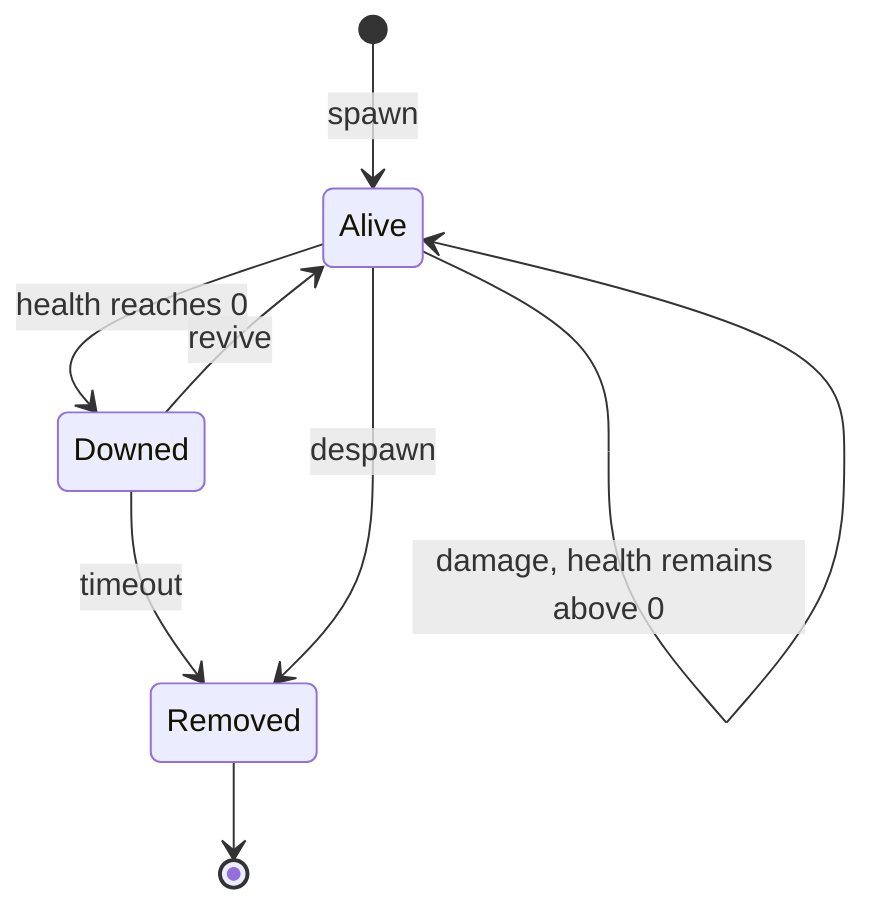

## Prerequisites

You should already be able to:

- distinguish a value from the address that currently stores it;
- identify the exact game build a tool is running against;
- read a small state machine and a timestamped event log;
- tell a read-only observer apart from code that changes game state.

## What bypass analysis means in this chapter

A **bypass** is a path that reaches an outcome without satisfying the
**control**, the code that was supposed to guard it. In a game, the mismatch is
often between a convenient proxy and the real rule:

| Proxy that gets checked | Property that actually matters |
|---|---|
| Menu button is enabled | Engine policy permits the state change |
| One field's checksum matches | The complete object relation is current and valid |
| One environment signal is absent | The requested command satisfies game rules |
| An old object still has a plausible address | The identity and generation still match |

The analysis pattern is always the same: state the promised rule, trace the
branch that claims to enforce it, follow every path to the effect, and look for
a path where the proxy and the real property disagree. Later lessons apply that
pattern to integrity checks, anti-debug behavior, encoded values, hooks, and
object layouts.

## An invariant is a property that must stay true

An **invariant** is a statement that must be true whenever the system is in a
valid state. Examples include:

- ammunition never becomes negative;
- an entity ID refers to at most one live entity in a snapshot;
- a patch is applied only to the exact build and bytes it was made for;
- a rendering hook is either fully installed or fully removed;
- a read-only observer never changes the game state.

An invariant does not live at one address. The health bound
`0 <= health <= max_health` can be enforced by a clamp instruction, depend on a
`max_health` field, and be reported by a log line, all at the same time. Each of
those is a place where the rule is kept or reported, and a bug in one of them
leaves the rule itself unchanged: a state with `health = 120` and
`max_health = 100` is invalid whichever of the three failed to catch it.

## State, transitions, controls, and detectors

| Term | Precise meaning | Example in a toy game |
|---|---|---|
| **State** | Values needed to describe the system at one moment | `health = 48`, `mode = Alive` |
| **Transition** | An event and rule that move state to another valid state | 5 damage changes health from 48 to 43 |
| **Invariant** | A property required of every valid state or transition | `0 <= health <= max_health` |

A control keeps an invariant true, usually by refusing or limiting a transition
before it takes effect. A damage routine that stops health at 0 instead of
letting it go negative is a control. A **detector** reports that an invariant
may already have failed, such as a scan that logs any entity whose health
exceeds its maximum. The two are separate pieces of code, so they fail
separately: a detector can be noisy while the control still works, or quiet
while the control is incomplete.



## A control guards one copy of the state

A game keeps several copies of the same fact. The simulation's entity object
holds health, the health bar keeps its own copy for drawing, a script receives
one in a snapshot, and in a networked game the server keeps a record while each
client keeps a prediction of it. Exactly one copy is **authoritative**: the one
whose value decides what happens next. In a single-player game that is usually
the simulation object. In a multiplayer game with an authoritative server it is
the server's record, and each client's copy is a prediction that the server can
overwrite.



A control protects only the copy it runs against. Code that validates the
health bar's copy and then applies damage to the simulation object has checked
one copy and changed another; Lesson 13.2 calls this the wrong source of truth.
**Server authority** is the same rule at network scale: the server validates
every client request against its own record, because anything a client
computed can be altered on the client's machine before it is sent.

The copies hold the same number most of the time, so reading a matching value
does not say which copy was read. Timing does. The authoritative copy changes
first and decides the next transition; every other copy catches up afterward,
on its own schedule.

## Draw the state machine

Suppose an entity can be alive, downed, or removed. A state diagram lists every
allowed transition:



The diagram raises a question that one memory sample cannot answer: does the
stored `health` field change before or after the `Alive -> Downed` transition?
A sample shows one moment. A trace of timestamped events shows the order.

## Trace state changes as typed events

A **trace** is a list of events in the order they were logged, each saying what
changed, when, and which observer saw it. Typed fields let a program check the
trace:

```rust
#[derive(Debug, Clone, Copy, PartialEq, Eq)]
enum Mode {
    Alive,
    Downed,
    Removed,
}

#[derive(Debug, Clone, PartialEq, Eq)]
struct TraceEvent {
    sequence: u64,
    tick: u64,
    source: &'static str,
    entity_id: u32,
    event: Event,
}

#[derive(Debug, Clone, PartialEq, Eq)]
enum Event {
    HealthRead { value: i32 },
    HealthWrite { before: i32, after: i32 },
    ModeChanged { before: Mode, after: Mode },
}
```

`sequence` gives log order. `tick` connects the event to the game clock.
`source` names the observer that produced the event. Because an event carries
typed fields rather than a sentence, a test can ask directly whether a
`HealthWrite` ending at 0 comes before the `ModeChanged` to `Downed` for the
same entity. A short trace for entity 7:

```text
sequence  tick  source        entity  event
      41   900  health watch       7  HealthWrite { before: 6, after: 0 }
      42   900  mode watch         7  ModeChanged { before: Alive, after: Downed }
      43   901  health bar         7  HealthRead { value: 0 }
```

Health reaches 0 at tick 900 and the mode changes in the same tick. The health
bar, which draws from a copy, shows 0 only at tick 901, one tick later.

Log order is not cause. Event 41 appearing before event 42 fits the damage
causing the transition, but it also fits both events sharing one cause, or two
observers that flushed their output at different times. Lesson 13.7 adds
correlation IDs, which tie together the events of one action even when log
order misleads.

## Glossary terms introduced here

- **Invariant:** a property required of every valid state or transition.
- **Control:** logic intended to preserve an invariant.
- **Detector:** logic that reports a possible invariant failure.
- **Authoritative state:** the one copy of a value whose contents decide what
  happens next.
- **Server authority:** a design in which the server's record is authoritative
  and every client request is validated against it.
- **Trace:** events listed in the order they were logged, each with its time
  and source.

## Checkpoint

You should now be able to describe a game system as state and transitions,
state the invariants it must keep, find the control that enforces each one and
the copy of state that control guards, and tell a control apart from a
detector.
