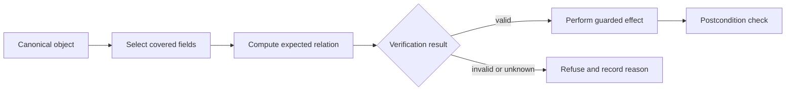
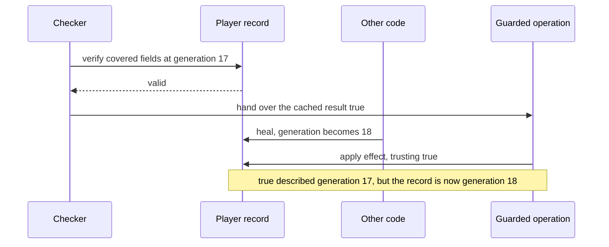

import MemoryStrip from '../../../../components/MemoryStrip.astro';

## Prerequisites

You should understand byte ranges, hashes, snapshots, state transitions, and
the difference between a copied value and the canonical value used by the
game.

## An integrity check is a claim about a boundary

An integrity check answers a narrow question such as, “Do these bytes equal the
expected bytes?” It does not automatically prove that the whole process, file,
object, or later operation is unchanged.

Every integrity check has five boundaries, and a passing result means nothing
outside them:

| Boundary | Question to answer |
|---|---|
| Bytes | Exactly which bytes are included? |
| Time | When are they measured, and how long is the result reused? |
| Identity | Which build, object, file, or module does the result describe? |
| Consumer | Which operation trusts the result? |
| Failure | What state is reached when verification cannot complete? |

The target invariant for this lesson is:

> A sensitive toy operation proceeds only when verification covers the same
> object, the required fields, and the state used by that operation.

## Follow the decision, not only the checksum function

The important path begins with canonical state and ends at the effect:



A result that is cached, copied to another object, or checked far from the
effect adds edges to this path. Each added edge is a place where the result can
stop describing the object, and the moment, it was computed for.

## A toy integrity record

This deliberately small record uses a checksum as an accidental-corruption
signal. It is not cryptographic authentication:

```rust
#[derive(Debug, Clone)]
struct PlayerRecord {
    player_id: u32,
    health: u16,
    max_health: u16,
    generation: u32,
    checksum: u32,
}

fn covered_checksum(record: &PlayerRecord) -> u32 {
    record.player_id
        .wrapping_mul(31)
        .wrapping_add(u32::from(record.health))
        .wrapping_add(u32::from(record.max_health).rotate_left(7))
        .wrapping_add(record.generation.rotate_left(13))
}

fn verify(record: &PlayerRecord) -> bool {
    record.health <= record.max_health
        && record.checksum == covered_checksum(record)
}
```

The checksum includes every field used to identify the record and interpret
health. The range invariant is checked separately because a matching checksum
does not make an impossible value meaningful.

For the record used in the examples below, player 7 with 80 of 100 health at
generation 3, the checksum works out like this:

```text
player_id  wrapping_mul(31)    7 × 31                  =    217
health                                                 +     80
max_health rotate_left(7)      100 × 2^7 = 100 × 128   + 12,800
generation rotate_left(13)     3 × 2^13 = 3 × 8,192    + 24,576
checksum                                               = 37,673
```

`rotate_left(7)` moves every bit of the 32-bit word seven places toward the
high end, and any bit pushed off the top re-enters at the bottom. For a small
number nothing reaches the top. 100 is `1100100` in binary, seven bits wide
because it is less than 2⁷ = 128, so after moving seven places its highest bit
sits at position 6 + 7 = 13, far below bit 31. The rotation is then exactly a
multiplication by 2⁷. The same reasoning turns `3.rotate_left(13)` into
3 × 2¹³. The total, 37,673, is far below 2³² (about 4.3 billion), so none of the
wrapping operations actually wraps.

<MemoryStrip
  cells="player_id=7|health=80|max_health=100|generation=3|checksum=37,673"
  groups="0-3:inputs to `covered_checksum`|4:stored result"
  caption="`verify` recomputes a checksum from the first four fields and compares it with the fifth. A field left out of the braced range could change without the comparison noticing."
/>

## Distinguish four failure classes

### Incomplete coverage

A check covers `health` but ignores `max_health` or `player_id`. The bytes can
be internally consistent while describing the wrong entity or an impossible
range.

Watch it happen to the record above. Suppose `covered_checksum` had been written
without the `max_health` term — an easy omission, since the field is rarely the
one being updated. For player 7 that shorter sum is 217 + 80 + 24,576 = 24,873,
and 24,873 is what the record stores. Now change `max_health` from 100 to 60
and recompute nothing:

<MemoryStrip
  cells="player_id=7|health=80|max_health=60|generation=3|checksum=24,873"
  marks="2"
  groups="0-1:covered|2:not covered|3:covered|4:stored result"
  caption="The shorter checksum after `max_health` drops from 100 to 60. The changed box is outside every covered range, so recomputing still gives 217 + 80 + 24,576 = 24,873, while health 80 now exceeds the maximum of 60."
/>

The checksum is doing its job correctly. It is reporting that every byte it
covers is unchanged, and that is true. The record is still impossible, because
the damage was done to a field the check never looked at.

The complete `covered_checksum` catches the same edit. With `max_health = 60`
its third term becomes 60 × 128 = 7,680, so the sum becomes
217 + 80 + 7,680 + 24,576 = 32,553, which no longer equals the stored 37,673.

This is why `verify` has two clauses rather than one. The checksum answers "did
the covered bytes change?" and the range test answers "is this record
possible?", and neither question implies the other. A record can pass one and
fail the other in both directions, so a check that asks only the first will
accept states the game's own rules forbid.

### Wrong source of truth

The code verifies a display cache, then applies an operation to the canonical
simulation object. The check and effect refer to different state.

### Stale decision

The program verifies generation 17, the object changes to generation 18, and a
later operation trusts the old `true`. This is a time-of-check/time-of-use
problem.



The result was correct when it was computed. It went stale because nothing tied
it to the generation it described. A consumer that compares the result's
generation with the record's current generation refuses it at the last step.

### Ambiguous failure

A read error, unsupported build, and genuine mismatch all become `false` or,
worse, silently become “valid.” Use explicit results:

```rust
#[derive(Debug, Clone, Copy, PartialEq, Eq)]
enum IntegrityFailure {
    WrongBuild,
    Unreadable,
    IdentityChanged,
    OutOfRange,
    ChecksumMismatch,
}
```

These variants are useful telemetry and make tests state exactly which promise
failed.

## Keep verification beside the effect

A guarded update can consume the same mutable object it verifies:

```rust
fn apply_heal(record: &mut PlayerRecord, amount: u16) -> Result<(), IntegrityFailure> {
    if record.health > record.max_health {
        return Err(IntegrityFailure::OutOfRange);
    }
    if record.checksum != covered_checksum(record) {
        return Err(IntegrityFailure::ChecksumMismatch);
    }

    // The checked object is also the object changed below.
    record.health = record.health.saturating_add(amount).min(record.max_health);
    record.generation = record.generation.wrapping_add(1);
    record.checksum = covered_checksum(record);
    Ok(())
}
```

This local function is easy to reason about because the check and effect share
one exclusive borrow. Across process or thread boundaries, use versioned
snapshots, expected-byte comparisons, or a command sent to the owner of the
state; a remote read followed by a remote write is not atomic.

## Test the relation, not one handpicked example

Useful regression properties include:

- changing any covered field without updating the checksum is rejected;
- changing an uncovered display-only field does not affect verification;
- `health > max_health` is rejected even with a recomputed checksum;
- a stale `generation` is refused at the consuming boundary;
- read failure produces `Unreadable`, never “valid”;
- every refusal emits a bounded reason code and no state change.

For the small record above, iterate over each covered field and flip one bit.
That mutation test proves the test suite notices missing coverage.

## Glossary terms introduced here

- **Integrity:** confidence that state still satisfies its required relation.
- **Coverage:** the exact data and conditions examined by a check.
- **Canonical state:** the state the game actually uses to decide an effect.
- **Freshness:** whether a check result still describes the state being consumed.
- **TOCTOU:** a gap in which state changes between checking and using it.
- **Postcondition:** a property that must hold after an operation completes.

## Checkpoint

You should now be able to trace an integrity result from selected bytes to its
consumer, identify incomplete coverage or stale identity, and place a repair
where the verified state and the guarded effect meet.
