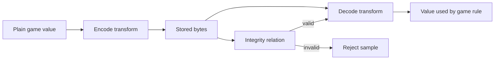
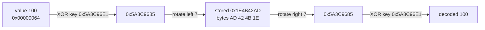

import MemoryStrip from '../../../../components/MemoryStrip.astro';

## Prerequisites

You should be comfortable with hexadecimal integers, XOR, bit rotation,
wrapping arithmetic, breakpoints, and tracing a value through several
instructions.

## Why a stored value can look like noise

An encoded field often looks like noise in a memory viewer, because the bits
being stored are not the number the game displays. That on its own tells you
almost nothing about what is being done to it.

Five words get used as though they were interchangeable here, and they are not:

| Word | What it is actually for | Needs a secret? |
|---|---|---|
| compression | making the bytes smaller | no |
| serialization | arranging values for storage or sending | no |
| obfuscation | making the bytes awkward to read | no |
| authentication | proving nobody altered the bytes | yes |
| encryption | hiding the bytes from anyone without the key | yes |

Only the last two involve a secret. Mistaking obfuscation for encryption sends
you hunting for a key that was never there; mistaking encryption for
obfuscation wastes days trying to spot a pattern in output designed to have
none.

The rule your decoder has to satisfy:

> Decoding an encoded value returns exactly the original value, and any
> integrity check travelling with it is verified *before* the decoded value is
> used for anything.

The second half is the part people skip. A value that decodes cleanly is not
the same as a value nobody tampered with — decoding will happily produce a
plausible-looking number from bytes somebody edited.

Trace both directions:



The write path often reveals the forward transform. The read path reveals its
inverse and the order of operations.

## Obfuscation and encryption answer different questions

| Property | Reversible obfuscation | Authenticated encryption |
|---|---|---|
| Main purpose | Change representation | Keep data secret and detect modification |
| Secret required | Often no durable secret | Yes |
| Repeated values | May reveal obvious patterns | Nonces should make ciphertexts differ |
| Modification detection | Optional ad-hoc tag | Authentication tag is part of the design |
| Analysis result | Recover the transform | Identify algorithm, key/nonce lifecycle, and boundaries |

A reversible XOR-and-rotate transform is useful for learning data flow, but it
is not a security boundary.

## Follow one complete toy transform

A minimal reversible transform is:

```rust
const ROTATION: u32 = 7;

pub const fn encode(value: u32, key: u32) -> u32 {
    (value ^ key).rotate_left(ROTATION)
}

pub const fn decode(encoded: u32, key: u32) -> u32 {
    encoded.rotate_right(ROTATION) ^ key
}
```

Read `encode` left to right. XOR combines the value and key; rotation moves the
bit positions. To invert it, reverse both the order and each operation:

1. rotate right by the same count;
2. XOR with the same key because `x ^ k ^ k == x`.

This “reverse order, invert each step” rule also helps when disassembly shows a
longer composition.

## One value through the transform, bit by bit

Take `value = 100` and `key = 0x5A3C96E1`. The whole round trip, before each
arrow is worked out below:



In hexadecimal, 100 is `0x64`, because 6 × 16 + 4 = 96 + 4 = 100; as a 32-bit
number it is `0x00000064`. Each hexadecimal digit stands for exactly four bits:
`6` is 4 + 2 = `0110`, `4` is `0100`, `A` (10) is 8 + 2 = `1010`, and `E` (14)
is 8 + 4 + 2 = `1110`. That lets both numbers be written out bit by bit.

**Step 1, XOR with the key.** XOR outputs 1 in each bit position where its two
inputs differ and 0 where they match:

```text
value         0x00000064   0000 0000 0000 0000 0000 0000 0110 0100
key           0x5A3C96E1   0101 1010 0011 1100 1001 0110 1110 0001
value ^ key   0x5A3C9685   0101 1010 0011 1100 1001 0110 1000 0101
```

The top six hexadecimal digits of `value` are zero, and XOR with 0 changes
nothing, so the key's own digits `5A3C96` pass straight through. Only the last
byte mixes: `0110 0100` against `1110 0001` differ in the positions that give
`1000 0101`, which is `0x85`.

**Step 2, rotate left by 7.** Every bit moves seven places toward the high end,
and the seven bits pushed off the top re-enter at the bottom. Here are the same
32 bits split after the seventh, before and after the move:

```text
value ^ key   0101101  0001111001001011010000101
              (top 7)  (remaining 25)

rotated       0001111001001011010000101  0101101
              (remaining 25)             (top 7, now at the bottom)

regrouped     0001 1110 0100 1011 0100 0010 1010 1101
hex digits       1    E    4    B    4    2    A    D    = 0x1E4B42AD
```

x86 stores a 32-bit number lowest byte first, which is called little-endian, so
memory holds the four bytes in the reverse of the order they are written in
hexadecimal:

<MemoryStrip
  cells="+0=64|+1=00|+2=00|+3=00"
  caption="The plain value 100, `0x00000064`, as it would sit in memory: lowest byte first."
/>

<MemoryStrip
  cells="+0=AD|+1=42|+2=4B|+3=1E"
  marks="0-3"
  caption="What memory holds instead: `encode(100, 0x5A3C96E1)` = `0x1E4B42AD`. No byte is `64`, so a memory scan for the value 100 never matches this field."
/>

Decoding runs the same steps backward. Rotating `0x1E4B42AD` right by 7 carries
its bottom seven bits, `0101101`, back to the top and restores `0x5A3C9685`.
XOR with the key then cancels it: the top six digits are identical in both
numbers, and anything XORed with itself is 0, while the last byte gives
`1000 0101` against `1110 0001` = `0110 0100` = `0x64` = 100.

## Compare encodings of values that differ in one known way

Encoding a few chosen values with the same key exposes the transform's parts
one at a time. With the key from the example:

| Plain value | Encoded value | Stored bytes |
|---:|---:|---|
| 100 | `0x1E4B42AD` | `AD 42 4B 1E` |
| 101 | `0x1E4B422D` | `2D 42 4B 1E` |
| 0 | `0x1E4B70AD` | `AD 70 4B 1E` |

The comparisons work because the key cancels. Rotation only moves bits, and XOR
works on each bit position separately, so rotating two numbers and then XORing
them gives the same result as XORing them first and rotating afterward. For any
two plain values `a` and `b`, the key drops out of `encode(a) ^ encode(b)`:

```text
encode(a) ^ encode(b) = rotl(a ^ key, 7) ^ rotl(b ^ key, 7)
                      = rotl(a ^ key ^ b ^ key, 7)
                      = rotl(a ^ b, 7)          because key ^ key = 0
```

**100 against 101 exposes the rotation.** 100 is `0110 0100` and 101 is
`0110 0101`: adding 1 to an even number flips only bit 0, so `100 ^ 101 = 1`.
The two encodings must then differ by `rotl(1, 7)` = 2⁷ = 128 = `0x80`, a
single bit at position 7. They do. `0xAD` is `1010 1101` and `0x2D` is
`0010 1101`, which differ only in their top bit, bit 7 of the lowest byte. A bit
that went in at position 0 came out at position 7, and that gives the rotation
count without knowing the key.

<MemoryStrip
  cells="+0=80|+1=00|+2=00|+3=00"
  marks="0"
  caption="`encode(100) ^ encode(101)`, byte by byte: `AD ^ 2D` = `80`, and every other byte meets an identical byte and gives `00`. The key has cancelled, leaving `rotl(1, 7)` = `0x00000080`."
/>

**0 exposes the key.** `encode(0)` is `rotl(0 ^ key, 7)` = `rotl(key, 7)`, so
rotating that stored value right by 7 returns the key itself. The third row
also follows from the first without the key. `encode(100) ^ encode(0)` is
`rotl(100, 7)`, and 100 is only seven bits wide, so no bit reaches the top and
the rotation is a plain multiplication: 100 × 128 = 12,800 = `0x3200` (check:
3 × 4,096 + 2 × 256 = 12,288 + 512 = 12,800). XORing `0x1E4B42AD` with
`0x00003200` changes only the byte `42`: `0100 0010` against `0011 0010` gives
`0111 0000` = `0x70`, so the result is `0x1E4B70AD`.

One pair on its own cannot pin a transform down, because many formulas turn 100
into `0x1E4B42AD`. The pairs above narrow it because each one isolates a single
part. If the same plain value encodes differently after a restart, the key is
not a constant: it is generated per session or per object, and has to be
recovered for each one.

Useful clues in a read path include:

- XOR, rotate, byte-swap, add, subtract, and multiply by odd constants;
- a nearby key or generation field;
- duplicate calculations before a comparison;
- a branch that rejects the value;
- conversion to float or clamping immediately after decoding.

## Preserve operation width and wrapping behavior

Machine arithmetic is performed at a width. `u32::wrapping_add` is not the same
as arbitrary-precision arithmetic, and an 8-bit rotate is not a 32-bit rotate.
A decoder has to reproduce operand widths, truncations, sign extensions, and
byte order exactly. The worked example above comes out right only because the
rotation is a 32-bit rotation and the four bytes are read lowest first.

For multiplication modulo `2^32`, only an odd multiplier has a multiplicative
inverse. That mathematical fact lets a reversible transform undo the multiply;
an even multiplier loses information.

## A tag verifies a defined relation, not every field

A small record can store a toy tag beside the encoded value and verify it before
decoding. That can detect accidental changes in the example, but the relation
is still reproducible by anyone who knows the algorithm and key. Name the
claim accurately: it is a toy integrity relation, not cryptographic
authentication.

## Verify the recovered model

The verification should prove:

```text
decode(encode(value, key), key) == value
```

over edge values such as `0`, `1`, `u32::MAX`, values around a carry boundary,
and multiple keys. Mutation tests should flip each encoded bit and confirm that
the toy tag check refuses changed samples.

## Glossary terms introduced here

- **Obfuscation:** a reversible representation intended to make a value less
  obvious, not to provide strong secrecy.
- **Plain value:** the value before a transform.
- **Encoded value:** the stored result of a transform.
- **Round trip:** encode followed by decode, ending at the original value.
- **Differential comparison:** encoding two inputs that differ in one known way
  and comparing the outputs; for an XOR-based transform the key cancels.
- **Wrapping arithmetic:** fixed-width arithmetic reduced modulo `2^N`.

## Checkpoint

You should now be able to trace encoded state through read and write paths,
recover the inverse operation order, preserve machine widths, and validate the
model with predictions rather than visual guesses.
