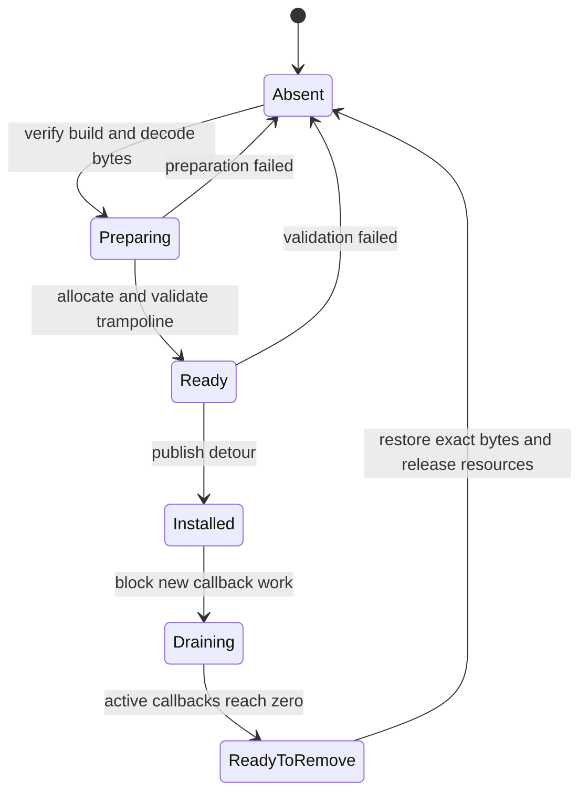
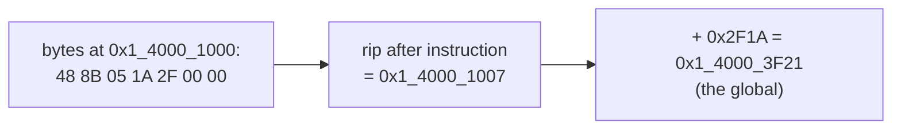
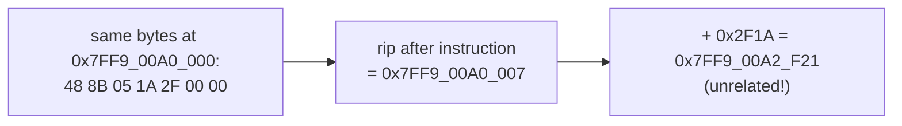
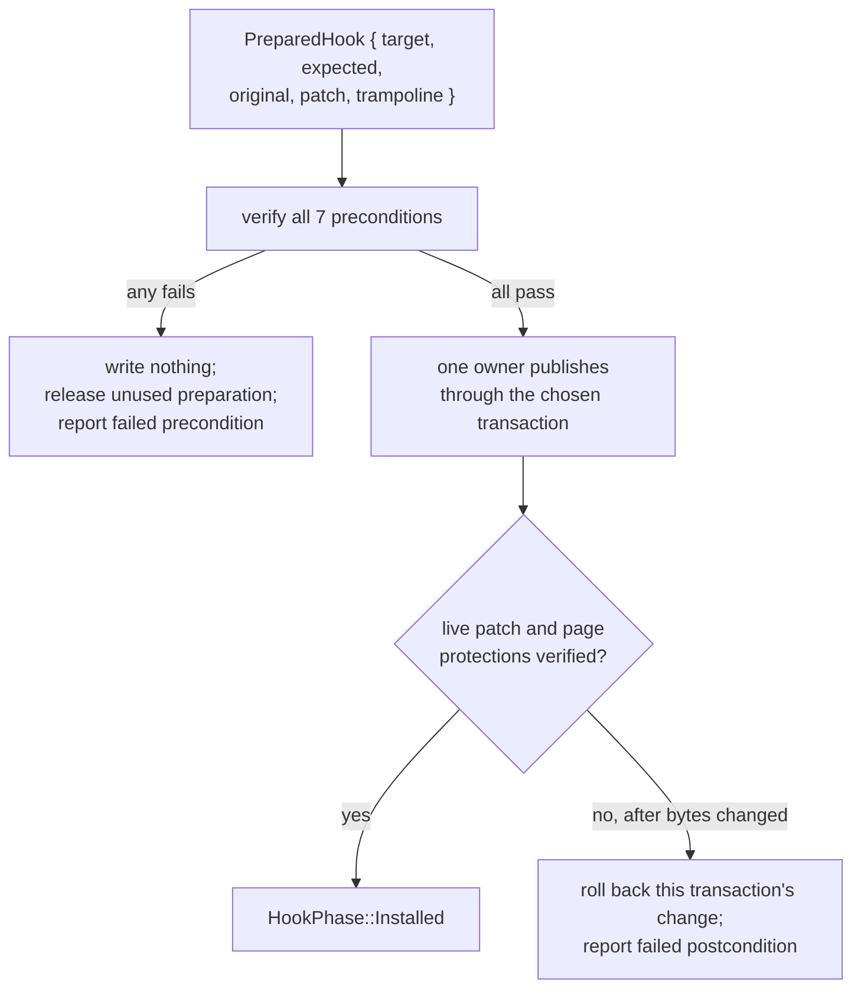

import Frame from '../../../../components/kit/Frame.astro';
import Scene from '../../../../components/Scene.astro';
import CodeTrace from '../../../../components/CodeTrace.astro';
import MarginNote from '../../../../components/kit/MarginNote.astro';


The tool now has an owner for its commands, features, and cleanup. A hook
adds a harder lifetime problem: it changes a path that the game itself can
enter while the tool is starting or stopping.

A detour is installed into code that other threads may already be executing.
Its correctness depends on whole x86-64 instructions, the calling convention,
executable-page protections, a valid trampoline, and ownership that can undo
the change. We will treat those as one live contract.

## A hook changes a live control-flow graph

Lesson 2.9 replaced a verified span of instructions with a jump to a code
cave, then resumed the original path. Writing that jump is the easy part.

The hard part is that you are editing a program while it runs. Another thread
may be executing the very bytes you are half-way through rewriting. A call may
already be inside your replacement at the moment you decide to remove it. The
game may throw away the object you hooked and build a fresh one.

In the vocabulary of Chapter 2, a detour replaces one edge in the game's
control-flow graph — it changes where a single instruction leads. Every
difficulty in this lesson comes from doing that to a graph other threads are
walking at the same time.

The installation invariant is:

> The hook is either completely absent or completely working. There is never a
> moment when a call can find half of it.

“Completely working” means four things are true at once, for every call: the
instructions it lands on are whole, the registers and stack are as the caller
expects, everything the hook touches is still alive, and there is a correct way
back.

Model installation and removal explicitly:



<Scene name="hook-lifetime" />

There should be no `HalfPatched` state visible to executing threads.

<Frame caption={"A separate drain example counts 2 → 1 → 0 active callbacks. Resources remain alive until callers drain; removal then restores the exact original bytes."}>
  
</Frame>

## Preserve five contracts

| Contract | What must remain true | Typical failure |
|---|---|---|
| Instruction | Whole instructions are displaced and relocated correctly | Return lands inside an instruction |
| ABI | Required registers, stack alignment, unwind expectations, and return values survive | Caller receives corrupted state |
| Identity | Expected module build and original bytes match | Patch targets a different function version |
| Concurrency | No thread executes a partly written or already freed path | Intermittent crash during install/remove |
| Lifetime | Callback state and trampoline outlive every user | Removal frees memory while a callback runs |

A successful single-threaded test proves almost none of these under load.

## Restoring state and replaying instructions are separate work

A detour can replace the bytes of an operation that the original path still
needs to perform. Its trampoline must execute the displaced work with its
original meaning, then continue at the first whole instruction after the
replaced span. Saving and restoring a register does not perform that work.

Consider a toy path that loads gold, adds a bonus, and stores the result.
The detour replaces the addition with a jump. Its observer temporarily uses
`EAX`, so preserving the incoming value prevents that scratch calculation
from changing the bonus's input. **Replay** means executing the displaced
addition exactly once before continuation. Try the three deliberate mistakes:
no replay, two replays, or leaving the temporary register change in place.

<CodeTrace trace="original-displaced-replay" />

The successful case preserves one register and replays one addition. It is
only a computation model. A real trampoline also has to preserve live flags
and required machine state, relocate address-dependent operands, satisfy the
calling convention, and survive concurrent entry. The five contracts above
remain necessary even if the toy's final number matches.

There is a third operation at removal: **restore the original patch-site
bytes** after callers can no longer enter or remain in the detour. That puts
the original code path back. Replaying displaced work during a call,
preserving machine state during observer work, and restoring bytes during
removal happen at different times and solve different problems.

<MarginNote kind="brief">Preserve the observer's live inputs, replay displaced work once per call, and restore original patch bytes during safe removal. None substitutes for the other two.</MarginNote>

**Restoration cheatsheet:** preserve live register/flag inputs; replay displaced work exactly once; restore original patch bytes only during safe removal. These are three separate jobs.

## Decode before deciding patch length

x86-64 instructions have variable length. Decode complete instructions until
their total size can hold the chosen branch encoding. Every displaced
instruction has to be kept, because the trampoline runs it later, and any
operand that depends on the instruction's own address has to be identified:

- RIP-relative memory operands;
- relative calls and jumps;
- conditional branches;
- instructions whose behavior depends on the original address.

Copying such bytes to a trampoline without relocation changes their target.

You can watch it happen with a RIP-relative load. At the original site, the
instruction means “read the global sitting `0x2F1A` bytes past the end of this
instruction”:



Copy those seven bytes into a trampoline at a different address. The
displacement is unchanged, but the address it is measured from is not:



The bytes are byte-for-byte identical and the instruction is entirely valid. It
just reads somewhere else now. Relative calls and conditional branches fail in
exactly the same way, and the symptom is rarely a crash at the hook — it is a
wrong value, or a jump into unrelated code, surfacing much later.
The trampoline builder must either rewrite the operand correctly or reject the
site. “Unsupported instruction” is a valid, reliable outcome.

## Make installation a transaction

Prepare everything before publishing the detour:

```rust
#[derive(Debug, Clone, Copy, PartialEq, Eq)]
enum HookPhase {
    Absent,
    Preparing,
    Installed,
    Draining,
}

struct PreparedHook {
    target: usize,
    expected: Vec<u8>,
    original: Vec<u8>,
    patch: Vec<u8>,
    trampoline: ExecutableBlock,
}
```

`ExecutableBlock` stands for the owning wrapper around the trampoline's
executable allocation; its implementation depends on the allocation strategy
used by the detour tool. This sketch describes the state that must stay alive,
rather than supplying another complete hook library. The saved `original`
bytes belong to the same owner, so restoration cannot outlive its evidence.

The preparation stage can verify:

1. exact target build and module identity;
2. current bytes equal `expected`;
3. all displaced instructions decode completely;
4. relative operands can be relocated;
5. trampoline and return address are reachable;
6. callback ABI matches the target function;
7. a dry-run decode of the final patch succeeds.

If a precondition fails, publish nothing: release unused prepared resources
and report the failed check. Only a verified preparation may reach the owner
that publishes the change. If verification fails after that owner has changed
the bytes, roll back its change under the same thread-safety mechanism used
for installation. As a flow:



### Publication must have a real thread-safety mechanism

A multi-byte detour is not magically atomic. Another thread must not fetch the
first half of the new jump while the second half still contains old bytes. Pick
one publication mechanism and name it in the design:

| Mechanism | What makes the patch indivisible to observers | Important limit |
|---|---|---|
| cooperative safe point | game-owned worker threads park at a known boundary before publication | only works when you control or can instrument those workers |
| thread rendezvous | peer threads are paused, their instruction pointers are checked or moved away from the patch span, and they resume only after verification | naïve suspension can deadlock when a stopped thread owns a lock the installer needs |
| framework-managed transaction | a mature detour library relocates affected instruction pointers and publishes through its documented transaction API | the library's guarantees still need to match the target architecture and process |

With peer threads unable to execute the patch span, the publisher changes the
page protection, writes the complete detour, calls Windows
`FlushInstructionCache` for the modified range, restores the original page
protection, rereads the bytes, and only then releases the rendezvous. The same
sequence applies in reverse during removal. `VirtualProtect` only changes page
permissions; it does **not** make a five-byte jump atomic or synchronize other
cores.

:::caution
Do not claim that an ordinary byte copy is atomic. A single aligned store is a
valid shortcut only when the architecture and exact patch encoding explicitly
guarantee atomicity for that width. If those facts are not proven, use a real
rendezvous or a transaction-capable hook library.
:::

## Re-entry is part of the contract

A callback can indirectly call the hooked function again. That is **re-entry**.
Choose and document a policy:

| Policy | Behavior | Suitable use |
|---|---|---|
| Allow | Nested calls execute callback again | Callback is pure and recursion is expected |
| Bypass nested | Nested call uses original path | Logging or observation that may call related code |
| Reject | Nested entry returns a defined error | Fixture where recursion is invalid |

A thread-local depth counter can implement “bypass nested” in a local fixture.
It is not a substitute for process-wide lifetime tracking during removal.

## Keep callback work bounded

The hooked thread may be the render thread or simulation thread. A callback
should capture a small owned event and return. Do not perform blocking I/O,
wait for another thread that may need the current thread, hold a global lock
through the original function, or let a panic cross the callback boundary.

A bounded queue makes overload visible. Count dropped events rather than
silently allocating without limit.

## Drain before removing

Removal needs two counters or states:

- whether new callback work is accepted;
- how many callbacks are currently active.

Set the state to `Draining`, stop publishing new work, wait for the active count
to reach zero using a bounded policy, restore the exact original bytes, verify
them, then release trampoline and callback state. If draining times out, keep
the still-valid resources and report the incomplete shutdown; freeing them is
not recovery.

## Test more than the happy path

Use a local fixture function and cover:

- expected bytes match and installation succeeds;
- one expected byte differs and nothing is written;
- a displaced RIP-relative instruction is relocated or cleanly rejected;
- nested callback entry follows the documented policy;
- 16 or more threads call the fixture while events are captured;
- the event queue fills and reports drops;
- removal begins while callbacks are active;
- install/remove repeated hundreds of times leaves original bytes intact;
- a callback failure returns a defined result without unwinding across the ABI.

## Glossary terms introduced here

- **Detour:** a deliberate replacement of one control-flow edge.
- **Trampoline:** relocated displaced instructions followed by a return edge.
- **Relocation:** adjusting address-dependent instructions for a new location.
- **Re-entry:** the hooked path is entered again before an earlier call returns.
- **Draining:** refusing new work while existing users finish.
- **Publish:** make prepared state visible to other threads.

A hook works only while its instruction, ABI, identity, concurrency, and
lifetime contracts all hold. Installation prepares and validates before
publication; removal drains active calls before freeing anything. Rollback and
the stress cases above test the transitions where those contracts are easiest
to break.

With the hook's lifetime established, we can use it to observe rendering.
The next chapter connects the game's coordinate frames to the draw calls and
pixels that a rendering tool works with.
