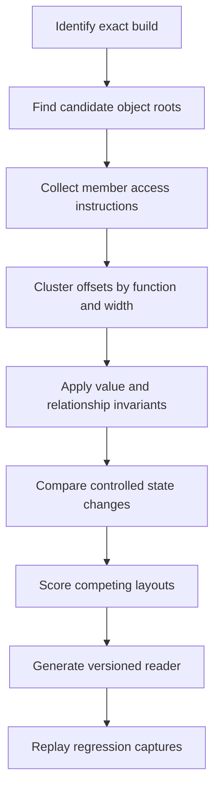
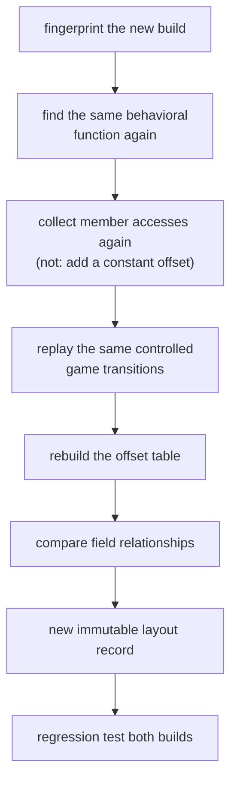

import MemoryStrip from '../../../../components/MemoryStrip.astro';

## Prerequisites

You should understand C++ object layouts, vtables, member offsets, container
headers, pointer chains, x86-64 addressing modes, and build fingerprints.

## An offset belongs to one exact build

If one build reads health from `[rcx+0x138]`, the number `0x138` is true only
for that build. The complete statement is:

> In this exact build, a method receiving the player object in `rcx` reads a
> four-byte health value at offset `0x138`.

An update can recompile the class with a field added, removed, or reordered,
and the same offset then lands on something else. An offset therefore belongs
to one exact build, and it has to be checked again after every update before it
is used.

The target invariant is:

> A layout is used only on the build and the object it was recovered from, and
> every field read is bounded and checked for a sensible value.

Unpacked, that is four separate demands. Use an offset only on the exact build
you proved it on. Use it only on an object you have confirmed is the one you
meant. Never read past the end of that object. And check that the value coming
back makes sense before believing it — a four-byte read that succeeds is not
the same thing as a four-byte read that returned health.

## Recover a layout from several independent checks



One memory scan cannot settle a structure: a four-byte 100 at some offset fits
health, ammunition, or a coincidence equally well. Static access patterns,
runtime value transitions, object identity, and relationships among fields each
rule out different wrong answers, so a layout is accepted only where they
agree.

## Build an offset table

Suppose several methods access one candidate object:

| Offset | Width | Access pattern | Runtime observation | Candidate meaning |
|---:|---:|---|---|---|
| `0x08` | 8 | indirect call through loaded pointer | points into read-only module data whose entries point into executable code | vtable pointer |
| `0x30` | 12 | three adjacent float loads | changes with movement | position vector |
| `0x48` | 4 | float compare against zero | changes with view rotation | yaw or pitch candidate |
| `0x138` | 4 | subtract, clamp, store | follows damage and healing | health candidate |
| `0x13C` | 4 | upper bound for previous field | stable per entity class | max-health candidate |

The relationship `0 <= health <= max_health` is stronger than “both numbers
look reasonable.” The clamp that stores health at `0x138` reads its upper bound
from `0x13C`, so one instruction sequence ties the two candidates together and
each supports the other.

## Distinguish identity from shape

Two objects can have similar bytes but different roles. Validate identity with
several signals:

- vtable pointer falls inside the module's expected read-only data section, and
  several entries reached through it fall inside executable code;
- entity ID matches the manager entry used to reach the object;
- generation changes when the slot is reused;
- position is finite and within broad world bounds;
- health relationships hold;
- repeated methods use the same object pointer.

A **shape check** says bytes resemble a player. An **identity check** says this
is the player object reached through the expected ownership path in this
snapshot.

## Represent uncertainty in the recovered type

```rust
#[derive(Debug, Clone, Copy)]
struct LayoutV42 {
    position: usize,
    health: usize,
    max_health: usize,
    entity_id: usize,
    generation: usize,
}

#[derive(Debug, Clone, Copy, PartialEq, Eq)]
enum Confidence {
    Candidate,
    Repeated,
    CrossValidated,
}
```

Generated metadata stores the confidence level beside each numeric offset,
together with the accesses and value transitions that earned it, so a
`Candidate` never becomes a trusted field just because it has a convenient
name.

## Migrate after an update by matching behavior

When a new build moves fields:

1. fingerprint the new executable and symbols that remain available;
2. locate the same behavioral function through call relationships or a
   carefully versioned pattern;
3. collect member accesses again instead of adding a constant to every offset;
4. replay the same controlled game transitions;
5. rebuild the offset table;
6. compare field relationships, not just individual values;
7. create a new layout record and keep the old record immutable;
8. run captured-snapshot regression tests for both builds.

As a flow:



Step 3 deserves emphasis, because the tempting shortcut is to diff two known
offsets and add that difference to all the others. Layouts do not move like
that. A field inserted in the middle shifts everything after it and nothing
before it, and alignment can absorb part of the shift:

<MemoryStrip
  column
  cells="0x30=position|0x48=yaw|0x138=health|0x13C=max_health|0x150=entity_id"
  caption="Build 41: five fields at their original offsets."
/>

<MemoryStrip
  column
  cells="0x30=position|0x48=yaw|0x50=team (new)|0x140=health|0x144=max_health|0x158=entity_id"
  marks="2|3|4|5"
  caption="Build 42: inserting `team` at `0x50` pushes every later field down by 8 bytes. `position` and `yaw`, both before the insertion, do not move at all."
/>

Nothing here moved by one constant. Three fields did not move at all, one
appeared, and the rest shifted by the size of the insertion. A tool that added
`+8` everywhere would read `position` eight bytes into the wrong place and
report numbers that still look like perfectly plausible coordinates.

Compiler optimization can split, inline, reorder, or eliminate accesses. A
missing old pattern does not prove the underlying concept disappeared.

## Reject partial reads and impossible layouts

A reader should validate the whole requested field range before interpreting
bytes. Use checked addition for `base + offset`, enforce maximum object size,
and reject unreadable page crossings. Decode into local values; do not create a
reference whose lifetime pretends remote bytes belong to the current process.

Validation should reject:

- non-finite vectors;
- `health > max_health` when the game model forbids it;
- a vtable pointer outside expected read-only module data, or initial entries
  that do not point into an expected executable code section;
- duplicate live entity IDs in one snapshot;
- generation changes during a multi-field read;
- an unsupported build rather than falling back to the nearest known layout.

## Score candidates without hiding the reasons

A score helps rank candidates but does not replace the underlying facts:

| Check | Example weight |
|---|---:|
| Controlled health transition matched | +4 |
| Damage function stores at offset | +3 |
| Range relation with max health holds | +2 |
| Offset merely contains a plausible number | +1 |
| Generation changed during read | reject |
| Build identity unknown | reject |

The score is stored with the list of checks that produced it, so a high score
can be audited.

## Glossary terms introduced here

- **Layout:** the byte positions and interpretation of fields in an object.
- **Shape check:** validation that bytes have a plausible structure.
- **Identity check:** validation that the object is the intended instance.
- **Generation:** a counter distinguishing reuse of the same storage slot.
- **Cross-validation:** confirming a field with independent checks, such as an
  access pattern, a value transition, and a range relation, that all agree.
- **Build fingerprint:** stable data used to identify one exact binary version.

## Checkpoint

You should now be able to reconstruct an object from access patterns and field
relationships, carry uncertainty explicitly, and migrate to a new build by
collecting its accesses again rather than guessing how far old offsets moved.
