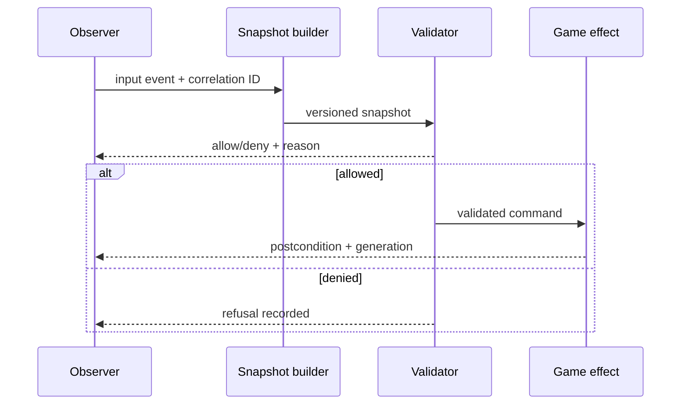
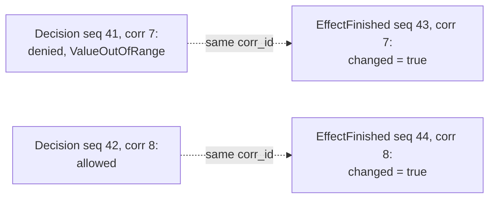
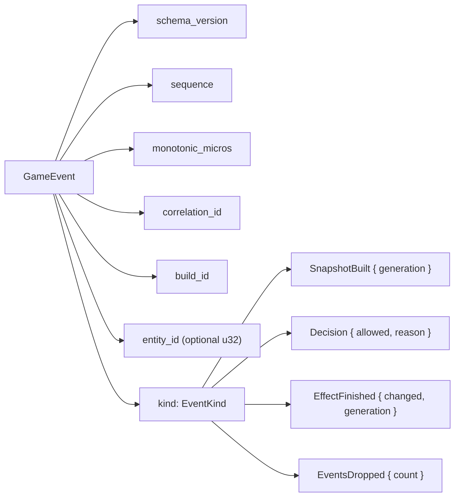

## Prerequisites

You should understand structured events, monotonic clocks, thread IDs, state
machines, bounded queues, and the difference between correlation and causation.

## Telemetry should explain a decision path

Most logs turn out to be useless at exactly the moment you need them. They
record that something happened without recording why it was allowed or refused,
so you end up staring at a line that says `write failed` and guessing.

Useful telemetry lets you follow one game action the whole way through: what
came in, what the code decided, why it decided that, and what actually changed
as a result.

The rule to design against:

> Every guarded operation leaves behind enough evidence to reconstruct four
> things — which target it touched, what it decided, why, and what happened —
> without dumping secrets or unbounded blobs into the log.

Those four are worth naming separately, because a log missing any one of them
cannot answer the question you will eventually put to it:

| What it records | The question it answers later |
|---|---|
| identity | which process, build, and object was this? |
| decision | was it allowed or denied? |
| reason | which specific check produced that answer? |
| outcome | did the effect actually happen? |

Drop the reason and you can see that something was refused but never why. Drop
the outcome and you cannot tell an allowed operation from a completed one.

Design events around the decision pipeline:



The same correlation ID connects the stages without pretending they happened
on one thread.

That field earns its place the moment two actions overlap, which on a render
thread is most of the time. Here are four events from one run, in the order
they reached the log:

```text
seq  corr  event
 41    7   Decision        allowed=false  reason=ValueOutOfRange
 42    8   Decision        allowed=true   reason=Allowed
 43    7   EffectFinished  changed=true   generation=13
 44    8   EffectFinished  changed=true   generation=14
```

Read that stream the obvious way — pair each effect with the decision just
before it — and everything looks correct. The effect at sequence 43 sits right
after an allowed decision, so nothing stands out, and the log appears to show
two successful operations.

Now pair by correlation ID instead. The effect at 43 belongs to action 7, and
action 7 was **denied**. Something changed state after a refusal, which is the
exact contradiction this lesson exists to catch, and the naive reading walked
straight past it.



Nothing was missing from the log. The evidence was complete, and ordering alone
was still enough to reach the wrong conclusion, because two actions interleaved
and the reader assumed they had not. This is why the join in a detection rule
is written on the correlation ID rather than on adjacency.

## Give each event a stable schema



```rust
#[derive(Debug, Clone, PartialEq, Eq)]
struct GameEvent {
    schema_version: u16,
    sequence: u64,
    monotonic_micros: u64,
    correlation_id: u64,
    build_id: u64,
    entity_id: Option<u32>,
    kind: EventKind,
}

#[derive(Debug, Clone, PartialEq, Eq)]
enum EventKind {
    SnapshotBuilt { generation: u32 },
    Decision { allowed: bool, reason: ReasonCode },
    EffectFinished { changed: bool, generation: u32 },
    EventsDropped { count: u64 },
}
```

Use a monotonic clock for duration and ordering inside one run. Wall-clock time
is useful for humans but can jump. `sequence` detects missing or reordered
events. A schema version allows the reader to reject fields it cannot
interpret.

## Record decisions on every branch

Logging only successful operations creates a blind spot. At minimum, record:

| Field | Why it matters |
|---|---|
| Operation category | Which boundary made the decision |
| Target identity | Which build and entity were involved |
| Snapshot generation | Whether evidence was fresh |
| Allow/deny result | The decision itself |
| Bounded reason code | Why the branch was taken |
| Postcondition | Whether the intended effect occurred |
| Drop counter | Whether evidence was lost |

Avoid raw pointers as durable identity: allocations move and addresses can be
reused. Prefer build ID plus entity ID and generation.

## Derive detections from invariants

A useful detection is a query over explicit events, not a mysterious score.
Examples for a toy game:

- an effect reports `changed = true` after a denied decision with the same
  correlation ID;
- one entity’s generation decreases;
- `health > max_health` appears in a validated snapshot;
- an installation enters `Installed` without a preceding verified `Ready`;
- events are dropped during the exact interval being analyzed.

The first rule can be expressed as a join:

```text
finding = EffectFinished.changed
       && matching Decision.allowed == false
       && same correlation_id
```

This does not infer intent. It identifies a concrete contradiction between a
control decision and an observed effect.

## Compare traces by structure

When two runs differ, line-by-line text comparison is often noisy. Normalize
unstable values such as addresses and timestamps, then compare:

1. state-transition sequence;
2. event kinds and reason codes;
3. entity/generation relationships;
4. call or hook identity;
5. relative durations and outliers;
6. final postconditions.

Keep raw evidence available for inspection, but use normalized summaries to
find the first meaningful divergence.

## Measure detector quality

Build a labeled fixture table:

| Fixture | Invariant actually fails? | Rule fires? | Classification |
|---|---:|---:|---|
| Valid command | No | No | True negative |
| Denied command, no effect | No | No | True negative |
| Denied command, effect changes | Yes | Yes | True positive |
| Allowed command, delayed event | No | Yes | False positive |
| Effect changes but decision event was dropped | Yes | No | False negative / insufficient evidence |

Report counts and the exact fixture set. “Detected 100%” is meaningless without
knowing what was tested.

## Design overload behavior deliberately

A render hook cannot block forever to preserve logs. Use a bounded queue and
choose a policy:

- drop newest and increment a counter;
- drop oldest and retain the recent window;
- sample low-priority events while preserving decisions and failures;
- write a compact overflow marker once per interval.

Never hide loss. An analysis interval containing dropped decision events has
lower evidentiary confidence.

## Turn a finding into a regression trace

Save the smallest event fixture that demonstrates the failure:

```text
SnapshotBuilt generation=12
Decision allowed=false reason=ValueOutOfRange
EffectFinished changed=true generation=13
```

The repair test passes only when the effect remains unchanged after the denied
decision. Keep a separate test confirming that a valid command still changes
state; a repair that disables everything is not correct.

## Glossary terms introduced here

- **Telemetry:** structured observations emitted by a running system.
- **Correlation ID:** an identifier connecting events from one logical action.
- **Reason code:** a stable bounded explanation for a decision.
- **Normalization:** replacing unstable details so trace structure can be
  compared.
- **Detection rule:** a precise query identifying evidence of an invariant
  failure.
- **Regression trace:** a saved minimal event sequence used to test a repair.

## Checkpoint

You should now be able to design a versioned event schema, connect decisions to
effects, detect contradictions, quantify false results, and preserve a failing
trace as a permanent repair test.
